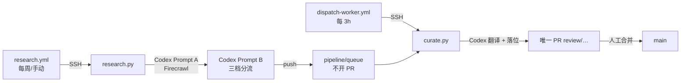

# Obsidian-workFlow

面向 Obsidian 的个人知识库自动化管线：用 **Firecrawl + 服务器 Codex** 做情报搜索与译文加工，经 **唯一人工终审 PR** 合并进库；`expand/index.md` 维护全库索引（含 `working/` 作品）。

> 知识库规则见 [agents.md](agents.md)。管线设计见 [docs/superpowers/specs/2026-08-09-curate-pipeline-design.md](docs/superpowers/specs/2026-08-09-curate-pipeline-design.md)。

---

## 特性

- **双段情报（Research）**：Prompt A 强制调用 Firecrawl 搜索；Prompt B 做长分析并三档分流（`translate` / `index` / `observe`）
- **唯一终审 PR（Curate）**：值得翻译的条目由 Codex 产译文并落位 `working/`，同步 index / log / 知识图谱；整条流水线只开一次人工 PR
- **索引权威**：`references/articles.md` 为收录状态机；`expand/index.md` 为全库总目录（wiki + expand + working）
- **一致性门禁**：K1–K7（`check_consistency.py`）在 pre-commit 与 CI 强制执行
- **支撑流水线**：每日 lint、周报、GC、凭据扫描、失败告警

## 主链路（现行）



| 分流 | 含义 | 落点 |
|------|------|------|
| `translate` | 值得全文翻译 | 待处理队列 → curate → `working/` |
| `index` | 仅索引收录 | `articles.md` 编号正文（核心含脉络） |
| `observe` | 暂不收录 | `articles.md` 观察项表 |

## 目录结构

```text
├── references/            # Phase 0：权威索引（articles.md 状态机 + 观察项）
├── wiki/                  # Phase 1：个人笔记（只读，AI 不写）
├── expand/                # Phase 2：AI 思考/概念 + index / log / 知识图谱
├── working/               # Phase 4：可对外译文作品
├── prompts/               # research-search / research-tracker / curate 等
├── scripts/               # research.py / curate.py / kb_common.py / 门禁与巡检
├── candidates/            # 批次暂存（sources / research 分析落盘）
├── .github/workflows/     # research / dispatch / e2e / consistency / lint …
├── agents.md              # 知识库总规则
└── README.md
```

## GitHub Actions

### 主路径（服务器 Codex）

| 流水线 | 触发 | 职责 |
|--------|------|------|
| `research.yml` | 每周一 06:00（UTC+8）/ 手动 | SSH → `research.py`（Prompt A+B）→ `pipeline/queue` |
| `dispatch-worker.yml` | 每 3 小时 | 待处理 > 0 则 SSH → `curate.py` |
| `e2e-pipeline.yml` | 手动 | 服务器 nohup 串行 research→curate，轮询日志 |

### 门禁与运维

| 流水线 | 触发 | 职责 |
|--------|------|------|
| `consistency.yml` | PR / push | K1–K7 一致性（必需检查） |
| `lint.yml` | 每天 08:30 | 巡检 |
| `gc.yml` | 每周 | 熵管理报告 |
| `weekly-report.yml` | 周五 | 周报 |
| `scan-secrets.yml` | push / PR | 凭据扫描 |
| `failure-notify.yml` | 失败 | Webhook 告警 |

### 已退役（勿当主路径）

| 流水线 / 脚本 | 说明 |
|---------------|------|
| `finalize.yml` / `finalize.py` | 落位已内联 curate；二次收录 PR 取消 |
| `collect.yml` + collect/filter | 固定源采集，由 research 替代 |
| `ingest.yml` + `ingest.py` | 旧 `raw/`→expand 深度笔记旁路 |
| `curate-review.md` / `worker.py` | 后置 AI 打分 / 旧全自动 worker |

## 核心脚本

| 脚本 | 说明 |
|------|------|
| `research.py` | Prompt A（Firecrawl）+ Prompt B（分流）→ articles；push `pipeline/queue` |
| `curate.py` | 翻译三件套 → 内联落位 working + 同步索引 → **唯一** `review/*` PR |
| `kb_common.py` | slug、落位、index/log/图谱同步 |
| `check_consistency.py` | K1–K7（含 `working/` 计入全库） |
| `retrack.py` | 已收录清单（`--list` 注入 research 去重） |
| `lint.py` / `gc_report.py` / `weekly_report.py` / `scan_secrets.py` | 巡检 / GC / 周报 / 凭据 |

## 提示词

| 文件 | 角色 |
|------|------|
| `prompts/research-search.md` | Prompt A：搜索（强制 Firecrawl MCP） |
| `prompts/research-tracker.md` | Prompt B：搜后长分析 + 三档分流 |
| `prompts/curate.md` | 抓取原文 + 译文三件套 |
| `prompts/curate-review.md` | **已废弃** |

## 快速开始

### 环境

- Python 3.12+
- 服务器：`codex` CLI + Firecrawl（MCP 或 CLI），仓库克隆于 `/root/note-worker`
- GitHub Secrets：`WORKER_HOST` / `WORKER_USER` / `WORKER_SSH_KEY`（SSH 调度）；`GH_TOKEN` 或 Actions token（开 PR）

### 手动跑一轮（服务器）

```bash
cd /root/note-worker
export NOTE_GIT_REF=main   # 可选；默认 main
python3 scripts/research.py --max 10
python3 scripts/curate.py --limit 4
```

或在 GitHub Actions 手动触发 **E2E 全流程测试（服务器 Codex）**。

### 本地常用

```bash
python scripts/check_consistency.py
python scripts/curate.py --dry-run
python scripts/research.py --dry-run
python scripts/lint.py --log expand/log.md
```

### 人工闸门

1. 等待 `review/<timestamp>` PR（标题如「待审：AI 产出 N 篇」）
2. 同意则合并；某篇不要则删对应 `working/*-translation.md` 并改 `articles.md` 状态后再合并
3. **不要**再期待 research / finalize 的中间 PR

## 质量与安全

- 过滤宁缺毋滥；观察项防重复采集但不计编号正文
- `私密/` gitignore；凭据扫描阻断合并
- 分支保护：`main` 仅能经 PR + consistency 必需检查合并

## License

MIT License（Copyright © 2026 ShiJie Wu），详见 [LICENSE](LICENSE)。
