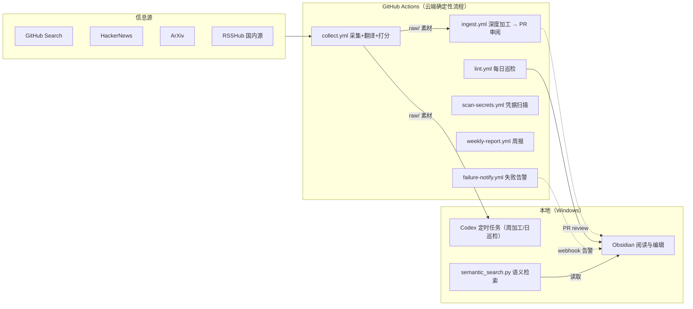

# Obsidian-workFlow

一套面向 Obsidian 个人知识库的自动化工作流：定时抓取 AI / Agent / 后端 / 跨端领域的前沿信息，经 LLM 过滤、翻译与深度加工后入库，并通过 git 版本管理与人工审阅闭环，避免 AI 内容污染知识库。

> 知识库管理规则见 [agents.md](agents.md)；自动化设计与实现细节见 [expand/自动化工作流设计.md](expand/自动化工作流设计.md) 与 [expand/自动化工作流功能与实现方案.md](expand/自动化工作流功能与实现方案.md)。

---

## 特性

- **定时采集**：GitHub Search / HackerNews / ArXiv / RSSHub（掘金、知乎）多源采集，全文抓取 + 低成本翻译（本地模型优先，LLM 兜底）
- **LLM 质量把关**：关键词粗滤 → LLM 三维打分（相关性 / 技术深度 / 新鲜度，总分 ≥ 7 才入库）→ URL / 标题 / SimHash 去重
- **深度技术笔记加工**：AI 按「深度技术笔记模板」生成条目（强制补全 `[补充]` 溯源、人话解释、生产级代码示例、避坑清单、知识关联地图），Bing 联网检索注入 `[补充]` 内容
- **人工审阅闭环**：AI 加工结果提交到 `ai-ingest/日期` 分支并开 PR，review 后合并；本地 Codex 定时任务输出变更摘要
- **每日巡检**：断链 / 孤立节点 / 重复 / 积压 / 索引同步 / 空笔记六项检查，报告自动写入 `expand/log.md`
- **周报与告警**：每周五自动生成知识库周报；任一流水线失败经 Webhook 告警
- **语义检索**：本地 embedding 索引（SQLite），按语义而非关键词查询，模型不可用时自动降级 TF-IDF
- **安全**：`私密/` 永不入仓，push / PR 自动凭据扫描，git 全程可回滚

## 架构总览



## 目录结构

```text
D:\note\
├── .github/workflows/     # GitHub Actions 流水线（6 条）
├── raw/                   # 原始素材（只读，永不修改）
├── wiki/                  # 个人学习笔记（只读，仅用户修改）
├── expand/                # AI 加工产物 + 索引 / 日志 / 图谱 / 自动化文档
│   ├── index.md           # 内容总目录（AI 维护）
│   ├── log.md             # 变更日志（AI 维护）
│   ├── 知识图谱.md          # 关系中枢（AI 维护）
│   ├── 动态索引.md          # Dataview 动态总目录（F10）
│   ├── 知识库周报.md         # 每周周报（F08）
│   ├── 自动化工作流设计.md    # 设计蓝图
│   └── 自动化工作流功能与实现方案.md  # 功能清单与实现方案
├── scripts/               # Python / PowerShell 脚本（本地与云端共用）
├── templates/             # Obsidian Templater 新条目模板
├── 私密/                   # 敏感信息（gitignore，永不入仓）
├── .semantic/             # 语义检索本地索引（gitignore）
├── .codex-runs/           # Codex 定时任务运行日志（gitignore）
├── agents.md              # 知识库管理规则（Ingest / Query / Lint）
└── README.md
```

## 自动化流水线

### GitHub Actions（云端）

| 流水线 | 触发 | 职责 |
| --- | --- | --- |
| 采集与过滤 `collect.yml` | 每周一 06:00（UTC+8） | GitHub / HN / ArXiv / RSSHub 采集 → 全文抓取 + DeepSeek 翻译 → LLM 打分（≥ 7 入库）→ 提交 `raw/` |
| AI 加工 `ingest.yml` | 每天 08:00（UTC+8） | 处理 `raw/` 中 `pending` 素材 → 深度技术笔记模板生成条目 → 提交 `ai-ingest/日期` 分支并开 PR |
| 每日巡检 `lint.yml` | 每天 08:30（UTC+8） | 断链 / 孤立 / 重复 / 积压 / index 同步 / 空笔记检查，报告写入 `log.md`，严重问题开 Issue |
| 凭据扫描 `scan-secrets.yml` | push 到 main / 每个 PR | 正则扫描 API Key / Token，命中即阻断合并 |
| 知识库周报 `weekly-report.yml` | 每周五 19:00（UTC+8） | 汇总采集 / 加工 / 健康度指标，生成 `expand/知识库周报.md` |
| 失败告警 `failure-notify.yml` | 任一以上流水线失败 | 通过 `NOTIFY_WEBHOOK`（Server酱 / Telegram 等）通知 |

### Codex 定时任务（本地，模式 A）

由 Windows 任务计划程序驱动，调用 Codex CLI 完成创造性加工与巡检（确定性逻辑仍在脚本 / Actions 中）：

| 任务 | 时间 | 职责 |
| --- | --- | --- |
| `Codex-KB-Weekly-Ingest` | 每周一 06:30 | 摄入 `raw/` 中所有 `pending` 素材，按 `agents.md` 规则入库并同步索引 / 图谱 / 日志 |
| `Codex-KB-Daily-Lint` | 每天 09:00 | 巡检知识库，修复可自动修复项，报告追加到 `log.md` |

包装脚本：`scripts/codex_task.ps1`（workspace-write 沙箱 + 网络访问，日志写入 `.codex-runs/`）。

## 核心脚本

| 脚本 | 说明 |
| --- | --- |
| `collect.py` | 采集（GitHub / HN / ArXiv / RSSHub）+ 关键词粗滤 + URL 去重 |
| `fetch_full.py` | 全文抓取（GitHub README / 文章 / arXiv / YouTube / B 站字幕 / PDF）+ DeepSeek 中文翻译 |
| `translator.py` | 可插拔翻译后端：本地 MarianMT（零 token）→ Google 免费 → LLM 兜底 |
| `filter.py` | 标题去重 + LLM 三维打分（失败回退启发式） |
| `ingest.py` | AI 加工入库：深度技术笔记模板生成条目，同步 index / log / 状态机（幂等） |
| `count_pending.py` | 统计 `raw/` 待处理素材数 |
| `lint.py` | 六项巡检 |
| `scan_secrets.py` | 凭据扫描 |
| `weekly_report.py` | 周报生成 |
| `semantic_search.py` | 语义检索（embedding + TF-IDF 降级，SQLite 索引） |
| `bing_search.py` | Bing Web Search API v7 封装（未配置密钥时优雅降级） |
| `setup_secrets.py` | 将 `私密/API密钥.md` 中的值一键同步到 GitHub Actions Secrets |
| `codex_task.ps1` | Codex 定时任务包装（模式 A） |

## 快速开始

### 环境要求

- Python 3.12+（本地与 Actions 共用）
- GitHub CLI `gh`（已登录，用于同步 Secrets / 推送）
- Codex CLI `codex`（模式 A 定时任务依赖）
- Obsidian（可选，本地阅读编辑 + Git / Dataview / Templater 插件）

### 1. 安装依赖

```bash
pip install -r scripts/requirements.txt
# 语义检索 + 本地翻译可选（本地使用；未安装时语义检索降级 TF-IDF、翻译回退 Google/LLM）
pip install -r scripts/requirements-semantic.txt
```

翻译后端通过环境变量 `TRANSLATE_BACKEND=local|google|llm|auto` 切换，默认 `auto`：
先尝试本地 MarianMT（`Helsinki-NLP/opus-mt-en-zh`，离线、零 token 成本），
失败或未安装时依次回退 Google 免费翻译、DeepSeek LLM；内容已基本为中文时自动跳过翻译。
需要出版级措辞时可临时切回 `TRANSLATE_BACKEND=llm`。

### 2. 配置密钥

编辑 `私密/API密钥.md`（该文件已 gitignore，永不入仓），填写后一键同步到 GitHub Secrets：

```bash
python scripts/setup_secrets.py
```

仓库需要的 Secret：

| Secret | 用途 | 必填 |
| --- | --- | --- |
| `LLM_API_KEY` | LLM 打分 / 加工调用 | ✅ |
| `LLM_BASE_URL` / `LLM_MODEL` | OpenAI 兼容端点与模型（默认 DeepSeek） | ✅ |
| `BING_SEARCH_API_KEY` / `BING_SEARCH_ENDPOINT` | Ingest `[补充]` 联网检索 | 否 |
| `GH_PAT` | 提高 GitHub API 限额 | 否 |
| `RSSHUB_BASE` | RSSHub 实例地址（建议自建） | 否 |
| `NOTIFY_WEBHOOK` | 失败告警 | 否 |

### 3. 日常使用

| 操作 | 方式 |
| --- | --- |
| 摄入素材 | 对 Codex 说「摄入 xxx」，或 `python scripts/ingest.py`（处理全部 `pending`） |
| 查询知识库 | 直接提问，AI 综合 `wiki/` 与 `expand/` 给出回答 |
| 检查知识库 | 说「检查知识库」，或 `python scripts/lint.py --log expand/log.md` |
| 语义检索 | `python scripts/semantic_search.py --index` 建索引，`python scripts/semantic_search.py --query "多智能体记忆"` 查询 |
| 生成周报 | `python scripts/weekly_report.py`（或等每周五 Actions 自动执行） |

### 4. Obsidian 配置

- **obsidian-git**：自动 commit / push / pull，保持本地与云端同步
- **Dataview**：`expand/动态索引.md` 按 frontmatter 实时生成条目总览
- **Templater**：`templates/新条目模板.md` 提供新条目模板（自动带 frontmatter 与 `## 相关条目`）

## 质量指标

| 指标 | 目标 |
| --- | --- |
| 采集量 / 轮 | 5-30 条 |
| 过滤通过率 | 20-50%（宁缺毋滥） |
| 加工量 / 天 | 0-5 条 |
| 积压率（> 48h） | < 10% |
| 链接健康度 | 100% |
| 孤立率 | < 5% |
| 凭据命中 | 0 |

## 安全说明

- `私密/` 目录被 `.gitignore` 排除，任何情况下不进入 git / 知识图谱
- push 与 PR 均触发凭据扫描，命中即阻断
- 曾泄露的 GitHub Token 与阿里云 AccessKey 建议立即吊销；请勿把密钥写进笔记或代码
- 敏感值只存于 GitHub Secrets 与本地 `私密/`，由 `setup_secrets.py` 同步，不落仓库

## License

MIT License（Copyright © 2026 ShiJie Wu），详见 [LICENSE](LICENSE)。
