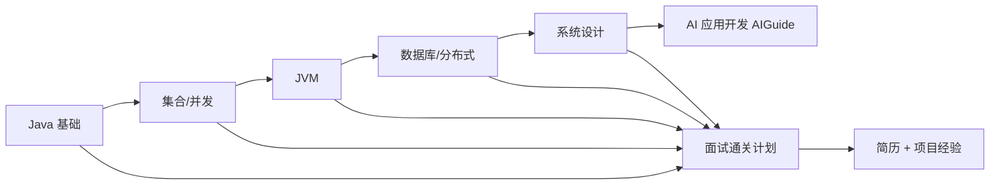

# JavaGuide

Java 后端的"百科全书式"面试与学习指南：从 Java 基础到分布式、再到 AI 应用开发，一套文档覆盖校招到社招的路线图。

## 检索问题（Q&A）
- Java 后端怎么系统准备面试？→ 本条目：JavaGuide 的内容体系与使用方式
- 后端学习路线 / 简历 / 项目经验怎么安排？→ JavaGuide 的 interview-preparation 系列

## 结构化提炼

### 核心论点
JavaGuide 以"知识点 + 面试题"形式系统覆盖 Java 基础、集合、并发、JVM、数据库、分布式、系统设计，并延伸出面向 AI 应用开发的 AIGuide，是后端面试的路线图级资料。

### 逻辑骨架
- 问题：Java 面试资料碎片化，不知道从哪开始
- 方案：开源文档站（javaguide.cn）+ 面试突击版（interview.javaguide.cn）+ 付费《Java 面试指北》
- 结构：后端面试准备（通关计划 / 简历 / 项目经验）→ Java 基础 / 集合 / 并发 / JVM → 数据库 / 分布式 / 系统设计 → AI 应用开发
- 延伸：AIGuide（LLM / Agent / RAG / MCP / Claude Code / Codex 面试与实战）

### 关键概念（费曼式）
- 面试通关计划：把海量考点拆成可执行的每日 / 每周清单，像游戏里的主线任务
- 八股文：高频面试知识点速记，JavaGuide 的特点是"先理解后背诵"

## 深度追问

### 苏格拉底式质疑
1. 内容更新能否跟上 Spring Boot 4 / Java 21 / AI 栈的节奏？
2. "面试导向"是否导致重记忆轻工程？实践项目部分深度如何？
3. 付费内容（面试指北）与开源版的实际差异有多大？

### 背景与盲区
- 背景：JavaGuide 是国内 star 最高的 Java 资料之一，AIGuide 是面向 AI 开发者的延伸
- 盲区：底层源码（JVM 实现细节）深度有限，需配合源码解读类资料

### 溯源与验证
- 开源仓库 + 在线站点可读；内容长期维护，社区校验充分

## 联想与缝合

### 跨学科类比
像"考驾照的科目一题库 + 路线图"：题库（八股）保证你过考，路线图（通关计划）保证你系统练车，两者配合才敢上路。

### 与知识库联系
- 与 [[面向对象]] / [[03-后端/java/集合]] / [[java高级技术]]：JavaGuide 可作为这些条目的"外部大图"，提供上下文与面试视角
- 与 [[面试]]：同为面试准备类条目，一个偏 Java 体系、一个偏 AI / Agent 体系
- 其 AIGuide 部分与本库 [[Agent搭建]] / [[RAG处理优化]] 等 AI 条目呼应

### 底层模型
- 学习路线图（Roadmap）：分层递进 + 里程碑
- 费曼式备考：先搭框架，再填细节

## 场景化转译

### 行动清单
- [ ] 把 JavaGuide 的通关计划映射到本知识库条目，逐章补齐 wiki 空白
- [ ] 面试前用 interview 版过一遍高频题，对照 [[面向对象]] 等条目做"理解版笔记"

### 避坑指南
- 别只刷题不写代码——面试导向资料要配项目实战（如苍穹项目）才有说服力
- 版本差异：优先看"最新版"标注的章节（Java 21 / Spring Boot 4）

## 可视化

## 相关条目
- [[面向对象]]
- [[03-后端/java/集合]]
- [[java高级技术]]
- [[面试]]
