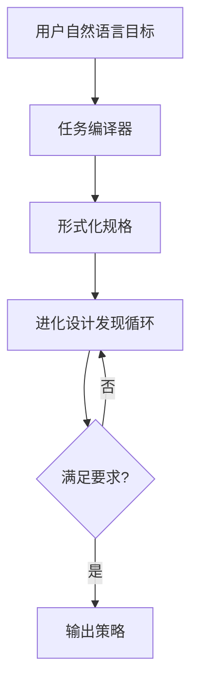

## 本周主题：AtumAI：数据中心控制面策略的Agentic生成框架

### 一句话总结
> AtumAI将数据中心控制面策略生成从人工数月工程压缩为写描述，通过形式化规格与进化搜索实现系统化、可迁移的Agentic生成。

### 记忆锚点（3个关键记忆点）
1. **形式化+进化**：把模糊目标编译成机器可检查的规格，再用扩散模型+进化算法搜索，而非纯靠LLM生成。
2. **可迁移**：任务编译器和搜索循环解耦，一次学习，处处复用。
3. **超越LLM**：搜索空间不限于LLM输出，扩散模型和替代模型扩展了候选池。

### 核心概念拆解
- **数据中心控制面策略**
  - 🗣️ 人话：数据中心里决定资源怎么分配、任务怎么调度、电力怎么管理的规则。
  - 🔧 本质：在满足硬约束（如SLA、能耗上限）下，优化目标（如吞吐量、成本）的决策逻辑。
  - 📍 定位：Agent/后端/基础设施层，属于AI for Systems方向。
  - 💡 补充：控制面策略通常由人工专家设计，需数月迭代，且难以适应动态负载。[补充]（参考Google Borg论文：https://research.google/pubs/pub43438/）

- **任务编译器（Task Compiler）**
  - 🗣️ 人话：把用户用大白话写的需求，翻译成机器能懂的“问题说明书”。
  - 🔧 本质：将自然语言目标转化为形式化规格（目标函数、约束、决策变量、评估方法）。
  - 📍 定位：Agent的“理解层”，连接用户意图与搜索算法。
  - 💡 补充：类似LLM-based API生成，但更强调可验证性和可搜索性。[补充]（参考OpenAI函数调用文档：https://platform.openai.com/docs/guides/function-calling）

- **进化设计发现循环（Evolutionary Design Discovery Loop）**
  - 🗣️ 人话：一个自动“试错+优化”的循环，像生物进化一样不断变异、选择、保留好方案。
  - 🔧 本质：结合扩散模型、进化算法和替代模型，在规格定义的搜索空间中迭代优化候选策略。
  - 📍 定位：Agent的“搜索层”，负责生成和评估候选策略。
  - 💡 补充：扩散模型用于生成多样化的初始候选，进化算法进行交叉变异，替代模型加速评估。[补充]（参考CMA-ES论文：https://arxiv.org/abs/1604.00772）

### 架构与方案对比
- **决策流程图**


- **对比表**

| 维度 | 传统人工设计 | 纯LLM生成 | AtumAI |
|------|-------------|-----------|--------|
| 适用场景 | 简单、静态策略 | 快速原型、初步方案 | 复杂、动态、多约束场景 |
| 核心优势 | 专家经验丰富 | 快速、无需领域知识 | 形式化保证、可迁移、系统化搜索 |
| 主要劣势 | 周期长（数月）、易陷入局部最优 | 缺乏硬约束保证、不可迁移、探索空间有限 | 需要设计搜索算法、计算开销较大 |
| 生产级成熟度 | 高（但效率低） | 低（仅辅助） | 中（论文验证，待大规模落地）[补充] |
| 架构师推荐结论 | 不推荐用于新场景 | 可作辅助 | 推荐作为未来方向 |

### 代码与实操速查
- **生产级最小示例（Python 3.10 + DEAP 1.4 + scikit-learn 1.3）**
```python
import random
from deap import base, creator, tools, algorithms

# 定义问题：最小化目标函数（示例）
def eval_func(individual):
    # 这里应调用替代模型或真实模拟器，此处为示例
    return sum(individual),

creator.create("FitnessMin", base.Fitness, weights=(-1.0,))
creator.create("Individual", list, fitness=creator.FitnessMin)

toolbox = base.Toolbox()
toolbox.register("attr_float", random.uniform, 0, 1)
toolbox.register("individual", tools.initRepeat, creator.Individual, toolbox.attr_float, n=10)
toolbox.register("population", tools.initRepeat, list, toolbox.individual)
toolbox.register("evaluate", eval_func)
toolbox.register("mate", tools.cxBlend, alpha=0.5)
toolbox.register("mutate", tools.mutGaussian, mu=0, sigma=0.2, indpb=0.2)
toolbox.register("select", tools.selTournament, tournsize=3)

def main():
    pop = toolbox.population(n=50)
    hof = tools.HallOfFame(1)
    stats = tools.Statistics(lambda ind: ind.fitness.values)
    stats.register("avg", lambda x: sum(x)/len(x))
    stats.register("min", min)
    pop, log = algorithms.eaSimple(pop, toolbox, cxpb=0.7, mutpb=0.2, ngen=40, stats=stats, halloffame=hof, verbose=True)
    return hof[0]

if __name__ == "__main__":
    best = main()
    print("Best solution:", best)
```

- **关键配置**：
  - 种群大小：50-200（根据搜索空间维度）
  - 交叉概率：0.7-0.9
  - 变异概率：0.1-0.3
  - 终止条件：达到最大代数或适应度收敛

- **常见报错与解决**：
  1. **评估函数报错**：确保评估函数返回元组，且无异常。
  2. **个体长度不一致**：初始化时确保长度固定。
  3. **收敛过快**：增大变异概率或使用自适应参数。[补充]（参考DEAP文档：https://deap.readthedocs.io/）

### 避坑清单（Anti-patterns）
- ❌ 直接用LLM生成最终策略 → ✅ 用LLM生成初始候选，再用进化算法优化（原因：LLM缺乏硬约束保证）
- ❌ 忽略形式化规格 → ✅ 先编译成机器可检查的规格（原因：无规格则搜索无结构，难以保证正确性）
- ❌ 只依赖单一模型（如LLM） → ✅ 集成扩散模型、进化算法、替代模型（原因：扩大搜索空间，避免局部最优）
- ❌ 评估函数使用真实系统频繁调用 → ✅ 使用替代模型（代理模型）加速评估（原因：真实系统调用成本高，替代模型可大幅降低开销）[补充]
- ❌ 忽视安全边界 → ✅ 在规格中明确约束，并在评估中强制检查（原因：数据中心策略涉及安全，违规可能导致事故）

### 知识关联地图
- **前置知识**：
  - [[MCP协议与工具调用]] #Agent #协议
  - [[langgraph4j-study-notes-01-core]] #Agent #编排
  - [[AgentHPOBench]] #优化 #搜索
- **横向关联**：
  - [[Agent搭建]] #Agent #框架
  - [[7-agentic-loop-he-xin-xun-huan]] #Agent #循环
- **纵向延伸**：
  - 下一步：研究扩散模型在策略生成中的应用（资源：Diffusion Policy论文 https://arxiv.org/abs/2303.04137）
  - 下一步：学习替代模型（代理模型）构建（资源：Bayesian Optimization教程 https://arxiv.org/abs/1807.02811）

### 本周素材盲区与知识增量
- **原文盲区**：
  - 未提供具体算法细节和实验数据 → 转化为「下周探索方向」：
    - 候选选题：进化算法在数据中心调度中的超参数调优
    - 候选选题：扩散模型生成策略的多样性分析
- **知识增量总结**：
  1. 形式化规格是Agentic搜索的关键，可提升可验证性和可迁移性。
  2. 结合多种搜索技术（扩散+进化+替代模型）能显著扩大搜索空间，优于单一LLM生成。
  3. 将任务编译与搜索解耦，使得框架可复用到不同任务，提高工程效率。

### 参考素材与官方链接
- **原始素材**：raw/atumai-arxiv-2608.02569.md（来源：http://arxiv.org/abs/2608.02569v1）
- **官方文档/网站**：
  - arXiv论文页面：http://arxiv.org/abs/2608.02569v1（获取原文和最新版本）
  - DEAP文档：https://deap.readthedocs.io/（进化算法实现）
  - OpenAI函数调用：https://platform.openai.com/docs/guides/function-calling（任务编译器参考）
  - CMA-ES论文：https://arxiv.org/abs/1604.00772（进化策略参考）
  - Diffusion Policy论文：https://arxiv.org/abs/2303.04137（扩散模型生成策略）

### 本周行动清单
- [ ] 阅读AtumAI论文全文，提取算法细节（预计耗时：60分钟，关联知识点：核心概念）✅ Done when：能画出完整流程图
- [ ] 用DEAP实现一个简单进化算法示例，并测试不同参数（预计耗时：45分钟，关联知识点：进化设计循环）✅ Done when：运行成功并记录参数影响
- [ ] 调研扩散模型在策略生成中的应用案例（预计耗时：30分钟，关联知识点：扩散模型）✅ Done when：整理3个案例
- [ ] 撰写一篇关于形式化规格在Agent中作用的博客（预计耗时：90分钟，关联知识点：任务编译器）✅ Done when：发布并收到反馈

### 相关条目
- [[MCP协议与工具调用]]
- [[Agent搭建]]
- [[7-agentic-loop-he-xin-xun-huan]]
