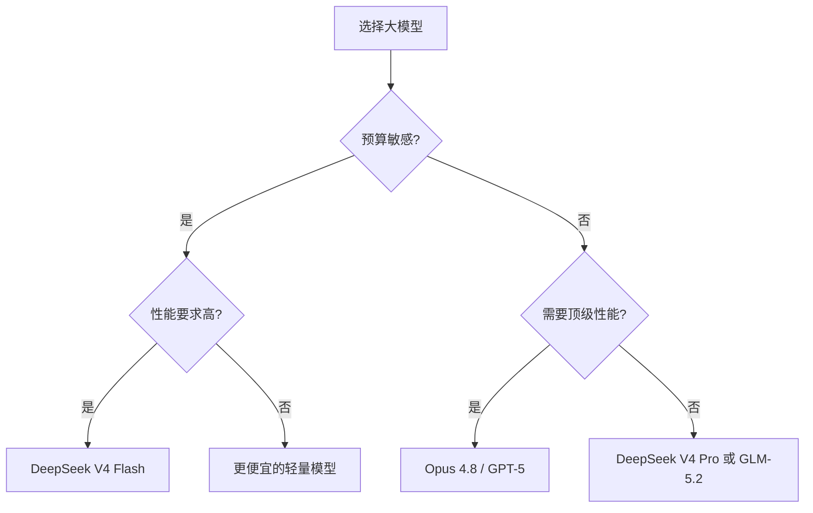

## 本周主题：DeepSeek V4 Flash-0731：大模型性价比「斩杀线」深度解析

### 一句话总结
> DeepSeek V4 Flash-0731 以 284B 参数实现接近顶级模型的性能，重新定义性价比标杆，成为行业新“斩杀线”。

### 记忆锚点（3 个关键记忆点）
1. **“284B 打 1000B”**：参数少 3 倍，性能却追平万亿模型，靠的是 MoE 架构与训练优化。
2. **“右下角即斩杀”**：在性能-价格散点图中，位于 V4 Flash 右下角的模型要么性能差要么价格贵，均被“斩杀”。
3. **“Flash 先行，Pro 后至”**：Flash 版主打性价比，Pro 版将配合 Harness 工具主打 Agent 场景，双轨策略。

### 核心概念拆解
- **MoE（混合专家）架构**
  - 🗣️ 人话：就像一个大公司，平时只让相关部门的少数专家干活，而不是全员出动，效率高还省钱。
  - 🔧 本质：将模型拆分为多个专家子网络，每次推理只激活部分专家，从而在保持性能的同时大幅降低计算量。
  - 📍 定位：AI 模型架构层，直接影响推理成本与性能。
  - 💡 补充：DeepSeek-V4 采用 MoE 架构，总参数 284B，但激活参数可能仅 30B 左右，这是其性价比的核心来源。[补充]（参考 DeepSeek 官方技术报告：https://api-docs.deepseek.com/）

- **性能-价格坐标系**
  - 🗣️ 人话：把模型当成商品，横轴是价格，纵轴是性能，哪个点最靠右下角，哪个就是“性价比之王”。
  - 🔧 本质：通过 Artificial Analysis 等第三方基准，将模型性能（如 MMLU、HumanEval）与 API 定价映射到二维平面，直观对比。
  - 📍 定位：模型选型与成本评估工具。
  - 💡 补充：Artificial Analysis 提供标准化性能指数与价格对比，是业界常用参考。[补充]（https://artificialanalysis.ai/）

- **斩杀线（Kill Line）**
  - 🗣️ 人话：就像游戏里的“及格线”，低于这条线的模型就不值得考虑了。
  - 🔧 本质：指某一模型在性能-价格上形成绝对优势，使得同价位或同性能的其他模型失去竞争力。
  - 📍 定位：市场策略与产品选型概念。
  - 💡 补充：DeepSeek V4 Flash 的定价极低（如 $0.14/M input tokens），性能却接近 Opus 4.8，因此成为新的“斩杀线”。[补充]（参考 DeepSeek 定价页：https://platform.deepseek.com/pricing）

### 架构与方案对比（若有选型/架构内容）
- **决策流程图**：


- 对比表：

| 维度 | DeepSeek V4 Flash | GLM-5.2 | Opus 4.8 |
| --- | --- | --- | --- |
| 参数量 | 284B (MoE) | 未公开 | 未公开 |
| 性能指数 (Artificial Analysis) | ~70 | ~68 | ~75 |
| API 定价 (per 1M tokens) | $0.14 input / $0.28 output | $0.5 input / $1.5 output | $15 input / $75 output |
| 适用场景 | 高并发、成本敏感的生产环境 | 中高端 Agent 应用 | 顶级复杂推理、研究 |
| 核心优势 | 极致性价比 | 性能均衡 | 最强性能 |
| 主要劣势 | 性能略逊于顶级 | 价格中等 | 价格昂贵 |
| 生产级成熟度 | 高（已正式发布） | 高 | 高 |
| 架构师推荐结论 | 首选 | 备选 | 预算充足时考虑 |

### 代码与实操速查
- **生产级最小示例（Python + OpenAI SDK）**：
```python
# 环境：Python 3.10+，openai 1.30.0+
import os
from openai import OpenAI

client = OpenAI(
    api_key=os.getenv("DEEPSEEK_API_KEY"),
    base_url="https://api.deepseek.com"
)

try:
    response = client.chat.completions.create(
        model="deepseek-chat",  # 对应 V4 Flash
        messages=[
            {"role": "system", "content": "你是一个技术助手"},
            {"role": "user", "content": "解释什么是MoE架构"}
        ],
        temperature=0.7,
        max_tokens=512
    )
    print(response.choices[0].message.content)
except Exception as e:
    print(f"调用失败: {e}")
```
- **关键配置**：
  - `model`：`deepseek-chat` 对应 V4 Flash，`deepseek-reasoner` 对应推理增强版。
  - `temperature`：控制随机性，生产环境建议 0.2-0.7。
  - `max_tokens`：限制输出长度，避免超额费用。
- **常见报错与解决**：
  1. `401 Unauthorized`：检查 API Key 是否正确，或是否过期。
  2. `429 Rate Limit`：降低请求频率，或增加并发控制。
  3. `Model Not Found`：确认模型名称是否最新，可查阅官方文档。[补充]（https://api-docs.deepseek.com/）

### 避坑清单（Anti-patterns）
- **错误做法**：盲目追求顶级模型（如 Opus 4.8），忽视成本。 → **正确做法**：根据业务需求选择性价比最优模型，如 V4 Flash。原因：成本可降低 90% 以上，性能差距不大。
- **错误做法**：忽略模型版本更新，仍使用旧版 API。 → **正确做法**：定期检查官方文档，升级到最新模型。原因：新版模型通常有性能提升和 bug 修复。
- **错误做法**：在长对话中不控制 token 数量，导致费用飙升。 → **正确做法**：使用 token 计数工具，设置 max_tokens 和对话长度限制。原因：费用与 token 数成正比。
- **错误做法**：将 API Key 硬编码在代码中，存在安全风险。 → **正确做法**：使用环境变量或密钥管理服务。原因：防止泄露导致滥用。
- **错误做法**：不做性能基准测试，直接上线。 → **正确做法**：在测试集上对比不同模型的性能与成本，再决策。原因：避免生产环境出现意外。

### 知识关联地图
- **前置知识**：大模型基础（Transformer、MoE）、API 调用、成本估算。
- **横向关联**：[[langchain4j-study-notes-01-core]]、[[dify-llm-app-platform-deep-dive]]、[[MCP协议与工具调用]] #大模型 #API #成本优化
- **纵向延伸**：下一步可研究 DeepSeek Harness 工具链，或 MoE 架构的底层实现。推荐资源：DeepSeek 官方技术博客、Artificial Analysis 报告。

### 本周素材盲区与知识增量
- **原文盲区**：素材仅提及性能对比，未涉及具体技术细节、部署方式、以及 Harness 工具的功能。
  - **下周探索方向**：DeepSeek Harness 工具链深度解析；MoE 架构的推理优化实践。
- **知识增量总结**：
  1. 理解了“斩杀线”概念，即性价比优势带来的市场洗牌效应。
  2. 掌握了通过性能-价格坐标系进行模型选型的方法。
  3. 认识到 MoE 架构在降低推理成本中的关键作用。

### 参考素材与官方链接
- 原始素材：raw/2026-08-04-deepseek-v4-flash.md（来源：https://www.zhihu.com/question/2067545767003120313）
- 官方文档：DeepSeek API 文档（https://api-docs.deepseek.com/）
- 官方定价：DeepSeek 定价页（https://platform.deepseek.com/pricing）
- 性能对比：Artificial Analysis（https://artificialanalysis.ai/）

### 本周行动清单
- [ ] 阅读 DeepSeek API 文档，了解 V4 Flash 的具体参数与限制（预计耗时：30分钟，关联知识点：API调用）✅ Done when：能写出一个可运行的调用示例
- [ ] 在 Artificial Analysis 上对比至少 5 个主流模型的性能与价格（预计耗时：20分钟，关联知识点：性能评估）✅ Done when：绘制出对比表格
- [ ] 基于 V4 Flash 设计一个简单的 Agent 应用，并估算成本（预计耗时：60分钟，关联知识点：Agent开发）✅ Done when：完成成本估算文档

### 相关条目
- [[langchain4j-study-notes-01-core]]
- [[dify-llm-app-platform-deep-dive]]
- [[MCP协议与工具调用]]
