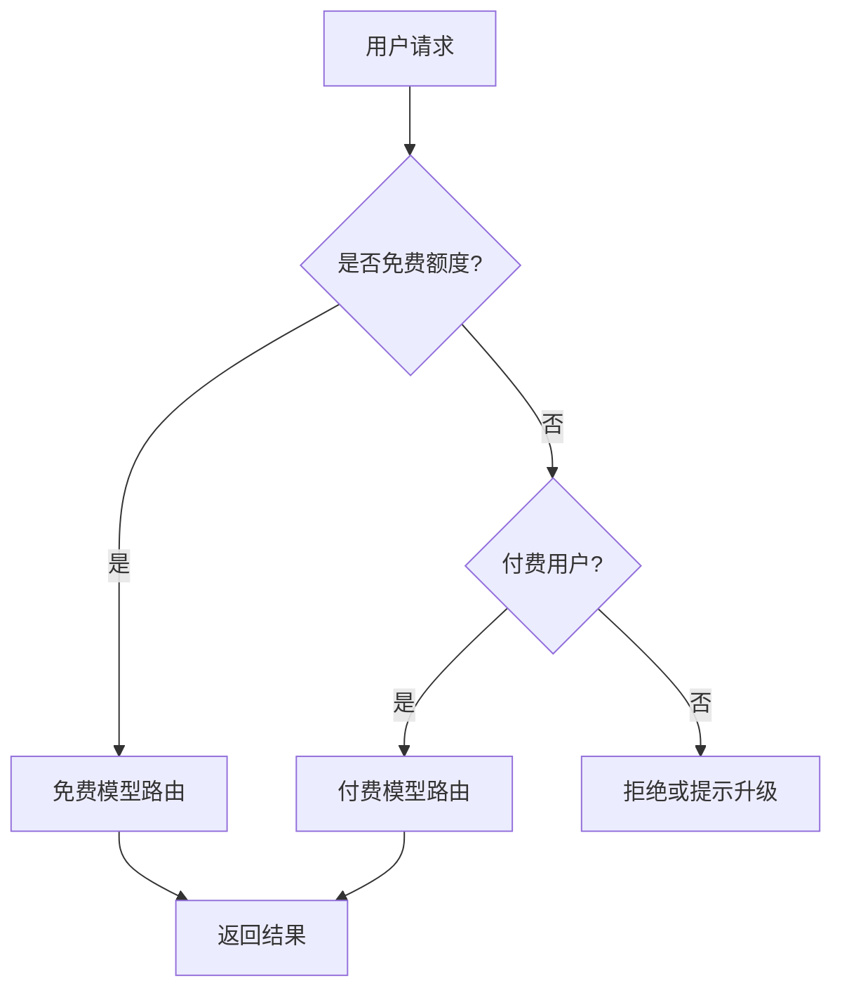

## 本周主题：DeepSeek V4 Flash 单日 8 万亿 Token 调用量：AI 编程 Agent 规模化的信号解读

### 一句话总结
> DeepSeek V4 Flash 单日 8 万亿 Token 消耗，标志着 AI 编程 Agent 已从演示走向大规模生产，成本与效率成为核心。

### 记忆锚点（3 个关键记忆点）
1. **8万亿 Token ≈ 5600万本《三体》**：直观感受 Token 消耗的恐怖规模，背后是海量开发者高频调用。
2. **免费 5 万亿 + 付费 3 万亿**：免费额度是获客利器，付费转化是商业闭环，OpenCode 平台模式验证成功。
3. **前五名均为中国模型**：中国 AI 大模型在编程场景已占据全球主导地位，DeepSeek 登顶。

### 核心概念拆解
- **Token 消耗量**
  - 🗣️ 人话：Token 是 AI 模型处理文本的最小单位，8 万亿 Token 相当于 AI 读完了 5600 万本《三体》，可见其工作量之大。
  - 🔧 本质：模型推理时输入和输出的文本片段数量，直接关联算力成本和响应速度。
  - 📍 定位：AI Agent 后端基础设施的关键指标，影响成本核算和性能优化。
  - 💡 补充：Token 计费是 LLM 服务的主要成本来源，不同模型价格差异巨大，优化 Token 使用是降本核心。[补充]（参考 [OpenAI Tokenizer](https://platform.openai.com/tokenizer)）

- **AI 编程 Agent**
  - 🗣️ 人话：像 Copilot 这样的工具，能帮你写代码、改 bug，甚至自动完成整个任务。
  - 🔧 本质：基于 LLM 的智能体，通过理解自然语言指令，生成或修改代码。
  - 📍 定位：Agent 应用层，是 LLM 能力在开发者工具中的具体体现。
  - 💡 补充：AI 编程 Agent 是当前 LLM 商业化最成功的场景之一，GitHub Copilot 已服务数百万开发者。[补充]（参考 [GitHub Copilot](https://github.com/features/copilot)）

- **模型路由与网关**
  - 🗣️ 人话：像智能路由器，根据你的请求自动选择最合适的 AI 模型，平衡速度、质量和成本。
  - 🔧 本质：通过策略将请求分发到不同模型，实现资源优化。
  - 📍 定位：后端基础设施，是 Agent 平台的核心组件。
  - 💡 补充：OpenCode 的 Zen 和 Go 网关正是此类实现，可参考 [LiteLLM](https://github.com/BerriAI/litellm) 等开源方案。[补充]

### 架构与方案对比（若有选型/架构内容）
- **决策流程图**：

- 对比表：

| 维度 | 免费试用模式 | 付费订阅模式 | 混合模式（OpenCode） |
|------|--------------|--------------|----------------------|
| 适用场景 | 新用户体验、低频率使用 | 高频专业用户、企业级 | 兼顾获客与盈利 |
| 核心优势 | 降低使用门槛，快速积累用户 | 稳定收入，保障服务质量 | 免费引流，付费转化 |
| 主要劣势 | 成本高，易被滥用 | 用户增长缓慢 | 需要精细的成本控制与用户分层 |
| 生产级成熟度 | 中（需防滥用） | 高 | 高（需策略支持） |
| 架构师推荐结论 | 适合初期推广 | 适合成熟产品 | **推荐**，结合业务目标动态调整 |

### 代码与实操速查
- 生产级最小示例（Python + OpenAI SDK 调用 DeepSeek，模拟 Token 消耗监控）：
```python
# 需要安装 openai>=1.0, 版本锁定 openai==1.35.0
import openai
import time

client = openai.OpenAI(
    api_key="your-api-key",
    base_url="https://api.deepseek.com/v1"  # DeepSeek 兼容 OpenAI 格式
)

def generate_code(prompt: str) -> str:
    try:
        response = client.chat.completions.create(
            model="deepseek-chat",  # 或 deepseek-coder
            messages=[{"role": "user", "content": prompt}],
            max_tokens=1024,
            temperature=0.2
        )
        usage = response.usage
        print(f"Prompt tokens: {usage.prompt_tokens}, Completion tokens: {usage.completion_tokens}, Total: {usage.total_tokens}")
        return response.choices[0].message.content
    except Exception as e:
        print(f"Error: {e}")
        return ""

if __name__ == "__main__":
    code = generate_code("用 Python 写一个快速排序")
    print(code)
```
- 关键配置：
  - `max_tokens`：限制生成长度，防止意外消耗过多 Token。
  - `temperature`：控制随机性，代码生成建议低值（0.2）。
  - `base_url`：指向 DeepSeek API 端点，确保网络可达。
- 常见报错与解决：
  1. **401 Unauthorized**：API Key 错误或过期，检查环境变量。
  2. **Rate Limit**：请求过于频繁，增加重试机制或降低并发。
  3. **Context Length Exceeded**：输入过长，截断或使用摘要。

### 避坑清单（Anti-patterns）
- **错误做法**：无限制地使用免费额度，导致成本失控。 → **正确做法**：设置每日 Token 消耗上限，并监控异常。
- **错误做法**：在代码中硬编码 API Key。 → **正确做法**：使用环境变量或密钥管理服务，防止泄露。
- **错误做法**：忽略模型版本更新，依赖旧模型。 → **正确做法**：定期评估新模型，及时迁移。
- **错误做法**：对所有请求使用同一模型，不考虑任务复杂度。 → **正确做法**：根据任务类型路由到不同模型，平衡成本与效果。

### 知识关联地图
- 前置知识：[[MCP协议与工具调用]]、[[langchain4j-study-notes-01-core]]、[[langgraph4j-study-notes-01-core]]
- 横向关联：[[awesome-llm-apps-开源AI代理与RAG应用集锦]]、[[cc-switch-跨平台AI编码代理配置管理器]]、[[open-webui-自托管AI平台深度解析]]
- 纵向延伸：学习如何构建自己的 AI 编程 Agent，参考 [[langchain4j-study-notes-02-rag]] 和 [[langgraph4j-study-notes-02-advanced]]。

### 本周素材盲区与知识增量
- 原文盲区：未提及 DeepSeek V4 Flash 的具体定价、性能基准、以及与其他模型的对比。
  - 转化为「下周探索方向」：调研 DeepSeek V4 Flash 的 API 定价与性能评测，对比 Claude 3.5 Sonnet 等。
- 知识增量总结：
  1. 理解了 Token 消耗量级与商业模式的关联。
  2. 认识到 AI 编程 Agent 的规模化落地现状。
  3. 掌握了模型网关在成本控制中的重要性。

### 参考素材与官方链接
- 原始素材：raw/opencode-deepseek-8t-token.md（来源：https://www.zhihu.com/question/2067873642554156045）
- 官方文档 / 网站链接：
  - [DeepSeek API 文档](https://platform.deepseek.com/api-docs/)：用于模型调用和参数配置。
  - [OpenRouter 模型排名](https://openrouter.ai/rankings)：查看模型调用量趋势。
  - [OpenCode 官网](https://opencode.ai/)：了解平台功能。

### 本周行动清单
- [ ] 阅读 DeepSeek API 文档，了解模型列表和定价（预计耗时：30分钟，关联知识点：Token 计费）✅ Done when：能说出不同模型的价格差异。
- [ ] 使用 DeepSeek API 编写一个简单的代码生成脚本，并监控 Token 消耗（预计耗时：45分钟，关联知识点：API 调用）✅ Done when：脚本运行成功，输出 Token 使用量。
- [ ] 调研 OpenRouter 的模型路由策略，思考如何应用到自己的项目（预计耗时：60分钟，关联知识点：模型网关）✅ Done when：整理出至少 3 种路由策略。

### 相关条目
- [[awesome-llm-apps-开源AI代理与RAG应用集锦]]
- [[cc-switch-跨平台AI编码代理配置管理器]]
- [[MCP协议与工具调用]]
