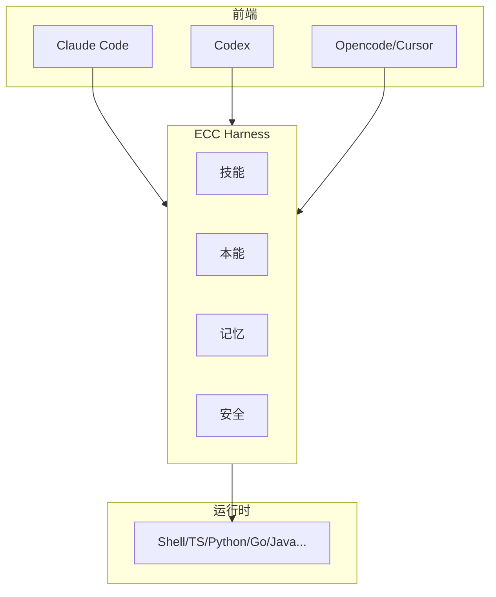

# ECC

给编程代理装一套"操作系统"：技能、本能、记忆、安全一应俱全，Claude Code / Codex / Cursor 都能插上。

## 检索问题（Q&A）
- 编程代理除了模型还缺什么基础设施？→ 本条目：ECC 的技能 / 本能 / 记忆 / 安全分层
- Agent 工程化参考实现？→ ECC 的 npm 包 + GitHub App 架构

## 结构化提炼

### 核心论点
ECC 把编程代理的工程化需求（技能管理、持久记忆、安全防护、多运行时）沉淀为可插拔的"代理工具操作系统"，跨 Claude Code / Codex / Cursor 等前端使用。

### 逻辑骨架
- 问题：编程代理各自为战，缺少可复用的能力层
- 方案：Agent Harness 分层——技能（skills）、本能（instincts）、记忆（memory）、安全（AgentShield）
- 形态：npm 包（ecc-universal / ecc-agentshield）+ GitHub App + Pro 订阅（私有仓库协作）
- 运行时：Shell / TypeScript / Python / Go / Java / Perl / Markdown

### 关键概念（费曼式）
- Agent Harness：把"代理怎么干活"的公共部分（工具、记忆、权限）抽出来，像操作系统管硬件一样管能力
- 本能（instincts）：预设的行为倾向 / 检查点，让代理不用每次重新想"该不该这么干"

## 深度追问

### 苏格拉底式质疑
1. "跨前端"是否只是薄封装？各家 agent 的钩子能力差异如何抹平？
2. 安全层（AgentShield）的防护边界在哪——能否拦截恶意 prompt 注入？
3. 个人项目 + GitHub App 的权限模型，是否与"最小权限"原则冲突？

### 背景与盲区
- 背景：编程代理（Claude Code / Codex）已成为 Agent 主战场，能力层正在工具化
- 盲区：缺少公开评测数据；社区规模小，长期维护风险

### 溯源与验证
- 官方渠道明确（GitHub / npm / GitHub App），"仅限官方来源"安全提醒；MIT 许可证

## 联想与缝合

### 跨学科类比
像"给新手程序员配 IDE 插件全家桶"：模型是编译器，ECC 是帮你管工程习惯、快捷键、防呆提醒的那层工具。

### 与知识库联系
- 与 [[22-skills-ji-neng-kai-fa]] / [[21-zi-ding-yi-agents]]：正是 Claude Code 源码解读中"Skills 技能系统"与"自定义 Agents"的第三方实现印证
- 与 [[Hermes-Agent]]：同为"代理能力层"，一个偏编程代理、一个偏通用助手

### 底层模型
- 分层架构（内核 / 驱动 / 应用）
- 能力复用：把最佳实践工具化沉淀

## 场景化转译

### 行动清单
- [ ] 阅读其技能 / 本能定义，借鉴到自己的 Codex / Claude 配置
- [ ] 安装前核对官方渠道（防供应链投毒），并启用 AgentShield 类安全层

### 避坑指南
- 只用官方渠道分发（仓库 / npm / GitHub App），第三方镜像可能带恶意代码
- 别把所有敏感操作交给代理自动执行——权限分层要保留人工确认点

## 可视化

## 相关条目
- [[Agent搭建]]
- [[22-skills-ji-neng-kai-fa]]
- [[21-zi-ding-yi-agents]]
- [[Hermes-Agent]]
