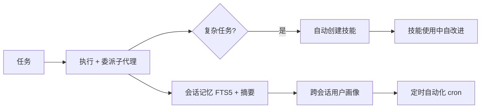

# Hermes-Agent

一个会"长记性"的代理：任务做完自动沉淀技能、技能越用越顺手、隔几天还记得你是谁——把学习循环做进 Agent 本体。

## 检索问题（Q&A）
- Agent 怎么实现跨会话记忆 / 持续学习？→ 本条目：Hermes 的闭环学习循环设计
- 想要能定时干活、多端聊天的自托管 Agent？→ Hermes 的 cron + Telegram / Discord / CLI 网关

## 结构化提炼

### 核心论点
Hermes Agent 的核心差异是内置闭环学习循环：从经验创建技能 → 使用中改进技能 → 主动维护记忆 → 跨会话构建用户画像，且模型无锁定、部署轻量。

### 逻辑骨架
- 问题：主流 Agent 无状态，会话结束就"失忆"，技能不沉淀
- 方案：技能（任务后自动创建，使用中自改进，兼容 agentskills.io）+ 记忆（FTS5 会话搜索 + LLM 摘要 + Honcho 用户建模）
- 形态：单网关多端（Telegram / Discord / Slack / WhatsApp / CLI / TUI）+ 内置 cron 定时 + 子代理委派
- 部署：5 美元 VPS / 无服务器（Modal / Daytona），模型任意切换

### 关键概念（费曼式）
- 闭环学习：做任务 → 总结成技能 → 下次直接复用并改进，像老员工积累工作手册
- FTS5 会话搜索：全库全文检索历史对话，配合 LLM 摘要实现"我记得聊过这个"

## 深度追问

### 苏格拉底式质疑
1. "技能自改进"的评估机制是什么？会不会越改越偏？
2. 记忆膨胀（FTS5 + 摘要）的成本与隐私边界——会话内容存哪里、谁可读？
3. 多端网关的并发与权限模型：Telegram 上谁能指挥它？

### 背景与盲区
- 背景：记忆机制是 Agent 的公认短板（本知识库已有 [[多智能体与记忆机制]] 梳理）
- 盲区：长时运行稳定性、技能库冲突、恶意输入通过消息端注入

### 溯源与验证
- 开源（MIT）+ 官方文档 / 桌面端；Nous Research 出品，社区活跃

## 联想与缝合

### 跨学科类比
像"带过你的老员工"：不只记住你说过什么，还会把你的做事方式沉淀成 SOP，下次直接按 SOP 干，还越干越好。

### 与知识库联系
- 与 [[多智能体与记忆机制]]：它是"记忆机制"章节的活案例（FTS5 + 摘要 + 用户建模）
- 与 [[22-skills-ji-neng-kai-fa]]：技能创建 / 改进正是 Claude Code Skills 思路的强化版
- 与 [[ECC]]：一个偏通用助手、一个偏编程代理，可对照"能力层"设计

### 底层模型
- 学习闭环（Observe → Act → Reflect → Codify）
- 外部记忆分层：工作记忆（会话）/ 长期记忆（FTS5）/ 用户模型（Honcho）

## 场景化转译

### 行动清单
- [ ] 给自己的 Agent 加上"任务后总结技能"的钩子，先把常用命令沉淀成脚本
- [ ] 体验其 cron 定时 + Telegram 提醒，作为个人自动化网关

### 避坑指南
- 接入消息端（Telegram 等）前先设好权限白名单，防止任何人指挥它
- 技能自动改进要加版本 / 回滚，避免"越改越差"且无法追溯

## 可视化

## 相关条目
- [[Agent搭建]]
- [[多智能体与记忆机制]]
- [[22-skills-ji-neng-kai-fa]]
- [[ECC]]
- [[n8n]]
