## 本周主题：Magnet：通过能力累积检测跨会话AI滥用

### 一句话总结
> 攻击者将有害目标拆解到多个会话执行，Magnet 通过跨会话聚合能力证据来检测这种隐蔽滥用。

### 记忆锚点（3 个关键记忆点）
1. **跨会话攻击 = 目标分解 + 能力累积**：每个会话看似无害，但累积起来形成有害能力。
2. **Magnet 像磁铁**：从海量良性会话中吸出相关证据，聚合成可操作的检测信号。
3. **检测粒度：用户级而非会话级**：以用户身份为关联者，跨会话聚合，打破会话隔离。

### 核心概念拆解
- **跨会话目标分解（Cross-Session Goal Decomposition）**
  - 🗣️ 人话：就像把一个大任务拆成很多小任务，每天做一点，单独看每步都正常，但做完整个项目就危险了。
  - 🔧 本质：攻击者将有害目标分解为多个无伤大雅的子任务，在多个独立会话中执行，每个会话单独检测均正常，但累积效果有害。
  - 📍 定位：AI Agent 安全监控环节，属于 Agent 滥用检测。
  - 💡 补充：现有检测多针对单轮或多轮（单会话）威胁模型，跨会话攻击利用会话无状态性逃避检测。[补充]（参考：https://arxiv.org/abs/2608.02518）

- **能力累积（Capability Accumulation）**
  - 🗣️ 人话：就像拼图，每片单独看是碎片，拼起来才是完整图案。攻击者通过多个会话收集“能力碎片”，最终拼成有害能力。
  - 🔧 本质：每个会话产生的工具调用结果或响应，作为“能力证据”，跨会话累积形成有害整体。
  - 📍 定位：Agent 行为分析，用于识别跨会话的恶意模式。
  - 💡 补充：能力证据包括示范响应和工具调用结果，这些证据被混在一起形成有害整体。[补充]（原文定义）

- **Magnet 检测方法**
  - 🗣️ 人话：Magnet 像一块磁铁，从一堆干草（大量良性会话）中吸出所有相关的“针”（有害证据），然后集中分析。
  - 🔧 本质：以用户身份为关联者，跨会话聚合相关能力证据，形成紧凑证据集，供检测器判定。
  - 📍 定位：Agent 安全监控系统核心算法。
  - 💡 补充：Magnet 模拟长期积累的相关能力，跨时间和跨代理对话聚合，由更高层次的关联者（用户身份）汇总。[补充]（原文）

### 架构与方案对比
- **决策流程图**：

```mermaid
graph TD
    A[检测目标] --> B{是否跨会话?}
    B -->|否| C[传统单会话检测]
    B -->|是| D{是否用户级聚合?}
    D -->|否| E[会话级检测（易漏报）]
    D -->|是| F[Magnet 用户级聚合检测]
```


- **对比表**：

| 维度 | 单会话检测 | 多轮检测（单会话） | Magnet（跨会话） |
|------|------------|-------------------|------------------|
| 适用场景 | 单次恶意指令 | 多轮对话中的恶意 | 跨会话目标分解攻击 |
| 核心优势 | 简单高效 | 捕捉上下文依赖 | 识别累积能力滥用 |
| 主要劣势 | 无法检测跨会话 | 仍受限于会话边界 | 需要跨会话关联，复杂度高 |
| 生产级成熟度 | 高 | 中 | 低（研究阶段） |
| 架构师推荐结论 | 基础必备 | 增强单会话能力 | 面向高级威胁，需结合用户行为分析 |

### 代码与实操速查
- **生产级最小示例（Python + 伪代码）**：
```python
# 版本：Python 3.10+
# 依赖：无（示例为概念验证）

class MagnetDetector:
    def __init__(self, user_id):
        self.user_id = user_id
        self.evidence_store = []  # 存储能力证据

    def collect_evidence(self, session_log):
        """从会话日志中提取能力证据"""
        try:
            # 提取工具调用结果和响应
            for item in session_log:
                if item['type'] in ['tool_result', 'response']:
                    self.evidence_store.append(item)
        except Exception as e:
            # 异常捕获：日志记录，不影响主流程
            print(f"Error collecting evidence: {e}")

    def aggregate_and_detect(self):
        """聚合证据并检测是否构成有害能力"""
        try:
            # 聚合逻辑：将证据按能力类型分类
            capabilities = {}
            for ev in self.evidence_store:
                cap_type = ev.get('capability_type', 'unknown')
                capabilities.setdefault(cap_type, []).append(ev)
            # 检测：如果某类能力累积超过阈值，则告警
            for cap_type, evs in capabilities.items():
                if len(evs) >= 3:  # 阈值示例
                    print(f"Alert: Capability {cap_type} accumulated")
                    return True
            return False
        except Exception as e:
            print(f"Detection error: {e}")
            return False

# 使用示例
magnet = MagnetDetector(user_id="user123")
magnet.collect_evidence([{'type': 'tool_result', 'capability_type': 'write_file'}])
magnet.collect_evidence([{'type': 'response', 'capability_type': 'write_file'}])
magnet.collect_evidence([{'type': 'tool_result', 'capability_type': 'write_file'}])
magnet.aggregate_and_detect()  # 输出 Alert
```

- **关键配置**：
  - 证据提取规则：定义哪些日志项算作“能力证据”（如工具调用结果、响应文本）。
  - 聚合粒度：按用户ID聚合，还是按设备/账号聚合。
  - 检测阈值：累积多少证据触发告警，需根据业务调优。

- **常见报错与解决**：
  1. **证据提取失败**：日志格式不统一 → 使用 schema 校验，兼容多种格式。
  2. **聚合内存溢出**：证据量过大 → 使用流式处理或数据库存储。
  3. **误报率高**：阈值过低 → 引入机器学习模型动态调整阈值。

### 避坑清单（Anti-patterns）
- **错误做法：只检测单会话内容** → 正确做法：建立跨会话关联，以用户为维度聚合分析（原因：跨会话攻击单看每个会话都正常）。
- **错误做法：忽略工具调用结果** → 正确做法：将工具调用结果作为能力证据纳入检测（原因：工具调用结果往往承载实际能力）。
- **错误做法：无限期存储所有证据** → 正确做法：设置证据保留期限，定期清理（原因：存储成本高，且隐私风险）。
- **错误做法：使用固定阈值** → 正确做法：根据用户行为基线动态调整阈值（原因：固定阈值易误报或漏报）。

### 知识关联地图
- **前置知识**：[[Agent搭建]]、[[MCP协议与工具调用]]、[[多智能体与记忆机制]]
- **横向关联**：[[17-sha-xiang-an-quan-ji-zhi]] #安全 #Agent监控
- **纵向延伸**：下一步研究“跨会话攻击的自动化检测框架”，可参考 [[AgentHPOBench]] 中的评估方法。

### 本周素材盲区与知识增量
- **原文盲区**：
  - 未提供具体实现细节和实验数据 → 转化为下周探索方向：“Magnet 的工程实现与评估基准”。
  - 未讨论对抗性攻击（攻击者如何规避 Magnet） → 转化为“对抗性跨会话攻击与防御”。
- **知识增量**：
  1. 跨会话攻击是一种新型威胁模型，现有检测框架存在盲区。
  2. 能力累积概念为检测提供了新思路。
  3. 用户级聚合是检测跨会话滥用的关键。

### 参考素材与官方链接
- **原始素材**：raw/2608.02518v1.md（来源：http://arxiv.org/abs/2608.02518v1）
- **官方文档/网站**：
  - arXiv 论文页面：http://arxiv.org/abs/2608.02518v1（获取论文全文）
  - arXiv Labs：https://labs.arxiv.org（相关实验工具）

### 本周行动清单
- [ ] 阅读论文全文，提取具体算法细节（预计耗时：60分钟，关联知识点：跨会话检测）✅ Done when：能复述 Magnet 的聚合逻辑
- [ ] 实现一个简单的跨会话证据聚合原型（预计耗时：120分钟，关联知识点：能力累积）✅ Done when：原型能检测出模拟攻击
- [ ] 调研现有 Agent 安全监控工具（预计耗时：45分钟，关联知识点：Agent安全）✅ Done when：列出至少3个工具并对比

### 相关条目
- [[Agent搭建]]
- [[MCP协议与工具调用]]
- [[多智能体与记忆机制]]
