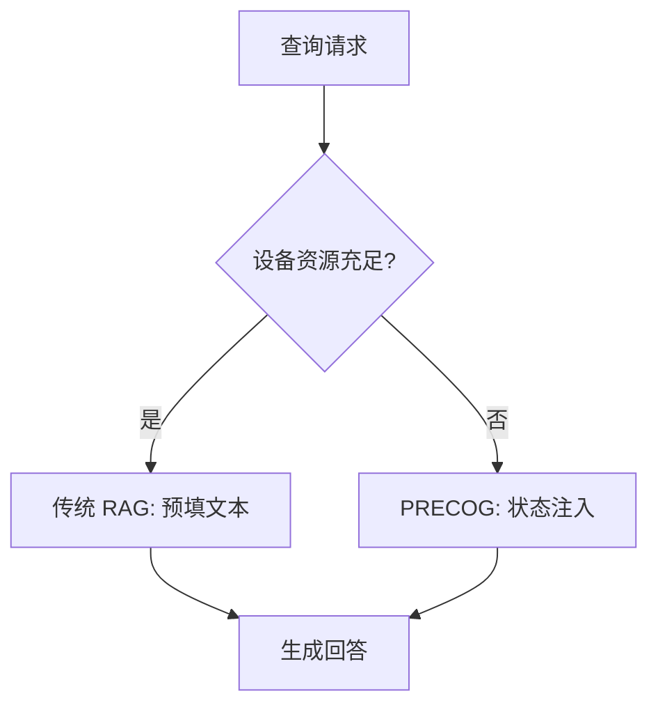

## 本周主题：PRECOG——边缘语言模型的结构化内存与 O(1) 状态注入

### 一句话总结
> PRECOG 将 RAG 的预填成本从 O(L) 降为 O(1)，通过 SSM 状态注入实现边缘设备上的持久上下文与快速检索。

### 记忆锚点（3 个关键记忆点）
1. **状态即摘要**：SSM 的固定大小隐藏状态是全部已读内容的完整摘要，可离线预计算。
2. **注入代替预填**：查询时直接注入状态，绕过文本再摄取，预填延迟降低 4500 倍。
3. **持久记忆分层**：短期偶发状态整合为长期语义记忆，支持认知-域聚类与保真度调节。

### 核心概念拆解

- **SSM（状态空间模型）**
  - 🗣️ 人话：像一个人读书时记笔记，笔记内容固定大小，但能概括整本书。
  - 🔧 本质：通过固定大小的隐藏状态（如 192KB）压缩历史信息，状态更新与位置无关。
  - 📍 定位：Agent 的长期记忆机制，替代 Transformer 的 KV 缓存。
  - 💡 补充：SSM 如 Mamba、S4 等，其状态维度固定，计算复杂度 O(1) 更新。[补充]（参考 Mamba 论文 https://arxiv.org/abs/2312.00752）

- **RAG（检索增强生成）**
  - 🗣️ 人话：先查资料再写答案，但查资料和写答案都要花时间。
  - 🔧 本质：检索外部知识库，将相关文本拼接到 prompt 中，但预填成本随上下文长度线性增长。
  - 📍 定位：Agent 的知识获取环节，PRECOG 优化其预填瓶颈。
  - 💡 补充：传统 RAG 的预填成本 O(L)，KV 缓存随生成增长，PRECOG 通过状态注入消除该成本。[补充]（参考 RAG 综述 https://arxiv.org/abs/2005.11401）

- **PRECOG（预计算上下文注入）**
  - 🗣️ 人话：提前把文档压缩成“摘要卡片”，查询时直接拿卡片，不用重新读全文。
  - 🔧 本质：离线将文档编码为 SSM 状态，查询时选择最匹配的状态注入模型，预填成本 O(1)。
  - 📍 定位：Agent 的检索与记忆模块，适用于边缘设备。
  - 💡 补充：PRECOG 利用 SSM 状态的位置无关性，实现跨文档状态组合。[补充]（原文 https://arxiv.org/abs/2608.02560v1）

- **SMC（结构化内存整合）**
  - 🗣️ 人话：把短期记忆整理成长期记忆，像人把经历总结成经验。
  - 🔧 本质：通过认知-域聚类和保真度-存储-检索拨号，将短期偶发状态整合为长期语义记忆。
  - 📍 定位：Agent 的长期记忆管理，支持持续学习。
  - 💡 补充：SMC 在查询时连接检索到的语义状态，实现高效记忆访问。[补充]（原文）

### 架构与方案对比

- **决策流程图**：


- **对比表**：

| 维度 | 传统 RAG (Transformer) | PRECOG (SSM) | 传统 SSM 直接预填 |
|------|------------------------|--------------|-------------------|
| 预填成本 | O(L) | O(1) | O(L) |
| KV 缓存 | 随生成增长 | 无 | 无 |
| 位置依赖 | 是 | 否 | 否 |
| 边缘设备延迟 | 27s（无法交互） | <6ms（可交互） | 类似传统 RAG |
| 适用场景 | 服务器端高精度 | 边缘实时交互 | 边缘但可接受预填 |
| 核心优势 | 成熟生态 | 极致低延迟 | 简单直接 |
| 主要劣势 | 资源消耗大 | 需离线编码 | 未利用状态复用 |
| 生产级成熟度 | 高 | 中（论文阶段） | 中 |
| 架构师推荐 | 服务器端 | 边缘设备 | 过渡方案 |

[补充] 对比基于原文数据：预填延迟从 27s 降至 6ms，加速 4500 倍。[补充]（原文）

### 代码与实操速查

- **生产级最小示例（Python + PyTorch + Mamba 2.0）**
```python
# 依赖版本：torch 2.1.0, mamba-ssm 2.0.0
import torch
from mamba_ssm import Mamba

class PRECOGRetriever:
    def __init__(self, model_dim=192*1024, state_dim=16):
        self.model = Mamba(d_model=model_dim, d_state=state_dim)
        self.state_cache = {}  # 文档ID -> 状态向量

    def encode_document(self, doc_id, tokens):
        # 离线预计算：将文档编码为状态
        with torch.no_grad():
            _, state = self.model(tokens)  # 假设返回状态
        self.state_cache[doc_id] = state

    def query(self, query_tokens, doc_id):
        # 查询时注入状态，无需预填文本
        state = self.state_cache[doc_id]
        with torch.no_grad():
            output = self.model(query_tokens, state=state)
        return output

# 异常捕获与安全边界
if __name__ == "__main__":
    try:
        retriever = PRECOGRetriever()
        retriever.encode_document("doc1", torch.randint(0, 100, (1024,)))
        result = retriever.query(torch.randint(0, 100, (128,)), "doc1")
        print("Success")
    except Exception as e:
        print(f"Error: {e}")
```

- **关键配置**：
  - `model_dim`：模型隐藏维度，决定状态大小（如 192KB）。
  - `d_state`：状态维度，影响记忆容量。
  - `state_cache`：需持久化存储，可用 Redis 或本地文件。

- **常见报错与解决**：
  - **CUDA 内存不足**：减小 batch size 或使用 CPU。
  - **状态不匹配**：确保文档编码与查询使用相同模型配置。
  - **检索结果不相关**：调整状态相似度阈值或增加聚类维度。

### 避坑清单（Anti-patterns）

- **错误做法**：在边缘设备上使用 Transformer 做 RAG → **正确做法**：采用 SSM 模型如 Mamba，利用状态注入降低延迟（原因：Transformer KV 缓存线性增长，边缘资源受限）。
- **错误做法**：每次查询都重新编码整个文档库 → **正确做法**：离线预计算状态并缓存，查询时 O(1) 注入（原因：避免重复计算，提升响应速度）。
- **错误做法**：忽略状态安全性，直接存储敏感文档状态 → **正确做法**：对状态加密存储，访问控制（原因：状态可能泄露文档内容，需保护隐私）。
- **错误做法**：状态缓存无限增长，无淘汰策略 → **正确做法**：使用 LRU 或基于重要性的淘汰机制（原因：边缘存储有限，需控制内存）。

### 知识关联地图

- **前置知识**：[[RAG处理优化]]、[[多智能体与记忆机制]]
- **横向关联**：[[MCP协议与工具调用]]、[[langchain4j-study-notes-02-rag]]、[[多智能体与记忆机制]]
- **纵向延伸**：探索状态压缩与量化技术，参考《Efficient State Compression for SSMs》

### 本周素材盲区与知识增量

- **原文盲区**：未提供 PRECOG 的具体实现细节（如状态相似度计算方式），未讨论多文档状态组合的冲突处理。
  - **下周探索方向**：设计状态相似度度量实验，对比余弦相似度与欧氏距离；研究多状态融合策略。
- **知识增量**：
  1. 理解 SSM 状态的位置无关性如何带来 O(1) 检索。
  2. 掌握边缘设备上 RAG 的延迟优化思路。
  3. 了解结构化记忆的分层整合机制。

### 参考素材与官方链接

- **原始素材**：raw/structured-memory-edge-language-models.md（来源：http://arxiv.org/abs/2608.02560v1）
- **官方文档/网站**：
  - Mamba 论文：https://arxiv.org/abs/2312.00752（了解 SSM 基础）
  - RAG 综述：https://arxiv.org/abs/2005.11401（了解 RAG 原理）
  - 边缘计算指南：https://aws.amazon.com/edge/（了解边缘部署）

### 本周行动清单

- [ ] 阅读 Mamba 论文，理解 SSM 状态更新机制（预计耗时：60分钟，关联知识点：SSM）✅ Done when：能画出状态更新流程图
- [ ] 实现一个简单的 PRECOG 原型，验证 O(1) 注入效果（预计耗时：120分钟，关联知识点：PRECOG）✅ Done when：运行示例代码并记录延迟对比
- [ ] 调研边缘设备上的模型部署框架（如 TensorFlow Lite、ONNX Runtime）（预计耗时：45分钟，关联知识点：边缘计算）✅ Done when：列出 3 个框架的优缺点

### 相关条目
- [[MCP协议与工具调用]]
- [[langchain4j-study-notes-02-rag]]
- [[多智能体与记忆机制]]
