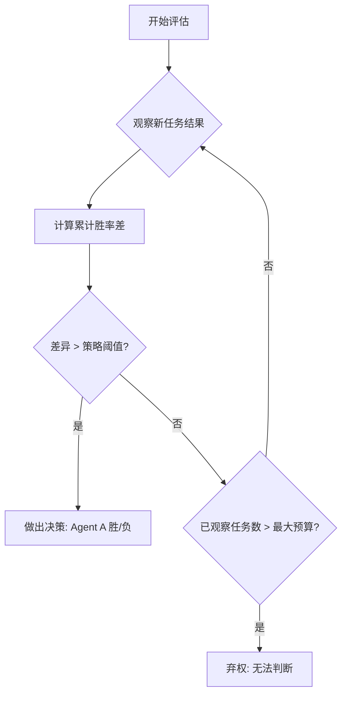

## 本周主题：ParEvalLayer —— 让 LLM-Agent 评价在部分结果上做出可靠决策

### 一句话总结
> 通过预设比较策略与统计检验，在仅观察 15%-25% 任务结果时即可复现完整基准结论，大幅降低 Agent 评估成本。

### 记忆锚点（3 个关键记忆点）
1. **部分得分 ≠ 部分结论**：早期任务样本有偏，不能直接外推最终排名。
2. **决策规则先行**：先定义“好多少才算赢”，再谈提前停止。
3. **15%-25% 的魔力**：在多数公共基准上，仅需少量任务即可做出可靠比较决策。

### 核心概念拆解
- **ParEvalLayer（部分评价决策层）**
  - 🗣️ 人话：像一个“监考老师”，考试没结束，但看到几个学生已经明显领先或落后，就提前判定胜负，省时省力。
  - 🔧 本质：一个基于预设统计阈值（如胜率差、置信区间）的在线决策模块，在部分样本上判断两个 Agent 系统的比较结果是否已具有统计显著性。
  - 📍 定位：AI Agent 评估与基准测试环节，属于 Agent 工程化落地的“质量保障”一环。
  - 💡 补充：该层独立于 Agent 本身，可插拔地嵌入现有评估流水线（如 HELM、OpenCompass）中，通过流式处理部分结果实现提前终止。[补充]（参考 HELM 评估框架：https://crfm.stanford.edu/helm/）

- **比较策略（Comparison Policy）**
  - 🗣️ 人话：提前定好“游戏规则”，比如“A 必须比 B 好 5% 才算赢，否则继续比”。
  - 🔧 本质：预先定义的统计假设检验规则，用于判断当前观察到的性能差异是否达到“实际显著”水平，而非仅“统计显著”。
  - 📍 定位：ParEvalLayer 的核心配置项，决定了决策的激进程度与可靠性。
  - 💡 补充：策略可包括“固定差异阈值”（如准确率绝对差 > 0.05）或“相对差异阈值”（如相对提升 > 10%）。更复杂的策略可引入贝叶斯因子或序贯概率比检验（SPRT）以动态调整阈值。[补充]（SPRT 原理参考：https://en.wikipedia.org/wiki/Sequential_probability_ratio_test）

- **弃权（Abstain）**
  - 🗣️ 人话：裁判说“这场比赛我看不清，不能判，需要更多证据”。
  - 🔧 本质：当观察到的结果不足以支撑任何一方胜出的结论时，系统主动放弃决策，继续收集数据或最终报告“无法判断”。
  - 📍 定位：保障决策可靠性的最后一道防线，避免在数据不足时给出误导性结论。
  - 💡 补充：弃权机制是生产级评估系统的重要组件，它承认了评估的局限性，防止将“无证据”误报为“无差异”。[补充]（参考“带弃权的分类”相关研究：https://arxiv.org/abs/2007.10720）

### 架构与方案对比
- **决策流程图**：


- **对比表**：

| 维度 | 方案A: 完整基准测试 | 方案B: 固定比例提前停止 | 方案C: ParEvalLayer (动态决策) |
| :--- | :--- | :--- | :--- |
| **适用场景** | 最终发布报告、高 stakes 决策 | 快速粗略对比、资源极度紧张 | 常规迭代、需要可靠性与效率平衡 |
| **核心优势** | 结论绝对可靠 | 简单直接，成本固定 | 在保证决策可靠性的前提下，平均成本最低 |
| **主要劣势** | 成本极高、耗时 | 结论可能错误，无可靠性保障 | 需要预设策略，增加设计复杂度 |
| **生产级成熟度** | 高 | 低 | 中（论文验证阶段，需更多实践） |
| **架构师推荐结论** | 仅用于最终验证 | 不推荐，除非对精度无要求 | **推荐**，作为评估流水线的标准组件 |

### 代码与实操速查
- **生产级最小示例（Python 伪代码，核心逻辑）**：
```python
# 语言: Python 3.11+
# 依赖: numpy>=1.24, scipy>=1.10
import numpy as np
from scipy import stats

class ParEvalLayer:
    def __init__(self, min_delta: float = 0.05, alpha: float = 0.05, max_tasks: int = 1000):
        """
        :param min_delta: 最小实际差异阈值 (e.g., 准确率差 > 0.05)
        :param alpha: 统计显著性水平
        :param max_tasks: 最大任务预算，超过则弃权
        """
        self.min_delta = min_delta
        self.alpha = alpha
        self.max_tasks = max_tasks
        self.results_a = []
        self.results_b = []

    def update(self, result_a: float, result_b: float) -> str:
        """
        更新结果并返回决策: 'A_WINS', 'B_WINS', 'CONTINUE', 'ABSTAIN'
        """
        self.results_a.append(result_a)
        self.results_b.append(result_b)

        if len(self.results_a) > self.max_tasks:
            return 'ABSTAIN'

        # 1. 计算当前差异
        diff = np.mean(self.results_a) - np.mean(self.results_b)

        # 2. 进行统计检验（此处使用 Welch's t-test）
        t_stat, p_value = stats.ttest_ind(self.results_a, self.results_b, equal_var=False)

        # 3. 判断是否达到“实际显著”
        if p_value < self.alpha and abs(diff) > self.min_delta:
            if diff > 0:
                return 'A_WINS'
            else:
                return 'B_WINS'
        else:
            return 'CONTINUE'

# 使用示例
evaluator = ParEvalLayer(min_delta=0.02, max_tasks=500)
# 模拟流式结果
for i in range(1000):
    # 假设从两个 Agent 获取结果
    res_a = np.random.beta(8, 2)  # Agent A 表现较好
    res_b = np.random.beta(7, 3)  # Agent B 表现较差
    decision = evaluator.update(res_a, res_b)
    if decision != 'CONTINUE':
        print(f"在第 {i+1} 个任务后做出决策: {decision}")
        break
else:
    print("达到最大预算，弃权")
```

- **关键配置参数**：
    - `min_delta`: 实际显著阈值，避免“统计显著但实际无用”的结论。
    - `alpha`: 显著性水平，控制犯 I 类错误（误判为有差异）的概率。
    - `max_tasks`: 最大预算，防止无限运行。

- **常见报错与解决（Top 3）**：
    1. **`p_value` 为 `nan`**：通常因某一组结果方差为 0。解决：在 `ttest_ind` 前检查方差，若为 0 则直接比较均值。
    2. **决策过于激进**：`min_delta` 设置过小。解决：根据业务实际调整，如准确率差至少 1%。
    3. **长时间不决策**：`max_tasks` 设置过小或 `min_delta` 过大。解决：增加预算或放宽阈值。

### 避坑清单（Anti-patterns）
- **错误做法 1**：直接使用部分任务的平均分进行排名。
  - **正确做法**：使用 ParEvalLayer 或类似统计检验方法。
  - **原因**：早期任务样本有偏，直接比较会导致错误结论。

- **错误做法 2**：忽略“实际显著性”，只看 p 值。
  - **正确做法**：同时设置 `min_delta` 和 `alpha`。
  - **原因**：大样本下微小差异也可能统计显著，但对业务无实际意义。

- **错误做法 3**：在所有场景下都使用相同的比较策略。
  - **正确做法**：根据任务难度、成本、风险调整策略。
  - **原因**：高风险决策需要更保守的策略（更小的 `alpha` 和更大的 `min_delta`）。

- **错误做法 4**：将“弃权”视为系统失败。
  - **正确做法**：将“弃权”作为有效输出，并设计后续流程（如人工介入或补充测试）。
  - **原因**：弃权是系统在信息不足时的正确反应，避免误导性结论。

### 知识关联地图
- **前置知识**：[[langchain4j-study-notes-01-core]] #Agent基础、[[7-agentic-loop-he-xin-xun-huan]] #Agent循环、[[judge0 API调用]] #评测执行
- **横向关联**：[[MCP协议与工具调用]] #工具调用评估、[[RAG处理优化]] #RAG系统评估、[[n8n]] #工作流评估
- **纵向延伸**：
  - 下一步方向：将 ParEvalLayer 集成到主流评测框架（如 OpenCompass、HELM）中。
  - 具体资源：OpenCompass 官方文档（https://opencompass.org.cn/）、HELM 官方文档（https://crfm.stanford.edu/helm/）

### 本周素材盲区与知识增量
- **原文盲区**：
  - 未提供 ParEvalLayer 的具体算法伪代码和参数配置细节。
  - 未讨论不同比较策略（如贝叶斯方法）的对比。
  - 未涉及在非分类任务（如生成式任务）上的应用。
  - **转化为「下周探索方向」**：
    1. 探索基于贝叶斯因子的序贯决策方法在 Agent 评估中的应用。
    2. 研究 ParEvalLayer 在 LLM 生成质量评估（如使用 LLM-as-a-Judge）中的适用性。
- **知识增量总结**：
    1. 理解了“部分评价”与“部分决策”的本质区别，以及统计检验在其中的关键作用。
    2. 认识到“弃权”机制在可靠 AI 系统中的重要性。
    3. 掌握了一种可显著降低 LLM-Agent 评估成本的设计模式。

### 参考素材与官方链接
- **原始素材**：raw/ParEvalLayer-When-Partial-LLM-Agent-Evaluations-Support-a-Decision.md（来源：http://arxiv.org/abs/2608.02444v1）
- **官方文档 / 网站链接**：
  - arXiv 论文页面：http://arxiv.org/abs/2608.02444v1（获取论文原文）
  - HELM 评估框架：https://crfm.stanford.edu/helm/（了解完整评估流程）
  - OpenCompass 评测平台：https://opencompass.org.cn/（主流评测框架）
  - 序贯概率比检验（SPRT）：https://en.wikipedia.org/wiki/Sequential_probability_ratio_test（相关统计理论基础）

### 本周行动清单
- [ ] 阅读论文原文，梳理 ParEvalLayer 的数学定义与算法细节（预计耗时：60分钟，关联知识点：核心概念拆解）✅ Done when：能画出完整的算法流程图
- [ ] 将上述 Python 伪代码实现为可运行的脚本，并用公开数据集（如 GLUE）进行模拟验证（预计耗时：90分钟，关联知识点：代码与实操速查）✅ Done when：脚本能输出与论文一致的“15%-25%”结论
- [ ] 调研 OpenCompass 或 HELM 的插件机制，设计 ParEvalLayer 的集成方案（预计耗时：120分钟，关联知识点：架构与方案对比）✅ Done when：输出一份集成设计文档

### 相关条目
- [[7-agentic-loop-he-xin-xun-huan]]
- [[langchain4j-study-notes-01-core]]
- [[judge0 API调用]]
