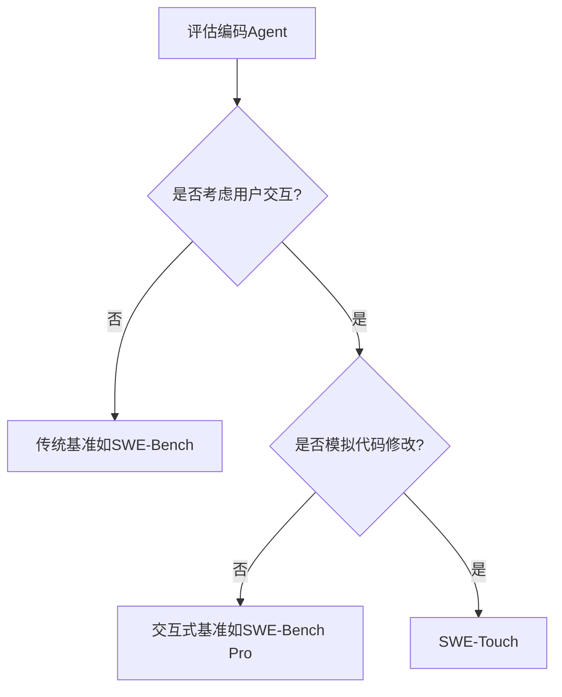

## 本周主题：SWE-Touch——当用户触碰代码时，编码Agent还能否保持性能？

### 一句话总结
> 编码Agent在共享工作空间中面对用户修改代码时，性能显著下降，现有基准未覆盖此关键场景。

### 记忆锚点（3 个关键记忆点）
1. **反编辑**：用户故意修改代码，与任务目标冲突，考验Agent的适应能力。
2. **7.7%降幅**：SWE-Bench Verified上平均解决率下降7.7个百分点，性能损失显著。
3. **共享工作空间**：Agent需实时感知并协调用户改动，而非孤立执行任务。

### 核心概念拆解
- **SWE-Touch基准**
  - 🗣️ 人话：就像考试时老师突然改题目，看学生能否随机应变。
  - 🔧 本质：通过注入与任务冲突的代码修改，测试Agent对工作空间变化的感知和适应能力。
  - 📍 定位：AI Agent评估环节，特别是编码Agent的鲁棒性测试。
  - 💡 补充：SWE-Touch基于SWE-Bench构建，使用用户补丁生成器构造反编辑，并在Agent到达相关代码时注入用户信息。[补充]（参考：SWE-Bench官方文档 https://www.swebench.com/）

- **反编辑（Adversarial Edits）**
  - 🗣️ 人话：故意捣乱，看Agent会不会被带偏。
  - 🔧 本质：对任务相关代码进行可信但冲突的修改，模拟真实协作中的干扰。
  - 📍 定位：基准测试的核心机制，用于评估Agent的冲突处理能力。
  - 💡 补充：反编辑由单独的用户补丁生成器生成，确保编辑的合理性和多样性。[补充]（参考：论文原文 http://arxiv.org/abs/2608.02499v1）

- **共享工作空间（Shared Workspace）**
  - 🗣️ 人话：多人协作的代码仓库，随时可能被他人改动。
  - 🔧 本质：Agent需要监控和响应工作空间中的动态变化，而非静态代码库。
  - 📍 定位：真实开发环境的模拟，强调Agent的协作能力。
  - 💡 补充：现有基准通常让Agent独立工作，SWE-Touch填补了这一空白。[补充]（参考：论文原文）

### 架构与方案对比
- **决策流程图**：


- **对比表**：

| 维度 | SWE-Bench | SWE-Bench Pro | SWE-Touch |
|------|-----------|---------------|-----------|
| 适用场景 | 单Agent独立解决Issue | 长期横向任务 | 共享工作空间中的协作任务 |
| 核心优势 | 标准化、广泛使用 | 任务更复杂、时间跨度长 | 模拟真实协作，测试适应能力 |
| 主要劣势 | 忽略用户交互 | 未模拟代码修改 | 构建成本高，需生成反编辑 |
| 生产级成熟度 | 高 | 中 | 低（研究阶段） |
| 架构师推荐结论 | 适合基础能力评估 | 适合评估长期规划 | 适合评估协作鲁棒性，未来趋势 |

[补充]：SWE-Bench Pro和DeepSWE用于长期横向任务，SWE-Touch在其基础上增加反编辑。[补充]（参考：论文原文）

### 代码与实操速查
- **生产级最小示例**（Python 3.10 + SWE-Touch框架）
```python
# 示例：使用SWE-Touch评估一个编码Agent
import swe_touch

# 初始化评估器
评估器 = swe_touch.Evaluator(
    model_name="gpt-4",  # 替换为你的Agent模型
    benchmark="swe-bench-verified",
    adversarial_edits=True,  # 启用反编辑
)

# 运行评估
try:
    结果 = 评估器.run()
    print(f"解决率: {结果.solve_rate:.2%}")
    print(f"性能下降: {结果.performance_drop:.2%}")
except Exception as e:
    print(f"评估失败: {e}")
    # 记录日志并重试
```
- **关键配置**：
  - `adversarial_edits`：是否注入反编辑，默认False，开启后模拟用户修改。
  - `edit_frequency`：反编辑注入频率，控制干扰程度。
  - `user_patch_generator`：用户补丁生成器，可自定义生成策略。
- **常见报错与解决**：
  1. **依赖缺失**：`ModuleNotFoundError: swe_touch` → 安装 `pip install swe-touch`。
  2. **API超时**：Agent调用超时 → 增加超时时间或使用重试机制。
  3. **反编辑冲突**：编辑与任务无关 → 调整生成器参数，确保编辑相关性。

### 避坑清单（Anti-patterns）
- 错误做法：忽略用户修改，继续执行原计划 → 正确做法：定期检查工作空间变化，及时调整策略（原因：共享工作空间要求Agent动态适应）。
- 错误做法：盲目接受所有用户编辑 → 正确做法：验证编辑是否与任务冲突，必要时回滚（原因：反编辑可能误导Agent）。
- 错误做法：不进行针对性测试 → 正确做法：对修改后的代码运行测试，确保功能正确（原因：验证是适应过程的关键）。
- 错误做法：仅依赖模型内部记忆，不重新检查仓库 → 正确做法：主动重新扫描仓库，获取最新状态（原因：避免使用过时信息）。

### 知识关联地图
- 前置知识：[[1-概述：开源在线代码执行系统]]、[[7-agentic-loop-he-xin-xun-huan]]、[[MCP协议与工具调用]]
- 横向关联：[[AgentHPOBench]]、[[DungeonBench]]、[[ExtractBench]]、[[MOT-SR]]、[[Magnet跨会话AI滥用检测]]、[[ParEvalLayer-部分LLM代理评价决策层]]、[[Tiny-Damage-车辆损伤评估Agentic-VLM分割落地]]
- 纵向延伸：下一步方向：研究Agent在共享工作空间中的主动感知机制，具体资源：论文《SWE-Touch》的后续工作，以及相关开源实现（如GitHub上的swe-touch仓库）。

### 本周素材盲区与知识增量
- 原文盲区：未提供具体Agent模型实现细节、反编辑生成算法、评估指标计算方式。
  - 转化为下周探索方向：
    1. 如何设计高效的反编辑生成算法？
    2. Agent如何主动感知工作空间变化？
    3. 如何平衡自主性与协作性？
- 知识增量总结：
  1. 共享工作空间是编码Agent实际部署的常态，现有基准忽略此维度。
  2. 反编辑是测试Agent鲁棒性的有效手段，可推广到其他Agent评估。
  3. 性能下降主要源于Agent对工作空间变化感知不足，需加强环境监控和冲突处理能力。

### 参考素材与官方链接
- 原始素材：raw/2608.02499v1.md（来源：http://arxiv.org/abs/2608.02499v1）
- 官方文档/网站：
  - SWE-Bench：https://www.swebench.com/（用于理解基础基准）
  - arXiv论文：http://arxiv.org/abs/2608.02499v1（原始论文）
  - SWE-Touch GitHub（若有）：https://github.com/swe-touch（用于代码和数据集）

### 本周行动清单
- [ ] 阅读SWE-Touch论文全文，理解反编辑生成机制（预计耗时：60分钟，关联知识点：核心概念拆解）✅ Done when：能复述反编辑生成流程
- [ ] 尝试运行SWE-Touch评估框架，对现有Agent进行测试（预计耗时：120分钟，关联知识点：代码与实操速查）✅ Done when：成功输出评估结果
- [ ] 分析Agent在共享工作空间中的失败案例，总结改进方向（预计耗时：90分钟，关联知识点：避坑清单）✅ Done when：列出3条改进建议

### 相关条目
- [[AgentHPOBench]]
- [[DungeonBench]]
- [[ExtractBench]]
- [[MOT-SR]]
- [[Magnet跨会话AI滥用检测]]
- [[ParEvalLayer-部分LLM代理评价决策层]]
- [[Tiny-Damage-车辆损伤评估Agentic-VLM分割落地]]
- [[7-agentic-loop-he-xin-xun-huan]]
