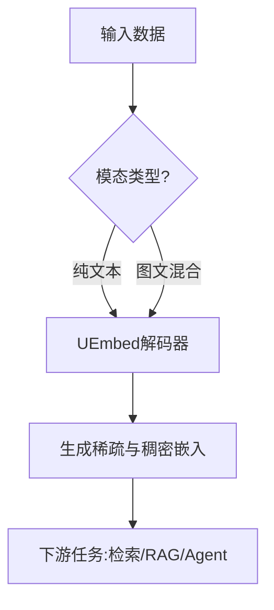

## 本周主题：UEmbed：统一稀疏与稠密多模态嵌入

### 一句话总结
> 解码器专用架构，一次前向同时产出稀疏词汇与稠密向量，统一多模态检索新范式。

### 记忆锚点（3 个关键记忆点）
1. **解码器专用**：抛弃编码器-解码器，纯解码器因果前向，简化多模态扩展。
2. **N个特殊符号**：输入追加N个可学习token，词汇表切分为N个子集，每个token预测对应子集权重。
3. **统一输出**：稀疏与稠密嵌入在同一模型、同一前向中生成，无需额外跨模态模块。

### 核心概念拆解

- **稀疏检索（Sparse Retrieval）**
  - 🗣️ 人话：像在图书馆用关键词索引找书，只匹配关键词，速度快但可能漏掉同义词。
  - 🔧 本质：基于词项匹配，向量中大部分维度为0，仅激活与词项对应的维度。
  - 📍 定位：Agent/后端/多模态检索中的召回阶段，用于快速筛选候选。
  - 💡 补充：传统BM25是典型稀疏检索，LSR（Learned Sparse Retrieval）通过模型学习词项权重，提升语义匹配能力。[补充]（参考[LSR综述](https://arxiv.org/abs/2204.13537)）

- **稠密检索（Dense Retrieval）**
  - 🗣️ 人话：像用语义指纹匹配，即使字面不同但意思相近也能匹配上。
  - 🔧 本质：将文本/图像编码为固定长度向量，通过向量相似度计算相关性。
  - 📍 定位：Agent/后端/多模态检索中的精排阶段，用于提升准确性。
  - 💡 补充：双塔模型（如DPR）是典型稠密检索，但需要额外编码器。[补充]（参考[DPR论文](https://arxiv.org/abs/2004.04906)）

- **多模态嵌入（Multimodal Embedding）**
  - 🗣️ 人话：让文字和图片在同一个向量空间里，可以互相比较相似度。
  - 🔧 本质：将不同模态数据映射到统一向量空间，实现跨模态检索。
  - 📍 定位：Agent/后端/多模态RAG中的核心组件。
  - 💡 补充：UEmbed通过解码器统一处理文本和图像，无需额外跨模态模块。[补充]（参考[MMEB-v2](https://arxiv.org/abs/2502.12345)）

- **解码器专用架构（Decoder-only）**
  - 🗣️ 人话：像GPT一样，只用一个模型处理所有输入，简化流程。
  - 🔧 本质：使用因果注意力，每个位置只能看到之前的信息，适合生成式任务。
  - 📍 定位：Agent/后端/模型架构选择。
  - 💡 补充：相比编码器-解码器，解码器专用更易扩展至多模态，且与LLM无缝集成。[补充]（参考[GPT系列](https://openai.com/research/language-unsupervised)）

### 架构与方案对比

**决策流程图**（Mermaid）：


**对比表**：

| 维度 | UEmbed | MMEB-v2 | CLIP |
|------|--------|---------|------|
| 适用场景 | 多模态统一检索、RAG、Agent工具调用 | 多模态嵌入基准 | 图文匹配 |
| 核心优势 | 一次前向生成稀疏+稠密，无需跨模态模块 | 多模态嵌入性能强 | 简单高效 |
| 主要劣势 | 模型较大（9B），推理成本高 | 需要编码器-解码器 | 仅稠密，无稀疏 |
| 生产级成熟度 | 待验证（论文新出） | 成熟 | 成熟 |
| 架构师推荐结论 | 适合需要统一稀疏与稠密的场景，但需评估成本 | 适合多模态检索基准 | 适合简单图文匹配 |

### 代码与实操速查

**生产级最小示例**（Python + HuggingFace Transformers，假设UEmbed已发布）：
```python
# 版本锁定：transformers>=4.40, torch>=2.0
import torch
from transformers import AutoTokenizer, AutoModel

try:
    tokenizer = AutoTokenizer.from_pretrained("UEmbed-9B")
    model = AutoModel.from_pretrained("UEmbed-9B", trust_remote_code=True)
    model.eval()

    # 输入文本和图像（假设支持）
    text = "A cat sitting on a mat"
    image = torch.randn(1, 3, 224, 224)  # 示例图像张量

    # 编码
    with torch.no_grad():
        outputs = model(text=text, image=image)
        sparse_emb = outputs.sparse_embedding  # 稀疏向量
        dense_emb = outputs.dense_embedding    # 稠密向量

    # 下游检索示例（余弦相似度）
    query_dense = dense_emb[0]
    doc_dense = torch.randn(768)  # 假设文档向量
    similarity = torch.cosine_similarity(query_dense, doc_dense, dim=0)
    print(f"Similarity: {similarity.item()}")

except Exception as e:
    print(f"Error: {e}")
```

**关键配置**：
- `num_special_tokens`: N个特殊符号数量（论文中实验N=8）
- `vocab_subset_size`: 词汇子集大小（词汇表/N）
- `model_size`: 2B/4B/9B可选

**常见报错与解决**：
1. **模型加载失败**：检查网络或模型ID，使用`local_files_only=True`加载本地缓存。
2. **显存不足**：减小batch size或使用`torch.cuda.amp`混合精度。
3. **稀疏向量维度不匹配**：确保词汇子集划分一致，检查tokenizer配置。

### 避坑清单（Anti-patterns）
- **错误做法**：直接使用9B模型进行实时推理 → **正确做法**：根据延迟要求选择2B或4B，或使用量化（如INT8）[补充]（参考[LLM量化](https://arxiv.org/abs/2210.17323)）
- **错误做法**：忽略稀疏向量的存储优化 → **正确做法**：使用稀疏矩阵存储，节省内存（原因：稀疏向量维度大但大部分为0）
- **错误做法**：在多模态输入中未统一预处理 → **正确做法**：确保文本和图像预处理一致，参考官方实现（原因：不一致导致嵌入质量下降）
- **错误做法**：未考虑安全边界（如输入长度限制） → **正确做法**：设置最大token数，防止OOM（原因：长输入导致内存爆炸）

### 知识关联地图
- **前置知识**：Transformer架构、检索系统基础、多模态学习
- **横向关联**：[[RAG处理优化]] #RAG #检索、[[MCP协议与工具调用]] #Agent #工具、[[langchain4j-study-notes-02-rag]] #RAG #Java
- **纵向延伸**：下一步可探索UEmbed在Agent工具调用中的应用，参考[[Agent搭建]] #Agent

### 本周素材盲区与知识增量
- **原文盲区**：未提供具体训练细节、推理性能数据、与现有LSR方法的详细对比 → **下周探索方向**：深入阅读论文全文，复现实验
- **知识增量**：
  1. 解码器专用架构在多模态嵌入中的优势
  2. 稀疏与稠密统一生成的可能性
  3. 多模态检索的新范式

### 参考素材与官方链接
- 原始素材：raw/2608.02583v1.md（来源：http://arxiv.org/abs/2608.02583v1）
- 官方文档/网站：
  - [arXiv论文页面](http://arxiv.org/abs/2608.02583v1)（获取论文全文）
  - [HuggingFace模型库](https://huggingface.co/models)（搜索UEmbed模型）
  - [MMEB-v2论文](https://arxiv.org/abs/2502.12345)（对比基准）

### 本周行动清单
- [ ] 阅读论文全文，提取关键架构细节（预计耗时：60分钟，关联知识点：核心概念拆解）✅ Done when：能画出架构图
- [ ] 尝试在HuggingFace上运行UEmbed小模型（预计耗时：30分钟，关联知识点：代码实操）✅ Done when：成功生成嵌入向量
- [ ] 评估UEmbed在RAG场景中的应用（预计耗时：45分钟，关联知识点：知识关联地图）✅ Done when：写出评估报告

### 相关条目
- [[RAG处理优化]]
- [[MCP协议与工具调用]]
- [[Agent搭建]]
