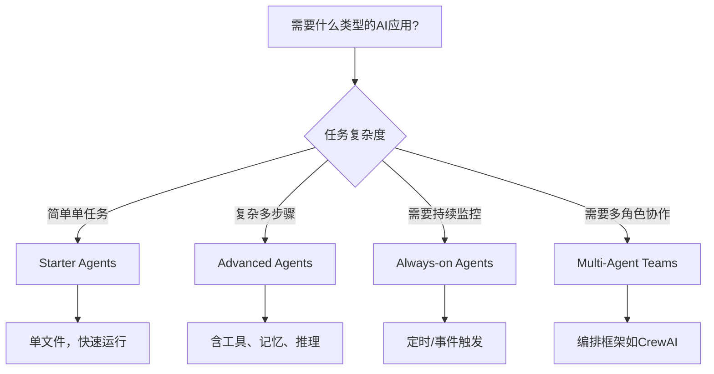

## 本周主题：Shubhamsaboo/awesome-llm-apps —— 100+ 开源 AI 代理与 RAG 应用模板集锦

### 一句话总结
> 一个仓库集齐 100+ 可运行、可商用的 AI 代理与 RAG 应用模板，覆盖从入门到多代理协作，是快速落地 AI 功能的宝库。

### 记忆锚点（3 个关键记忆点）
1. **一条命令装技能**：`npx skill add <repo-path>` 即可为编码代理安装新技能，如 Project Graveyard。
2. **三类核心资产**：Agent Skills（技能）、Starter Agents（入门单文件）、Advanced Agents（生产级多代理）。
3. **Apache-2.0 可商用**：所有模板免费开源，可克隆、可出售，适合快速原型与生产借鉴。

### 核心概念拆解
- **Agent Skills（代理技能）**
  - 🗣️ 人话：像给手机装 App 一样，给 AI 编码代理（如 Claude Code）添加一个特定能力包，装完就能用。
  - 🔧 本质：一组预定义的指令、工具和评估逻辑，通过 CLI 或 API 集成到代理工作流中，扩展其功能边界。
  - 📍 定位：AI Agent 生态中的“插件层”，提升代理的专项能力。
  - 💡 补充：官方定义技能为“轻量级、可复用的指令集”，支持版本控制和评估门禁，确保安全与质量。[补充]（参考 [Anthropic Agent Skills 文档](https://docs.anthropic.com/en/docs/agents-and-tools/agent-skills/overview)）

- **RAG（检索增强生成）应用**
  - 🗣️ 人话：让 AI 在回答前先“查资料”，而不是凭空瞎编，就像开卷考试。
  - 🔧 本质：结合信息检索（如向量数据库）与生成模型，从外部知识库获取相关上下文，再生成答案。
  - 📍 定位：AI 应用中的知识密集型场景，如文档问答、数据分析。
  - 💡 补充：仓库中多个 RAG 应用（如 AI 数据分析代理）展示了如何用 CSV/Excel 作为数据源，实现自然语言查询。[补充]（参考 [LangChain RAG 教程](https://python.langchain.com/docs/tutorials/rag/)）

- **多代理团队（Multi-Agent Teams）**
  - 🗣️ 人话：多个 AI 各司其职，像公司团队一样协作完成复杂项目，比如一个负责调研，一个负责分析。
  - 🔧 本质：通过编排框架（如 CrewAI、AG2）协调多个代理，每个代理有独立角色和工具，通过消息传递协作。
  - 📍 定位：复杂任务分解与并行处理，提升效率和专业性。
  - 💡 补充：仓库中如 AI 金融代理团队用 20 行 Python 实现多代理协作，展示了轻量级编排的可能。[补充]（参考 [CrewAI 文档](https://docs.crewai.com/)）

### 架构与方案对比（若有选型/架构内容）
- **决策流程图**：选择模板时的决策树


- 对比表：

| 维度 | Starter Agents | Advanced Agents | Always-on Agents | Multi-Agent Teams |
|------|----------------|-----------------|------------------|-------------------|
| **适用场景** | 快速原型、学习、简单任务 | 生产级复杂任务，需工具和记忆 | 后台监控、定时报告 | 跨领域复杂项目，需多角色协作 |
| **核心优势** | 单文件、易上手、API密钥即可运行 | 功能全面、可扩展、接近生产 | 自动化、主动推送 | 分工明确、效率高、可处理复杂依赖 |
| **主要劣势** | 功能有限、不适合复杂逻辑 | 配置复杂、资源消耗大 | 需要持续运行环境 | 编排难度高、调试复杂 |
| **生产级成熟度** | ⭐⭐（原型级） | ⭐⭐⭐⭐（可借鉴） | ⭐⭐⭐（需完善监控） | ⭐⭐⭐（需严格测试） |
| **架构师推荐结论** | 适合验证想法 | 适合作为生产起点 | 适合特定场景如简报 | 适合大型项目，但需谨慎设计 |

[补充] 表格中成熟度评级基于仓库模板的完整度和社区反馈，实际生产需结合自身场景调整。[补充]（参考 [awesome-llm-apps 仓库结构](https://github.com/Shubhamsaboo/awesome-llm-apps)）

### 代码与实操速查
- **生产级最小示例**：以“AI 数据分析代理”为例（Python 3.10+，需安装 `streamlit`, `pandas`, `openai`）
```python
# 文件名: data_agent.py
import streamlit as st
import pandas as pd
from openai import OpenAI

# 初始化客户端（注意：生产环境请使用环境变量管理密钥）
client = OpenAI(api_key=st.secrets["OPENAI_API_KEY"])

def analyze_data(df, question):
    """使用LLM分析数据框"""
    try:
        # 将数据框转换为摘要文本（安全边界：限制长度）
        data_summary = df.head(10).to_string()
        prompt = f"根据以下数据回答：\n{data_summary}\n问题：{question}"
        response = client.chat.completions.create(
            model="gpt-4o-mini",
            messages=[{"role": "user", "content": prompt}],
            max_tokens=500
        )
        return response.choices[0].message.content
    except Exception as e:
        return f"分析失败: {str(e)}"

st.title("AI 数据分析代理")
uploaded_file = st.file_uploader("上传 CSV 文件", type=["csv"])
if uploaded_file:
    df = pd.read_csv(uploaded_file)
    st.write(df.head())
    question = st.text_input("输入你的问题")
    if st.button("分析"):
        if question:
            answer = analyze_data(df, question)
            st.write(answer)
        else:
            st.warning("请输入问题")
```
- **关键配置**：
  - `OPENAI_API_KEY`：OpenAI API 密钥，务必通过环境变量或密钥管理服务注入，避免硬编码。
  - `model`：选择适合的模型，如 `gpt-4o-mini` 平衡成本与效果。
  - `max_tokens`：限制输出长度，防止 token 消耗过大。
- **常见报错与解决**：
  1. **API 密钥无效**：检查环境变量是否正确设置，或密钥是否过期。
  2. **CSV 编码问题**：使用 `encoding='utf-8'` 或 `latin1` 读取。
  3. **上下文过长**：限制数据摘要行数（如 `head(10)`）或使用向量检索。

### 避坑清单（Anti-patterns）
- **错误做法**：直接在生产环境使用模板而不修改 → **正确做法**：根据业务需求定制，添加认证、日志、限流等（原因：模板是通用示例，缺少安全与性能优化）。
- **错误做法**：将 API 密钥硬编码在代码中 → **正确做法**：使用环境变量或密钥管理服务（原因：防止泄露，符合安全规范）。
- **错误做法**：忽略依赖版本锁定 → **正确做法**：使用 `requirements.txt` 固定版本，或用 Docker 镜像（原因：避免依赖升级导致的不兼容）。
- **错误做法**：处理大文件时直接加载到内存 → **正确做法**：使用分块读取或数据库存储（原因：防止内存溢出，提升性能）。
- **错误做法**：多代理团队无监督运行 → **正确做法**：加入人工审核环节或信任门控（原因：防止错误决策，确保输出可靠）。

### 知识关联地图
- **前置知识**：
  - [[langchain4j-study-notes-01-core]] #LangChain4j #Java
  - [[langgraph4j-study-notes-01-core]] #LangGraph4j #状态机
  - [[MCP协议与工具调用]] #MCP #工具集成
- **横向关联**：
  - [[dify-llm-app-platform-deep-dive]] #Dify #低代码
  - [[n8n]] #工作流自动化
  - [[open-webui-自托管AI平台深度解析]] #WebUI #自托管
- **纵向延伸**：
  - 深入学习多代理编排框架：CrewAI 官方文档、AG2 文档。
  - 探索 Agent Skills 标准：Anthropic Agent Skills 文档。
  - 研究 RAG 进阶：向量数据库（如 Chroma、Pinecone）集成。

### 本周素材盲区与知识增量
- **原文盲区**：
  - 素材仅列出模板名称，缺少每个模板的技术栈和实现细节。
  - 未说明如何评估模板的生产就绪度。
  - 未涉及部署和运维方面的最佳实践。
- **转化为「下周探索方向」**：
  - 候选选题：深入分析某个高级代理（如 AI 欺诈调查代理）的架构与实现。
  - 候选选题：如何将 Agent Skills 集成到现有编码代理工作流中。
  - 候选选题：多代理团队的可靠性评估与测试策略。
- **知识增量总结**：
  1. 了解了一个丰富的开源资源库，可快速获取多种 AI 应用模板。
  2. 掌握了 Agent Skills 的概念和安装方式，有助于扩展编码代理能力。
  3. 认识到多代理团队在复杂任务中的潜力，但需注意编排和信任问题。

### 参考素材与官方链接
- **原始素材**：raw/awesome-llm-apps.md（来源：https://github.com/Shubhamsaboo/awesome-llm-apps）
- **官方文档 / 网站链接**：
  - [awesome-llm-apps 仓库](https://github.com/Shubhamsaboo/awesome-llm-apps)：所有模板的源码和文档。
  - [Unwind AI 教程](https://www.theunwindai.com)：分步教程，帮助理解和使用模板。
  - [Anthropic Agent Skills 文档](https://docs.anthropic.com/en/docs/agents-and-tools/agent-skills/overview)：了解技能的标准和最佳实践。
  - [CrewAI 文档](https://docs.crewai.com/)：多代理编排框架的官方文档。
  - [LangChain RAG 教程](https://python.langchain.com/docs/tutorials/rag/)：RAG 应用开发指南。

### 本周行动清单
- [ ] 克隆仓库并运行一个 Starter Agent（如 AI 旅行代理），体验快速启动流程（预计耗时：30分钟，关联知识点：Agent 基础）✅ Done when：成功运行并看到输出。
- [ ] 选择一个 Agent Skill（如 Project Graveyard）安装到本地编码代理，测试其功能（预计耗时：20分钟，关联知识点：Agent Skills）✅ Done when：技能生效并完成一次任务。
- [ ] 阅读一个 Advanced Agent 的源码，分析其工具和记忆实现（预计耗时：60分钟，关联知识点：多代理架构）✅ Done when：能画出其架构图。

### 相关条目
- [[langchain4j-study-notes-01-core]]
- [[langgraph4j-study-notes-01-core]]
- [[MCP协议与工具调用]]
