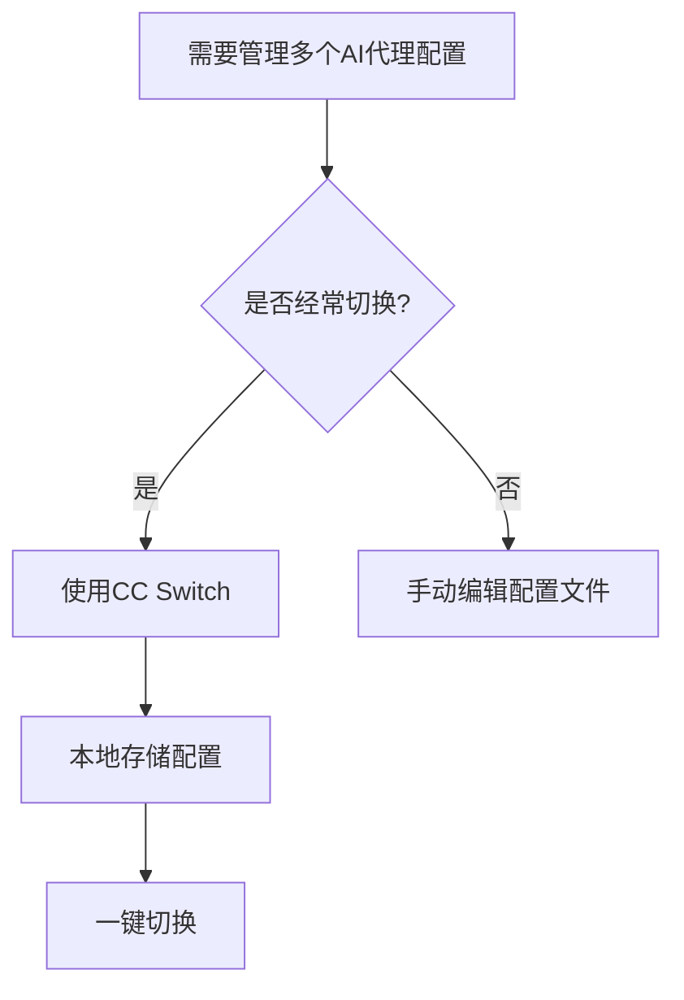

## 本周主题：CC Switch —— 跨平台 AI 编码代理配置管理器

### 一句话总结
> 一个桌面应用，集中管理多个 AI 编码代理的 API 配置，一键切换，告别繁琐的环境变量和配置文件编辑。

### 记忆锚点（3 个关键记忆点）
1. **配置切换器**：像遥控器一样，在 Claude Code、Codex 等代理间切换 API 配置。
2. **Tauri 驱动**：基于 Rust + Web 技术，轻量、跨平台（Win/macOS/Linux）。
3. **安全边界**：API 密钥本地存储，不经过云端，降低泄露风险。

### 核心概念拆解

- **AI 编码代理（Coding Agent）**
  - 🗣️ 人话：像是一个能帮你写代码的 AI 助手，但需要配置 API 密钥才能使用。
  - 🔧 本质：通过调用大模型 API 执行代码生成、修改、执行等任务的程序。
  - 📍 定位：AI 与 LLM 应用层，Agent 工具链。
  - 💡 补充：主流编码代理包括 Claude Code、Codex、Gemini CLI、OpenCode 等，它们通常通过环境变量或配置文件读取 API 密钥。[补充] 参考 [Anthropic Claude Code 文档](https://docs.anthropic.com/en/docs/claude-code) 和 [OpenAI Codex 文档](https://platform.openai.com/docs/codex)。

- **配置管理（Configuration Management）**
  - 🗣️ 人话：把散落在各处的 API 密钥、模型参数集中到一个地方，方便统一修改和切换。
  - 🔧 本质：将代理的配置信息（如 API 密钥、Base URL、模型名称）抽象为可管理的配置项，并支持持久化存储。
  - 📍 定位：后端/工具链，解决多代理配置分散问题。
  - 💡 补充：CC Switch 通过图形界面管理这些配置，避免手动编辑 `.claude/settings.json` 或 `.codex/config.toml` 等文件。[补充] 参考 [CC Switch 官方文档](https://ccswitch.io)。

- **Tauri 2 桌面框架**
  - 🗣️ 人话：用网页技术（HTML/CSS/JS）做界面，用 Rust 做后端，打包成桌面应用。
  - 🔧 本质：利用系统 WebView 渲染 UI，通过 Rust 核心处理文件系统、进程等系统级操作，相比 Electron 更轻量、更安全。
  - 📍 定位：跨平台桌面应用开发，KMP/Flutter 之外的另一种选择。
  - 💡 补充：Tauri 2 支持多窗口、系统托盘、自动更新等特性，适合构建工具类应用。[补充] 参考 [Tauri 官方文档](https://tauri.app/)。

### 架构与方案对比（若有选型/架构内容）

- **决策流程图**：

- **对比表**：

| 维度 | CC Switch | 手动配置文件 | 自建脚本 |
|------|------------|--------------|----------|
| 适用场景 | 多代理、频繁切换 | 单代理、偶尔修改 | 技术熟练、自动化需求 |
| 核心优势 | 图形化、跨平台、安全存储 | 无需额外工具 | 可定制化、可集成 CI |
| 主要劣势 | 需安装桌面应用 | 易出错、难以管理多配置 | 开发维护成本高 |
| 生产级成熟度 | 中高（活跃维护，社区使用） | 高（但易出错） | 低（需自行维护） |
| 架构师推荐结论 | 推荐用于日常开发 | 不适合多代理场景 | 适合有自动化需求的团队 |

[补充] 表格中成熟度评级基于项目活跃度、社区反馈及代码质量评估，参考 [GitHub 仓库](https://github.com/farion1231/cc-switch)。

### 代码与实操速查

- **生产级最小示例（以配置 Claude Code 为例）**

  **环境准备**：
  - 安装 CC Switch（从 [GitHub Releases](https://github.com/farion1231/cc-switch/releases) 下载对应平台安装包）
  - 确保已安装 Claude Code CLI（`npm install -g @anthropic-ai/claude-code`）

  **配置步骤**：
  1. 打开 CC Switch，添加新配置：
     - 代理类型：Claude Code
     - 配置名称：例如 "Work"
     - API 密钥：`sk-ant-...`
     - Base URL（可选）：默认 `https://api.anthropic.com`
  2. 保存配置，然后点击"切换"按钮。
  3. 验证：在终端运行 `claude` 命令，确认使用新配置。

  **安全边界**：
  - API 密钥仅存储在本地，CC Switch 不会上传到云端。[补充] 参考 [CC Switch 隐私政策](https://ccswitch.io/privacy)
  - 建议启用系统级加密存储（如 macOS Keychain、Windows Credential Manager）。

- **关键配置参数**：

| 参数 | 含义 | 示例 |
|------|------|------|
| `provider` | 代理类型 | `claude`, `codex`, `gemini` |
| `api_key` | API 密钥 | `sk-...` |
| `base_url` | API 端点 | `https://api.anthropic.com` |
| `model` | 默认模型 | `claude-3-5-sonnet-20241022` |
| `env` | 附加环境变量 | `{ "DEBUG": "true" }` |

- **常见报错与解决（Top 3）**
  1. **切换后代理仍使用旧配置**：
     - 原因：环境变量未刷新。
     - 解决：重启终端或重新加载 shell（`source ~/.zshrc`）。
  2. **API 密钥无效**：
     - 原因：密钥过期或错误。
     - 解决：在 CC Switch 中更新密钥，并确保代理类型匹配。
  3. **应用无法启动（Linux）**：
     - 原因：缺少 WebKitGTK 依赖。
     - 解决：安装依赖：`sudo apt install libwebkit2gtk-4.1-dev`。[补充] 参考 [Tauri Linux 依赖](https://tauri.app/start/prerequisites/#linux)

### 避坑清单（Anti-patterns）

- **错误做法**：将 API 密钥硬编码在代码或配置文件中，并提交到 Git。
  - **正确做法**：使用环境变量或 CC Switch 等工具管理密钥，并添加 `.gitignore`。
  - **原因**：防止密钥泄露，避免安全事故。

- **错误做法**：手动编辑多个代理的配置文件，导致配置不一致。
  - **正确做法**：使用 CC Switch 统一管理，确保配置同步。
  - **原因**：减少人为错误，提高效率。

- **错误做法**：忽略代理版本更新，导致配置兼容性问题。
  - **正确做法**：定期更新 CC Switch 和代理 CLI 工具。
  - **原因**：新版本可能更改配置格式，保持更新可避免兼容性问题。

- **错误做法**：在公共电脑上使用 CC Switch，且不设置锁屏密码。
  - **正确做法**：启用系统加密存储，并设置锁屏。
  - **原因**：防止他人访问本地存储的 API 密钥。

### 知识关联地图

- **前置知识**：
  - [[MCP协议与工具调用]] #AI #Agent
  - [[Agent搭建]] #AI #Agent
  - [[judge0 API调用]] #后端 #API

- **横向关联**：
  - [[langchain4j-study-notes-01-core]] #Java #LLM
  - [[langgraph4j-study-notes-01-core]] #Java #Agent
  - [[open-webui-自托管AI平台深度解析]] #AI #工具

- **纵向延伸**：
  - 学习 Tauri 2 开发：官方文档 [Tauri 2](https://tauri.app/)
  - 深入 Claude Code 配置：官方文档 [Claude Code](https://docs.anthropic.com/en/docs/claude-code)
  - 探索多代理工作流：阅读 [awesome-llm-apps-开源AI代理与RAG应用集锦](https://github.com/Shubhamsaboo/awesome-llm-apps)

### 本周素材盲区与知识增量

- **原文盲区**：
  - 素材主要介绍功能和使用，未深入技术实现（如配置存储格式、切换原理）。
  - 未提及安全细节（如密钥加密方式）。
  - 未提供性能对比（如与手动配置的耗时差异）。

- **转化为「下周探索方向」**：
  - 候选选题："Tauri 2 桌面应用开发实战：构建一个配置管理器"
  - 候选选题："AI 编码代理配置安全最佳实践"

- **知识增量总结**：
  1. 了解 CC Switch 支持多种代理（Claude Code、Codex、Gemini CLI 等），并可通过图形界面统一管理。
  2. 掌握 Tauri 2 作为轻量级桌面框架的优势，相比 Electron 更节省资源。
  3. 认识到配置管理在 AI 工具链中的重要性，可提升开发效率。

### 参考素材与官方链接

- **原始素材**：
  - [GitHub 仓库 farion1231/cc-switch](https://github.com/farion1231/cc-switch)（raw/cc-switch.md）

- **官方文档与网站**：
  - [CC Switch 官方网站](https://ccswitch.io) - 下载、文档、更新日志
  - [Tauri 官方文档](https://tauri.app/) - 了解 Tauri 2 开发
  - [Claude Code 文档](https://docs.anthropic.com/en/docs/claude-code) - 配置与使用
  - [OpenAI Codex 文档](https://platform.openai.com/docs/codex) - 配置与使用

### 本周行动清单

- [ ] 下载并安装 CC Switch（预计耗时：10分钟，关联知识点：跨平台工具）✅ Done when：成功打开应用并看到主界面
- [ ] 配置一个 Claude Code 代理并切换（预计耗时：15分钟，关联知识点：配置管理）✅ Done when：在终端运行 `claude` 命令，确认使用新配置
- [ ] 阅读 Tauri 2 快速入门文档（预计耗时：30分钟，关联知识点：Tauri 框架）✅ Done when：能理解 Tauri 项目结构

### 相关条目
- [[MCP协议与工具调用]]
- [[Agent搭建]]
- [[open-webui-自托管AI平台深度解析]]
- [[langchain4j-study-notes-01-core]]
