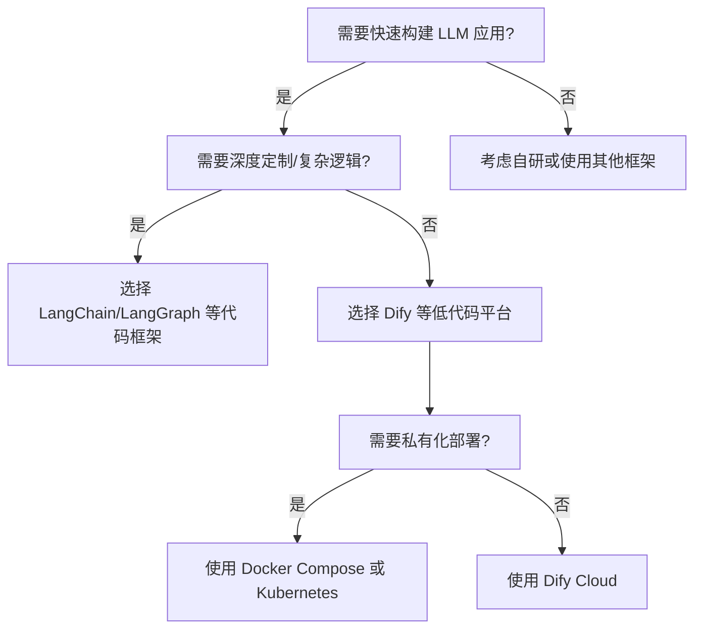

## 本周主题：Dify —— 开源 LLM 应用开发平台深度解析

### 一句话总结
> Dify 是一个集工作流、RAG、Agent、模型管理于一体的开源 LLM 应用开发平台，让你像搭积木一样快速构建并部署 AI 应用。

### 记忆锚点（3 个关键记忆点）
1. **选型口诀**：要快速搭 LLM 应用，不想从零写代码，就用 Dify；要深度定制和极致性能，选 LangChain/LangGraph。
2. **核心价值**：Dify 的核心是 **可视化编排 + 后端即服务 (BaaS)**，它把复杂的 AI 应用开发变成了配置和拖拽。
3. **部署铁律**：生产环境首选 **Docker Compose 或 Kubernetes (Helm)**，避免使用源码部署，以降低运维复杂度。

### 核心概念拆解

- **LLM 应用开发平台 (LLM App Platform)**
  - 🗣️ 人话：一个专门用来“拼装”大模型应用的“乐高工厂”。你不需要自己造轮子（比如连接数据库、处理用户会话），只需要把现成的“积木”（模型、工具、知识库）按你的想法拼起来。
  - 🔧 本质：将 LLM 应用开发的通用环节（模型接入、Prompt 管理、数据检索、Agent 逻辑、可观测性）抽象为可视化、可配置的模块，并提供 API 供外部调用。
  - 📍 定位：AI 应用开发层，位于底层模型和上层业务逻辑之间，是 **Agent 与后端** 的中间件。
  - 💡 补充：这类平台的核心竞争力在于 **降低开发门槛** 和 **提升交付效率**。Gartner 预测到 2026 年，超过 80% 的企业将使用 LLM 编排平台来开发生成式 AI 应用 [补充](https://www.gartner.com/en/newsroom/press-releases/2023-10-03-gartner-predicts-more-than-80-percent-of-enterprises-will-have-used-generative-ai-apis-or-deployed-generative-ai-enabled-applications-by-2026)。

- **可视化工作流 (Visual Workflow)**
  - 🗣️ 人话：把 AI 应用的逻辑（比如“先判断用户意图，再决定是查数据库还是调用工具”）画成一张流程图，而不是写一堆 if-else 代码。
  - 🔧 本质：一种基于 DAG（有向无环图）的编程范式，通过节点（Node）和连线（Edge）定义执行逻辑。
  - 📍 定位：Agent 核心编排层，用于实现复杂的业务逻辑和 Agent 行为。
  - 💡 补充：Dify 的工作流引擎支持条件分支、循环、并行执行等高级逻辑，并提供了丰富的节点类型（如 LLM、知识检索、代码执行、HTTP 请求等）。相比 LangChain 的 Chain 概念，Dify 的可视化方式对非开发者更友好 [补充](https://docs.dify.ai/guides/workflow)。

- **RAG 管道 (RAG Pipeline)**
  - 🗣️ 人话：给大模型装上一个“外挂知识库”。当用户提问时，先从知识库里找出相关的资料，再连同问题一起交给大模型，让它“有据可依”地回答。
  - 🔧 本质：将检索（Retrieval）和生成（Generation）两个阶段串联起来的流水线。核心是文档加载、切分、向量化、存储和检索。
  - 📍 定位：后端数据层，是解决 LLM 幻觉和知识时效性问题的关键。
  - 💡 补充：Dify 的 RAG 管道支持从 PDF、PPT、网页等多种格式中提取文本，并提供了多种检索策略（如向量检索、全文检索、混合检索）和重排序（Rerank）能力 [补充](https://docs.dify.ai/guides/knowledge-base)。

- **Agent 能力 (Agent Capabilities)**
  - 🗣️ 人话：让大模型学会“使用工具”。比如，你问它“今天天气怎么样？”，它会自己去调用天气查询 API，然后把结果告诉你。
  - 🔧 本质：基于 LLM 的推理能力，通过 ReAct（Reasoning + Acting）或 Function Calling 机制，让模型自主决定调用哪个工具、传入什么参数。
  - 📍 定位：Agent 核心能力层，是构建智能体（如 AutoGPT、BabyAGI）的基础。
  - 💡 补充：Dify 支持基于 LLM Function Calling 或 ReAct 两种方式定义 Agent，并内置了 50+ 工具（如 Google Search、DALL·E、Stable Diffusion） [补充](https://docs.dify.ai/guides/agent)。

- **LLMOps (LLM Operations)**
  - 🗣️ 人话：AI 应用的“运维监控中心”。你可以看到每个用户请求的日志、Token 消耗、响应速度，还能根据这些数据来优化 Prompt 和模型。
  - 🔧 本质：将 DevOps 理念应用于 LLM 应用，涵盖日志记录、监控、评估、提示词管理和持续优化。
  - 📍 定位：生产环境必备，是保障 AI 应用稳定性和持续改进的关键。
  - 💡 补充：Dify 集成了 Langfuse、Opik 等第三方可观测性平台，提供更强大的追踪和分析能力 [补充](https://docs.dify.ai/observability)。

### 架构与方案对比

- **决策流程图**：

- **对比表**：

| 维度 | Dify | LangChain/LangGraph | 自研 (基于 LLM API) |
| :--- | :--- | :--- | :--- |
| **适用场景** | 快速原型验证、业务集成、非 AI 专业团队 | 复杂 Agent 逻辑、研究、高度定制化 | 对数据安全、性能、成本有极致要求 |
| **核心优势** | 低代码、可视化、内置 LLMOps、BaaS | 灵活、生态丰富、可编程性强 | 完全可控、无平台锁定 |
| **主要劣势** | 灵活性受限、深度定制困难、平台依赖 | 学习曲线陡峭、开发效率低 | 开发周期长、运维成本高 |
| **生产级成熟度** | ⭐⭐⭐⭐ (社区版活跃，企业版功能完善) | ⭐⭐⭐⭐ (生态成熟，但需自行组装) | ⭐⭐ (取决于团队能力) |
| **架构师推荐结论** | **首选**，快速交付，满足 80% 场景 | 特定复杂场景下选择 | 不推荐，除非有特殊需求 |

### 代码与实操速查

- **生产级最小示例（Docker Compose 部署）**
  - **语言/框架**：Docker & Docker Compose v2.24.0+ (Dify v1.x)
  - **操作步骤**：
    1. 克隆仓库：`git clone https://github.com/langgenius/dify.git`
    2. 进入目录：`cd dify/docker`
    3. 复制环境变量：`cp .env.example .env`
    4. **（生产必做）** 编辑 `.env` 文件，修改以下关键项：
        - `SECRET_KEY`：生成一个强随机密钥（`openssl rand -base64 42`）
        - `POSTGRES_PASSWORD`、`REDIS_PASSWORD`：设置强密码
        - `DB_HOST`、`DB_PORT` 等：如使用外部数据库，修改连接信息
    5. 启动服务：`docker compose up -d`
    6. 访问 `http://localhost/install` 完成初始化。
  - **安全边界**：生产环境务必修改默认密码和密钥，并配置 HTTPS。
  - **补充**：官方提供 Helm Chart 用于 Kubernetes 部署，可实现高可用和弹性伸缩 [补充](https://docs.dify.ai/getting-started/install-self-hosted/install-with-kubernetes)。

- **关键配置（核心参数及含义）**
  - `SECRET_KEY`：用于加密会话和敏感数据的密钥，**必须修改**。
  - `POSTGRES_PASSWORD` / `REDIS_PASSWORD`：数据库和缓存服务的密码。
  - `VECTOR_STORE`：指定向量数据库类型（如 `weaviate`、`qdrant`），用于 RAG 功能。
  - `MODE`：部署模式，可选 `api`、`worker`、`web` 等，用于分布式部署。
  - `LOG_LEVEL`：日志级别，生产环境建议 `INFO`。

- **常见报错与解决（Top 3）**
  1. **`docker compose up -d` 后服务无法启动**：
     - 原因：端口冲突或环境变量配置错误。
     - 解决：检查 `.env` 文件中的端口配置，使用 `docker compose logs <service>` 查看具体错误日志。
  2. **模型调用失败，提示 `Invalid API Key`**：
     - 原因：在 Dify 中配置的模型 API Key 错误或已过期。
     - 解决：在「设置」->「模型供应商」中重新配置正确的 API Key。
  3. **知识库文档上传后，检索不到内容**：
     - 原因：文档切分和向量化过程失败，或检索策略配置不当。
     - 解决：检查文档格式是否支持，尝试调整分块大小和检索策略（如改为混合检索）。

### 避坑清单（Anti-patterns）

- **错误做法**：直接使用默认的 `SECRET_KEY` 和数据库密码部署到生产环境。
  - **正确做法**：部署前务必修改所有默认密钥和密码，并使用强随机数生成。
  - **原因**：默认密钥极易被攻击者利用，导致数据泄露和未授权访问。

- **错误做法**：将所有业务逻辑都塞进 Dify 工作流中，导致工作流图极其复杂，难以维护。
  - **正确做法**：将复杂逻辑拆分为多个子工作流或通过自定义工具（API 扩展）实现，保持工作流简洁清晰。
  - **原因**：过于复杂的工作流是维护噩梦，且难以调试和复用。

- **错误做法**：忽略 LLMOps，上线后不监控日志和性能。
  - **正确做法**：从第一天起就配置日志、监控和告警，并定期分析数据以优化应用。
  - **原因**：没有可观测性，就无法了解应用运行状况，更无法持续改进。

- **错误做法**：在 Dify 中直接处理大文件（如 100MB+ 的 PDF），导致内存溢出或超时。
  - **正确做法**：在上传前对大文件进行预处理（如压缩、切分），或使用外部存储服务（如 S3）进行管理。
  - **原因**：Dify 默认配置下对文件大小有限制，且大文件会消耗大量内存和计算资源。

- **错误做法**：将所有依赖都捆绑在 Dify 中，不关注其版本更新和安全补丁。
  - **正确做法**：定期关注 Dify 的 Release 和 Security Advisory，及时升级版本。
  - **原因**：开源项目会不断修复安全漏洞，保持版本更新是基本的安全要求。

### 知识关联地图

- **前置知识**：
  - [[RAG处理优化]] #RAG #知识库
  - [[MCP协议与工具调用]] #Agent #工具
  - [[langchain4j-study-notes-01-core]] #LangChain4j #Java
- **横向关联**：
  - [[langgraph4j-study-notes-01-core]] #LangGraph #Agent
  - [[n8n]] #工作流 #自动化
  - [[Agent搭建]] #Agent
- **纵向延伸**：
  - 下一步方向：深入研究 Dify 源码，理解其插件机制和 API 设计。
  - 具体资源：Dify 官方文档 [补充](https://docs.dify.ai/)、GitHub 仓库 [补充](https://github.com/langgenius/dify)。

### 本周素材盲区与知识增量

- **原文盲区**：素材（GitHub README）仅提供了功能概览，缺乏对 Dify 内部架构（如 API 服务、Worker 服务、数据库设计）的深入解析，也未涉及具体的二次开发示例。
  - **转化为「下周探索方向」**：
    - 候选选题 1：**Dify 源码架构解析**：深入分析 Dify 的 API 层、Worker 层和数据模型。
    - 候选选题 2：**Dify 自定义插件开发实战**：编写一个自定义工具或模型插件。
- **知识增量总结**：
  1. 理解了 LLM 应用开发平台（如 Dify）的核心价值在于 **抽象和可视化**，将复杂的 AI 工程问题转化为配置问题。
  2. 掌握了 Dify 的部署方式（Docker Compose / Kubernetes）和关键配置项，为生产落地打下基础。
  3. 认识到 LLMOps 在 AI 应用生命周期中的重要性，Dify 提供了从开发到运维的一体化解决方案。

### 参考素材与官方链接

- **原始素材**：raw/langgenius-dify-github-readme.md (来源：https://github.com/langgenius/dify)
- **官方文档**：https://docs.dify.ai/ （包含安装部署、功能指南、API 参考等）
- **Dify Cloud**：https://cloud.dify.ai （官方托管的云服务，可快速体验）
- **Docker Hub**：https://hub.docker.com/u/langgenius （官方 Docker 镜像）
- **Helm Charts**：https://github.com/douban/charts/tree/master/charts/dify （社区维护的 Kubernetes 部署方案）

### 本周行动清单

- [ ] 使用 Docker Compose 在本地部署一套 Dify 环境（预计耗时：30分钟，关联知识点：Docker、Dify 部署）✅ Done when：浏览器能正常访问 Dify 初始化页面。
- [ ] 在 Dify 中创建一个简单的 RAG 应用，上传一份 PDF 文档并测试问答（预计耗时：45分钟，关联知识点：RAG、知识库）✅ Done when：能基于 PDF 内容正确回答相关问题。
- [ ] 阅读 Dify 官方文档中关于「工作流」和「Agent」的章节，并尝试创建一个带条件分支的工作流（预计耗时：60分钟，关联知识点：工作流、Agent）✅ Done when：成功运行一个包含条件分支的测试工作流。

### 相关条目
- [[RAG处理优化]]
- [[MCP协议与工具调用]]
- [[Agent搭建]]
