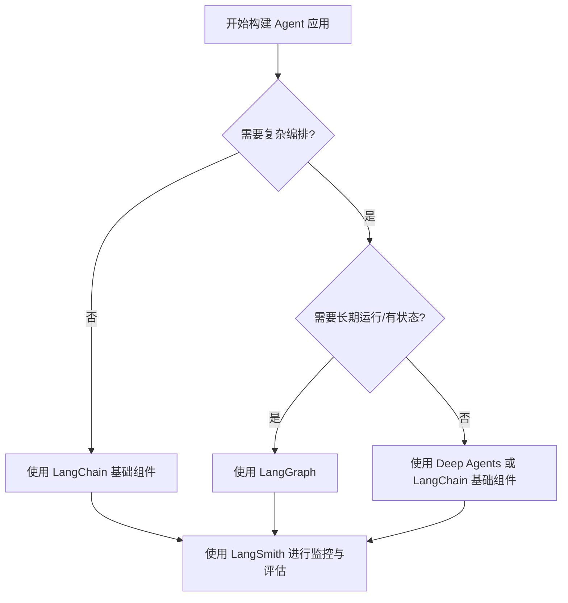

## 本周主题：LangChain —— Agent 工程平台深度解析

### 一句话总结
> LangChain 不只是 LLM 封装库，而是一套覆盖开发、编排、评估、部署的 Agent 工程化平台，核心价值在于标准化抽象与生态集成。

### 记忆锚点（3 个关键记忆点）
1. **LangChain 是“乐高”，LangGraph 是“图纸”**：前者提供积木块（模型、工具、向量库），后者定义搭建流程（状态机、图编排）。
2. **模型互操作性是“插座”**：通过统一接口 `init_chat_model`，换模型如换插座，业务代码零改动。
3. **生产级三件套：LangChain（开发）+ LangGraph（编排）+ LangSmith（监控/评估）**，缺一不可。

### 核心概念拆解
- **LangChain 核心抽象**
  - 🗣️ 人话：LangChain 就像手机的应用商店，它定义了 App（模型）、硬件接口（工具）、存储（向量库）的统一标准，开发者按标准开发，用户按标准使用，互相兼容。
  - 🔧 本质：通过标准接口（`BaseChatModel`、`BaseTool`、`BaseRetriever`）屏蔽底层差异，实现组件可插拔与互操作。
  - 📍 定位：Agent 开发的基础设施层，提供构建 Agent 所需的“积木”。
  - 💡 补充：LangChain 核心价值在于其庞大的集成生态（500+ 集成），覆盖模型提供商、向量数据库、工具 API 等，极大降低了集成成本。[补充]（官方集成列表：https://docs.langchain.com/oss/python/integrations/providers/overview）

- **LangGraph（低级编排框架）**
  - 🗣️ 人话：LangGraph 是 Agent 的“导演”，它用图（Graph）的方式定义 Agent 的执行流程：哪个节点先执行、什么条件下跳转到哪个节点、如何循环。
  - 🔧 本质：基于图的状态机，节点是处理逻辑（调用 LLM、执行工具），边是状态转移条件，支持循环、分支、并行。
  - 📍 定位：Agent 编排层，用于构建可控、复杂、有状态的工作流。
  - 💡 补充：LangGraph 的核心优势在于其**细粒度的控制能力**和**持久化支持**（`checkpointer`），适合生产级 Agent 的复杂状态管理。[补充]（官方文档：https://docs.langchain.com/oss/python/langgraph/overview）

- **Deep Agents（高级包）**
  - 🗣️ 人话：Deep Agents 是 LangChain 官方提供的“预制菜”Agent 模板，内置了规划、子代理、文件系统操作等常见能力，开箱即用。
  - 🔧 本质：基于 LangGraph 构建的高级 Agent 模式封装，提供通用 Agent 能力（如 ReAct、Plan-and-Execute）。
  - 📍 定位：面向特定场景的 Agent 快速启动工具。
  - 💡 补充：Deep Agents 是 LangChain 官方推荐的入门起点，适合快速验证想法，但复杂定制仍需深入 LangGraph。[补充]（官方介绍：http://docs.langchain.com/oss/python/deepagents/）

- **LangSmith（可观测性与评估平台）**
  - 🗣️ 人话：LangSmith 是 Agent 的“行车记录仪”和“考场”，记录 Agent 每一步的输入输出、Token 消耗、耗时，并支持批量评估 Agent 的表现。
  - 🔧 本质：LLM 应用的全链路追踪（Tracing）、离线/在线评估（Evaluation）与监控平台。
  - 📍 定位：生产环境下的运维与质量保障层。
  - 💡 补充：LangSmith 不仅支持 LangChain 生态，也支持通过 SDK 集成其他框架，是生产级 Agent 应用不可或缺的一环。[补充]（官方文档：https://docs.langchain.com/langsmith/home）

### 架构与方案对比
- **决策流程图**：


- **对比表**：

| 维度 | LangChain 基础库 | LangGraph | Deep Agents |
| :--- | :--- | :--- | :--- |
| **适用场景** | 简单的 LLM 调用、RAG 流程、工具调用 | 复杂、可控、有状态的 Agent 工作流 | 快速启动的常见 Agent 模式（规划、子代理） |
| **核心优势** | 抽象统一、集成丰富、上手快 | 细粒度控制、状态持久化、支持循环与分支 | 开箱即用、内置最佳实践 |
| **主要劣势** | 编排能力弱，难以构建复杂流程 | 学习曲线陡峭，需要理解图与状态概念 | 定制性差，难以应对非常规需求 |
| **生产级成熟度** | ★★★★☆（作为基础库稳定） | ★★★★☆（社区活跃，但需自行处理部分边界） | ★★★☆☆（较新，需充分测试）[补充] |
| **架构师推荐结论** | 作为所有项目的基础依赖 | 核心 Agent 编排首选 | 适合 MVP 或标准场景快速验证 |

### 代码与实操速查
- **生产级最小示例（Python 3.11 + langchain 1.0）**：
```python
# 安装：pip install "langchain[openai]" langgraph langsmith
from langchain.chat_models import init_chat_model
from langchain_core.tools import tool
from langgraph.prebuilt import create_react_agent
from langgraph.checkpoint.memory import MemorySaver
import os

# 1. 初始化模型（支持多提供商切换）
llm = init_chat_model("openai:gpt-4o", temperature=0) # 或 "anthropic:claude-3-5-sonnet"

# 2. 定义工具
@tool
def get_weather(city: str) -> str:
    """获取指定城市的天气。"""
    # 生产环境应调用真实 API，并处理异常
    try:
        # 模拟 API 调用
        return f"{city} 的天气是晴天，25°C。"
    except Exception as e:
        return f"获取天气失败: {e}"

# 3. 构建 Agent（使用 LangGraph 的预构建 ReAct Agent）
# 使用 MemorySaver 实现状态持久化（生产环境可替换为 PostgresSaver 等）
agent = create_react_agent(model=llm, tools=[get_weather], checkpointer=MemorySaver())

# 4. 执行 Agent
config = {"configurable": {"thread_id": "user-123"}} # 用于区分不同会话状态
response = agent.invoke(
    {"messages": [{"role": "user", "content": "北京天气怎么样？"}]},
    config=config
)
print(response["messages"][-1].content)

# 5. 异常捕获与安全边界
# - 所有外部 API 调用需 try-catch
# - 对用户输入进行长度限制和内容过滤
# - 使用环境变量管理 API Key，切勿硬编码
```

- **关键配置（核心参数及含义）**：
  - `init_chat_model("provider:model_name")`：统一模型初始化，`provider` 支持 `openai`、`anthropic`、`google_vertexai` 等。
  - `create_react_agent(model, tools, checkpointer)`：创建 ReAct 模式 Agent，`checkpointer` 用于状态持久化。
  - `config = {"configurable": {"thread_id": "..."}}`：`thread_id` 是会话标识，用于隔离不同用户/会话的 Agent 状态。

- **常见报错与解决（Top 3）**：
  1. **`ModuleNotFoundError: No module named 'langchain_openai'`**：未安装对应集成包。解决：`pip install langchain-openai`。
  2. **`AuthenticationError: api_key`**：API Key 未设置或错误。解决：设置环境变量 `OPENAI_API_KEY`，或检查 Key 有效性。
  3. **`LangGraphException: Invalid graph`**：图定义错误（如节点不存在）。解决：检查 `add_node` 和 `add_edge` 的节点名称是否一致。

### 避坑清单（Anti-patterns）
- **错误做法**：将所有逻辑写在一个巨大的 `chain` 中，导致难以调试和维护。
  - **正确做法**：使用 LangGraph 将复杂流程拆分为多个节点，每个节点职责单一，便于测试和追踪。（原因：提高可维护性和可观测性）
- **错误做法**：在 Agent 中直接调用外部 API，不进行异常捕获。
  - **正确做法**：所有工具函数内部必须 try-catch，并返回友好的错误信息给 LLM。（原因：避免 Agent 因未处理异常而崩溃，提高鲁棒性）
- **错误做法**：将 API Key 硬编码在代码中，或提交到 Git 仓库。
  - **正确做法**：使用环境变量或密钥管理服务（如 Vault）管理敏感信息。（原因：防止密钥泄露，符合安全规范）
- **错误做法**：在生产环境使用 `MemorySaver` 存储状态，导致内存溢出。
  - **正确做法**：使用 `PostgresSaver` 或 `RedisSaver` 等外部存储，实现状态持久化和水平扩展。（原因：内存存储无法应对多实例部署和长期运行）
- **错误做法**：盲目追求“全自动”Agent，不设置任何人工审核环节。
  - **正确做法**：在高风险操作（如删除、转账）前，加入人工确认节点（`interrupt`）。（原因：保证安全边界，防止 Agent 误操作）

### 知识关联地图
- **前置知识**：[[langchain4j-study-notes-01-core]]、[[langgraph4j-study-notes-01-core]]、[[MCP协议与工具调用]]
- **横向关联**：[[dify-llm-app-platform-deep-dive]] #Agent平台 #低代码、[[n8n]] #工作流自动化、[[Agent搭建]] #实践
- **纵向延伸**：
  - 深入学习 LangGraph 高级特性（`StateGraph`、`Checkpointer`、`Human-in-the-loop`）：官方文档 https://docs.langchain.com/oss/python/langgraph/overview
  - 学习 LangSmith 评估与监控：官方文档 https://docs.langchain.com/langsmith/home
  - 探索 Deep Agents 源码，理解高级 Agent 模式实现：https://github.com/langchain-ai/langchain/tree/master/libs/experimental

### 本周素材盲区与知识增量
- **原文盲区**：
  - 素材仅提供了 LangChain 的概览，未涉及具体 API 使用、LangGraph 的图定义细节、LangSmith 的评估配置等。
  - 未讨论 LangChain 与其他框架（如 LlamaIndex）的对比。
  - 未涉及 LangChain 在 Java/Kotlin 生态中的对应实现（LangChain4j）。
- **转化为「下周探索方向」**：
  - **候选选题**：LangGraph 状态机深度实践（含 `StateGraph` 自定义节点与边）。
  - **候选选题**：LangSmith 在生产环境中的评估策略与最佳实践。
  - **候选选题**：LangChain4j 与 LangChain.py 的对比与选型指南。
- **知识增量总结**：
  1. LangChain 已从“链”演进为“Agent 工程平台”，核心是 LangGraph 编排与 LangSmith 可观测性。
  2. 生产级 Agent 应用必须考虑状态持久化、异常处理、安全边界与可观测性，而非仅仅调用 LLM。
  3. 模型互操作性（`init_chat_model`）是降低供应商锁定风险的关键设计。

### 参考素材与官方链接
- **原始素材**：raw/langchain-ai-langchain.md（来源：https://github.com/langchain-ai/langchain）
- **官方文档与网站**：
  - LangChain 官方文档（概念与指南）：https://docs.langchain.com/oss/python/langchain/overview
  - LangGraph 官方文档（编排框架）：https://docs.langchain.com/oss/python/langgraph/overview
  - LangSmith 官方文档（可观测性与评估）：https://docs.langchain.com/langsmith/home
  - LangChain 集成列表（模型/工具/向量库）：https://docs.langchain.com/oss/python/integrations/providers/overview
  - LangChain Academy（免费课程）：https://academy.langchain.com/
  - LangChain.js（JS/TS 版本）：https://github.com/langchain-ai/langchainjs

### 本周行动清单
- [ ] 阅读 LangGraph 官方文档的“概念”章节，理解 StateGraph、Node、Edge 核心概念（预计耗时：60分钟，关联知识点：LangGraph 编排）✅ Done when：能画出简单的 Agent 状态图
- [ ] 使用 LangChain + LangGraph 构建一个带工具调用的简单 Agent（如天气查询），并加入异常捕获（预计耗时：90分钟，关联知识点：LangChain 基础、LangGraph）✅ Done when：Agent 能正确调用工具并返回结果，且能处理工具调用失败
- [ ] 注册 LangSmith 并创建一个项目，将上述 Agent 的追踪数据上传，查看 Trace 详情（预计耗时：30分钟，关联知识点：LangSmith）✅ Done when：能在 LangSmith 后台看到 Agent 的完整执行链路
- [ ] 调研 LangChain4j 的现状与核心 API，与 LangChain.py 做简单对比（预计耗时：45分钟，关联知识点：LangChain4j）✅ Done when：输出一份 200 字左右的对比笔记

### 相关条目
- [[langchain4j-study-notes-01-core]]
- [[langgraph4j-study-notes-01-core]]
- [[MCP协议与工具调用]]
- [[dify-llm-app-platform-deep-dive]]
