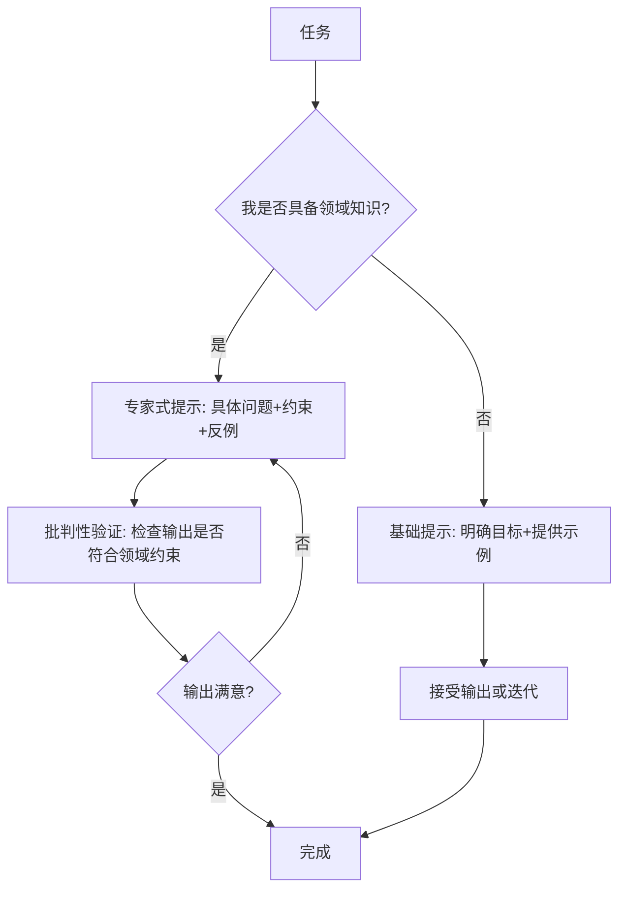

## 本周主题：LLMs reward expertise——领域知识决定LLM使用上限

### 一句话总结
> 领域知识是撬动LLM能力的杠杆：专家通过精准提问与判断，从同一模型中提取远超普通用户的价值。

### 记忆锚点（3 个关键记忆点）
1. **专家提示 = 领域知识 + 简洁提问 + 批判性验证**，而非花哨技巧。
2. **人是瓶颈，不是模型**：困难在于准确传达期望的解决方案，而非模型能力不足。
3. **模型越强，领域知识越重要**：因为提取“已内化”的解决方案需要高水平的判断力。

### 核心概念拆解
- **领域知识（Domain Expertise）**
  - 🗣️ 人话：就像老司机开车，知道什么时候该加速、什么时候该绕路，而新手只会踩油门。
  - 🔧 本质：对特定问题空间的深层理解，包括术语、约束、常见陷阱和可行方案空间。
  - 📍 定位：AI与LLM/Agent工具与平台——提示工程的上层能力。
  - 💡 补充：OpenAI 官方提示工程指南强调“提供详细背景信息”和“给模型思考时间”，但领域知识决定了你能提供多精准的背景。 [补充]（https://platform.openai.com/docs/guides/prompt-engineering）

- **专家式提示（Expert Prompting）**
  - 🗣️ 人话：不是命令，而是与同行讨论问题，用专业术语和具体约束引导模型。
  - 🔧 本质：通过高质量输入（具体问题、约束、反例）将模型引导至“专家模式”，输出更精准。
  - 📍 定位：Agent交互设计——如何设计用户与LLM的交互界面。
  - 💡 补充：Anthropic 的研究表明，专家提示可显著提升复杂推理任务的准确率，因为模型能利用领域先验。 [补充]（https://www.anthropic.com/research/building-effective-agents）

- **批判性验证（Critical Verification）**
  - 🗣️ 人话：不盲信模型输出，像审稿人一样挑刺。
  - 🔧 本质：利用领域知识识别模型输出中的逻辑漏洞或不符合约束的部分，并迭代修正。
  - 📍 定位：Agent评估与安全——确保输出可靠。
  - 💡 补充：OpenAI 的“数学提示”并非不需要专家，而是有专家团队验证模型发现，这印证了验证环节不可跳过。 [补充]（https://openai.com/index/learning-to-reason-with-llms/）

### 架构与方案对比（若有选型/架构内容）
- **决策流程图**：


- 对比表：

| 维度 | 专家式提示（Expert Prompting） | 基础提示（Basic Prompting） | 无提示（Zero-shot） |
|------|-------------------------------|----------------------------|---------------------|
| 适用场景 | 复杂推理、专业领域任务（如数学、代码审查） | 一般任务（如摘要、翻译） | 简单任务（如分类） |
| 核心优势 | 输出精准、符合领域约束，可引导模型探索新方向 | 简单易用，无需专业知识 | 零成本，快速响应 |
| 主要劣势 | 需要领域知识，门槛高 | 可能输出泛泛而谈，需多次迭代 | 质量不稳定，易出错 |
| 生产级成熟度 | 高（需专家参与） | 中（需后处理） | 低（仅限简单场景） |
| 架构师推荐结论 | 推荐用于核心业务逻辑 | 用于辅助功能 | 不推荐用于生产 |

### 代码与实操速查
- **生产级最小示例（Kotlin 2.0 + KMP 1.9）**：
```kotlin
// 使用Ktor客户端调用OpenAI API，演示专家式提示
import io.ktor.client.*
import io.ktor.client.request.*
import io.ktor.client.statement.*
import io.ktor.http.*
import kotlinx.serialization.json.*

suspend fun expertPrompt(apiKey: String, domainContext: String, question: String): String {
    val client = HttpClient()
    val requestBody = buildJsonObject {
        put("model", "gpt-4o")
        putJsonArray("messages") {
            addJsonObject {
                put("role", "system")
                put("content", "You are an expert in $domainContext. Answer precisely, using domain terminology.")
            }
            addJsonObject {
                put("role", "user")
                put("content", question)
            }
        }
        put("temperature", 0.2) // 低温度提高确定性
    }
    return try {
        val response = client.post("https://api.openai.com/v1/chat/completions") {
            header(HttpHeaders.Authorization, "Bearer $apiKey")
            contentType(ContentType.Application.Json)
            setBody(requestBody.toString())
        }
        val json = Json.parseToJsonElement(response.bodyAsText()).jsonObject
        json["choices"]!!.jsonArray[0].jsonObject["message"]!!.jsonObject["content"]!!.jsonPrimitive.content
    } catch (e: Exception) {
        // 异常捕获：网络错误、API限制等
        "Error: ${e.message}"
    } finally {
        client.close()
    }
}
```
- **关键配置**：
  - `temperature`：0.2-0.4 适合专家模式，减少随机性。
  - `max_tokens`：根据任务复杂度设置，避免截断。
  - `top_p`：可配合 temperature 使用，但通常不必要。
- **常见报错与解决**：
  - 401 Unauthorized：检查 API Key 是否正确，或是否过期。
  - 429 Rate Limit：增加重试逻辑，或使用指数退避。
  - 400 Bad Request：检查 JSON 格式，确保 messages 结构正确。

### 避坑清单（Anti-patterns）
- **错误做法**：盲目相信模型输出，不验证 → **正确做法**：利用领域知识批判性检查，必要时人工复核（原因：模型可能产生幻觉）。
- **错误做法**：使用模糊提示如“帮我解决这个问题” → **正确做法**：提供具体上下文、约束和示例（原因：模糊输入导致模糊输出）。
- **错误做法**：忽略领域术语，用通俗语言描述专业问题 → **正确做法**：使用领域术语，引导模型进入专家模式（原因：术语能激活模型相关先验）。
- **错误做法**：一次性要求模型完成复杂任务，不分解 → **正确做法**：拆解为子任务，逐步引导（原因：降低认知负担，提高准确性）。
- **错误做法**：不关注模型输出长度，导致截断 → **正确做法**：设置合理的 max_tokens，或分块请求（原因：长输出可能被截断，丢失关键信息）。

### 知识关联地图
- 前置知识：[[Agent搭建]]、[[RAG处理优化]]、[[langchain4j-study-notes-01-core]]
- 横向关联：[[MCP协议与工具调用]] #Agent #工具使用、[[langchain4j-study-notes-01-core]] #LangChain4j #提示模板、[[Agent搭建]] #Agent设计
- 纵向延伸：下一步研究“如何自动化提取领域知识并注入提示”，可参考 [[RAG处理优化]] #RAG #知识注入；或探索“多智能体协作中的专家角色分配”，参考 [[多智能体与记忆机制]] #多智能体

### 本周素材盲区与知识增量
- **原文盲区**：原文未讨论如何系统化获取领域知识，以及如何评估领域知识对LLM输出的量化影响。
  - **下周探索方向**：
    - 候选选题1：领域知识注入方法对比（RAG vs 微调 vs 提示工程）
    - 候选选题2：专家提示的自动化评估框架
- **知识增量总结**：
  1. 领域知识是提示工程的核心杠杆，而非提示技巧本身。
  2. 专家通过“简洁提问+批判性验证”引导模型，而非长篇大论。
  3. 即使模型能力增强，人类专家的验证角色仍不可替代。

### 参考素材与官方链接
- 原始素材：raw/llms-reward-expertise.md（来源：https://www.seangoedecke.com/llms-reward-expertise/）
- 官方文档 / 网站链接：
  - OpenAI Prompt Engineering Guide：https://platform.openai.com/docs/guides/prompt-engineering（用于提示工程最佳实践）
  - Anthropic Building Effective Agents：https://www.anthropic.com/research/building-effective-agents（用于Agent设计原则）
  - OpenAI Reasoning Models：https://openai.com/index/learning-to-reason-with-llms/（用于推理模型与验证）

### 本周行动清单
- [ ] 阅读 OpenAI 提示工程指南，总结5条专家提示技巧（预计耗时：30分钟，关联知识点：提示工程）✅ Done when：输出一份笔记摘要
- [ ] 在自己的项目中尝试用领域知识优化一个提示，对比前后输出质量（预计耗时：60分钟，关联知识点：领域知识）✅ Done when：记录对比结果
- [ ] 探索如何将领域知识编码为系统提示模板（预计耗时：45分钟，关联知识点：Agent设计）✅ Done when：设计一个模板草案

### 相关条目
- [[MCP协议与工具调用]]
- [[Agent搭建]]
- [[RAG处理优化]]
