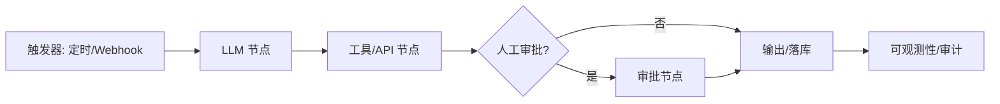

# n8n

把 AI 工作流画成流程图：拖拽节点、插自定义代码、接 1500 多个服务，自己托管也行——从原型到生产的低代码自动化平台。

## 检索问题（Q&A）
- 想可视化编排 AI 工作流 / Agent，用什么？→ 本条目：n8n 核心能力、部署方式
- 自托管工作流引擎怎么选？→ n8n 与云端方案对比要点

## 结构化提炼

### 核心论点
n8n 以"可视化画布 + 代码节点 + 海量集成"覆盖 AI 工作流从原型到生产的全流程，模型无锁定、可自托管、企业特性完整（RBAC / 审计 / 敏感数据处理）。

### 逻辑骨架
- 问题：AI 工作流编排要么太技术（纯代码）、要么被云厂商锁定
- 方案：公平代码（Fair-code）平台——可视化构建、任意模型切换、1500+ 集成、9000+ 模板
- 部署：npx n8n 或 Docker（端口 5678），可自托管
- 企业：RBAC、审计日志、敏感数据保护、人工审批、可观测性

### 关键概念（费曼式）
- 公平代码（Fair-code）：源码可见、可自托管、可扩展，但商用有附加条款——介于开源与闭源之间
- 节点（Node）：工作流里的一个步骤（触发 / 处理 / 工具 / 模型），像流水线工位

## 深度追问

### 苏格拉底式质疑
1. 复杂分支 / 状态管理到一定程度，低代码画布是否变成"蜘蛛网"反而不如代码？
2. 1500+ 集成里有多少是稳定官方维护，还是社区节点占多数？
3. 自托管的高可用 / 升级 / 备份成本，是否被"免云费"掩盖？

### 背景与盲区
- 背景：AI 工作流编排赛道（n8n / LangFlow / Dify / Coze）竞争激烈，n8n 强调"开发者与企业向"
- 盲区：大规模并行性能、与现有系统的深度定制成本

### 溯源与验证
- 开源仓库 n8n-io/n8n，文档与社区完整，可直接部署试用

## 联想与缝合

### 跨学科类比
像"乐高 + 电工手册"：乐高负责把积木（节点）拼起来，电工手册（模板 / 文档）告诉你哪些拼法经过验证。

### 与知识库联系
- 与 [[自动化工作流设计]]：本知识库管线（采集→加工→入库）正是 n8n 擅长的编排形态，可作引擎候选
- 与 [[Hermes-Agent]]：一个是可视化编排层、一个是自进化代理，可组合使用

### 底层模型
- 工作流流水线（Pipeline）：触发 → 处理 → 输出 → 监控
- 低代码分层：可视化编排 + 代码逃生舱（需要时可以写代码）

## 场景化转译

### 行动清单
- [ ] 用 Docker 起一个 n8n 实例，把"采集 → 翻译 → 入库"先画成一条原型工作流
- [ ] 调研其 AI / LangChain 节点，评估能否替代部分手工脚本

### 避坑指南
- 别把复杂业务全塞进画布——超过约 20 个节点的流程优先拆服务 / 代码
- 自托管要预留备份与升级策略（数据目录 n8n_data 定期备份）

## 可视化

## 相关条目
- [[Agent搭建]]
- [[自动化工作流设计]]
- [[Hermes-Agent]]
