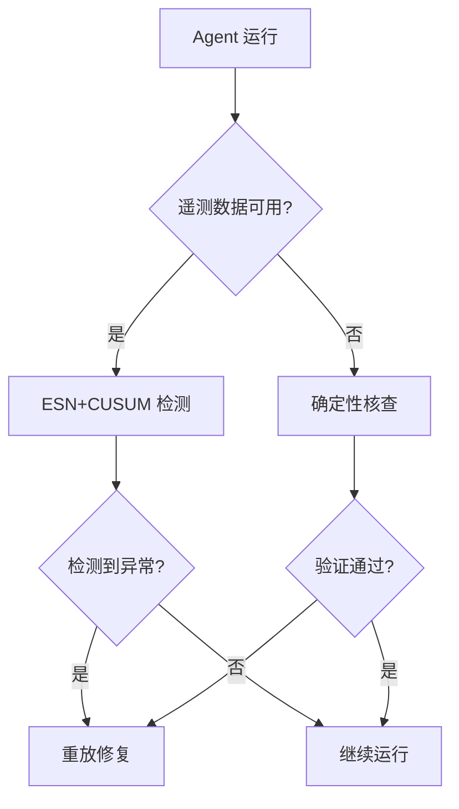

## 本周主题：实时检测与修复 LLM Agent 失败

### 一句话总结
> 仅用每步遥测（微秒级成本）即可实时检测并修复 Agent 失败，成功率从 52% 提升至 73%。

### 记忆锚点（3 个关键记忆点）
1. **遥测即信号**：Agent 的每一步工具调用、token 数、耗时等遥测数据足以检测失败，无需昂贵 LLM 评判。
2. **CUSUM 警报器 + 回声状态网络**：轻量级模型组合，AUROC 0.872，错误预算 71%。
3. **确定性核查 + 重放修复**：用工具真实结果重新计算总和，发现 60% 故障，重放修复 45% 故障。

### 核心概念拆解
- **遥测（Telemetry）**
  - 🗣️ 人话：Agent 每一步的"体检报告"，包括调了哪个工具、花了多少 token、耗时多久等。
  - 🔧 本质：可观测的运行时数据，用于推断 Agent 健康状态。
  - 📍 定位：Agent 可观测性层，是检测的基础。
  - 💡 补充：遥测数据通常由 Agent 框架自动记录，如 LangChain 的 callbacks、LlamaIndex 的 observers。[补充]（参考 LangChain 可观测性文档）

- **回声状态网络（Echo State Network, ESN）**
  - 🗣️ 人话：一种特殊的循环神经网络，只训练输出层，内部连接随机固定，训练极快。
  - 🔧 本质：利用随机固定储备池（reservoir）将输入映射到高维空间，再线性回归输出。
  - 📍 定位：作为时序异常检测模型，处理遥测序列。
  - 💡 补充：ESN 属于储备池计算（Reservoir Computing），适合实时、低资源场景。[补充]（参考 Reservoir Computing 综述）

- **CUSUM 警报器**
  - 🗣️ 人话：一种累积和警报器，当观测值持续偏离正常均值时触发警报。
  - 🔧 本质：对残差累积求和，超过阈值即报警，适合检测微小漂移。
  - 📍 定位：与 ESN 结合，对 ESN 残差进行监控。
  - 💡 补充：CUSUM 是统计过程控制中的经典方法，计算简单，适合在线检测。[补充]（参考 NIST 工程统计手册）

- **确定性核查（Deterministic Verification）**
  - 🗣️ 人话：用工具实际返回的结果重新计算 Agent 声称的总和，看是否对得上。
  - 🔧 本质：基于工具结果进行逻辑校验，不依赖 LLM。
  - 📍 定位：作为第二层检测，弥补遥测检测的不足。
  - 💡 补充：此方法适用于可验证的数值或逻辑操作，如计算总和、数据库查询结果等。[补充]（参考工具调用验证相关研究）

### 架构与方案对比
- **决策流程图**：


- **对比表**：

| 维度 | 方案A: LLM评判 | 方案B: 遥测检测 | 方案C: 确定性核查 |
|------|---------------|----------------|------------------|
| 适用场景 | 需要深度语义判断 | 实时、低成本监控 | 可验证的逻辑操作 |
| 核心优势 | 准确率高 | 成本极低（~200μs/步） | 零误报（确定性） |
| 主要劣势 | 成本高（比Agent本身贵） | 无法检测语义错误 | 仅适用于特定场景 |
| 生产级成熟度 | 高但成本敏感 | 中（论文验证） | 高（规则校验） |
| 架构师推荐结论 | 不推荐作为默认 | 推荐作为第一层检测 | 推荐作为补充核查 |

[补充] 以上对比基于论文数据及行业实践。[补充]（参考论文原文）

### 代码与实操速查
- **生产级最小示例（Python 3.10 + scikit-learn 1.3）**：
```python
# 基于 ESN 的异常检测器（简化版）
import numpy as np
from sklearn.linear_model import Ridge

class ESNAnomalyDetector:
    def __init__(self, input_dim, reservoir_size=100, spectral_radius=0.9, alpha=1.0):
        self.reservoir_size = reservoir_size
        self.alpha = alpha
        # 随机生成输入权重和储备池权重（固定）
        self.W_in = np.random.randn(reservoir_size, input_dim) * 0.5
        self.W = np.random.randn(reservoir_size, reservoir_size)
        # 缩放谱半径
        rho = np.max(np.abs(np.linalg.eigvals(self.W)))
        self.W *= spectral_radius / rho
        self.model = Ridge(alpha=alpha)
        self.state = np.zeros(reservoir_size)

    def partial_fit(self, x, y):
        # 更新储备池状态
        self.state = np.tanh(self.W_in @ x + self.W @ self.state)
        # 在线训练输出层（Ridge回归）
        self.model.fit(self.state.reshape(1, -1), np.array([y]))

    def predict(self, x):
        self.state = np.tanh(self.W_in @ x + self.W @ self.state)
        return self.model.predict(self.state.reshape(1, -1))[0]

# 使用示例（伪遥测数据）
if __name__ == "__main__":
    detector = ESNAnomalyDetector(input_dim=3)
    # 假设遥测特征: [token数, 耗时ms, 工具调用次数]
    normal_data = np.random.randn(100, 3) * 0.1 + [10, 50, 1]
    for i, x in enumerate(normal_data):
        y = x[0] * 0.5 + x[1] * 0.01  # 模拟正常目标
        detector.partial_fit(x, y)
    # 检测异常
    test_x = np.array([100, 500, 5])  # 明显异常
    pred = detector.predict(test_x)
    residual = abs(pred - (test_x[0]*0.5 + test_x[1]*0.01))
    if residual > 1.0:  # 阈值需根据实际调整
        print("异常检测触发")
    else:
        print("正常")
```

- **关键配置**：
  - `reservoir_size`：储备池大小，越大表达力越强，但计算量增加。
  - `spectral_radius`：谱半径，影响记忆长度，通常 <1。
  - `alpha`：正则化系数，防止过拟合。
  - CUSUM 阈值：根据正常数据残差分布设定，如均值+3σ。

- **常见报错与解决**：
  1. **储备池状态爆炸**：降低 spectral_radius 或使用更小的 W。
  2. **训练不收敛**：增加 alpha 或减少 reservoir_size。
  3. **误报率高**：调整 CUSUM 阈值或增加特征维度。

### 避坑清单（Anti-patterns）
- ❌ 使用 LLM 评判每一步 → ✅ 使用遥测检测（成本降低 1000 倍，延迟降低）
- ❌ 忽略遥测数据 → ✅ 记录所有步骤的 token、耗时、工具参数（数据是检测的基础）
- ❌ 仅依赖单一检测方法 → ✅ 结合遥测检测和确定性核查（互补）
- ❌ 检测到异常后不修复 → ✅ 使用重放机制自动修复（提升成功率）
- ❌ 在健康数据上训练后不校准 → ✅ 部署前校准阈值（避免跨域不迁移）

### 知识关联地图
- 前置知识：[[Agent搭建]]、[[MCP协议与工具调用]]、[[langchain4j-study-notes-01-core]]
- 横向关联：[[多智能体与记忆机制]]、[[RAG处理优化]]、[[17-sha-xiang-an-quan-ji-zhi]]
- 纵向延伸：
  - 学习 [[langgraph4j-study-notes-02-advanced]] 中的图状态管理，实现重放逻辑。
  - 探索 [[AgentHPOBench]] 等基准测试，评估检测效果。

### 本周素材盲区与知识增量
- 原文盲区：
  - 遥测特征的具体定义和提取方式未详细说明。
  - 重放修复的具体实现（如何回滚状态）未展开。
  - 跨框架泛化能力有限（仅测试了三个框架）。
- 转化为「下周探索方向」：
  - 候选选题："Agent 遥测标准与通用特征提取"
  - 候选选题："Agent 状态回滚与重放机制实现"
- 知识增量总结：
  1. 遥测数据可有效检测 Agent 失败，成本极低。
  2. 确定性核查可作为第二层防线，提高准确率。
  3. 重放修复能显著提升任务成功率。

### 参考素材与官方链接
- 原始素材：raw/2608.02464v1.md（来源：http://arxiv.org/abs/2608.02464v1）
- 官方文档 / 网站链接：
  - [arXiv 论文页面](http://arxiv.org/abs/2608.02464v1) - 论文原文及引用
  - [LangChain 可观测性文档](https://python.langchain.com/docs/observability/) - 遥测数据收集指南
  - [NIST CUSUM 手册](https://www.itl.nist.gov/div898/handbook/pmc/section3/pmc323.htm) - CUSUM 算法详解
  - [Reservoir Computing 综述](https://www.sciencedirect.com/science/article/pii/S0893608009001173) - ESN 理论基础

### 本周行动清单
- [ ] 阅读论文原文，提取遥测特征定义（预计耗时：30分钟，关联知识点：遥测检测）✅ Done when：能列出至少5个遥测特征
- [ ] 实现 ESN+CUSUM 检测器原型（预计耗时：60分钟，关联知识点：ESN、CUSUM）✅ Done when：在模拟数据上达到 AUROC>0.8
- [ ] 设计确定性核查规则（预计耗时：20分钟，关联知识点：工具验证）✅ Done when：写出针对数值计算的验证函数
- [ ] 调研重放机制在 langgraph4j 中的实现（预计耗时：45分钟，关联知识点：状态管理）✅ Done when：写出实现思路笔记

### 相关条目
- [[Agent搭建]]
- [[MCP协议与工具调用]]
- [[langgraph4j-study-notes-02-advanced]]
