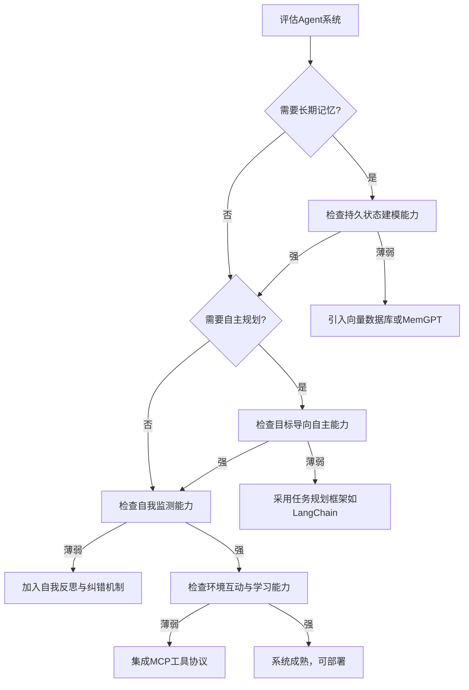

## 本周主题：认知能力差距分类学与适应性认知智能架构（ACIA）

### 一句话总结
> 论文提出五维度认知能力差距分类法，并据此设计适应性认知智能架构（ACIA），为构建可靠长期推理的Agent系统提供路线图。

### 记忆锚点（3 个关键记忆点）
1. **五维差距模型**：持久状态、目标导向、自我监控、环境互动、学习适应——诊断Agent认知短板的五大维度。
2. **ACIA 架构**：一个概念性蓝图，旨在弥合上述差距，实现更可靠的长期自主运行。
3. **认知中心评估**：评价重点从单任务准确率转向长期推理、适应性和持续学习能力。

### 核心概念拆解
- **认知能力差距（Cognitive Capability Gaps）**
  - 🗣️ 人话：就像一个人虽然会背很多单词（生成能力），但不会写一篇逻辑通顺的长篇小说（长期推理）。AI 在特定任务上很强，但在需要持续思考、记忆和适应的工作上就露馅了。
  - 🔧 本质：当前AI系统在跨时间、跨任务的连贯性、自主性和适应性上存在根本性缺陷。
  - 📍 定位：AI与LLM/Agent 核心理论，指导Agent架构设计与评估。
  - 💡 补充：该分类法为组织现有研究、识别未解决问题提供了统一框架，是迈向AGI的关键理论基石。[补充] (https://arxiv.org/abs/2608.02553)

- **持久性状态建模（Persistent State Modeling）**
  - 🗣️ 人话：AI 的“长期记忆”。它需要记住几天前和你聊过的内容，并据此调整今天的回答，而不是每次都“失忆”。
  - 🔧 本质：构建和维护跨会话、跨任务的世界模型与自身状态表征。
  - 📍 定位：Agent 的记忆系统与状态管理。
  - 💡 补充：这与RAG（检索增强生成）和长期记忆机制（如MemGPT）的研究紧密相关，是解决Agent“金鱼记忆”问题的关键。[补充] (https://arxiv.org/abs/2310.08560)

- **目标导向自主（Goal-Directed Autonomy）**
  - 🗣️ 人话：给AI一个“想减肥”的大目标，它能自己拆解成“控制饮食”和“加强运动”的小计划，并一步步执行，而不是只回答“减肥很重要”。
  - 🔧 本质：将高层目标分解为子目标，并动态规划行动序列以达成目标的能力。
  - 📍 定位：Agent 的任务规划与执行模块。
  - 💡 补充：当前主流Agent框架（如LangChain、AutoGPT）已实现初步的任务分解，但面对动态环境时，规划的鲁棒性和重新规划能力仍是巨大挑战。[补充] (https://arxiv.org/abs/2308.00352)

- **自我监测和控制（Self-Monitoring and Control）**
  - 🗣️ 人话：AI 的“自我反省”能力。当它发现自己写代码有bug时，能主动识别、调试并修复，而不是把错误代码直接交给你。
  - 🔧 本质：系统对自身行为、推理过程和结果进行评估、纠错和调整的能力。
  - 📍 定位：Agent 的自我纠错与安全机制。
  - 💡 补充：包括自我一致性检查、基于反馈的强化学习（RLHF）以及更细粒度的过程监督（Process Supervision），是提升Agent可靠性的核心。[补充] (https://arxiv.org/abs/2305.20050)

- **环境互动（Environmental Interaction）**
  - 🗣️ 人话：AI 的“动手能力”。它不仅能说，还能通过调用API、操作软件、控制机器人等方式改变现实世界，并从结果中学习。
  - 🔧 本质：通过具身或虚拟接口感知环境、采取行动并接收反馈的闭环能力。
  - 📍 定位：Agent 的工具调用与外部系统集成。
  - 💡 补充：MCP（模型上下文协议）等标准化协议正在成为Agent与工具交互的通用语言，极大降低了集成成本。[补充] (https://modelcontextprotocol.io/)

- **学习和适应（Learning and Adaptation）**
  - 🗣️ 人话：AI 的“成长性”。它应该能从每次交互中学习，越用越懂你，而不是永远停留在出厂设置。
  - 🔧 本质：在部署后，从新数据或交互反馈中持续更新模型参数或知识库的能力。
  - 📍 定位：Agent 的持续学习与个性化。
  - 💡 补充：包括在线学习、少样本学习（Few-shot Learning）以及更前沿的元学习（Meta-Learning），目标是让AI“学会学习”。[补充] (https://arxiv.org/abs/1910.09897)

### 架构与方案对比（若有选型/架构内容）
- **决策流程图：如何评估你的Agent系统？**


- **对比表：传统AI vs. 认知增强AI**

| 维度 | 传统生成式AI | 认知增强AI (ACIA愿景) |
| :--- | :--- | :--- |
| **适用场景** | 单轮问答、内容生成、代码补全 | 复杂任务自主执行、长期项目协作、个性化助手 |
| **核心优势** | 生成质量高、响应快、成本低 | 可靠性高、适应性强、能处理长周期任务 |
| **主要劣势** | 缺乏记忆、无法规划、不可靠 | 技术复杂度高、计算成本大、尚处研究阶段 |
| **生产级成熟度** | ★★★★☆（已广泛商用） | ★☆☆☆☆（研究验证阶段）[补充] |
| **架构师推荐结论** | 适合明确、短周期的任务 | 适合需要长期规划和自主决策的核心业务场景，建议在沙盒环境试点 |

### 代码与实操速查
- **生产级最小示例：为Agent添加持久记忆（伪代码）**
  - 语言/框架：Python + LangChain (v0.1) + Redis (v7.0) [补充]
  - 功能：使用Redis作为长期记忆存储，实现跨会话记忆。
  - 代码示例：
    ```python
    import redis
    from langchain.memory import ConversationBufferMemory
    from langchain.llms import OpenAI

    # 1. 初始化Redis客户端 (生产环境需使用连接池)
    redis_client = redis.Redis(
        host='localhost', port=6379, db=0,
        decode_responses=True,
        password='your_strong_password' # 安全边界：生产环境必须设置密码
    )

    # 2. 使用Redis作为LangChain的记忆存储
    # 注意：LangChain的RedisChatMessageHistory是官方实现，这里为演示核心逻辑
    from langchain_community.chat_message_histories import RedisChatMessageHistory
    history = RedisChatMessageHistory(
        url="redis://:your_strong_password@localhost:6379/0",
        session_id="user-123", # 每个用户一个会话ID
        ttl=86400 # 设置过期时间，防止内存泄漏
    )

    memory = ConversationBufferMemory(
        chat_memory=history,
        return_messages=True
    )

    # 3. 在对话链中使用记忆
    llm = OpenAI(model="gpt-4", temperature=0.7)
    from langchain.chains import ConversationChain
    conversation = ConversationChain(
        llm=llm,
        memory=memory
    )

    # 4. 模拟对话
    try:
        response1 = conversation.predict(input="我叫小明，我喜欢红色。")
        print(f"AI: {response1}")
        response2 = conversation.predict(input="我喜欢什么颜色？")
        print(f"AI: {response2}") # 应该能正确回答“红色”
    except Exception as e:
        print(f"对话过程中发生错误: {e}")
        # 异常捕获：记录日志，并尝试重连或降级策略
    finally:
        redis_client.close()
    ```

- **关键配置（核心参数及含义）**
  - `session_id`: 区分不同用户或会话的标识，是记忆隔离的关键。
  - `ttl`: 记忆的过期时间（秒），防止无限增长，需根据业务场景设定。
  - `decode_responses`: 设置为True，让Redis返回字符串而非字节，便于处理。

- **常见报错与解决（Top 3）**
  1. **`redis.exceptions.ConnectionError`**: Redis服务未启动或网络不通。解决：检查Redis进程和网络配置。
  2. **`redis.exceptions.AuthenticationError`**: 密码错误。解决：核对连接URL中的密码。
  3. **`langchain.errors.OutputParserException`**: LLM输出格式不符合预期。解决：在Prompt中明确输出格式，或使用更稳定的模型。

### 避坑清单（Anti-patterns）
- **错误做法1：将无限增长的对话历史直接存入内存。**
  - 正确做法：使用外部存储（如Redis、向量数据库）并设置TTL或大小限制。原因：会导致内存溢出和性能下降。
- **错误做法2：在Prompt中拼接所有历史记录，导致Token超限。**
  - 正确做法：使用摘要或滑动窗口机制，只保留关键信息。原因：成本高且模型可能忽略早期信息。
- **错误做法3：对所有用户使用同一个`session_id`。**
  - 正确做法：为每个用户/会话生成唯一ID。原因：会导致数据泄露和用户间干扰。
- **错误做法4：忽略异常处理，直接调用外部服务。**
  - 正确做法：对API调用、数据库操作等添加try-catch和重试机制。原因：生产环境必须保证系统的鲁棒性。

### 知识关联地图
- **前置知识**：[[langchain4j-study-notes-01-core]] #Agent框架 #记忆机制；[[MCP协议与工具调用]] #工具交互
- **横向关联**：[[20-memory-ji-yi-xi-tong]] #记忆系统；[[7-agentic-loop-he-xin-xun-huan]] #Agent循环；[[19-agent-xie-diao-mo-shi]] #多Agent协作
- **纵向延伸**：下一步深入研究“持久性状态建模”的具体实现，如MemGPT论文。资源：MemGPT: Towards LLMs as Operating Systems (https://arxiv.org/abs/2310.08560)

### 本周素材盲区与知识增量
- **原文盲区**：论文提出了分类法和ACIA概念，但未给出具体的实现代码或算法细节。
  - **下周探索方向**：如何为现有Agent框架（如LangChain、AutoGen）设计并实现一个基于ACIA的“认知增强”中间件？
- **知识增量总结**：
  1. 获得了一个系统性的框架（五维分类法）来评估和诊断AI系统的认知短板。
  2. 了解了ACIA架构作为未来Agent设计的蓝图，明确了各模块的职责。
  3. 认识到“认知中心评估”是未来AI评测的重要趋势，超越了传统的任务准确率。

### 参考素材与官方链接
- **原始素材**：raw/认知能力差距分类学论文.md (来源：http://arxiv.org/abs/2608.02553v1)
- **官方文档 / 网站链接列表**
  - arXiv论文页面：https://arxiv.org/abs/2608.02553 (获取论文原文和最新版本)
  - LangChain官方文档：https://python.langchain.com/docs/get_started/introduction (用于代码示例中的框架参考)
  - Redis官方文档：https://redis.io/docs/ (用于记忆存储的数据库参考)
  - MemGPT项目页：https://memgpt.ai/ (用于纵向延伸研究)

### 本周行动清单
- [ ] 阅读论文原文，重点精读“五维差距”和“ACIA架构”章节，并做笔记（预计耗时：60分钟，关联知识点：核心概念拆解）✅ Done when：完成一份500字以上的深度摘要，并提炼出10个可引用的观点。
- [ ] 运行并测试“生产级最小示例”中的代码，并尝试修改`session_id`和`ttl`参数观察效果（预计耗时：30分钟，关联知识点：代码与实操速查）✅ Done when：代码成功运行，并记录不同参数下的行为差异。
- [ ] 基于“知识关联地图”，阅读[[20-memory-ji-yi-xi-tong]]和[[MCP协议与工具调用]]两篇笔记，并思考如何将ACIA框架融入现有项目（预计耗时：45分钟，关联知识点：知识关联地图）✅ Done when：输出一篇关于“ACIA框架在现有项目中落地的可行性分析”的短文。

### 相关条目
- [[20-memory-ji-yi-xi-tong]]
- [[7-agentic-loop-he-xin-xun-huan]]
- [[MCP协议与工具调用]]
