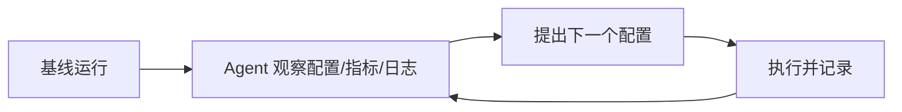

# AgentHPOBench

LLM Agent 能否像研究员一样"读懂实验证据并调整下一步"？AgentHPOBench 用 30 个可执行 ML 任务来回答这个问题。

## 检索问题（Q&A）
- Agent 做实验/调参的能力怎么评测？→ 本条目：AgentHPOBench 基准设计、任务与结论
- LLM Agent 目前最大的短板是什么？→ 持续迭代改进、复杂日志诊断、稳定逼近参考性能

## 结构化提炼

### 核心论点
现有基准只测"最终答案"不测"实验过程"；AgentHPOBench 把 Agent 当作顺序超参数优化器来评估——每次观察累积的配置、指标和日志后提出下一个配置。

### 逻辑骨架
- 问题：LLM 已从代码补全走向自主科学代理，但缺少"过程性实验能力"的评测
- 方案：顺序基准，7 个研究类别、30 个可执行 ML 任务，每任务从验证过的基线运行开始
- 评估：统一协议下对比 12 种主流 Agent 与传统 HPO 基线
- 结论：Agent 有可测量的优化能力，但迭代改进、日志诊断、稳定收敛仍有明显局限

### 关键概念（费曼式）
- 顺序超参数优化：不是一次性调好参数，而是"调→看结果→再调"的闭环，像调水温一样逐步逼近
- 基线运行（baseline run）：给 Agent 一个已跑通的起点，避免从零开始

## 深度追问

### 苏格拉底式质疑
1. 30 个任务是否覆盖真实科研场景的多样性？跨领域泛化结论是否过强？
2. "诊断复杂日志"失败，是模型能力不足，还是评测日志格式对 Agent 不友好？
3. 传统 HPO 基线（贝叶斯优化）计算成本远低于 LLM Agent——能力提升的性价比是否值得？

### 背景与盲区
- 背景：HPO 领域经典基线是贝叶斯优化（SMBO / Tree Parzen），LLM Agent 的定位是"用常识推理替代昂贵搜索"
- 盲区：未覆盖 Agent 主动设计实验（而非仅调参）、多轮长程实验的记忆成本、评测 token 开销

### 溯源与验证
- 论文 2607.29626，任务公开可复现；结论基于 12 个 Agent 的统一协议对比

## 联想与缝合

### 跨学科类比
像"实习研究员带教考核"：只考论文答辩（静态答案）不够，还要查实验记录本（过程性决策）——AgentHPOBench 就是这本记录本的评分表。

### 与知识库联系
- 与 [[Agent搭建]]：评测对象正是 ReAct / LangGraph 类 Agent 的"决策→行动→观察"循环
- 与 [[MOT-SR]]：后者是"Agent 做实验"的正面案例（选工具→生成候选→看结果迭代），可互为印证

### 底层模型
- 闭环反馈循环（act → observe → decide）
- 近似最优搜索 vs 启发式常识推理的权衡

## 场景化转译

### 行动清单
- [ ] 做 Agent 评测时加入"过程性指标 + 统一协议"，避免只看最终答案
- [ ] 把"日志诊断"能力纳入自研 Agent 的评测维度

### 避坑指南
- 别把"任务成功率"当唯一指标——中间决策质量才是 Agent 的差异所在
- 对比时控制计算成本维度，否则 LLM 方案的"能力提升"可能不划算

## 可视化

## 相关条目
- [[Agent搭建]]
- [[ExtractBench]]
- [[DungeonBench]]
- [[MOT-SR]]
