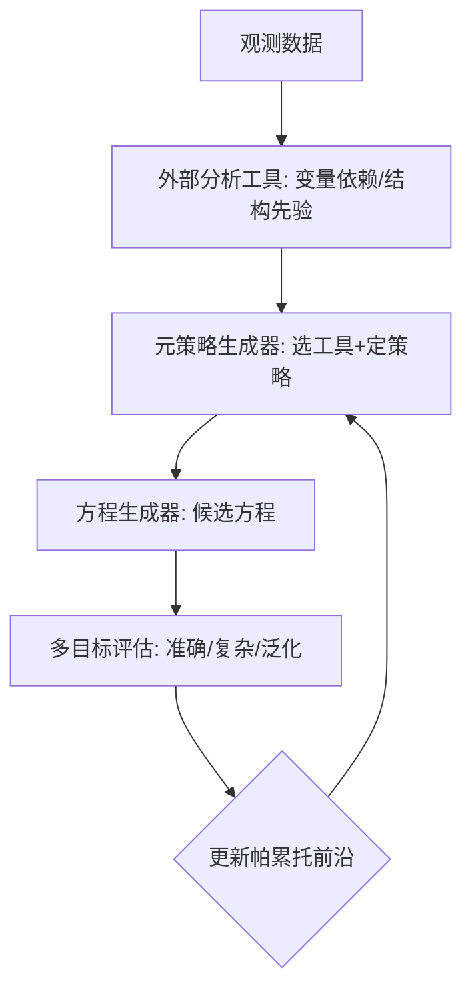

# MOT-SR

让 LLM 当"科学搭档"：先用工具摸清数据里谁依赖谁，再从多个目标里挑出又准又简单又扛泛化的方程。

## 检索问题（Q&A）
- LLM 怎么做符号回归 / 发现方程？→ 本条目：MOT-SR 双模块闭环设计
- AI 科学研究为什么容易"过拟合局部最优"？→ 单目标只看拟合误差；MOT-SR 用帕累托前沿

## 结构化提炼

### 核心论点
符号回归（从数据找解析方程）要解决两个问题：缺数据分析机制、单目标评估；MOT-SR 用"外部分析工具 + 多目标帕累托优化"闭环解决。

### 逻辑骨架
- 问题：LLM 做 SR 不分析变量依赖 → 效率低；只看拟合误差 → 早熟收敛到局部最优
- 方案：双 LLM 模块——元策略生成器（按帕累托最优方程选工具、定优化策略）+ 方程生成器（产出候选）；动态维护帕累托前沿
- 指标：准确性 + 结构复杂性 + 泛化能力联合优化
- 案例：40 个标准任务全面领先；EMRI（引力波轨道建模）中可解释修正项实现最低轨迹级积分误差

### 关键概念（费曼式）
- 帕累托前沿：一组"没有哪个目标能再变好而不牺牲另一个"的方案集合，像买房时"面积-价格"的取舍曲线
- 符号回归：从数据反推数学表达式（y = ax² + b），区别于黑盒神经网络

## 深度追问

### 苏格拉底式质疑
1. "泛化能力"如何在方程层面定义？留出验证集是否存在泄漏风险？
2. 工具提取的结构先验是否依赖人工设计？换领域能否零配置迁移？
3. 双 LLM 模块的推理成本 vs 传统 SR（遗传规划）如何？论文未充分对比

### 背景与盲区
- 背景：经典 SR 用遗传规划（GP），LLM 的优势是常识与工具调用，MOT-SR 把两者结合
- 盲区：高维数据、噪声数据下的稳定性；特定领域知识库的适配

### 溯源与验证
- 40 个标准任务 + EMRI 真实问题双验证；对比基线明确（准确率 / 泛化 / 效率）

## 联想与缝合

### 跨学科类比
像"厨师研发新菜"：先尝食材（分析工具摸清变量关系），再定标准（准、好看、能复现），不断试菜并淘汰不达标的（帕累托前沿）。

### 与知识库联系
- 与 [[MCP协议与工具调用]]：外部分析工具接入正是工具调用 / 协议设计的具体应用
- 与 [[AgentHPOBench]]：同为"Agent 做科研实验"的闭环范式，一为框架一为评测

### 底层模型
- 多目标优化（帕累托最优）
- 闭环搜索：策略 → 执行 → 反馈 → 改进

## 场景化转译

### 行动清单
- [ ] 自研 Agent 的搜索类任务中，把"单一指标"换成"多目标 + 前沿保留"，避免早熟收敛
- [ ] 数据探索阶段先接分析工具（EDA），再让模型生成假设

### 避坑指南
- 只优化拟合误差 = 自欺欺人，验证集 / 泛化指标必须进入优化目标
- 多目标别做简单加权求和，帕累托保留才能避免"牺牲可解释性换精度"

## 可视化

## 相关条目
- [[Agent搭建]]
- [[MCP协议与工具调用]]
- [[AgentHPOBench]]
- [[DungeonBench]]
