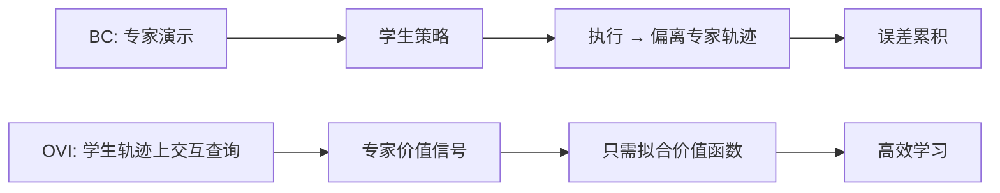

# 在线策略交互与模仿学习

一个反直觉的发现：让专家"跟着你走"（在线交互）比"教你走路"（离线示范）更省事——模型只需要装得下专家的价值观，不需要装得下专家的全套动作。

## 检索问题（Q&A）
- 模仿学习为什么有瓶颈？BC 的复合误差怎么破？→ 本条目：专家交互放宽表征需求 + OVI 算法
- "蒸馏"场景学生模型学不动怎么办？→ 用价值函数拟合替代策略拟合

## 结构化提炼

### 核心论点
交互式专家查询能放宽模仿学习的表征需求：从"实现专家策略"降到"实现专家价值函数"；据此提出统计与计算均高效的 OVI 算法，并证明离线方法在无更强假设下必然受限。

### 逻辑骨架
- 问题：行为克隆（BC）受复合误差与表征瓶颈限制（蒸馏中常见）
- 方案：OVI——在学习器自身轨迹上交互式查询专家 + 用价值函数估计指导生成
- 理论：正定理（能表征价值函数即可高效学习）+ 负定理（离线方法必须随策略类复杂度扩展）
- 验证：OVI 优于 BC、DAgger 和离线价值型方法；模型表达力远低于专家时收益最大

### 关键概念（费曼式）
- 复合误差：BC 错一步，下一步输入就偏离专家轨迹，错误像滚雪球
- 价值函数 vs 策略：价值函数回答"这个状态好不好"，策略回答"我该做什么"——前者往往更容易学

## 深度追问

### 苏格拉底式质疑
1. "线性最大化预言机"假设在非线性网络 / 大模型上是否成立？计算高效性的适用面多广？
2. 交互式查询专家的成本（专家在线待命）是否抵消了学习效率收益？
3. 负定理是否依赖特定函数类？更宽泛假设下离线方法有没有出路？

### 背景与盲区
- 背景：DAgger 是交互式模仿学习的经典基线，OVI 的差异在于"价值函数视角 + 统计效率保证"
- 盲区：大规模语言模型蒸馏场景的直接验证（论文以机器人 / 经典 RL 为主）

### 溯源与验证
- 含正反两类理论结果 + 多组实验对比，可在论文（2607.29617）复现

## 联想与缝合

### 跨学科类比
像"带徒弟"：离线示范像给录像带自学（走错一步就崩）；在线交互像师傅跟在旁边"你走，我随时纠偏"——师傅不用演示所有动作，只要会判断对不对。

### 与知识库联系
- 与 [[DungeonBench]]：一个研究"交互中学"，一个研究"交互中测"，形成训练-评测闭环
- 与 [[Agent搭建]]：价值函数 / 策略的表征权衡，是 Agent 训练中"学什么表示"的底层问题

### 底层模型
- 表征能力决定学习上限（representation bottleneck）
- 在线交互 = 分布匹配的自我修正

## 场景化转译

### 行动清单
- [ ] 做模型蒸馏时，先评估"学生模型能否表征价值函数"，而不是硬啃完整策略
- [ ] 交互式反馈优先于海量离线数据——先保证分布覆盖，再堆样本量

### 避坑指南
- 别迷信"数据越多越好"：表征装不下时，堆离线数据只会放大复合误差
- 交互成本高时，用价值函数监督 + 少量查询，而非全量专家演示

## 可视化

## 相关条目
- [[Agent搭建]]
- [[DungeonBench]]
- [[AgentHPOBench]]
