# Qwen3.8-Max: A New Bar for Coding and Cowork

> 原文链接：https://qwen.ai/blog?id=qwen3.8
> 全文抓取：2026-08-04（已翻译）


Qwen Studio

Qwen Code

Research

API Platform

Ambassador

EN

DownloadTry Qwen Studio

Qwen3.8-Max: A New Bar for Coding and Cowork \| Qwen

# Qwen3.8-Max: A New Bar for Coding and Cowork

2026/08/02 · 25 minute · 5068 words · QwenTeam丨Translations:简体中文

[QWEN STUDIO](https://chat.qwen.ai/) [DISCORD](https://discord.gg/yPEP2vHTu4)

Today, we are officially releasing **Qwen 3.8-Max**, the most capable model in the Qwen family to date. This also marks the first time we will open-source the weights of a Qwen-Max-class model — the open weights will be released next week. Built upon the architectural foundation of Qwen 3.5, Qwen 3.8-Max scales to **2.4 trillion** parameters, delivering comprehensive improvements across coding, work, research, and long-horizon tasks. It can not only answer more challenging questions, but also complete complex tasks end-to-end with greater reliability, producing dependable deliverables.

- **Qwen3.8-Max** — now available via
[QwenCloud](https://www.qwencloud.com/):
  - 2.4T parameters (95B active), with open weights releasing next week
  - comprehensive improvements across coding, work, research, and long-horizon tasks
  - end-to-end and dependable delivery of complex tasks
- Call via API on [QwenCloud](https://www.qwencloud.com/).

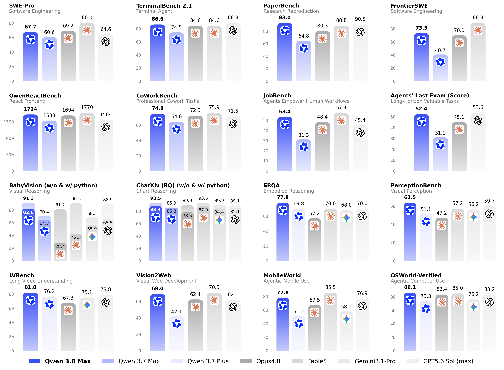

## Coding [\#](https://qwen.ai/blog?id=qwen3.8\#coding)

For a top model, coding today means far more than writing a function on request — it means taking a real, multi-day project from an empty folder all the way to a finished result, on its own. We tested Qwen3.8-Max on three such challenges, where every result had to be earned by actually writing and running code, with **no human help at all**. One thread runs through all three: Qwen3.8-Max doesn’t just follow a fixed plan — it **self-evolves through feedback loops**, whether that means building a harness that upgrades itself, refining a research method experiment after experiment, or climbing a competition leaderboard submission after submission.

### 10+ Days of Autonomous Coding: Building a Self-Evolving Harness [\#](https://qwen.ai/blog?id=qwen3.8\#10-days-of-autonomous-coding-building-a-self-evolving-harness)

In this case, Qwen3.8-Max was asked to create the `oh-my-cli` project from scratch and, over a 10+ day long-horizon autonomous coding run, build a self-evolving harness. It brings user feedback, advanced community practices, and the model’s own self-test results into one engineering loop: requirements are normalized into issues, automatically claimed and executed by agents, and continuously iterated through code, tests, previews, and logs. The complete project trace is publicly available in the GitHub repository [qwen-code-dev-bot/oh-my-cli](https://github.com/qwen-code-dev-bot/oh-my-cli).

**Key implementation details in the autonomous coding harness:**

- **Loop Engineering Setup: task state, dispatch, and recovery.** Qwen3.8-Max combines an issue state machine, dispatcher, monitor, and watchdog into one execution loop: after a new requirement enters GitHub Issues, an agent claims it through the state machine and moves through `ready → leased → active`; once implementation is complete, E2E tests and CI checks are triggered, and the PR is merged after passing.
- **Self-testing: product self-testing and maintenance.** After each update, the model triggers Build, Unit Test, E2E, and Desktop Lifecycle validation; abnormal states are routed back to the relevant issue / PR for fixes and re-verification.
- **Multi-source Evolution:** product upgrades from multiple demand signals. By converting community experience and user / developer feedback into executable work, the harness continuously evolves `/goal`, `/resume`, Dynamic Workflow, Session Replay, Desktop, and other capabilities.

As of **July 30, 2026**, after approximately **16 days** of fully autonomous AI operation, the repository had accumulated **265 commits, 127 PRs, and 151 issues**, demonstrating a continuously evolving autonomous coding capability.

Video 1. In a 10+ day long-horizon autonomous coding run, Qwen3.8-Max autonomously builds a self-evolving harness, continuously completing community requirement collection, issue dispatch, code generation, verification, and self-repair.

### Reproduce a research paper — then improve it [\#](https://qwen.ai/blog?id=qwen3.8\#reproduce-a-research-paper--then-improve-it)

We handed Qwen3.8-Max a recent research paper — [_“Unified Data Selection for LLM Reasoning”_](https://arxiv.org/abs/2605.22389) — and asked it to: **reproduce the paper’s experiment in code, then try to do better.** The paper tackles a very practical question in AI training: when you have far more data than you can afford to train on, _which examples are actually worth keeping?_ The paper’s answer is to prize the examples full of **“hard decision points”** — the moments in a worked solution where the model was genuinely unsure which way to go next.

The catch: Qwen3.8-Max started from **nothing but the paper and a set of GPUs** — no starter code, no ready-made pipeline. The data-processing scripts, the training code, the evaluation setup — it had to design and write **all of it from scratch**, exactly the kind of work that takes skilled engineers days.

Working **completely on its own for about five days** (~125 hours of continuous effort), Qwen3.8-Max wrote roughly **7,600 lines of code**, took over **1,100 actions**, and ran **33 rounds of GPU training**. It first spent ~37 hours rebuilding the paper’s full pipeline from zero and **reproduced its six main findings** — repeatedly fine-tuning a Qwen3-8B model on the data it selected and confirming the gains on hard math benchmarks (for instance, the paper’s selection method beats picking data at random by **+7.7%** on AIME24).

Then it went further, turning reproduction into **self-evolution**. Over the next ~88 hours it ran a self-improving research loop — _form a hypothesis → write the code → run it on GPUs → analyze → try again_ — inventing and testing **18 improvement ideas of its own across four rounds**. Each round’s results fed the next round’s hypotheses, and by diagnosing what went wrong with each attempt it finally evolved a new method that **beats the paper’s own approach**, a **+2.7-point** gain on the competition-level math benchmark AIME24.

Expand

AI Agent — Paper Reproduction & Improvement Trajectory

Skip Intro

PDFUnified Data Selection for LLM Reasoning.pdf

Read this paper, reproduce the HES experiment on Qwen3-8B, and explore improvements

Qwen3.8-Max▾

PDFUnified Data Selection for LLM Reasoning.pdf

Read this paper, reproduce the HES experiment on Qwen3-8B, and explore improvements

Auto ▾


Qwen3.8-Max

Thinking...

Aliyun Cluster · 8 GPUsTRAINING

GPU Util96%

VRAM72.4 / 80 GB

Throughput3,840 tok/s

train loss0.63

📁

Workspace

0 files

Qwen3.8-MaxAgent Activity

0 / 1164

—

Env Debug + Fix

Pipeline + Table

Improve A-F

Improve G-K

Improve L-N

Improve O-R

2

Calls

1

Cmds

0

Files

0

Lines

0h00m

39h56m

ReproduceImprove

1x2x3x5x

×

ReproduceImprove

✓ Reproduction Verified · Phase 1 Complete

HES outperforms random by +7.7% on AIME24.

Reproduction of all central claims confirmed.

From reading the paper to verifying the central claim — 37h of autonomous agent work.

37h

Active Time

779

Tool Calls

5.1K

Lines Written

16

GPU Jobs

📊 Reproduction vs Original Paper

AI agent's autonomous reproduction _aligns with original findings_

Comparing our Qwen3-8B reproduction (Mixture-of-Thoughts, 20% HES selection) with the original paper's results.
All charts use the same benchmark (AIME24, avg@16 pass@1) under **controlled experimental settings**.


AIME24 Method Comparison (20% Data)

0%10%20%30%40%50%50.049.6HES46.747.7Length38.142.7Difficulty39.841.9Random18.524.8Lo-HES≈ aligned

Original PaperOur Reproduction

HES Score Across 4 Benchmarks (20% Data)

202530354045505550.049.6AIME2437.934.2AIME2535.030.8HMMT2326.528.1HMMT24Highest-HES, avg@16 pass@1

Original PaperOur Reproduction

Entropy Metric Ablation — Sum >> Average (AIME24)

0102030405050.049.6HES(rel)42.345.4HES(abs)40.237.3AvgESum-based →← Average-based

Original Paper (AIME24)Our Reproduction (AIME24)

Scaling Effect — More HES Data = Better

303540455055606520%40%60%80%100%50.052.550.849.653.153.549.0FullFull+2.50+3.96Data Selection Ratio

Paper (AIME24)Ours (AIME24)

✓ HES > Random on ALL benchmarks✓ HES > Length > Random ranking✓ Sum-entropy >> Average-entropy✓ Lowest-HES catastrophically bad✓ Scaling from 20%→80% positive✓ HES 20% ≈ Full dataset performance


Qwen3.8-Max

Analyzing results

Skip ›

×

ReproduceImprove

🚀 Improvement Complete · Fully Autonomous

Autonomous improvement: O(nhighgate) = 52.29% (+2.71).

18 methods tested across 4 phases of exploration.

Iterative hypothesis → experiment → analysis loop — 88h of autonomous improvement search.

88h

Improve Time

354

Tool Calls

2.5K

Lines Written

17

GPU Jobs

🚀 Autonomous Improvement

4-phase search yields _+2.71 over baseline_

Agent autonomously designed 18 improvement methods across 4 phases, each building on prior results. Iterative hypothesis → experiment → analysis loop.


Improvement Phases (vs HES baseline 49.58%)

**Phase 2** 6 methods

**Phase 3** 4 methods

**Phase 4** σ-sweep

**Phase 5** gating

Phase 2

D

50.42

Phase 3

K

51.67

Phase 4

M

51.25

Phase 5

O ★

52.29

PhaseIDMethodAIME24Delta

P2Dstratified\_hes50.42%+0.84

P3Kesdiffw51.67%+2.09

P4Mesdiffw\_s4051.25%+1.67

P5Onhighgate52.29%+2.71

P5Rshiftgate51.25%+1.67

▶ P2: 6 hypotheses → stratification best▶ P3: entropy–score diff metrics → +2.09▶ P4: σ-sweep, 0.3 optimal (0.2 collapses)▶ P5: gating variants → nhighgate +2.71★ Counting outlier tokens >> averaging

★ Fully autonomous loop: read results → hypothesize → code → GPU → verify — 18 methods, 33 jobs, 125h


How the improvement search unfolded — 4 rounds, 18 ideas

| Round | Best idea that round | Score (AIME24) | Gain vs. baseline |
| --- | --- | --- | --- |
| — | Paper’s method, reproduced (baseline) | 49.58% | — |
| 1 | Split the data by difficulty before selecting | 50.42% | +0.84 |
| 2 | Weight examples by an entropy–score gap | 51.67% | +2.09 |
| 3 | Tune the selection width | 51.25% | +1.67 |
| 4 | **Count the hard decision points (“nhighgate”)** ★ | **52.29%** | **+2.71** |

### Beat hundreds of human teams in 24 hours [\#](https://qwen.ai/blog?id=qwen3.8\#beat-hundreds-of-human-teams-in-24-hours)

Next we entered Qwen3.8-Max into a real online contest — the [WWW2025 Multimodal Dialogue Intent Recognition Challenge](https://tianchi.aliyun.com/competition/entrance/532277), hosted on **Alibaba Cloud’s Tianchi platform**, where **526 human teams** were competing. The task: read customer-service chats — both the text _and_ the screenshots — and correctly work out what the customer wants.

Working entirely on its own and under a strict **24-hour** time limit, Qwen3.8-Max read the competition rules and built a full solution in code. For the text side, it fine-tuned and ensembled several Chinese language models — **BERT, MacBERT, and RoBERTa**; for the product screenshots, it fine-tuned a vision-language model, **Qwen2.5-VL-7B**, backed by a **Chinese-CLIP** model for images its main model was unsure about. It then fused all of them into a single **weighted-voting system**, calibrating how much each model’s vote should count through cross-validation and adding extra image voters to break ties. Across **45 submissions** — each round’s feedback steering the next round of fine-tuning and re-weighting — its accuracy climbed steadily from **0.60 to a final 0.853**, beating **458 of the 526 human teams (87% of the field)**.

Expand

WWW 2025 Multimodal Dialogue Intent Recognition — Score Animation + Trajectory

Details

Hide Annotations

Beat human teams · of 526

Claude Fable 588.4%

Qwen 3.8-Max87.1%

GPT-5.6-Sol59.7%

Claude Opus 4.855.1%

GPT-5.517.9%

x1x2

TURNS

99

SUBMISSIONS

4

BEST SCORE

0.781

TIME

~2h

BEST STRATEGY

re-validate submission

### Snapshot 5 — VLM + multi-model text ensemble

code changed⛶

build\_submission.py extended to combine BERT, Qwen-7B text, and Qwen2.5-VL text predictions by majority vote; added gen\_vlm\_text.py and updated train\_qwen\_text.py and train\_vlm\_text.py.

code/build\_submission.py

code/gen\_vlm\_text.py

code/train\_qwen\_text.py

code/train\_vlm\_text.py

```
1 """
2 Build submission.csv by combining:
3 - Text task: ensemble of BERT logits (+ optional qwen text preds)
4 - Image task: VLM preds (+ optional CLIP linear-probe fallback / ensemble)
5 Output: /home/submission/submission.csv
6 Usage: python build_submission.py [--vlm] [--clip-w W]
7 """
8 import os, re, json, sys
9 import numpy as np
10 import scipy.special as sp
11
12 TEXT_A = '/home/code/text_artifacts'
13 IMG_A = '/home/code/img_artifacts'
14 OUT = '/home/submission/submission.csv'
15 os.makedirs('/home/submission', exist_ok=True)
16
17 test = json.load(open('/home/data/test.json'))
18 text_te = [t for t in test if t['instruction'].startswith('你是一个电商客服专家')]
19 img_te = [t for t in test if t['instruction'].startswith('Picture')]
20 ids_text = [t['id'] for t in text_te]
21 ids_img = [t['id'] for t in img_te]
22
23 # ---- text predictions ----
24 text_labels = json.load(open(f'{TEXT_A}/text_labels.json'))
25+l2i = {l: i for i, l in enumerate(text_labels)}
26 def load_logits(tag):
27     f = f'{TEXT_A}/text_logits_{tag}_test.npy'
28     return np.load(f) if os.path.exists(f) else None
29
30 logits = []
31 for tag in ['macbert', 'roberta']:
32     lo = load_logits(tag)
33     if lo is not None:
34         logits.append(sp.softmax(lo, axis=-1))
-        print(f"text: using {tag}")
35+        print(f"text: using {tag} logits")
36 if logits:
-    P = np.mean(logits, axis=0)
37+    P_bert = np.mean(logits, axis=0)
38 else:
-    P = None
39+    P_bert = None
40
41+# LLM hard predictions for text task
42+llm_votes = {i: {} for i in range(len(ids_text))}
43+id2pos = {_id: i for i, _id in enumerate(ids_text)}
44+llm_files = []
45+for fn in os.listdir(TEXT_A):
46+    if re.match(r'(qwen_text|vlm_text)_test_preds(_\w+)?\.json$', fn):
47+        llm_files.append(fn)
48+for fn in sorted(llm_files):
49+    n = 0
50+    for p in json.load(open(f'{TEXT_A}/{fn}')):
51+        if p['pred'] and p['id'] in id2pos:
52+            d = llm_votes[id2pos[p['id']]]
53+            d[p['pred']] = d.get(p['pred'], 0) + 1
54+            n += 1
55+    print(f"text: LLM vote file {fn} ({n} preds)")
56+
57+W_BERT = 2.0   # weight on BERT ensemble probability
58+W_LLM = 1.2    # weight per LLM vote
59 text_pred = {}
-if P is not None:
-    for i, _id in enumerate(ids_text):
-        text_pred[_id] = text_labels[int(P[i].argmax())]
-
-# optional Qwen text preds
-qf = f'{TEXT_A}/qwen_text_test_preds.json'
-if os.path.exists(qf):
-    qp = {p['id']: p['pred'] for p in json.load(open(qf)) if p['pred']}
-    for _id in ids_text:
-        if _id in qp:
-            if P is None:
-                text_pred[_id] = qp[_id]
-    print(f"text: qwen preds available ({len(qp)})")
60+for i, _id in enumerate(ids_text):
61+    score = np.zeros(len(text_labels))
62+    if P_bert is not None:
63+        score += W_BERT * P_bert[i]
64+    for lab, cnt in llm_votes[i].items():
65+        if lab in l2i:
66+            score[l2i[lab]] += W_LLM * cnt
67+    if score.sum() == 0:
68+        continue
69+    text_pred[_id] = text_labels[int(score.argmax())]
70+print(f"text: final preds {len(text_pred)}/{len(ids_text)}")
71
72 # ---- image predictions ----
73 img_labels = json.load(open(f'{IMG_A}/img_labels.json'))
74 img_pred = {}
75 vlm_f = f'{IMG_A}/vlm_test_preds.json'
76 if os.path.exists(vlm_f):
77     vp = json.load(open(vlm_f))
78     n_unmatched = sum(1 for p in vp if not p['pred'])
79     for p in vp:
80         img_pred[p['id']] = p['pred']
81     print(f"image: VLM preds ({len(vp)}, unmatched={n_unmatched})")
82
83 # CLIP fallback for unmatched VLM preds
84 clip_lp = np.load(f'{IMG_A}/clip_lp_test.npy') if os.path.exists(f'{IMG_A}/clip_lp_test.npy') else None
85 train_labels = sorted({t['output'] for t in json.load(open('/home/data/train.json'))
86                        if t['instruction'].startswith('Picture')})
87 if clip_lp is not None:
88     for i, _id in enumerate(ids_img):
89         if _id not in img_pred or img_pred[_id] is None:
90             img_pred[_id] = train_labels[int(clip_lp[i].argmax())]
91     print("image: CLIP fallback applied")
92
93 # ---- assemble ----
94 rows = []
95 missing = 0
96 for t in test:
97     _id = t['id']
98     if _id in text_pred: pred = text_pred[_id]
99     elif _id in img_pred: pred = img_pred[_id]
100     else: pred = None
101     if pred is None:
102         pred = 'unknown'; missing += 1
103     rows.append(f"{_id},{pred}")
104 print(f"rows={len(rows)} missing={missing}")
105 with open(OUT, 'w') as f:
106     f.write("id,predict\n" + "\n".join(rows) + "\n")
107 print(f"written {OUT}")
108
```

## Trajectory

Submission 5 / 45 · Turn 99

⛶

#1

Sub

BERT text + CLIP image baseline 0.60391

Turns 1–60

First baseline submission: text intent labels predicted by a Chinese-BERT model (macbert) and image labels by a Chinese-CLIP linear-probe fallback, after exploring the data and downloading BERT, CLIP and Qwen models. Scored 0.604.

#2

Sub

add roberta to text ensemble 0.63933

Turns 61–63

No code changed; roberta finished training (OOF 0.693, beating macbert's 0.613) so build\_submission was re-run to average macbert+roberta for the text task while keeping the CLIP image fallback. Score rose to 0.639.

#3

Sub

add fine-tuned VLM images 0.78095

Turns 64–89

Replaced the CLIP image fallback with a LoRA fine-tuned Qwen2.5-VL-7B on the screenshot classification task (train acc 0.959, val 0.786), combined with the macbert+roberta text ensemble; also began training Qwen2.5-7B text and Qwen2.5-VL on text. Score jumped to 0.781.

#4

Sub

re-validate submission 0.78095

Turns 90–90

No code changed; build\_submission and the validator were re-run to confirm the previous rebuild had actually executed after a shell '&& ... &' backgrounding mistake. Score unchanged at 0.781.

#5

Sub

VLM + multi-model text ensemble 0.84251

Turns 91–109

Extended build\_submission to majority-vote the BERT ensemble with a fine-tuned Qwen2.5-7B text model (val 0.767) and a Qwen2.5-VL text adapter, while keeping the fine-tuned VLM image predictions; also launched a second VLM (v2, higher-res). Score rose to 0.843.

#6

Sub

VLM v2 + ensemble calibration 0.84663

Turns 110–151

Rebuilt the submission combining the BERT text ensemble (macbert + roberta logits) with Qwen-text and image-aware VLM-text votes, and trained/generated a second, higher-resolution image VLM (v2, 2048 pixels with crop logic). Also generated train-set predictions from the Qwen-text and VLM-text adapters to measure model agreement for ensemble weighting; accuracy reached 0.8466, a new best.

#7

Sub

VLM v3 + image tiebreak 0.84265

Turns 152–189

Changed the image-task tie-break in build\_submission.py to prefer the higher-validation VLM (v2) over the weak CLIP probe, and trained a third image VLM (v3, seed 3, v2-style) so image predictions could be resolved by majority vote across three VLMs. Added vlm\_text\_swap.py to estimate honest OOF accuracy for the VLM-text model (train on 30 val, eval on 270); the submission scored 0.8427, below the 0.8466 best.

#8

Sub

3-VLM majority vote 0.84362

Turns 190–192

Rebuilt the submission using majority vote over the three image VLMs (v1/v2/v3), which reached 0.976 train accuracy, higher than any single VLM, and reordered the tie-break priority to v3 > v2 > v1 since v3 had the highest validation accuracy (0.90). Accuracy was 0.8436, still under the 0.8466 best.

#9

Sub

VLM-text seed 2 diversity 0.83352

Turns 193–203

Trained a second-seed VLM-text model (val 0.80) and added its predictions as a fifth text voter (macbert, roberta, qwen-text, vlm-text, vlm-text-s2), and ran swap-validation of the VLM-text model (0.737 on 270 OOD samples vs BERT's 0.696). Added qwen\_text\_swap.py to calibrate Qwen-text; accuracy dropped to 0.8335.

#10

Sub

Per-voter weight calibration 0.83444

Turns 204–211

Completed the Qwen-text swap-validation (0.722 on 270 OOD samples) and grid-searched text-ensemble weights on that split, then updated build\_submission.py with per-voter calibrated weights (BERT 2.0, qwen 0.5, vlm-text 0.5), which scored 0.785 on the 270 OOD samples. Test accuracy was 0.8344, still below the 0.8466 best.

#11

Sub

Add qwen/vlm text voter seeds 0.84516

Turns 212–221

The agent confirmed a supposed 'vlm\_v4' artifact was a hallucination and kept the clean state of 3 image VLMs plus the calibrated text ensemble, then trained new text voters (qwen\_text seed2 at val 0.833 and vlm\_text seed3) and rebuilt the submission with the new qwen seed-2 voter added. Accuracy was 0.84516, below the 0.84663 best.

#12

Sub

5-voter text ensemble 0.83546

Turns 222–226

The agent finished vlm\_text seed3 (val 0.733) and rebuilt the submission with 5 text voters (qwen s1/s2 plus vlm\_text s1/s2/s3) alongside the 3 image VLMs, and launched a 4th image VLM (v4, seed 11). The 5-voter ensemble scored 0.83546, below the best.

#13

Sub

re-submit unchanged 0.83546

Turns 226–226

The agent re-submitted the same 5-voter text ensemble plus 3 image VLMs with no code or model changes (same turn as the prior submission). The score was unchanged at 0.83546.

#14

Sub

6-voter text ensemble 0.83961

Turns 227–239

The agent trained a 6th text voter, vlm\_text seed4 (val 0.80), in parallel with the still-training 4th image VLM (v4), then rebuilt the submission with 6 text voters (qwen s1/s2 plus vlm\_text s1/s2/s3/s4) and the 3 finished image VLMs. Accuracy was 0.83961, still below the best.

#15

Sub

Add 4th image VLM (v4) 0.83915

Turns 240–260

The agent finished the 4th image VLM (v4, seed 11, val 0.800) and edited build\_submission.py to add it to the image majority-vote priority list, rebuilding with 4 image VLMs plus the 6-voter text ensemble. Accuracy was 0.83915, still short of the 0.84663 best.

#16

Sub

Train 5th VLM, calibration prep 0.83820

Turns 261–272

The agent simulated the image builder's tiebreak logic on the training set to confirm the 4-VLM majority vote (0.9771) beat 3 models, then launched a 5th image VLM (v5) to break the 22 remaining 2-2 test ties, added a vlm\_text seed-5 voter (val 0.833), and wrote a 2-fold OOD calibration script for the text voters. Submission scored 0.8382, below the best of 0.84663.

#17

Sub

Recalibrate text weights, 2-fold OOD 0.84356

Turns 273–287

With vlm\_text seed-5 done, the agent rebuilt the submission with 7 text voters, generated honest 2-fold OOD predictions for both text model types (qwen 0.783, vlm\_text 0.803), and grid-searched ensemble weights on the 300 OOD samples, editing build\_submission.py to use calibrated totals (BERT 1.0, qwen 0.25, vlm 0.25, OOD 0.827). Submission scored 0.84356, still under the best 0.84663.

#18

Sub

BERT seed diversity + recalibration 0.84176

Turns 288–309

While v5 image training continued, the agent parameterized train\_text.py with seed/tag args and trained seed-7 macbert and roberta as two extra BERT voters (four BERT models total), added a calibrate\_text\_weights.py grid-search script, and updated build\_submission.py to consume all four BERT logits with recalibrated weights and v5 in the image priority list. Submission scored 0.84176, below the best 0.84663.

#19

Sub

Integrate 5th VLM (v5) 0.84235

Turns 310–321

The agent waited for the 5th image VLM (v5, val ~0.857) to finish training and generate its predictions, then rebuilt the submission with the resulting 5-voter image ensemble; v5 was already in the builder's priority list so no code files changed. Submission scored 0.84235, still under the best 0.84663.

#20

Sub

Builder auto-discovery refactor 0.84235

Turns 322–332

With images essentially resolved (496/500 strict winners), the agent refactored build\_submission.py and calibrate\_text\_weights.py to glob-discover all BERT logit/OOF tags and derive per-voter weights dynamically from calibrated totals, verified the rebuilt submission was byte-identical to the previous one, and launched extra BERT seeds (13, 99) plus a third qwen\_text seed in the background. Submission scored 0.84235, unchanged and below the best 0.84663.

#21

Sub

Expand BERT to 8 models 0.84792

Turns 333–338

Trained four more BERT models (macbert + roberta, seeds 13/99) to grow the text ensemble to 8 models, which the builder auto-discovered, then re-ran weight calibration; the 8-model BERT OOF held the same 0.8333 optimum so weights stayed at BERT=2.0/qwen=0.25/vlm=0.30. Rebuilding produced a new best exact-match accuracy of 0.84792.

#22

Sub

Rebuild with third qwen voter 0.84500

Turns 339–340

Waited for the qwen q3s run to finish, then rebuilt the submission with 8 LLM voters (3 qwen at 0.0833 each, 5 vlm\_text at 0.06 each) while keeping the calibrated group totals fixed (qwen 0.25, vlm 0.30); the smoother 8-model BERT averaging had shifted 6 text rows. Accuracy was 0.845, below the 0.84792 best.

#23

Sub

Add voters; test agree-bonus 0.84507

Turns 341–353

Launched a second voter batch (vlm\_text seeds 6/7 and qwen seeds 13/21) and analyzed ensemble disagreements, finding qwen+vlm agreement beats BERT 36:9 on conflicts; an 'agree-bonus' scheme reached 0.8367 OOD but was judged unstable noise and not adopted. Edited build\_submission.py; accuracy 0.84507.

#24

Sub

Add image and qwen voters 0.84270

Turns 354–365

Rebuilt with the 12 text voters from batch 2 (4 rows changed), then launched two more image VLMs (seeds 22/23) to harden the majority on the 4 remaining image ties plus qwen voters q6s/q7s, and did an interim rebuild folding in the two new qwen voters. Edited build\_submission.py; accuracy 0.8427.

#25

Sub

Add 6th image VLM voter 0.84439

Turns 366–387

While waiting on image VLMs v6/v7, tried a logistic-regression stacking meta-learner over BERT OOF softmax and voter one-hots for the text task, but it scored 0.813 OOD versus the 0.833 weighted vote and was rejected; once v6 finished, rebuilt the submission adding it as the 6th image voter. Accuracy 0.84439, still below the 0.84792 best.

#26

Sub

Add 7th image VLM voter 0.84705

Turns 388–402

While waiting for the 7th image VLM (v7, val ~0.843) to finish training, the agent sanity-checked v6's train accuracy, then rebuilt the submission with a 7-voter image VLM ensemble (496/500 decisive votes). Accuracy was 0.84705, below the best of 0.84792.

#27

Sub

Add 5-epoch text voters 0.85073

Turns 403–413

With the 7-voter image side finalized, the agent used free GPU to train four longer (5-epoch) text voters for diversity (vlm\_text seeds 11/12 and qwen\_text seeds 11/12), then rebuilt combining 18 text voters (9 qwen + 9 vlm\_text), 7 image VLMs, and 8 BERT models. Accuracy rose to 0.85073, a new best.

#28

Sub

Interim rebuild, +2 qwen voters 0.84946

Turns 414–422

The agent launched a parallel batch 4 (vlm\_text seeds 13/14, qwen seeds 13/14, and BERT seeds 123/456); when the two new 5-epoch qwen voters (q10s/q11s) finished first, it did an interim rebuild adding them (20 voters total). Accuracy was 0.84946, below the best of 0.85073.

#29

Sub

Interim rebuild, 12-model BERT 0.84749

Turns 423–426

As batch 4's BERT chain (seeds 123/456) completed, the agent did an interim rebuild incorporating the enlarged 12-model BERT ensemble plus the newly finished vlm\_text v10s voter, then ran a weight-recalibration check. Accuracy was 0.84749, below the best of 0.85073.

#30

Sub

Recalibrate text ensemble weights 0.84959

Turns 427–429

Using the 12-model BERT out-of-fold predictions, the agent recalibrated and lowered the text-voter weights in build\_submission.py (qwen 0.25->0.20, vlm\_text 0.30->0.25, BERT kept at 1.5) for better half-split stability, then rebuilt. Accuracy was 0.84959, still below the best of 0.85073.

#31

Sub

long-context BERT (1024) diversity 0.84951

Turns 430–438

Parameterized MAX\_LEN in train\_text.py (argv7, batch size auto-reduced to 4 above 512) to launch 1024-token macbert/roberta BERT runs as a new diversity axis, since 23/300 dialogues truncate at 512, and rebuilt the ensemble once the v11s vlm\_text voter finished (21 text voters). Accuracy was 0.84951, below the running best of 0.85073.

#32

Sub

BERT LR-diversity + more voters 0.84953

Turns 439–451

After the 1024-token BERT runs crashed (macbert-large position embeddings capped at 512), the agent instead added BERT diversity via a higher learning rate (3e-5, seeds 42 and 7, tags lr35/lr35s7) and launched additional qwen (q12s/q13s) and vlm\_text (v12s/v13s) voter chains, then did an interim rebuild. Accuracy 0.84953, still below the best 0.85073.

#33

Sub

add lr-BERT + v12s voter 0.85167

Turns 452–457

Rebuilt the ensemble with no code change, folding in the newly finished lr35/lr35s7 learning-rate-diverse BERT folds and the v12s vlm\_text voter (validation accuracy 0.9667). This reached a new best exact-match accuracy of 0.85167.

#34

Sub

ensemble weight recalibration 0.85059

Turns 458–461

Recalibrated ensemble weights on the expanded 16-model BERT out-of-fold predictions (OOD accuracy 0.8433, up from 0.8367 with 12 models) and edited build\_submission.py to set W\_BERT=1.5, qwen\_text=0.25, vlm\_text=0.30, then rebuilt. Accuracy 0.85059, below the best 0.85167.

#35

Sub

add v13s/q14s voters, rebuild 0.85067

Turns 462–470

Rebuilt the ensemble (16-model BERT OOF + 25 qwen/vlm\_text voters + 7 image VLMs) after the v13s vlm\_text and q14s qwen voters finished, keeping weights W\_BERT=1.5/qwen 0.25/vlm 0.30, with no code change, while launching another voter batch (v14s/v15s, q14s/q15s). Accuracy 0.85067, still below the best 0.85167.

#36

Sub

grow voter ensemble (rebuild) 0.84971

Turns 471–476

The agent waited for batch 6 text-LLM voters to finish, then re-ran build\_submission.py to fold in the newly trained vlm\_text v14s and qwen q15s voters, reaching 28 voters (15 qwen + 13 vlm\_text) alongside 16 BERT models and 7 image VLMs. No code changed and accuracy was 0.84971, below the running best of 0.85167.

#37

Sub

expand voters + BERT seeds 0.85276

Turns 477–486

With the final v15s voter done, the agent rebuilt the submission over all 30 voters (15 qwen + 15 vlm\_text), 18 BERT models (adding macbert\_s789 and roberta\_s789 seeds), and 7 image VLMs, while launching further BERT seed variants in parallel. No code changed and accuracy rose to 0.85276, a new best.

#38

Sub

recalibrate weights, 20 BERT 0.85276

Turns 487–489

After the last BERT batch (lr35s13) completed, the agent ran calibrate\_text\_weights.py and did a final rebuild/recalibration over 20 BERT models, 30 voters, and 7 image VLMs. No code changed and accuracy held at 0.85276, tying the best.

#39

Sub

2-fold seed7 calibration voters 0.85267

Turns 490–505

The agent tested temperature-scaling and agreement-bonus tweaks on the 20-model OOF (neither helped, so weights BERT 1.5 / qwen 0.25 / vlm 0.30 were kept), then edited text\_2fold.py to accept a seed and tag and launched second-seed (seed7) 2-fold OOD voters plus more test voters and BERT seeds so the calibration set would better match the multi-voter test ensemble. Accuracy was 0.85267, just under the 0.85276 best.

#40

Sub

2-seed soft weight recalibration 0.85058

Turns 506–514

After both seed 2-fold voter sets finished, the agent recalibrated using 2-seed soft-averaged voter probabilities (OOD 0.8533) and edited build\_submission.py to change the ensemble weights from (BERT 1.5, qwen 0.25, vlm 0.30) to (2.0, 0.40, 0.35), then rebuilt. Accuracy fell to 0.85058, below the 0.85276 best.

#41

Sub

Add v16s voter, interim rebuild 0.85148

Turns 515–517

Reran build\_submission.py to fold the newly finished vlm\_text voter v16s into the calibrated LLM ensemble while v17s was still training, changing 3 rows. Accuracy was 0.85148, below the 0.85276 best.

#42

Sub

Rebuild with all 34 voters 0.85148

Turns 518–523

After v17s finished training, rebuilt the submission to include all 34 LLM test voters (17 Qwen-text + 17 VLM-text) and launched two more 2-fold OOD calibration voter seeds (13 and 99) in parallel. Accuracy stayed at 0.85148.

#43

Sub

4-seed weight recalibration 0.85138

Turns 524–535

Ran a 4-seed soft-voter calibration on the OOD set, which peaked at a flat ~0.8467 plateau, and edited build\_submission.py to apply the most stable weight center (BERT 2.75, Qwen 0.65, VLM-text 0.45). One row changed and accuracy was 0.85138.

#44

Sub

Interim rebuild, launch diversity batches 0.85138

Turns 536–541

Launched final diversity chains (image VLM seeds 24/25, extra Qwen/VLM-text voters, more BERT seeds) at near-maximum GPU memory, then did an interim rebuild picking up the finished q18s voter. Accuracy was unchanged at 0.85138.

#45

Sub

Recalibrate for 25 BERT models 0.85074

Turns 542–549

The final BERT batch finished (25 BERT models total, adding s3030 and lr35s123) while the parallel voter chain OOM'd; the agent recalibrated over the enlarged BERT OOF and edited build\_submission.py to weights BERT 3.0, Qwen 0.35, VLM-text 0.40 (lowest half-split spread), then rebuilt. Accuracy was 0.85074, the lowest of the final five.

#—

End

Final wrap-up

Turns 550–563

### Code

×

```

```

### Trajectory

×

### WWW 2025 · Multimodal Dialogue Intent Recognition

×

The WWW 2025 Multimodal Dialogue Intent Recognition competition is jointly organised by **Taobao and Tmall Group** (淘天集团), the **WWW 2025** conference, and the **Tianchi** platform. It is drawn directly from real e-commerce customer-service operations, where shoppers reach out both by chatting with an agent and by sending screenshots of what they are looking at.

Given either a multi-turn Chinese conversation between a customer and a service agent, or a screenshot taken inside a shopping app, the model has to work out what the user actually wants and return a single, fine-grained category label. The text and image inputs are judged together by overall **accuracy** on a held-out test set, so the real difficulty is labelling consistently and precisely across dozens of closely related categories.

Worked examples

#### Example 1 · Text dialogue

A long thread about wiring and installation; the labelled intent is the single line asking how to control the fan.

INPUT · dialogue

用户：<image>

客服：您好！您对这款商品有什么想了解的吗？

用户：这款风扇灯安装时对电线有没有特殊要求？

客服：需要连接零线、火线和地线；地线没预留可不接，零线火线必须接上。

用户：如何操控风扇

客服：选好款式颜色后点击图片可看功能参数，支持遥控器操作，对应图片上会有遥控器图标。

candidates: 用法用量 · 控制方式 · 能否调光 · 功效功能 · …

model

→

OUTPUT · label

控制方式

#### Example 2 · Screenshot

A checkout page — but the pop-up says the purchase failed, and that is what fixes the label.

INPUT · screenshot


Real training-set screenshot (train.json)

model

→

OUTPUT · label

下单过程中出现异常

（显示购买失败浮窗）

#### Example 3 · Screenshot

Same layout as an ordinary delivery-tracking page; only the “物流异常” banner changes the class.

INPUT · screenshot


Real training-set screenshot (train.json)

model

→

OUTPUT · label

物流页面-

物流异常页面

#### Example 4 · Screenshot

A refund / urge-shipping timeline in which the platform has stepped in to arbitrate the dispute.

INPUT · screenshot


Real training-set screenshot (train.json)

model

→

OUTPUT · label

平台介入页面

Together, these three cases show what makes Qwen3.8-Max stand out: it can stay focused on a hard, open-ended goal for days, come up with its own ideas, and turn them into working results — all without a human in the loop.

## Work [\#](https://qwen.ai/blog?id=qwen3.8\#work)

Alongside coding, **real work** \- the messy, multi-step, tool-heavy tasks that fill the working day in nearly every profession - is the other main track where frontier models create enormous economic value. Making Qwen3.8-Max broadly competent and reliably robust across these workflows is therefore central to our mission.

**Scaling Real-World RL Systems.** By jointly scaling RL environments and compute, we lift **general working competence** uniformly across several popular harnesses (QwenWork / Claude Code / Codex / OpenClaw / Hermes). Achieving this required addressing three coupled challenges:

1. **Continuously scaling decoupled real environments** along independent axes — _Task_ (single-task → multi-task → multi-day), _Workspace_ (multi-file → hierarchical folders → complex heterogeneous folders), and _Harness_ (category, version, skills) — so environment growth **compounds combinatorially** rather than requiring bespoke integration.

2. **A Universal Reward System** that internalizes heterogeneous verification — spanning execution-based checking, rubric-conditioned adjudication over text and rendered visual output, and agentic inspection — under automatically scalable rubrics. By unifying these modalities within **one reward system**, it provides a coherent and reliable source of reward across all environments, eliminating the inconsistency inherent in maintaining task-specific verifiers.

3. **An online data balancer** that shapes every batch to keep its distribution over tasks, difficulty, workspaces, and harnesses highly balanced, **suppressing inter-batch gradient variance** and thereby sustaining stable, continued scaling of RL compute.


Together these supply **breadth, reliable reward, and stability** — turning joint environment-and-compute scale into a measurable, horizontal lift in real-world working ability.

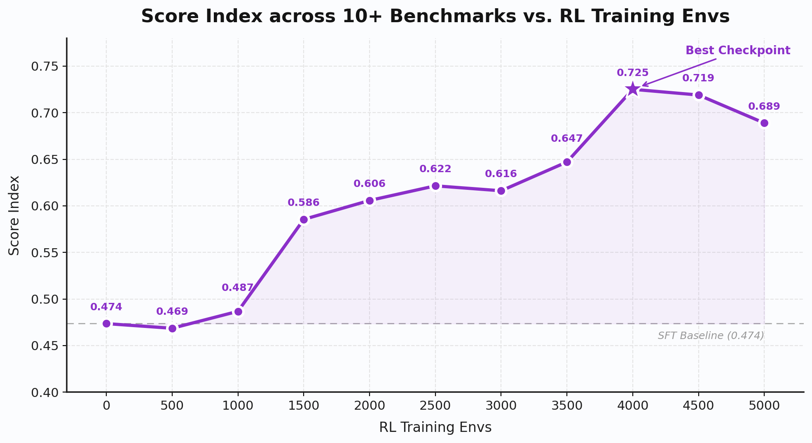

Fig 1. Qwen3.8-Max shows steady, consistent gains across dozens of in-house and public working benchmarks as RL training continues to scale up.

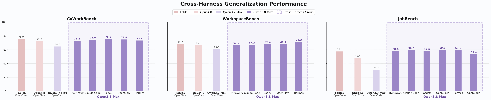

Fig 2. Qwen3.8-Max achieves comparable performance across many harnesses, including QwenWork, Claude Code, Codex, OpenClaw, and Hermes.

### Testing the _Breadth_ of Working Ability Across _Hundreds_ of High-Value Professions [\#](https://qwen.ai/blog?id=qwen3.8\#testing-the-breadth-of-working-ability-across-hundreds-of-high-value-professions)

As frontier models take on an ever-widening role in economically valuable work, we stress-tested the **breadth** of Qwen3.8-Max’s ability to deliver production-quality results in real workflows — spanning high-frequency tasks across **several hundred high-economic-value professions**. A few representative showcases:

- **Corporate compliance counsel** — Qwen3.8-Max surfaced **1,284 relevant clauses** across a corpus of **hundreds of documents** in a single pass, completing the full review in **under an hour**. Such a review typically takes a paralegal team working collaboratively for **around a week**.
- **UI/UX designer** — Qwen3.8-Max produced a high-fidelity, interactive prototype for the digital-banking app _NOVA_ — **8 screens** with a consistent design system, delivered in **one shot** with **zero rounds** of human revision, versus **3–5 rounds** of revision in a conventional workflow.
- **Restaurant brand founder** — Qwen3.8-Max read through **over a hundred ingredient-supply briefs** and produced a complete **26-dish menu** in one pass. Each dish is annotated with its average caloric value and ingredient provenance, with the food-cost ratio held at **33.8%**. Such menu development would normally require a head chef and operations team weeks of iterative recipe testing, costing, and refinement.
- **Structural engineer** — From a single set of drawings, Qwen3.8-Max reconstructed the seismic structural model of a 30-story office tower in the browser, with natural period, base shear, and inter-story drift ratio all available for real-time inspection on hover. In a traditional workflow, an engineer would need to build the model manually in specialized modeling software, typically taking over a week.
- **Rehabilitation therapist** — Qwen3.8-Max turned a **2D paper assessment form** into a **3D interactive demo** with freely rotatable viewing angles and layer-by-layer **anatomical overlays**, letting patients see exactly where the injury sits and how recovery progresses — work previously outsourced to a medical-animation studio at **2–4 weeks**’ lead time and **thousands of dollars** in cost.
- **Sports data analyst** — Qwen3.8-Max parsed **~8,400 offensive/defensive possessions per player** into a ready-to-use **player tactical profile** and **coaching report** in **tens of minutes**. A traditional analytics team would need to manually complete tactical segmentation, causal attribution, and report writing — a process typically spanning **several working days**.

Video 1. Across hundreds of high-value professions, Qwen3.8-Max measurably boosts human productivity in real workflows — showcasing the _breadth_ of its working ability.

### Building a Profitable End-to-End Quant Strategy in a Single Session [\#](https://qwen.ai/blog?id=qwen3.8\#building-a-profitable-end-to-end-quant-strategy-in-a-single-session)

Powered by its **Dynamic Workflows** construction capability, Qwen3.8-Max drives task planning programmatically and orchestrates large-scale sub-agent systems with precision — turning a single conversation into an end-to-end, automated quant-research loop.

**Depth — end-to-end ETF-rotation strategy R&D.** From a one-line task description, Qwen3.8-Max autonomously planned a complex dynamic workflow and worked for **hours** to deliver a complete ETF-rotation strategy — building the data system, constructing base factors, and orchestrating multi-round greedy iteration, all while dynamically analyzing backtests and correcting course. Throughout, it **acted on evidence instead of a fixed script**:

- When it observed misalignment between design-period metrics and validation-period metrics — a classic overfitting signal — it **automatically triggered pruning, removing redundant factors round by round**.
- When it found multiple paths converging on the same set of core signals, it **added multi-seed union validation** to eliminate path dependence.
- When it judged that three-model ensembling was less robust than fixed-direction synthesis on small cross-sections, it **autonomously switched to a more suitable strategy framework**.

**Breadth — massively parallel factor mining.** Factor research entails a vast search space, and traditional workflows remain serial. Qwen3.8-Max parallelized the process: from just **six short descriptions** spanning the classic factor families of momentum, value, quality, investment, low-risk, and sentiment, it decomposed each into **50 research directions**, dispatched **~330 sub-agents**, completed **~6,000 backtests**, and continuously adapted the workflow mid-run. The selected factors achieved **excess Sharpe ratios of 0.64–1.48**, with IC uniformly positive, ranging from **0.010 to 0.014**.

From coherent single-track R&D to parallel exploration of a huge hypothesis space, Qwen3.8-Max leverages Dynamic Workflows to **freeze orchestration logic into reproducible programs** — compressing quant research that once took researchers **weeks to months** of serial work into a **scalable, automated loop delivered within a single conversation**, demonstrating the model’s broad potential for **long-horizon autonomous work**.

Video 2. Qwen3.8-Max promises to put a quant researcher's expertise within everyone's reach — showcasing the _depth_ of its working ability.

## Long-Horizon Task [\#](https://qwen.ai/blog?id=qwen3.8\#long-horizon-task)

When tackling highly complex, long-horizon, and multi-constraint tasks, Qwen3.8-Max demonstrates exceptional system-level autonomous planning and end-to-end closed-loop adaptive learning. Whether navigating stringent physical constraints in digital chip design or highly competitive, strategic business simulations, the model achieves deep algorithmic and strategic refactoring across thousands of rounds of interaction via an action-feedback-iteration loop.

### Autonomous Chip Design and Closed-Loop Feedback-Driven Optimization [\#](https://qwen.ai/blog?id=qwen3.8\#autonomous-chip-design-and-closed-loop-feedback-driven-optimization)

Qwen3.8-Max has independently achieved the autonomous execution of the entire silicon design flow, spanning logic restructuring, multi-constraint optimization, and physical layout generation. The target design is a **GCD / RSA cryptographic hardware accelerator** that integrates modular exponentiation and modular multiplication. Built on a GCD datapath and control path, this block represents a typically compact yet logic-dense digital circuit. Under a randomized `cocotb` verification framework, the model must maintain **bit-exact functional correctness** across 4-, 6-, 8-, and 16-bit configurations while minimizing the synthesized gate count (Yosys cell count)—a direct addressing of the classic trade-off between area and correctness in front-end hardware design. Area performance is evaluated based on the 16-bit (WIDTH = 16) configuration.

Qwen3.8-Max optimized this design within a sandboxed environment integrated with simulation (Iverilog), synthesis (Yosys), and physical design (OpenROAD) toolchains. Starting with minimal inputs—a basic task description, a stub RTL workspace with empty module templates, and an evaluation script for verification and synthesis—Qwen3.8-Max operated completely autonomously. Without any golden reference designs or human intervention, the model independently executed the entire process from high-level algorithmic architecture design to RTL code generation and multi-round iterative refinement.

Over a single continuous autonomous run, Qwen3.8-Max completed approximately **500 turns and 71 evaluations across 13 key milestones**, executing an end-to-end restructure of the design. The model autonomously managed RTL editing, simulation debugging, synthesis analysis, redundancy localization, and iterative datapath re-architecting—advancing from initial bug-fixing to deep, algorithm-level rewrites. **While its first functionally viable design measured 8,298 gates, Qwen3.8-Max drove this down to 678 gates, leading all evaluated models**. This trajectory demonstrates that Qwen3.8-Max is capable of major structural breakthroughs even hundreds of turns into a run, rather than plateauing after early, low-hanging gains.

**Key Design Milestones Along the Trajectory:** _(The evolution records preserve the complete circuit topology and the corresponding code diff details at each stage)_

- **Algorithmic Rewrite: Modulo divider to iterative shift-subtract (8,298 → 2,010 gates, Turn 22)**
The single largest optimization step. Qwen3.8-Max replaced the expensive 16-bit hardware modulo divider in `modular_multiplier` with an iterative shift-subtract architecture, slashing 6,288 gates in one move—accounting for over 80% of the total area reduction.
- **Redundancy Elimination & Bitwidth Trimming (2,010 → 1,304 gates, Turns 35–48)**
Recognizing the caller’s pre-conditions, the model safely bypassed the entire `REDUCE` stage, merged two independent reduction modules into a single shared block, optimized the output path to combinational logic, and narrowed the bitwidth of the internal register `k_ff`.
- **Register & Control FSM Pruning (1,304 → 907 gates, Turns 60–113)**
The model removed redundant `base` and `mod` registers as well as the `k_nz` flip-flop, introduced an early-exit mechanism for even numbers, utilized the subtractor’s most significant bit (MSB) as the comparator, and merged the separate “compare-then-subtract” logic in the GCD module into a single, reusable subtractor.
- **Module Fusion & Logic Sharing (907 → 765 gates, Turns 170–252)**
Dissolving module boundaries, the model inlined the multiplier directly into the modular exponentiation **finite state machine (FSM)**, merged three sub-modules, and shared a single subtractor globally, thereby eliminating cross-module redundant interfaces and duplicated logic.
- **Gate-Level Refinement (765 → 678 gates, Turns 443–500)**
Utilizing local optimizations such as a shared NOR-gate tree, absolute-difference subtraction splitting (abs-sub splitting), and byte-to-bit selection logic, the model squeezed out the final gate-level redundancies.

To verify whether front-end optimizations translate to physical implementation, Qwen3.8-Max ran the RTL design through a standard place-and-route (PR) flow using OpenROAD (Nangate45 PDK) to generate a physical silicon layout. In the physical layout representation, each chip demonstrates the actual routing results: standard cells are laid out on the physical plane of the die, with metal routing layers stacked above (each layer color-coded and connected by vertical vias). **The starting design occupied a 106×106 µm² die** with a total wirelength of 33,369 µm and severe timing violations (a negative slack of -4.46 ns). **The final layout shrank to a 46×46 µm² die**, with wirelength dropping to 4,187 µm, and successfully achieved timing closure at 500 MHz (+0.66 ns Slack). This represents an 81% reduction in physical die area, proving that high-level front-end architectural optimizations translate directly into highly compact, routable, and performant silicon implementation.

Expand

Neon Glass Chip City · interactive accelerator study

Qwen3.8 Max 678

GPT 5.5 749

Opus 4.8 870

GLM 5.2 1107

DeepSeek V4 Pro 1450

Valid AttemptFailed Attempt

67810002000400085002050100200400\# Tool Calls →Yosys Cells (Log, Best So Far)DeepSeek V4 Pro1450GLM 5.21107Opus 4.8870GPT 5.5749Qwen3.8 Max678#1 · tc 17 · 8298 cells — first working design#2 · tc 22 · 2010 cells — 16-bit modulo → shift-subtract#3 · tc 35 · 1660 cells — drop REDUCE phase#5 · tc 48 · 1304 cells — 2 reduce blocks → 1 shared#6 · tc 60 · 1180 cells — drop base/mod registers#7 · tc 77 · 1135 cells — drop k\_nz FF, early even-exit#8 · tc 111 · 948 cells — comparator → subtractor MSB#9 · tc 113 · 907 cells — GCD cmp+sub → one subtractor#10 · tc 170 · 847 cells — inline mult into exp FSM#11 · tc 252 · 765 cells — merge 3 modules, 1 subtractor#12 · tc 443 · 701 cells — shared NOR tree#13 · tc 459 · 678 cells — abs-sub split, byte→bit select#4 · tc 44 · 1493 cells4

Gate Area · vs Start#4

8298-Gate Start

1488 Gates

5.6× Smaller Than Baseline

−167 From Milestone #3

Registers **198**MUX **283**XOR/XNOR **148**AND **501**OR **300**NOT **58**

❚❚

Before · Step 1 · first working design8,298 cells

106×106 µm² · timing VIOLATED −4.46 ns

WebGL hardware acceleration is unavailable.

After · Step 13 · final design678 cells

46×46 µm² · timing MET +0.66 ns

✕

This case highlights two pivotal capabilities of Qwen3.8-Max as a foundational model for autonomous, long-horizon hardware agents:

1. **Long-horizon Sustained Optimization**: The model maintains a highly coherent, systematic strategy over hundreds of complex interaction turns, driving deep into algorithmic-level datapath rewrites rather than stalling at superficial syntax adjustments.
2. **Feedback-driven Closed-loop Improvement**: In the absence of prior reference designs, the model relies entirely on an “edit-simulate-synthesize-layout” feedback loop to drive optimization. Each design iteration is strictly validated through automated `cocotb` functional tests, with physical feasibility fully guaranteed by OpenROAD backend validation.

### Continuous Learning in Long-term Operations [\#](https://qwen.ai/blog?id=qwen3.8\#continuous-learning-in-long-term-operations)

E-Commerce Bench is a **365-day long-cycle e-commerce operation** simulation benchmark, designed to evaluate large language models’ business decision-making capabilities in sustained operational scenarios. Built on real, desensitized transaction data from Taobao and Tmall, this benchmark deeply replicates a complex ecosystem comprising **12 store types, 60 product categories, nearly 600 suppliers, and 7,000 products**. The model is given ¥100,000 in starting capital to simultaneously operate multiple online stores. Throughout the year, it must contend with seasonal demand swings, sudden environmental events, and cash flow pressures from a highly realistic e-commerce settlement system. The model must autonomously make full-chain decisions, including product selection, supply chain negotiation, inventory management, dynamic pricing, and returns handling, with the ultimate goal of maximizing total balance by year-end. This also tests the model’s capital allocation strategy throughout the year. It must know when to invest proactively for growth. Just as importantly, it must convert inventory and operating gains into cash before the cycle ends. Otherwise, unconverted assets left on the books can hurt the final results.

In price negotiations, the benchmark introduces **a supplier matrix, driven by game theory principles**, where each supplier possesses distinct personality traits and concession strategies. This requires the model to negotiate through multi-round natural language interactions. Qwen3.8-Max demonstrated continuous learning capability in negotiations. It conducted deep probing on the same products from the same suppliers, achieving progressive reductions in procurement prices and steady increases in profit round by round. This caused **the negotiation efficiency (represented by the area in the radar chart) to continuously expand over time**. Moreover, it effectively generalized this negotiation experience to similar products, while other models’ negotiation efficiency generally hit a plateau in the mid-term.

Additionally, the model had to navigate hidden risks beneath the surface and complex market rhythms. Within the matrix of nearly 600 suppliers, the benchmark covertly embedded 152 fraudulent merchants, encompassing classic scam patterns such as “membership fee traps,” “low-price bait,” and “goods not as described.” This comprehensively tested the model’s risk control capabilities. At the same time, the pressure of surging orders during annual major promotions intertwined with random supply chain crises, like typhoons and material shortages, pushing the model’s stocking rhythm and crisis management abilities to the limit. Against this backdrop, Qwen3.8-Max exhibited exceptional forward-looking planning capability. It invested the most capital in the earliest stage of operations to establish its position, which accelerated its subsequent asset growth curve. It also achieved **a net profit exceeding ¥100,000 during the year-end major promotion period**—nearly 2.4 times that of the second-place GLM 5.2.

Qwen3.8-Max ultimately achieved the highest total balance of ¥416,252 (a 4.16x return), surpassing the second-place GLM 5.2 by 38%. This also represents a 152% improvement over its previous flagship generation, Qwen3.7-Max. These results demonstrate that Qwen3.8-Max possesses advantages in **long-horizon coherent decision-making**. Furthermore, it has the ability to **adaptively learn from transactional feedback**, continuously iterating and evolving across more than 2,000 rounds of interaction, rather than rigidly adhering to strategies learned early on.

## Multimodal Agents [\#](https://qwen.ai/blog?id=qwen3.8\#multimodal-agents)

From everything it sees to everything it does, Qwen3.8-Max is not merely capable of understanding images, documents, and videos. It delivers **visual intelligence that runs through the entire task lifecycle**.

When working with financial reports and complex PDFs spanning **more than 200 pages**, Qwen3.8-Max can understand text, charts, and document layouts across pages, extract key insights from large volumes of information, and turn them into structured reports or production-ready web experiences. When processing videos longer than **100 hours**, it can do more than locate specific moments and answer detailed questions. It can organize people, events, timestamps, and scenes into a **video memory graph**, continuously building connections across long time spans to reconstruct event progressions, character relationships, and critical moments.

Whether the input is a hundreds-page document, a complete TV series, or a 100-hour livestream, information that would otherwise be difficult to consume can be transformed into a **searchable, traceable, and interactive knowledge structure**.

Beyond understanding, Qwen3.8-Max can carry out real visual production tasks. It can edit personal footage into a vlog, turn a question into an immersive educational animation, reconstruct a complete frontend project from a single interface screenshot, transform a floor plan into a Blender-based 3D interior visualization, and develop interactive games and applications from a natural-language request.

More importantly, **vision is not limited to the input stage**. During execution, Qwen3.8-Max continuously observes and evaluates its own intermediate results. It can inspect page layouts, object orientations, spatial relationships, animation quality, and interaction outcomes. When it detects issues—such as a television facing the wrong direction, a misaligned interface, or a visual result that does not match the intended design—it can **identify the deviation, revise its plan, and correct the output autonomously**.

This means vision is no longer simply another modality that an agent uses to understand input. It becomes a **native feedback loop across planning, execution, verification, and iteration**. The model generates while observing, acts while reviewing, and repeatedly examines the result, identifies problems, and improves its work. This visual feedback loop moves an agent beyond merely completing a task toward **completing it well**.

Qwen3.8-Max is helping multimodal agents evolve from **understanding the world** to **continuously acting and creating within it through vision**.

In the digital world, finishing a complex task on its own often takes two things at once: **writing code to implement the underlying logic, and operating the interface by hand to drive the task and observe the result.** This Hybrid Agent capability — the pairing of _coding_ and _GUI operation_ — makes the two channels complementary: **coding does the heavy lifting efficiently and at scale**, while **GUI operation reaches whatever a human can see and touch and, just as importantly, feeds back what actually happens in a live system** — extending the visual feedback loop above from inspecting its own output to **verifying against a real, running application**.

To measure this, we introduce **RecreationBench**, a long-horizon application-recreation benchmark spanning five platforms — desktop (Ubuntu, macOS, Windows), mobile (Android), and web. The model may observe a real, running application only as a **black box** — no source code, no internet access — making sense of it purely through interaction and feedback, then rebuilding the whole application from scratch. Here Qwen3.8-Max already demonstrates **frontier-level Hybrid Agent capability**, converging on the original step by step through repeated cycles of iterative coding and interactive feedback.

To make these capabilities easier to integrate into existing agent systems, we are also introducing **Qwen-MM-Plugins**. It is a harness extension library designed for multimodal agents, providing agent frameworks with image and video processing, multimodal memory, dynamic-resolution support, visual tool use, and specialized capabilities for tasks such as video editing, Blender, and CAD. With Qwen-MM-Plugins, **any existing agent harness can be extended into a more naturally multimodal-native system**.

## User Feedback [\#](https://qwen.ai/blog?id=qwen3.8\#user-feedback)

The most honest take on Qwen3.8-Max comes from people who actually put it to work. Top-tier agent platforms, leading open-source algorithm teams, professional firms in law, finance, and manufacturing, scrappy startups, solo developers, and academic researchers — all of them keep handing it their **most complex, mission-critical, and long-horizon tasks**.

Enterprises use it to stand up large-scale agent systems. Knowledge workers dump their images, manuscripts, and video on it, and get everything processed. Developers hand it their heaviest engineering tasks outright. Research teams run the loop of literature, data, and simulation end to end. One model, reached for so often across such different work that it becomes indispensable. The verdict is the same: **Qwen3.8-Max drives long, autonomous task chains and turns out ship-ready results in a single pass**.

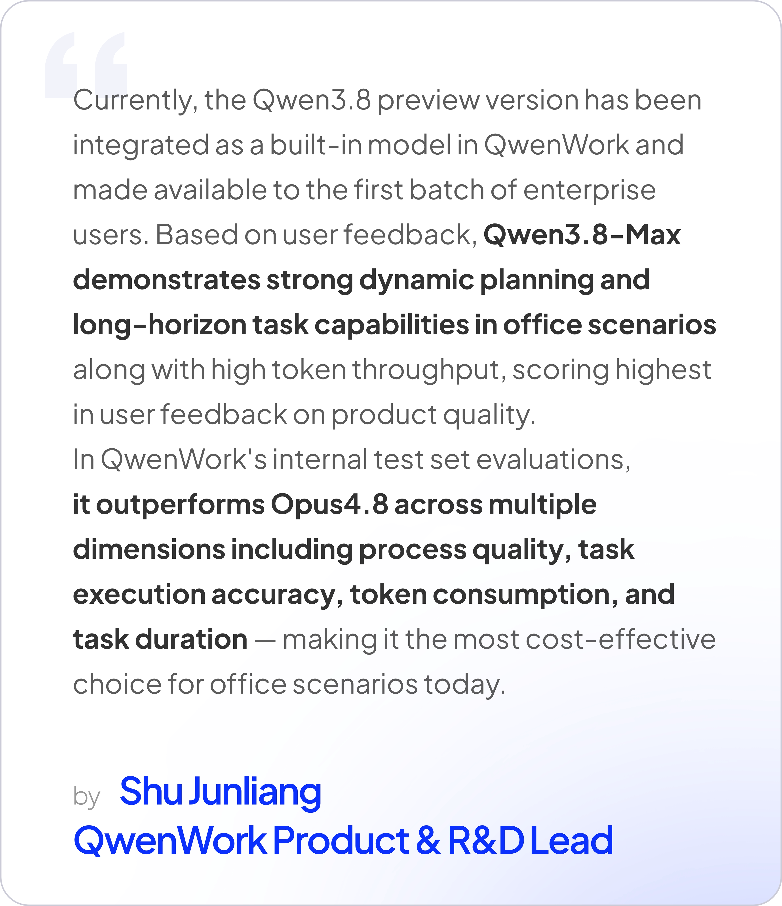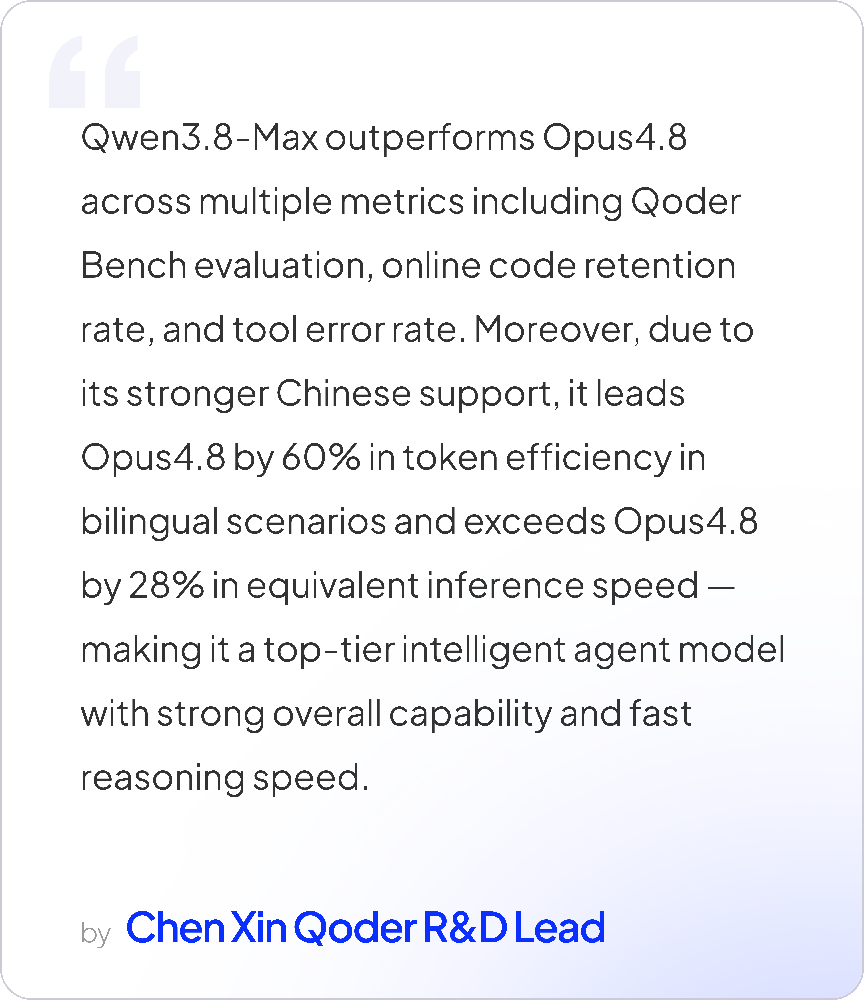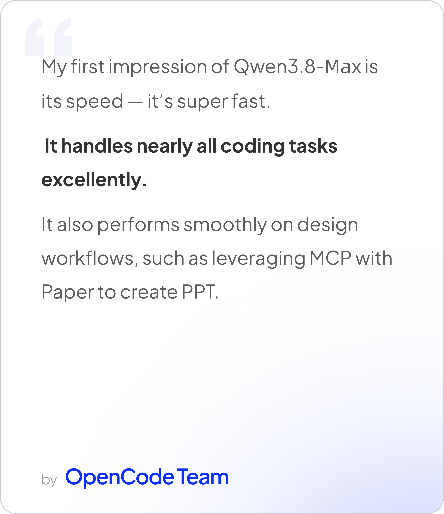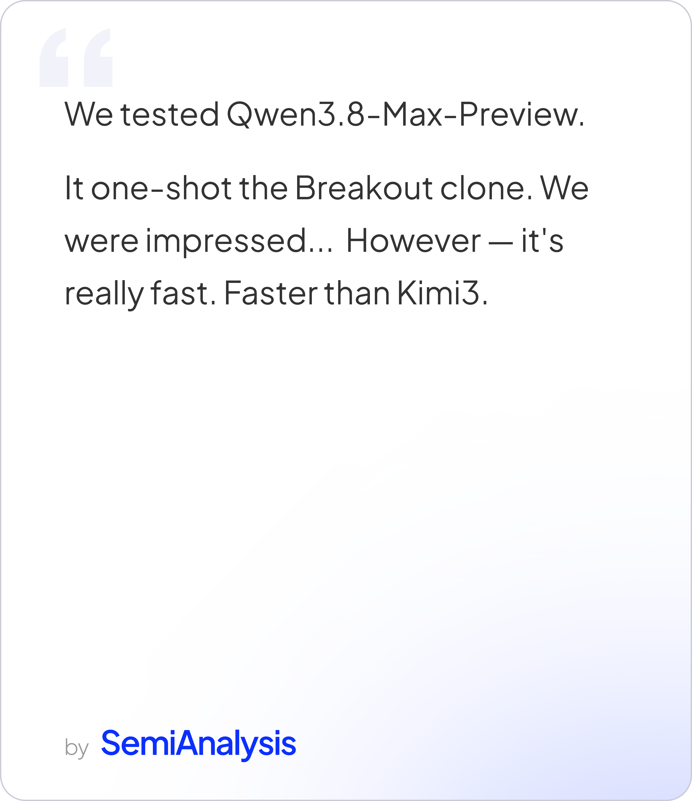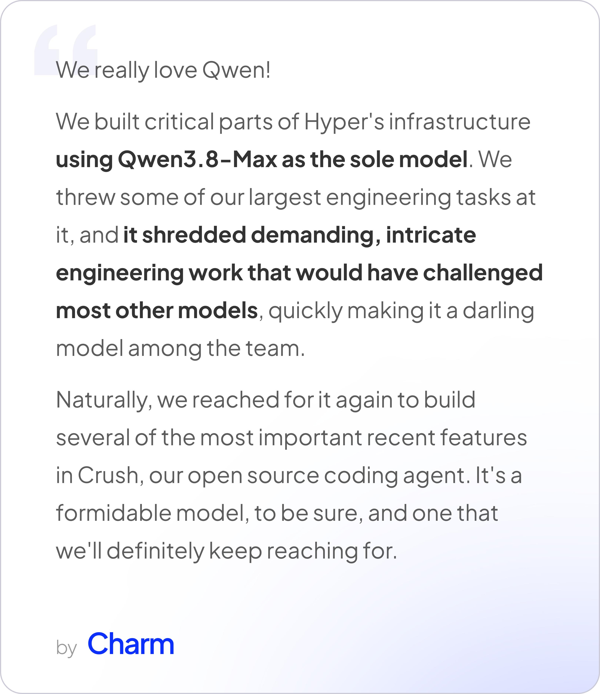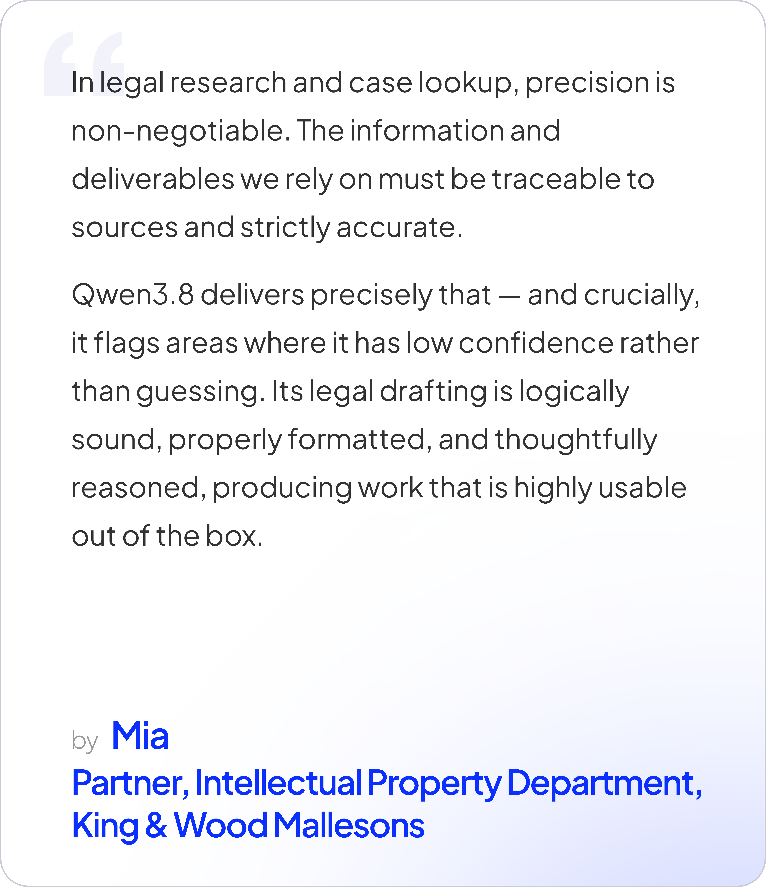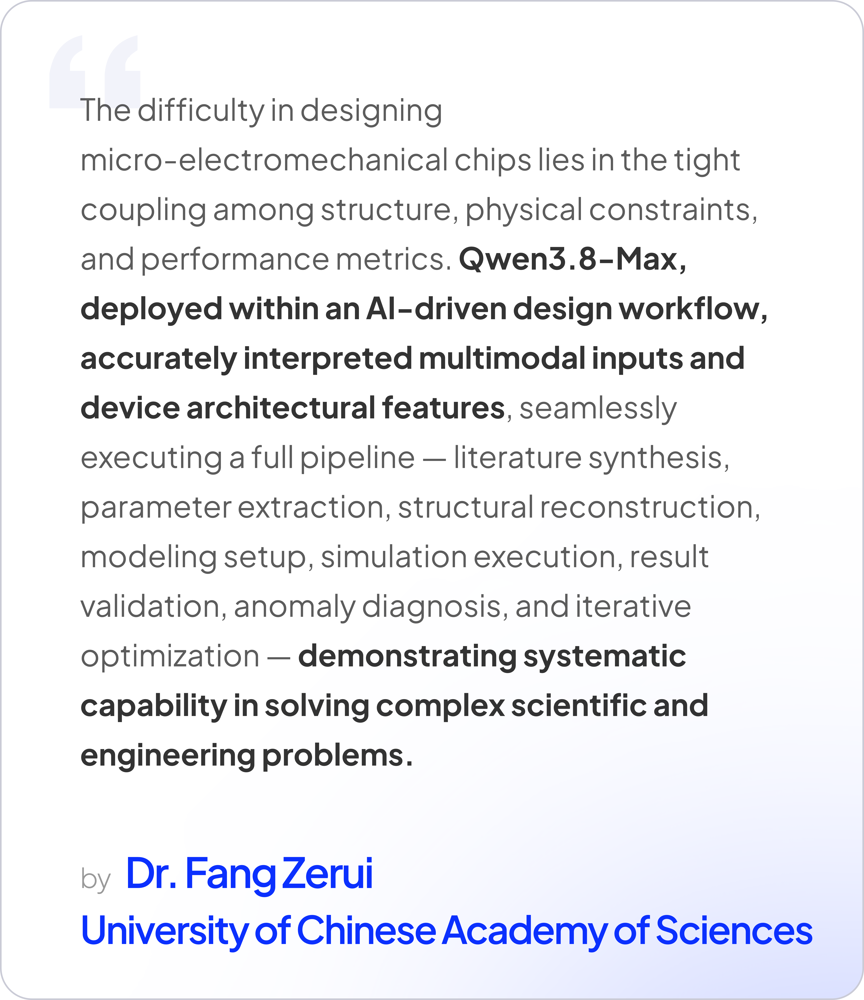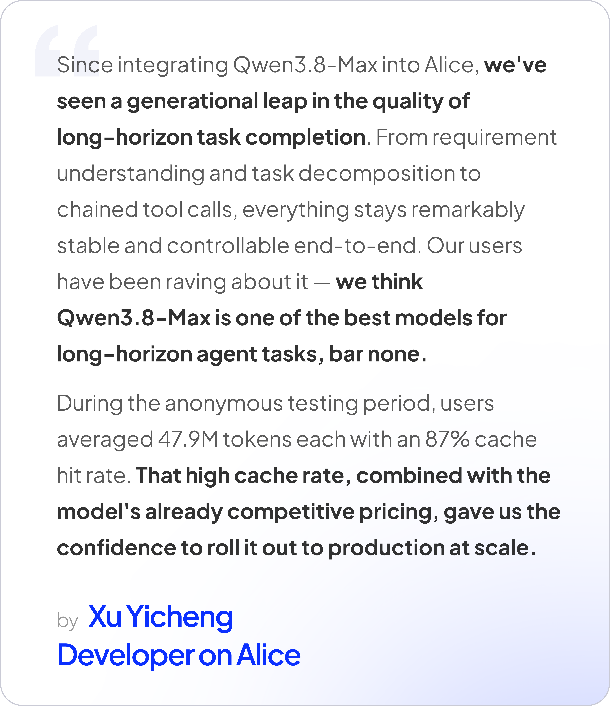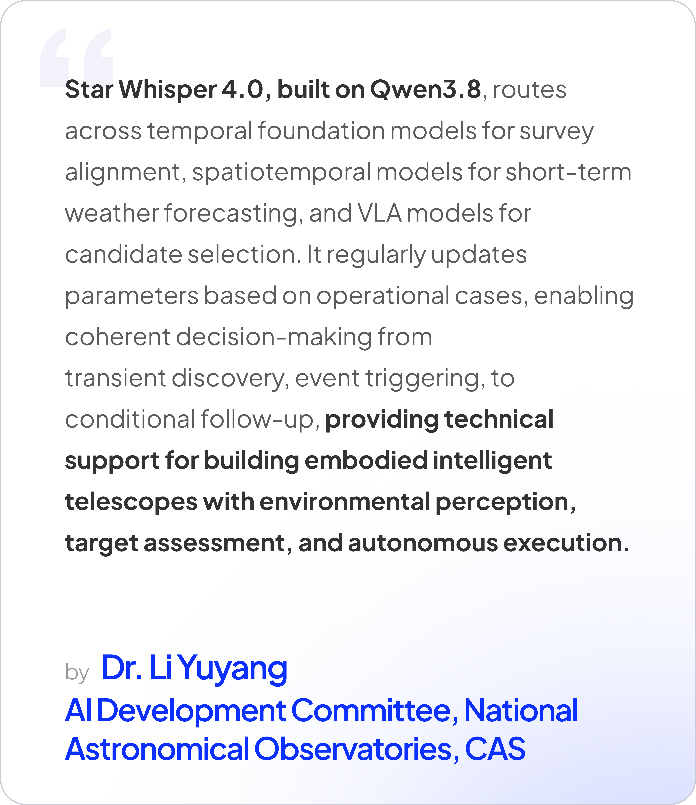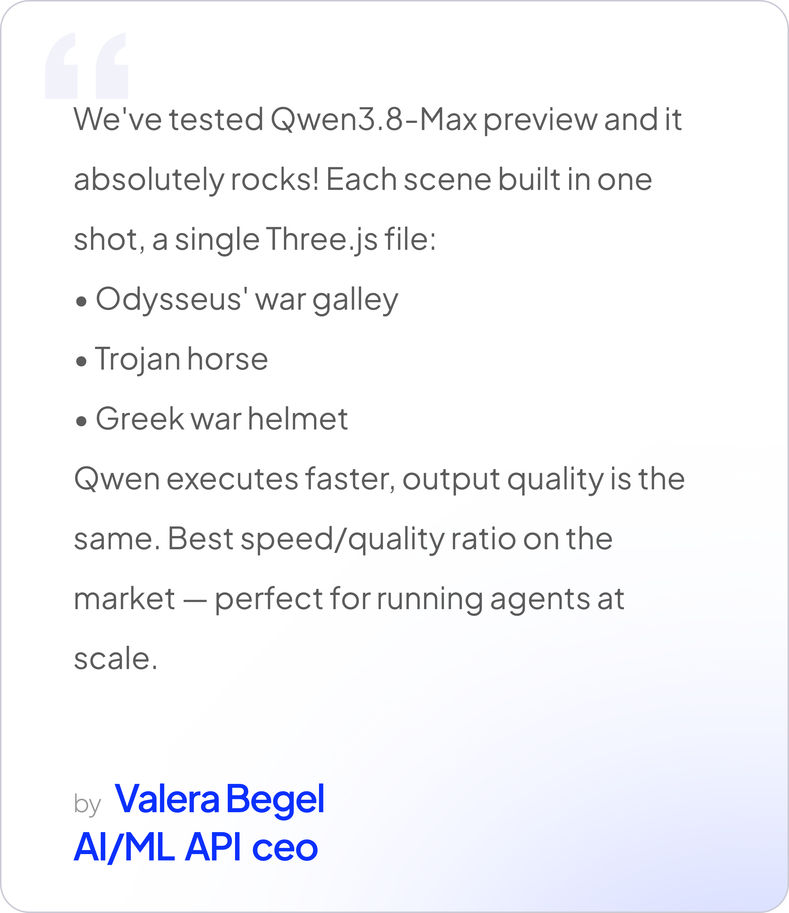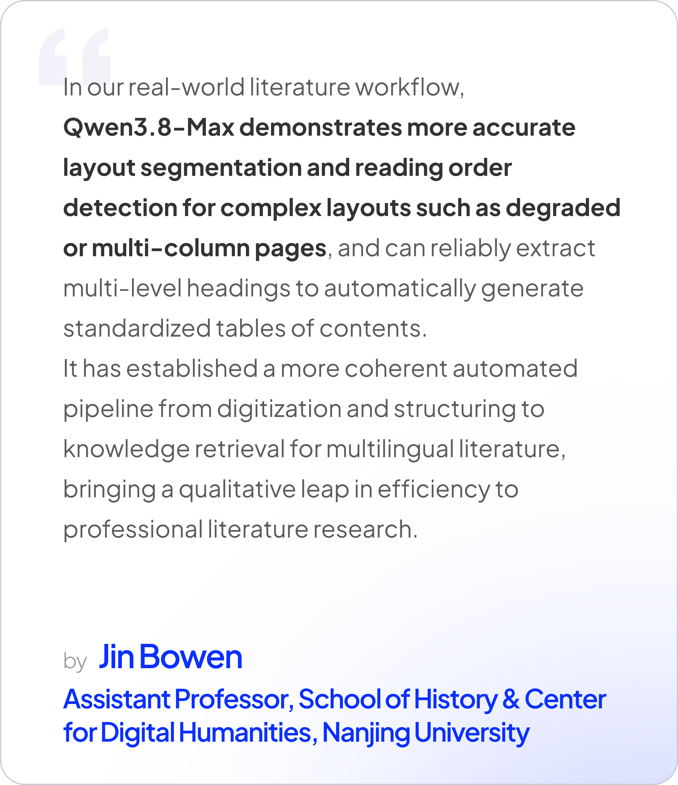

## Full Benchmark Table [\#](https://qwen.ai/blog?id=qwen3.8\#full-benchmark-table)

|  | Opus4.8 | Fable5 | GPT5.6 Sol (max) | Qwen3.7-Max | Qwen3.8-Max |
| --- | --- | --- | --- | --- | --- |
| Coding Agent |
| Terminal Bench 2.1 | 84.6 | 84.6 | 88.8 | 74.5 | 86.6 |
| SWE-bench Pro | 69.2 | 80.0 | 64.6 | 60.6 | 67.7 |
| DeepSWE 1.1 | 59.0 | 70.0 | 73.0 | 21.6 | 56.6 |
| NL2Repo-Bench | 69.4 | -- | -- | 47.2 | 55.9 |
| FrontierSWE | 70.0 | 88.8 | -- | 40.7 | 73.5 |
| MLS-Bench-Lite | 42.8 | 49.9 | 46.2 | 31.7 | 41.0 |
| PaperBench | 80.3 | 88.8 | 90.5 | 64.8 | 93.0 |
| AndroidBench | 69.8 | 84.5 | 74.0 | 56.5 | 75.1 |
| QwenSWEBench | 84.0 | 86.3 | 73.5 | 63.4 | 80.7 |
| QwenQoderBench | 62.7 | 63.1 | 53.8 | 36.8 | 58.4 |
| QwenReactBench | 1694 | 1770 | 1564 | 1538 | 1724 |
| QwenSVGBench | 1648 | 1690 | 1758 | 1499 | 1713 |
| General Agent |
| CoWorkBench | 72.3 | 75.9 | 71.5 | 64.6 | 74.8 |
| WorkSpaceBench | 66.8 | 68.7 | 65.6 | 61.4 | 67.7 |
| JobBench | 48.4 | 57.4 | 45.4 | 31.3 | 53.4 |
| SkillsBench | 65.1 | 70.9 | 73.5 | 61.2 | 70.2 |
| Agents' Last Exam (Pass / Score) | 27.0 / 45.1 | \-\- / -- | 30.6 / 53.6 | 11.8 / 31.1 | 27.0 / 52.4 |
| Automation-Bench (Pass@1) | 27.2 | 29.1 | 29.7 | 14.2 | 27.3 |
| Toolathlon Verified (Pass@1) | 76.2 | 77.9 | 74.9 | 49.7 | 72.5 |
| WideSearch | 72.9 | 81.2 | -- | 75.2 | 81.9 |
| HLE w/ tools | 57.9 | 64.5 | 58.0 | 53.5 | 56.2 |
| General Capabilities |
| GPQA Diamond | 92.0 | 92.6 | 94.1 | 92.4 | 92.6 |
| HLE | 45.7 | 53.3 | 47.2 | 41.4 | 43.6 |
| IFBench | 62.2 | 63.5 | 72.7 | 79.1 | 82.8 |
| $OneMillion-Bench (expert score) | 41.8 | 55.9 | 53.8 | 44.4 | 52.5 |
| HealthBench | 52.4 | -- | 55.3 | 54.5 | 60.2 |
| PLawBench | 69.6 | 70.2 | 72.3 | 58.9 | 73.2 |
| PRBench-Legal | 52.7 | 57.6 | 57.6 | 48.5 | 57.6 |
| PRBench-Finance | 51.9 | 55.8 | 55.5 | 46.8 | 58.3 |
| MRCR v2 256K (8-needle) | 83.2 | -- | 93.8 | 86.7 | 92.9 |
| LongBench v2 | 69.1 | -- | 67.1 | 65.3 | 66.3 |

1\. Fable5 results may involve fallbacks.

2\. Terminal Bench 2.1: Evaluated with Claude Code (avg@10), using a 5-hour timeout and max\_tokens=131,072. For all other models, we report the best published score across harnesses: Claude Opus 4.8 and Claude Fable 5 with Terminus 2 from Artificial Analysis (https://artificialanalysis.ai/evaluations/terminalbench-v2-1); GPT-5.6 Sol with Codex (https://openai.com/index/previewing-gpt-5-6-sol/).

3\. SWE-bench Pro: Evaluated with the Claude Code harness, temp=1.0, top\_p=0.95, and a 256K context window. Problematic tasks corrected and all baselines evaluated on the refined benchmark.

4\. DeepSWE 1.1: Evaluated with the Claude Code and mini-SWE-agent harnesses, temp=1.0, top\_p=0.95, and a 256K context window. We report the highest score among both harnesses; notably, Qwen3.8-Max performs best on Claude Code.

5\. NL2Repo-Bench: Evaluated with the Claude Code harness. To prevent reward hacking, we disable Bash commands that attempt to access the specific repository, such as pip download, pip install, and git clone.

6\. FrontierSWE: Evaluated with the Claude Code harness. All other available MEAN@5 results are taken from the official FrontierSWE leaderboard (https://www.frontierswe.com) as of August 3, 2026. Dominance scores are recomputed from the raw scores using the official evaluation script. "--" indicates that no official MEAN@5 result was available as of that date.

7\. MLS-Bench-Lite: Evaluated with Claude Code using a 5-hour timeout and max\_tokens=131,072. All other model scores are taken from the official leaderboard.

8\. PaperBench: Evaluated in the BasicAgent setting under Code-Dev mode, judged by Claude Opus 4.6, and averaged over 3 runs (max 12 hours per run).

9\. AndroidBench: Evaluated on the 95-task public subset, reporting avg@3 scores.

10\. QwenSWEBench: Inhouse coding benchmark to evaluate models' software engineering capabilities. Evaluated with the Claude Code harness. Reporting avg@3 with an 8-hour timeout, max\_tokens=32,768, temperature=1.0, and a 256K-token context window.

11\. QwenQoderBench: Inhouse coding benchmark to evaluate user experience on Qoder. Evaluated with the Claude Code harness. Reporting avg@5 with a 6-hour timeout, max\_tokens=32,768, temperature=1.0, and a 256K-token context window.

12\. QwenReactBench: Inhouse React project building benchmark using Claude Code as the harness, bilingual (EN/CN), 7 categories; auto-render + multimodal judge; BT/Elo rating.

13\. QwenSVGBench: Inhouse SVG code generation benchmark; bilingual (EN/CN), auto-render + multimodal judge; BT/Elo rating.

14\. CoWorkBench: Inhouse cowork benchmark for evaluating long-horizon tasks across computer science, finance, law, medical, and other productivity domains.

15\. SkillsBench: Evaluated on the public SkillsBench v1.1 benchmark across 87 tasks, reporting the average score over three runs per task. Opus 4.8 and Fable 5 are evaluated on Claude Code; GPT-5.6 Sol is evaluated on Codex; the Qwen-series are evaluated on OpenCode. All results are from our own testing.

16\. Automation-Bench: Evaluated on the 600-task public subset.

17\. WideSearch: Evaluated with the Claude Code harness for external models and the Qwen-Agent harness for ours, reporting the average item-F1 over four runs.

18\. $OneMillion-Bench: Evaluated using gemini-3.1-pro-preview.

19\. PLawBench: Evaluated using gemini-3.1-pro-preview.

20\. Empty cells (--): Scores are not yet available or are not applicable.

|  | Opus4.8 | Fable5 | Gemini3.1-Pro | GPT5.6-Sol | Qwen3.7-Plus | Qwen3.8-Max |
| --- | --- | --- | --- | --- | --- | --- |
| Multimodal Reasoning |
| MMMU-Pro | 75.6 | 81.2 | 80.5 | 83.0 | 79.0 | 82.3 |
| MathVision | 87.1 / 97.1 | 92.7 / 98.6 | 87.4 / 95.7 | 90.8 / 97.8 | 90.3 / -- | 95.2 / 97.7 |
| BabyVision | 28.4 / 81.2 | 42.5 / 90.5 | 55.9 / 68.3 | 65.5 / 88.9 | 64.7 / 70.4 | 82.0 / 91.3 |
| HLE-VL (w/ Tools) | -- | -- | 43.9 | 51.2 | 25.6 | 52.2 |
| ZeroBench (Pass@5) | 17.0 / 34.0 | 20.0 / 46.0 | 17.0 / 23.0 | 22.0 / 35.0 | 19.0 / 19.0 | 24.0 / 49.0 |
| ZeroBench-Sub | 31.1 | 37.1 | 36.5 | 46.7 | 41.0 | 48.5 |
| LogicVista | 76.7 | 85.7 | 82.6 | 89.7 | 84.3 | 91.9 |
| HiPhO | 69.3 | 78.6 | 85.4 | 86.8 | 84.1 | 90.0 |
| PhyX | 54.2 | 71.7 | 79.4 | 79.1 | 80.0 | 83.5 |
| SLAKE | 75.9 | 86.6 | 82.9 | 85.1 | 83.2 | 90.8 |
| MedXpertQA-MM | 71.7 | 80.0 | 80.7 | 81.5 | 71.0 | 80.4 |
| PMC-VQA | 59.2 | 63.2 | 62.5 | 62.3 | 63.4 | 66.2 |
| Visual Agent & Coding |
| OSWorld-Verified | 83.4 | 85.0 | 76.2 | 83.2 | 73.3 | 86.1 |
| OSWorld 2.0 | 20.6 / 54.8 | \-\- / 66.1 | 7.8 / 30.6 | \-\- / 62.6 | 2.8 / 21.5 | 19.4 / 46.7 |
| ScreenSpot Pro | 82.3 | 87.3 | 68.1 | 81.3 | 79.0 | 84.5 |
| WebArena-Verified | 67.9 | 71.3 | 64.3 | 69.7 | 55.3 | 66.8 |
| AndroidWorld | 75.0 | 88.8 | 70.7 | 77.6 | 81.0 | 85.3 |
| MobileWorld | 67.5 | 85.5 | 58.1 | 76.9 | 51.2 | 77.8 |
| ClawEval-MM | 73.3 / 73.8 | 81.2 / 77.5 | 50.5 / 55.2 | 81.2 / 78.9 | 57.4 / 60.1 | 77.2 / 74.8 |
| Vision2Web | 62.4 | 70.5 | -- | 62.1 | 42.1 | 69.0 |
| QwenBlenderBench | 62.4 | 69.5 | 23.0 | 68.6 | 41.5 | 69.9 |
| Parametric CAD Bench | 85.1 | 87.5 | 73.5 | 86.2 | 73.8 | 91.5 |
| RecreationBench | 48.0 | 56.1 | 16.2 | 47.6 | 30.2 | 51.7 |
| PresentBench | 80.9 | 79.8 | 55.4 | 82.9 | 65.7 | 79.6 |
| Document & Office Intelligence |
| CharXiv (RQ) | 78.5 / 89.9 | 87.9 / 93.5 | 84.4 / 89.9 | 85.1 / 89.1 | 85.8 / 85.9 | 88.4 / 93.5 |
| OmniDocBench 1.5 | 86.5 | 89.5 | 90.0 | 86.7 | 91.4 | 92.1 |
| OCR-Bench-V2 (EN/ZH) | 53.9 / 55.3 | 65.3 / 58.1 | 64.6 / 58.2 | 69.0 / 57.3 | 70.7 / 67.1 | 74.2 / 68.3 |
| CC-OCR-Bench-V2 | 60.3 | 72.4 | 68.9 | 68.0 | 72.7 | 79.6 |
| MTVQA-Test | 48.1 | 41.6 | 54.3 | 52.7 | 51.2 | 56.6 |
| MADQA | 86.8 | 86.0 | 81.1 | 87.8 | 87.1 | 91.8 |
| QwenVisualOffice | 34.5 | 32.4 | 39.6 | 29.5 | 32.4 | 44.6 |
| Real-World & Spatial Understanding |
| RealWorldQA | 76.6 | 85.9 | 83.5 | 83.7 | 86.9 | 88.0 |
| ERQA | 57.2 | 70.0 | 68.0 | 70.0 | 69.8 | 77.8 |
| LingoQA | 73.8 | 77.4 | 66.8 | 72.6 | 83.4 | 84.8 |
| SURDS | 62.2 | 79.4 | 64.0 | 63.0 | 77.2 | 77.8 |
| Visual Perception & Grounding |
| SimpleVQA | 67.3 | 73.4 | 73.1 | 66.6 | 70.3 | 75.0 |
| WorldVQA | 33.9 | 53.5 | 54.0 | 45.1 | 43.9 | 53.2 |
| MMStar | 76.7 | 80.5 | 84.0 | 82.5 | 83.2 | 85.9 |
| PerceptionBench | 47.2 | 57.2 | 56.2 | 59.7 | 51.1 | 63.5 |
| CountQA | 41.3 | 63.1 | 72.8 | 68.6 | 77.0 | 82.4 |
| RefAdv-S | 61.7 | 68.6 | 71.9 | 69.2 | 73.0 | 80.2 |
| Dense200 | 20.8 | 31.1 | 69.7 | 55.3 | 60.7 | 87.0 |
| COCO | 50.7 | 56.4 | 72.4 | 61.2 | 74.2 | 78.7 |
| VisFactor | 30.1 | 54.5 | 39.8 | 62.8 | 42.8 | 60.8 |
| VLMsAreBiased | 43.8 | 61.2 | 74.1 | 59.8 | 36.6 | 88.3 |
| Video Intelligence & Agents |
| VideoMME (w/ Sub.) | 85.4 | -- | 86.7 | 89.5 | 88.0 | 90.4 |
| VideoMME v2 (w/ Sub.) | 49.0 | 52.2 | 66.9 | 71.1 | 59.7 | 68.3 |
| VideoMMMU | 75.3 | 81.2 | 85.3 | 85.0 | 85.4 | 88.7 |
| MMVU | 67.4 | 72.0 | 77.9 | 81.2 | 76.6 | 82.4 |
| MLVU (M-Avg) | 53.4 | -- | 84.7 | 87.6 | 87.4 | 90.8 |
| TVBench | 61.5 | -- | 73.0 | 83.2 | 78.2 | 81.9 |
| LVBench | 67.3 | -- | 75.1 | 78.8 | 76.2 | 81.8 |
| LVBench (w/ Mem.) | 84.3 | 90.1 | -- | 84.2 | 74.5 | 85.6 |
| EgoLife (w/ Mem.) | 78.3 | 82.3 | -- | 70.8 | 68.8 | 80.3 |
| VideoDR (w/ Search) | 65.6 | 77.1 | -- | 71.3 | 41.0 | 73.2 |

1\. MathVision, BabyVision, CharXiv (RQ), and ZeroBench: Scores are reported as “without CI / with CI.” A small number of incorrect ground-truth annotations in MathVision and CharXiv (RQ) were corrected following manual verification.

2\. MathVision: Our model is evaluated using a fixed prompt, e.g., “Please reason step by step, and put your final answer within `\boxed{}`.” For other models, we report the higher score obtained from runs with and without the `\boxed{}` formatting requirement.

3\. MMMU-Pro: Results for Gemini3.1-Pro and GPT5.6-Sol are taken from official model reports or system cards. All other models are evaluated in-house.

4\. ClawEval-MM: Scores are reported as “Pass@3 / average score.” Pass@3 measures the percentage passed in at least one of the three trials, and average score is the mean score across the three trials.

5\. Vision2Web: Scores are averaged across the frontend, webpage, and website categories, using the Claude Code harness and gpt-5.4-2026-03-05 as the judge.

6\. HLE-VL (w/ Tools): Scores are evaluated with tool use, including both Code Interpreter (CI) and Search. Scores for the tool-enabled versions of Gemini3.1-Pro and GPT5.6-Sol are measured end-to-end through their official native tool-calling APIs.

7\. OSWorld 2.0: Scores are reported as “binary / partial.” The binary score is the percentage of tasks receiving the full task reward, while the partial score aggregates the partial rewards obtained across all tasks.

8\. ScreenSpot Pro: Scores for Opus4.8 and Fable5 are taken from official system cards. The Fable5 results refer to the corresponding Mythos Preview scores. All other models are evaluated in-house.

9\. WebArena-Verified: Scores are reported using the official WebArena grader within the OSWorld scaffold.

10\. RecreationBench: An internal long-horizon application-recreation benchmark for evaluating hybrid-agent capabilities across five platforms: Ubuntu, macOS, Windows, Android, and the web.

11\. PerceptionBench: Scores for comparison models are taken from the benchmark’s official release report, while our model is evaluated in-house.

12\. VideoMME (w/ Sub.) and VideoMME v2 (w/ Sub.): Scores are evaluated with subtitles enabled.

13\. QwenBlenderBench and QwenVisualOffice: Both are internal benchmarks.

14\. LVBench and EgoLife (w/ Mem.): Scores are evaluated using a memory system built with Qwen-MM-Plugins, enabling fine-grained, long-horizon video memory.

15\. VideoDR (w/ Search): Scores are evaluated with access to a search tool.

16\. Empty cells (--): Scores are not yet available or are not applicable.

## Build with Qwen3.8 [\#](https://qwen.ai/blog?id=qwen3.8\#build-with-qwen38)

Qwen3.8-Max is now available through [QwenCloud](https://www.qwencloud.com/). You can integrate it with popular agent frameworks and coding assistants. The model weights will be open-sourced on Hugging Face and ModelScope next week — stay tuned.

### API Usage [\#](https://qwen.ai/blog?id=qwen3.8\#api-usage)

Qwen3.8-Max comes with the official support for `reasoning_effort`, which can be used to adjust reasoning depth and control cost:

- `xhigh` (default): for complex tasks demanding thorough analysis
- `medium`: balancing accuracy and speed
- `low`: efficient reasoning optimizing for speed and cost

In addition, `preserve_thinking` is enabled by default for all workloads for best out-of-the-box experience.

#### QwenCloud [\#](https://qwen.ai/blog?id=qwen3.8\#qwencloud)

QwenCloud supports industry-standard protocols, including chat completions and responses APIs compatible with OpenAI’s specification, as well as an API interface compatible with Anthropic.

```
python

"""
Environment variables:
  DASHSCOPE_API_KEY: Your API Key from https://home.qwencloud.com/
  DASHSCOPE_BASE_URL: (optional) Base URL for compatible-mode API.
    - Beijing: https://dashscope.aliyuncs.com/compatible-mode/v1
    - Singapore: https://dashscope-intl.aliyuncs.com/compatible-mode/v1
    - US (Virginia): https://dashscope-us.aliyuncs.com/compatible-mode/v1
"""from openai import OpenAIimport os
api_key = os.environ.get("DASHSCOPE_API_KEY")if not api_key:    raise ValueError(        "DASHSCOPE_API_KEY is required. "        "Set it via: export DASHSCOPE_API_KEY='your-api-key'"    )
client = OpenAI(    api_key=api_key,    base_url=os.environ.get(        "DASHSCOPE_BASE_URL",        "https://dashscope-intl.aliyuncs.com/compatible-mode/v1",    ),)
messages = [{"role": "user", "content": "Write a Python function to merge two sorted linked lists."}]
completion = client.chat.completions.create(    model="qwen3.8-max",    messages=messages,    extra_body={        "enable_thinking": True,        # "preserve_thinking": True,    },    reasoning_effort="xhigh",  # supported levels are xhigh, medium, and low    stream=True,)
reasoning_content = ""answer_content = ""is_answering = Falseprint("\n" + "=" * 20 + "Reasoning" + "=" * 20 + "\n")
for chunk in completion:    if not chunk.choices:        print("\nUsage:")        print(chunk.usage)        continue
    delta = chunk.choices[0].delta
    if hasattr(delta, "reasoning_content") and delta.reasoning_content is not None:        if not is_answering:            print(delta.reasoning_content, end="", flush=True)        reasoning_content += delta.reasoning_content
    if hasattr(delta, "content") and delta.content:        if not is_answering:            print("\n" + "=" * 20 + "Answer" + "=" * 20 + "\n")            is_answering = True        print(delta.content, end="", flush=True)        answer_content += delta.content
```

For more information, please visit the [API doc](https://docs.qwencloud.com/developer-guides/getting-started/first-api-call).

### Coding Assistants [\#](https://qwen.ai/blog?id=qwen3.8\#coding-assistants)

Qwen3.8-Max integrates seamlessly with popular agent frameworks and coding assistants:

#### Claude Code [\#](https://qwen.ai/blog?id=qwen3.8\#claude-code)

Qwen APIs support the Anthropic API protocol, enabling direct use with **Claude Code**:

```
bash

npm install -g @anthropic-ai/claude-code

export ANTHROPIC_MODEL="qwen3.8-max"export ANTHROPIC_SMALL_FAST_MODEL="qwen3.8-max"export ANTHROPIC_BASE_URL=https://dashscope-intl.aliyuncs.com/apps/anthropic
export ANTHROPIC_AUTH_TOKEN=<your_api_key>

claude
```

#### Codex [\#](https://qwen.ai/blog?id=qwen3.8\#codex)

Qwen APIs support the OpenAI Responses protocol, enabling use with **Codex**:

In `~/.codex/model-catalog.local.json`

```
json

{  "models": [    {      "slug": "qwen3.8-max",      "display_name": "qwen3.8-max",      "description": "Model Studio: Qwen3.8-Max",      "default_reasoning_level": "xhigh",      "supported_reasoning_levels": [        {          "effort": "low",          "description": "Fast responses with lighter reasoning"        },        {          "effort": "medium",          "description": "Greater reasoning depth for complex problems"        },        {          "effort": "xhigh",          "description": "Extra high reasoning depth for complex problems"        }      ],      "context_window": 1000000,      "effective_context_window_percent": 95,      "supports_parallel_tool_calls": true,      "supports_image_detail_original": true,      "input_modalities": ["text", "image"],      "shell_type": "default",      "visibility": "list",      "supported_in_api": true,      "priority": 1,      "base_instructions": "",      "support_verbosity": false,      "supports_reasoning_summaries": false,      "experimental_supported_tools": [],      "truncation_policy": {        "mode": "bytes",        "limit": 10000      }    }  ]}
```

In `~/.codex/config.toml`

```
toml

model_catalog_json = "~/.codex/model-catalog.local.json"
model_provider = "ModelStudio"model = "qwen3.8-max"
[model_providers.ModelStudio]name = "Model Studio"base_url = "https://dashscope-intl.aliyuncs.com/compatible-mode/v1"env_key = "OPENAI_API_KEY"wire_api = "responses"
```

```
bash

npm install -g @openai/codex

export OPENAI_API_KEY=<your_api_key>

codex
```

#### Qoder CLI [\#](https://qwen.ai/blog?id=qwen3.8\#qoder-cli)

[Qoder](https://qoder.com/) co-evolves with Qwen for agentic coding:

```
bash

curl -fsSL https://qoder.com/install | bash

qoder
```

#### Qwen Code [\#](https://qwen.ai/blog?id=qwen3.8\#qwen-code)

[Qwen Code](https://qwen.ai/qwencode) is deeply optimized for the Qwen series:

```
bash

npm install -g @qwen-code/qwen-code@latest

qwen
```

#### OpenClaw [\#](https://qwen.ai/blog?id=qwen3.8\#openclaw)

Connect to [OpenClaw](https://openclaw.ai/) via [QwenCloud](https://docs.qwencloud.com/developer-guides/clients-and-developer-tools/openclaw):

```
bash

curl -fsSL https://molt.bot/install.sh | bash

export DASHSCOPE_API_KEY=<your_api_key>

openclaw dashboard
```

Configure `~/.openclaw/openclaw.json`:

```
json

{  "models": {    "mode": "merge",    "providers": {      "modelstudio": {        "baseUrl": "https://dashscope-intl.aliyuncs.com/compatible-mode/v1",        "apiKey": "DASHSCOPE_API_KEY",        "api": "openai-completions",        "models": [          {            "id": "qwen3.8-max",            "name": "qwen3.8-max",            "reasoning": true,            "input": ["text", "image"],            "contextWindow": 1000000,            "maxTokens": 65536          }        ]      }    }  },  "agents": {    "defaults": {      "model": {        "primary": "modelstudio/qwen3.8-max"      }    }  }}
```

## Summary [\#](https://qwen.ai/blog?id=qwen3.8\#summary)

Qwen3.8-Max is our most capable model to date, and the first open-weight model at Max scale. Scaling to 2.4 trillion parameters, it delivers comprehensive gains across coding, real-world work, long-horizon tasks, and multimodal agents — able to take complex, open-ended goals from start to finish with minimal human involvement and produce dependable deliverables. The open weights will be released next week. We welcome community feedback and look forward to seeing what you build.

## Citation [\#](https://qwen.ai/blog?id=qwen3.8\#citation)

```
bibtex

@misc{qwen38,    title = {{Qwen3.8}: A New Bar for Coding and Cowork},    url = {https://qwen.ai/blog?id=qwen3.8},    author = {{Qwen Team}},    month = {August},    year = {2026}}
```

[Go to Top (Alt + G)](https://qwen.ai/blog?id=qwen3.8#top "Go to Top (Alt + G)")

Try Qwen Studio

Web

iOS

Android

macOS

Windows

Qwen Studio

Qwen Studio Overview

Download

API Platform

Our Flagship Models

Platform Overview

API Platform

Qwen Cloud

Research

Latest Advancements

Research Index

GitHub

Terms & Policies

Terms of Service

Privacy Policy

Usage Policy

Cookies Notice

Training Data Summary


Qwen © 2026

Manage Cookies

Powered by Alibaba Cloud
