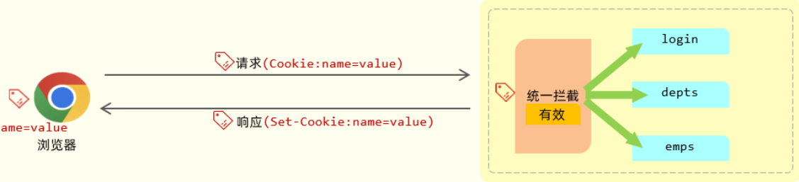

## 开发规范

[概述 - 飞书云文档](https://heuqqdmbyk.feishu.cn/wiki/LYVswfK4eigRIhkW0pvcqgH9nWd)

### 前后端分离开发

需求分析----接口设计-----前后端并行开发-----测试-----联调

### Restful

风格： URL定义资源，HTTP动词描述操作

GET 查询用户

DELETE 删除用户

POST 新增用户

PUT 修改用户

### Apifox

作用：接口文档测试、接口请求测试、Mock服务

官网：https://apifox.com/

### 工程搭建

创建SpringBoot工程，引入Mybatis,mysql驱动，lombok

创建数据库表dept,yml配置信息

引入实体类Dept及统一响应结果封装类Result

控制层

```
@RestController
public class DeptController {
    @Autowired
    private DeptService deptService;
//    @RequestMapping(value = "/depts",method = RequestMethod.GET)
    @GetMapping("/depts")
    public Result list(){
        System.out.println("查询全部部门的数据");
        List<Dept> deptList= deptService.findAll();
        return Result.success(deptList);
    }
}
```

数据访问

```
@Mapper
public interface DeptMapper {
    //查询所有的部门数据
    @Select("select id,name,create_time,update_time from dept order by update_time desc")
    List<Dept> findAll();
}
```

业务层

```
@Service
public class DeptServiceImpl implements DeptService {
    @Autowired
    private DeptMapper deptMapper;
    @Override
    public List<Dept> findAll() {
        return deptMapper.findAll();

    }
}
@Mapper
public interface DeptMapper {
    //查询所有的部门数据
    @Select("select id,name,create_time,update_time from dept order by update_time desc")
    List<Dept> findAll();
}
```

### 数据封装

数据库中的属性名和实体类的属性名一致时才能进行封装

#### 手动结果映射（通过@Results和@Result）

```
@Results({
        @Result(column = "create_time",property = "createTime"),
        @Result(column = "update_time",property = "updateTime")
})
```

#### 起别名

#### YML修改驼峰命名

```
map-underscore-to-camel-case: true
```

### 前后端联调测试

前端通过给nginx代理服务器发送请求，nginx将请求发给后端服务器，将响应得到的数据传给前端

安全，灵活，负载均衡

## 部门管理

### 删除部门

```
@DeleteMapping("/depts")
public Result delete(@RequestParam("id") Integer deptId){
    System.out.println("根据ID删除部门："+deptId);
    return  Result.success();
}
```

```
@DeleteMapping("/depts")
public Result delete(Integer id){
    System.out.println("根据ID删除部门："+id);
    return  Result.success();
}
```

### 新增部门

请求为POST

接收json格式的请求参数时直接声明对象类型

@RequestBody将json格式数据封装进实体类中

```
@PostMapping("/depts")
public Result Add(@RequestBody Dept dept){
    System.out.println("新增部门名称："+dept);
    deptService.Adddept(dept);
    return Result.success();
}
```

```
@Override
public void Adddept(Dept dept) {
    //补全基础属性-CreatTime,updateTime
    dept.setCreateTime(LocalDateTime.now());
    dept.setUpdateTime(LocalDateTime.now());

    deptMapper.Adddept(dept);
}
```

```
@Insert("insert into dept(name, create_time, update_time) values (#{name},#{createTime},#{updateTime})")
void Adddept(Dept dept);
```

### 查询部门

```
@GetMapping("/{id}")
public Result select(@PathVariable Integer id){
    System.out.println("查询部门id："+id);
    Dept dept=deptService.select(id);
    dept.setUpdateTime(LocalDateTime.now());
    return Result.success(dept);

}
```

### 修改部门

```
@PutMapping
public Result update(@RequestBody Dept dept){
    System.out.println("修改部门:"+dept);
    deptService.update(dept);
    return  Result.success();
}
```

## 员工管理

### 分页查询

controller

```
@RequestMapping("/emps")
@Slf4j
@RestController
public class EmpController {
    @Autowired
    private EmpService empService;


    @GetMapping
    public Result page(@RequestParam(defaultValue = "1") Integer page,@RequestParam(defaultValue = "10") Integer pageSize){
        log.info("分页查询:{},{}",page,pageSize);
        PageResult<Emp> pageResult=empService.page(page,pageSize);
        return Result.success(pageResult);
    }
}
```

service

```
@Service
public class EmpServiceImpl implements EmpService {
    @Autowired
    private Empmapper empmapper;
    @Override
    public PageResult<Emp> page(Integer page, Integer pageSize) {
        Long total = empmapper.count();
        Integer star=(page-1)*pageSize;
        List<Emp> list= empmapper.list(star,pageSize);

        return new PageResult<Emp>(total,list);
    }
}
```

```
public interface EmpService {
    PageResult<Emp> page(Integer page, Integer pageSize);
}
```

mapper

```
//操作员工信息
@Mapper
public interface Empmapper {
    @Select("select count(*) from emp left join dept on emp.dept_id=dept.id ")
    public long count();
    @Select("select emp.*,dept.name deptName from emp left join  dept on emp.dept_id = dept.id order by emp.update_time desc limit #{start},#{pageSize} ")
    public List<Emp> list(Integer start,Integer pageSize);
}
```

### PageHelper

依赖

```
<dependency>
    <groupId>com.github.pagehelper</groupId>
    <artifactId>pagehelper-spring-boot-starter</artifactId>
    <version>1.4.7</version>
</dependency>
```

#### 1. 拦截查询

java

```
PageHelper.startPage(page, pageSize);
List<Emp> empList = empmapper.list();
```


当调用 `PageHelper.startPage()` 时，PageHelper 会在 **ThreadLocal** 中设置分页参数。

#### 2. 拦截器包装结果

MyBatis 执行查询时，PageHelper 的拦截器会：

- 拦截执行的 SQL
- 自动添加分页语句（如 LIMIT）
- 执行 count 查询获取总数
- 将结果包装成 `Page` 对象

#### 3. 返回 Page 实现类

实际上返回的 `empList` 并不是普通的 ArrayList，而是 PageHelper 内部实现的 `Page` 对象：

java

```
// PageHelper 内部实现类似这样
public class Page<E> extends ArrayList<E> implements Serializable {
    private static final long serialVersionUID = 1L;
    private int pageNum;     // 当前页
    private int pageSize;    // 每页大小
    private long total;      // 总记录数
    private int pages;       // 总页数
    
    // 其他分页相关方法和属性...
}
```


#### 为什么能强转成功？

```
Page<Emp> p = (Page<Emp>) empList;  // 强转成功
```

因为：

1. **继承关系**：`Page` 类继承了 `ArrayList`
2. **实际类型**：`empList` 的实际运行时类型是 `Page`，不是普通的 `ArrayList`
3. **多态特性**：Java 的多态机制允许这样的向下转型

### 动态SQL

<if>:判断条件是否成立，如果条件为TRUE，则拼接SQL

<where>

- 如果所有条件都为空：`WHERE` 关键字会被自动移除

- 如果第一个条件为空：开头的 `AND` 会被自动移除

  好处：保证数据传输时的完整性，如果只传输了姓名，其他数据可以保留
  
  减少了执行的次数
  
  ```
  <?xml version="1.0" encoding="UTF-8" ?>
  <!DOCTYPE mapper
          PUBLIC "-//mybatis.org//DTD Mapper 3.0//EN"
          "http://mybatis.org/dtd/mybatis-3-mapper.dtd">
  <mapper namespace="org.example.mapper.Empmapper">
      <select id="list" resultType="org.example.pojo.Emp">
          select emp.*,dept.name deptName from emp left join  dept on emp.dept_id = dept.id
          <where>
              <if test="name !=null and name !=''">
                  emp.name like concat('%',#{name},'%')
              </if>
            <if test="gender !=null">
                and emp.gender=#{gender}
            </if>
            <if test="begin !=null and end !=null">
                and emp.entry_date between #{begin} and #{end}
            </if>
          </where>
           order by emp.update_time desc
      </select>
  
  </mapper>
  ```

### 增加员工

```
@Options(useGeneratedKeys = true,keyProperty = "id")//获取到生成的主键
```

service

```
@Override
public void save(Emp emp) {
    //保存员工的基本信息
    emp.setCreateTime(LocalDateTime.now());
    emp.setCreateTime(LocalDateTime.now());
    empmapper.insert(emp);

    //保存员工工作经历信息
    List<EmpExpr> exprList=emp.getEmpExpr();
    if(!CollectionUtils.isEmpty(exprList)){
        //遍历集合，为ID赋值
        exprList.forEach(empExpr -> {
            empExpr.setEmpId(emp.getId());
        });
        empExprMapper.insert(exprList);
    }

}
```

xml文件

```
<?xml version="1.0" encoding="UTF-8" ?>
<!DOCTYPE mapper
        PUBLIC "-//mybatis.org//DTD Mapper 3.0//EN"
        "http://mybatis.org/dtd/mybatis-3-mapper.dtd">
<mapper namespace="org.example.mapper.EmpExprMapper">
    <insert id="insertBatch">
        insert into emp_expr(emp_id, begin, end, company, job) values
        <foreach collection="exprList" item="expr" separator=",">
            (#{expr.empId},#{expr.begin},#{expr.end},#{expr.company},#{expr.job})
        </foreach>
    </insert>

</mapper>
```

### 文件上传

前端文件上传三要素：method,enctype,type

```
<form action="/upload" method="post" enctype="multipart/form-data">
    姓名: <input type="text" name="name"><br>
    年龄: <input type="text" name="age"><br>
    头像: <input type="file" name="file"><br>
    <input type="submit" value="提交">
</form>
```

yml配置文件上传大小（spring下）

```
servlet:
  multipart:
    #最大单个文件大小
    max-file-size: 10MB
    #最大请求文件大小
    max-request-size: 100MB
```

文件上传，服务器接收请求参数，将文件放置在规定目录下，但是如果不对文件进行保存，程序结束后会被删除

```
@PostMapping("/upload")
public Result upload(String name, Integer age, MultipartFile file) throws IOException {
    log.info("接收到的参数：{},{},{}",name,age,file);
    //保存文件
    String originalFileName=file.getOriginalFilename();

    //新的文件名
    String extension=originalFileName.substring(originalFileName.lastIndexOf("."));
    String  newFileName= UUID.randomUUID().toString()+extension;
    file.transferTo(new File("D:/image/"+newFileName));
    return Result.success();
}
```

### 

```xml
<dependency>
    <groupId>javax.xml.bind</groupId>
    <artifactId>jaxb-api</artifactId>
    <version>2.3.1</version>
</dependency>
<dependency>
    <groupId>javax.activation</groupId>
    <artifactId>activation</artifactId>
    <version>1.1.1</version>
</dependency>
<!-- no more than 2.3.3-->
<dependency>
    <groupId>org.glassfish.jaxb</groupId>
    <artifactId>jaxb-runtime</artifactId>
    <version>2.3.3</version>
</dependency>
```

```xml
<dependency>
    <groupId>com.aliyun.oss</groupId>
    <artifactId>aliyun-sdk-oss</artifactId>
    <version>3.17.4</version>
</dependency>
```

文件上传阿里云

```
@PostMapping("/upload")
public Result upload(MultipartFile file) throws Exception {
    log.info("文件上传：{}",file.getOriginalFilename());
    //将文件交给OSS管理
    String url=aliyunOSSOperator.upload(file.getBytes(),file.getOriginalFilename());
    log.info("文件上传OSS：url:{}",url);

    return Result.success(url);
}
```

工具类（@Value注解 第一种方法）

```
@Component
public class AliyunOSSOperator {

    @Value("${aliyun.oss.endpoint}")
    private String endpoint;
    @Value("${aliyun.oss.bucketName}")
    private String bucketName ;
    @Value("${aliyun.oss.region}")
    private String region;

    public String upload(byte[] content, String originalFilename) throws Exception {
        // 从环境变量中获取访问凭证。运行本代码示例之前，请确保已设置环境变量OSS_ACCESS_KEY_ID和OSS_ACCESS_KEY_SECRET。
        EnvironmentVariableCredentialsProvider credentialsProvider = CredentialsProviderFactory.newEnvironmentVariableCredentialsProvider();

        // 填写Object完整路径，例如202406/1.png。Object完整路径中不能包含Bucket名称。
        //获取当前系统日期的字符串,格式为 yyyy/MM
        String dir = LocalDate.now().format(DateTimeFormatter.ofPattern("yyyy/MM"));
        //生成一个新的不重复的文件名
        String newFileName = UUID.randomUUID() + originalFilename.substring(originalFilename.lastIndexOf("."));
        String objectName = dir + "/" + newFileName;

        // 创建OSSClient实例。
        ClientBuilderConfiguration clientBuilderConfiguration = new ClientBuilderConfiguration();
        clientBuilderConfiguration.setSignatureVersion(SignVersion.V4);
        OSS ossClient = OSSClientBuilder.create()
                .endpoint(endpoint)
                .credentialsProvider(credentialsProvider)
                .clientConfiguration(clientBuilderConfiguration)
                .region(region)
                .build();

        try {
            ossClient.putObject(bucketName, objectName, new ByteArrayInputStream(content));
        } finally {
            ossClient.shutdown();
        }

        return endpoint.split("//")[0] + "//" + bucketName + "." + endpoint.split("//")[1] + "/" + objectName;
    }

}
```

@ConfigurationProperties（第二种方法）

```
@Data
@Component
@ConfigurationProperties(prefix = "aliyun.oss")
public class AliyunOSSProperities {
    private String endpoint;
    private String bucketName;
    private String region;

}
```

在工具类中注入该类

### 删除员工

Service层

```
@Transactional(rollbackFor = {Exception.class})
@Override
public void delete(Integer[] ids) {
    //批量删除员工基本信息
    empmapper.delete(ids);

    //批量删除员工的工作经历信息
    empExprMapper.deleteEmpIds(ids);
}
```

mapper对应xml文件 删除员工经历同理

```
<delete id="delete">
    delete from emp where id in
    <foreach collection="ids" item="id" separator="," open="(" close=")">
        #{id}
    </foreach>
</delete>
```

### 编辑员工

根据ID查询时实体类中有封装的员工经历的List集合必须手动映射

使用resultMap进行映射

```
<resultMap id="empResultMap" type="org.example.pojo.Emp">
    <id column="id" property="id"/>
    <result column="username" property="username"/>
    <result column="password" property="password"/>
    <result column="name" property="name"/>
    <result column="gender" property="gender"/>
    <result column="phone" property="phone"/>
    <result column="job" property="job"/>
    <result column="salary" property="salary" />
    <result column="image" property="image"/>
    <result column="entry_date" property="entryDate"/>
    <result column="dept_id" property="deptId"/>
    <result column="create_time" property="createTime"/>
    <result column="update_time" property="updateTime"/>

    <collection property="exprList" ofType="org.example.pojo.EmpExpr">
        <id column="ee_id" property="id"/>
        <result column="ee_empid" property="empId"/>
        <result column="ee_begin" property="begin"/>
        <result column="ee_end" property="end"/>
        <result column="ee_company" property="company"/>
        <result column="ee_job" property="job"/>
    </collection>
</resultMap>
<select id="getByID" resultMap="empResultMap">
    select
        e.*,
        ee.id ee_id,
        ee.emp_id ee_empid,
        ee.begin ee_begin,
        ee.end ee_end,
        ee.company ee_company,
        ee.job ee_job
    from emp e left join emp_expr ee on e.id=ee.emp_id
    where e.id=#{id}
</select>
```


修改员工的工作经历信息（先删除，再增加）

**Service层**

```
@Transactional(rollbackFor = Exception.class)
@Override
public void update(Emp emp) {
    //根据ID修改员工的基本信息
    emp.setUpdateTime(LocalDateTime.now());
    empmapper.updateById(emp);

    //根据ID修改员工的工作经历和信息
    //删除原来的工作经历
    Integer[] id={emp.getId()};
    empExprMapper.deleteEmpIds(id);

    //添加员工的工作经历
    List<EmpExpr> exprList=emp.getExprList();
    if(!CollectionUtils.isEmpty(exprList)){
        exprList.forEach(empExpr -> empExpr.setEmpId(emp.getId()));
        empExprMapper.insertBatch(exprList);
    }
}
```

**xml映射**（**动态更新**）

传递的数据可选择更新或者不更新

```
<update id="updateById">
        UPDATE emp
            <!--set标签会自动生成Set关键字，会自动更新字段多余的,-->
        <set>
            <if test="username != null and username != ''">
                username = #{username},
            </if>
            <if test="password != null and password != ''">
                password = #{password},
            </if>
            <if test="name != null and name != ''">
                name = #{name},
            </if>
            <if test="gender != null">
                gender = #{gender},
            </if>
            <if test="phone != null and phone != ''">
                phone = #{phone},
            </if>
            <if test="job != null">
                job = #{job},
            </if>
            <if test="salary != null">
                salary = #{salary},
            </if>
            <if test="image != null and image != ''">
                image = #{image},
            </if>
            <if test="entryDate != null">
                entry_date = #{entryDate},
            </if>
            <if test="deptId != null">
                dept_id = #{deptId},
            </if>
            <if test="updateTime != null">
                update_time = #{updateTime}
            </if>
        </set>
        WHERE id = #{id}
    </update>
```

### 全局异常处理器

@ExceptionHandler 注解对全局的异常进行捕捉

```
//全局异常处理器
@Slf4j
@RestControllerAdvice
public class GlobalExceptionHandler {
    @ExceptionHandler
    public Result handleException(Exception e){
        log.error("程序出错了！",e);
        return Result.error("出错了，请联系管理员");
    }
    @ExceptionHandler
    public Result handleDuplicateKeyException(DuplicateKeyException e)
        {
            log.error("程序出错了！",e);
            String message=e.getMessage();
            int i=message.indexOf("Duplicate entry");
            String errMsg=message.substring(i);
            String[] arr=errMsg.split(" ");
            return Result.error("【"+arr[2]+"】已存在");
        }
}
```

### 员工信息统计

实体类JobOption,两个List类型的成员变量，存放job和count

```
@Data
@AllArgsConstructor
@NoArgsConstructor
public class JobOption {
    private List jobList;
    private List dataList;
}
```

- 将job的数字转换为中文，并命名为pos，将每个职位对应的人数统计出来，放置num中，每行返回一个map对象
- Java 中通过 `map.get("pos")` 和 `map.get("num")` 访问

```
<select id="countEmpJobData" resultType="java.util.Map">
    SELECT
        (CASE
             WHEN job=1 THEN '班主任'
             WHEN job=2 THEN '讲师'
             WHEN job=3 THEN '学工主管'
             WHEN job=4 THEN '教研主管'
             WHEN job=5 THEN '咨询师'
             ELSE '其他'
            END) AS pos,
        COUNT(*) AS num
    FROM emp
    GROUP BY (CASE
                  WHEN job=1 THEN '班主任'
                  WHEN job=2 THEN '讲师'
                  WHEN job=3 THEN '学工主管'
                  WHEN job=4 THEN '教研主管'
                  WHEN job=5 THEN '咨询师'
                  ELSE '其他'
        END)
    ORDER BY num DESC
</select>
```

## 登录认证

### 登录功能

实体类loginInfo返回数据（用户名，密码，姓名，token）

```
@Override
public LoginInfo login(Emp emp) {
    //调用Mapper接口，根据用户名和密码查询员工信息
    Emp e=empmapper.loginSelectByUsernameAndPassword(emp);

    //判断是否存在员工，如果存在，则返回员工信息
    if(e!=null){
        log.info("登录成功,员工信息：{}",e);
        return new LoginInfo(e.getId(),e.getUsername(),e.getName(),"");
    }

    //不存在，返回null
    return null;
}
```


### 登录校验

会话：会话是和浏览器关联的，当有三个浏览器客户端和服务器建立了连接时，就会有三个会话。同一个浏览器在未关闭之前请求了多次服务器，这多次请求是属于同一个会话。比如：1、2、3这三个请求都是属于同一个会话。当我们关闭浏览器之后，这次会话就结束了。而如果我们是直接把web服务器关了，那么所有的会话就都结束了

会话跟踪：服务器会接收很多的请求，但是服务器是需要识别出这些请求是不是同一个浏览器发出来的。比如：1和2这两个请求是不是同一个浏览器发出来的，3和5这两个请求不是同一个浏览器发出来的。如果是同一个浏览器发出来的，就说明是同一个会话。如果是不同的浏览器发出来的，就说明是不同的会话。而识别多次请求是否来自于同一浏览器的过程，我们就称为会话跟踪。


为什么要共享数据呢？

由于HTTP是无状态协议，在后面请求中怎么拿到前一次请求生成的数据呢？此时就需要在一次会话的多次请求之间进行数据共享

#### Cookie

cookie 是客户端会话跟踪技术，它是存储在客户端浏览器的，我们使用 cookie 来跟踪会话，我们就可以在浏览器第一次发起请求来请求服务器的时候，我们在服务器端来设置一个cookie。

比如第一次请求了登录接口，登录接口执行完成之后，我们就可以设置一个cookie，在 cookie 当中我们就可以来存储用户相关的一些数据信息。比如我可以在 cookie 当中来存储当前登录用户的用户名，用户的ID。

服务器端在给客户端在响应数据的时候，会自动的将 cookie 响应给浏览器，浏览器接收到响应回来的 cookie 之后，会自动的将 cookie 的值存储在浏览器本地。接下来在后续的每一次请求当中，都会将浏览器本地所存储的 cookie 自动地携带到服务端。

接下来在服务端我们就可以获取到 cookie 的值。我们可以去判断一下这个 cookie 的值是否存在，如果不存在这个cookie，就说明客户端之前是没有访问登录接口的；如果存在 cookie 的值，就说明客户端之前已经登录完成了。这样我们就可以基于 cookie 在同一次会话的不同请求之间来共享数据。

我刚才在介绍流程的时候，用了 3 个自动：

服务器会 自动 的将 cookie 响应给浏览器。

浏览器接收到响应回来的数据之后，会 自动 的将 cookie 存储在浏览器本地。

在后续的请求当中，浏览器会 自动 的将 cookie 携带到服务器端。

为什么这一切都是自动化进行的？

是因为 cookie 它是 HTP 协议当中所支持的技术，而各大浏览器厂商都支持了这一标准。在 HTTP 协议官方给我们提供了一个响应头和请求头：

响应头 Set-Cookie ：设置Cookie数据的

请求头 Cookie：携带Cookie数据的
请求头：cookie：



HTTP请求包头包含存储先前通过与所述服务器发送的HTTP cookes Set-Cookie头（name=value，前面的name就是cookie的名称，后面的value就是cookie的值）

响应头：Set-Cookie：服务器向客户端发送，然后客户端就会获得一个Cookie，之后客户端的每一次请求就会自动的携带着这个Cookie给服务器


缺点：

- 无法跨域使用
- 用户可以自己禁用
- 移动端不能使用


#### Session

基于Cookie实现，传递数据的JSESSIONID，数据存储在服务器端，当前端进行请求的时候通过JSESSIONID拿取数据，响应数据

缺点：

- 服务器集群环境下无法直接使用Session
- 移动端APP(Android、IOS)中无法使用Cookie
- 用户可以自己禁用Cookie
- Cookie不能跨域


#### JWT令牌

组成：

header：记录令牌类型，签名算法

Payload：携带一些自定义的信息

signature：访问被篡改，保证安全性


#### Filter 过滤器

登录校验，统一编码处理，敏感字符处理

避免重复性工作，减少工作量

如果请求操作是合法的，一定要放行

```
@Slf4j
@WebFilter(urlPatterns = "/*")
public class TokenFilter implements Filter {
    @Override
    public void doFilter(ServletRequest servletRequest, ServletResponse servletResponse, FilterChain filterChain) throws IOException, ServletException {
        HttpServletRequest httpServletRequest=(HttpServletRequest) servletRequest;
        HttpServletResponse httpServletResponse=(HttpServletResponse) servletResponse;
        //获取请求路径
        String path = httpServletRequest.getRequestURI();

        //判断是否是登录请求
        if(path.contains("/login")){
            filterChain.doFilter(httpServletRequest,httpServletResponse);
            return;
        }
        //获取请求头中的Token
        String Token=httpServletRequest.getHeader("token");

        //检测Token是否为空
        if(Token==null|| Token.isEmpty()){
            log.info("令牌为空");
            httpServletResponse.setStatus(HttpServletResponse.SC_UNAUTHORIZED);
            return;
        }

        //校验Token是否出错
        try {
            JwtUtils.parseJWT(Token);

        } catch (Exception e) {
            log.info("令牌非法，响应401");
            httpServletResponse.setStatus(HttpServletResponse.SC_UNAUTHORIZED);
            return;
        }


        //放行
        log.info("令牌合格，放行");
        filterChain.doFilter(httpServletRequest,httpServletResponse);
    }
}
```

#### 拦截器

作用和Filter过滤器差不多，放行的操作是return true 

使用时先创建一个类，获取url的地址，对url地址进行校验，如果是登录请求，就放行；

获取token头

如果是其他请求需要检验token头是否为空，然后检验token头是否出错，如果不满足就返回false

否则返回true

最后需要创建一个配置类，注册拦截器

```
@Configuration
public class WebConfig implements WebMvcConfigurer {
//    @Autowired
//    private Interceptor interceptor;
    @Autowired
    private TokenInterceptor tokenInterceptor;
    @Override
    public void addInterceptors(InterceptorRegistry registry) {
        registry.addInterceptor(tokenInterceptor).addPathPatterns("/**");
    }
}
```

与Filter过滤器的区别：

拦截器只能拦截Spring环境下的资源，而过滤器可以拦截所有资源

**过滤器(Filter)是Servlet层面的标准，它拦截的是HTTP请求本身，因此可以作用于到达你应用的所有资源。而拦截器(Interceptor)是Spring MVC框架层面的，它只能拦截进入Spring MVC处理链路的请求。**

拦截器可以进行依赖注入，因为它是Spring管理的Bean,但是过滤器不能，因为它是由Servlet容器管理的


## 相关条目
- [[javaweb]]
- [[Mybatis-plus]]
