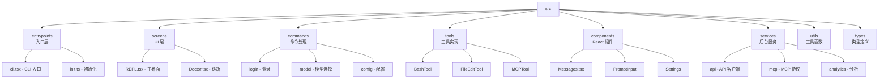

# 1-xiang-mu-gai-lan
Claude Code Best (CCB) 是一个基于终端的 AI 编程助手，它将 Anthropic 官方 Claude Code CLI 工具的核心功能进行了逆向还原与工程化重构。作为一个 terminal-native agentic system，它能够直接在你的项目目录中读取代码、修改文件、执行命令和调试程序，拥有完整的 shell 能力。

Sources: [README.md](#root/p0g3hAvrI4aA) [what-is-claude-code.mdx](#root/ZSHKW9WKpqoR)

## 什么是 Claude Code

Claude Code 不是传统的聊天机器人，而是一个智能编码系统。它运行在你的本地终端中，能够自主决策工具调用链，完成复杂的编程任务。理解其技术定位需要关注三个核心维度：

| 维度 | 含义 | 实际表现 |
| --- | --- | --- |
| **Terminal-native** | 原生 CLI 应用，不依赖 IDE 插件或 Web 界面 | 直接在终端中启动，拥有完整的 shell 访问权限 |
| **Agentic** | AI 自主决策工具调用链，非"一问一答"模式 | 根据任务自动选择工具，执行多步骤操作 |
| **Coding system** | 面向软件工程全流程，非通用问答工具 | 专攻代码编写、调试、重构等开发场景 |

与同类工具相比，Claude Code 在架构层面有着本质区别。Cursor 或 GitHub Copilot 属于 IDE 集成型，依赖 IDE API；ChatGPT 是云端聊天模式；而 Claude Code 则是真正的终端原生应用，能够执行任何你在终端中可以完成的操作。

Sources: [what-is-claude-code.mdx](#root/1K0gBrhJMqqt)

## 核心特性概览

Claude Code V5 版本实现了大量企业级功能和工具扩展，主要包括：

| 功能类别 | 核心能力 | 技术实现 |
| --- | --- | --- |
| **基础编程** | 代码编辑、文件操作、命令执行 | 50+ 内置工具，包括 BashTool、FileEditTool 等 |
| **高级交互** | Voice Mode 语音模式、Buddy 陪伴助手 | 支持语音输入输出，可视化交互体验 |
| **远程控制** | Remote Control / Bridge Mode | 通过 WebSocket 实现远程会话管理 |
| **外部集成** | MCP 协议、OpenAI API 兼容、Chrome 浏览器控制 | 支持多种第三方服务集成 |
| **安全机制** | Auto Mode 自动模式、权限模型、沙箱隔离 | 多层安全防护，用户可控的执行策略 |
| **记忆系统** | Auto Dream 记忆整理、Project Memory | 自动上下文压缩与关键信息提取 |
| **开发者工具** | Debug 模式、Feature Flags、遥测上报 | 完整的开发与调试支持 |

Sources: [README.md](#root/Vsv7mTEwc6an)

## 五层架构设计

Claude Code 采用清晰的五层架构，每一层职责明确、边界分明  
 



| 层次 | 职责 | 核心模块 | 关键技术 |
| --- | --- | --- | --- |
| **交互层** | 终端 UI、用户输入、消息展示 | `src/screens/REPL.tsx` | React/Ink、PromptInput |
| **编排层** | 多轮对话、会话持久化、成本追踪 | `src/QueryEngine.ts` | QueryEngine、transcript 管理 |
| **核心循环层** | 发请求 → 拿响应 → 执行工具 → 循环 | `src/query.ts` | Agentic Loop、状态机 |
| **工具层** | AI 的"双手"——读写文件、执行命令 | `src/tools.ts` → `src/Tool.ts` | Tool 接口、MCP 协议 |
| **通信层** | 与 Claude API 的流式通信 | `src/services/api/claude.ts` | Streaming、多 Provider 支持 |

Sources: [architecture-overview.mdx](#root/h3JtoNmsLvjT)

## 项目结构解析

Claude Code 的源码组织采用模块化设计，主要目录结构如下：


  
 

| 目录 | 功能描述 | 关键文件 |
| --- | --- | --- |
| `src/entrypoints/` | 应用入口点 | `cli.tsx`、`init.ts` |
| `src/screens/` | 终端 UI 屏幕 | `REPL.tsx`、`ResumeConversation.tsx` |
| `src/commands/` | 斜杠命令实现 | `login`、`model`、`config` 等 |
| `src/tools/` | 工具实现 | `BashTool`、`FileEditTool`、`MCPTool` 等 |
| `src/components/` | React/Ink 组件 | `Messages.tsx`、`PromptInput`、`Settings` |
| `src/services/` | 后台服务 | `api/`、`mcp/`、`analytics/` |
| `src/utils/` | 工具函数 | `shell`、`git`、`context` 等 |
| `src/types/` | TypeScript 类型定义 | 全局类型、接口定义 |

Sources: [get\_dir\_structure](#dir_path-src) [main.tsx](#root/0BHW4s9ZEQ4w)

## 数据流与执行机制

当你在终端中输入一个编程任务时，Claude Code 会启动完整的 Agentic Loop 来处理：

sequenceDiagram

    participant U as 用户

    participant R as REPL

    participant Q as QueryEngine

    participant A as Agentic Loop

    participant T as Tools

    participant API as Claude API

    U->>R: 输入任务

    R->>Q: processUserInput()

    Q->>A: queryEngine.query()

    loop Agentic Loop

        A->>API: 发送请求（含上下文）

        API-->>A: 流式响应

        A->>A: 解析工具调用

        A->>T: 执行工具（并行/串行）

        T-->>A: 返回结果

        A->>A: 判断是否需要继续

    end

    A-->>R: 完成结果

    R-->>U: 展示输出

实际场景中的典型执行流程：修复 TypeScript 编译错误时，系统会依次执行查看报错 → 定位文件 → 搜索类型定义 → 修复代码 → 验证修复等步骤。每一步都是 AI 自主决策的，它会选择合适的工具、传递正确的参数、在适当时机停止。

Sources: [what-is-claude-code.mdx](#root/QAvEq65skso2) [architecture-overview.mdx](#root/MZS9RgMww73n)

## 技术栈与依赖

Claude Code 基于 Bun 运行时构建，采用现代化的技术栈：

| 技术类别 | 选型 | 用途 |
| --- | --- | --- |
| **运行时** | Bun >= 1.2.0 | JavaScript/TypeScript 运行环境 |
| **UI 框架** | React + Ink | 终端原生 UI 渲染 |
| **CLI 框架** | Commander.js | 命令行参数解析 |
| **工具库** | lodash-es | 通用工具函数 |
| **打包工具** | 自定义 build.ts | Code splitting 多文件打包 |

项目采用 Monorepo 架构，包含多个子包：

```
packages/
├── @ant/
│   ├── claude-for-chrome-mcp
│   ├── computer-use-input
│   ├── computer-use-mcp
│   └── computer-use-swift
├── audio-capture-napi
├── color-diff-napi
├── image-processor-napi
├── modifiers-napi
└── url-handler-napi
```

Sources: [package.json](#root/afcG186Yotny) [README.md](#root/h1Qvhu1WsWEG)

## 快速开始指南

### 环境要求

Claude Code 对环境有明确要求，确保使用最新版本的 Bun：

```
# 必须使用最新版本 Bun
bun upgrade
```

推荐的最低版本为 Bun >= 1.2.0，旧版本可能导致各种奇奇怪怪的 BUG。

Sources: [README.md](#root/AjCKUuV8M47c)

### 安装步骤

```
# 1. 克隆仓库
git clone https://github.com/claude-code-best/claude-code.git
cd claude-code

# 2. 安装依赖（国内用户建议使用代理）
bun install

# 3. 开发模式运行（看到版本号 888 说明正确）
bun run dev

# 4. 构建生产版本
bun run build
```

构建产物输出到 `dist/` 目录，包含入口文件 `dist/cli.js` 和约 450 个 chunk 文件。构建出的版本同时支持 Bun 和 Node.js 启动，可以直接发布到私有源使用。

Sources: [README.md](#root/Nc8Cy3r0z0zM)

### 初次配置

首次运行后，在 REPL 中输入 `/login` 命令进入登录配置界面。推荐选择 **Custom Platform** 选项，这样可以对接第三方 API 兼容服务（无需 Anthropic 官方账号），支持 OpenAI、GLM 等多种模型提供商。

Sources: [README.md](#root/rVnhQ8qBtD7D)

## 适用场景与优势

Claude Code 特别适合以下开发场景：

| 场景 | Claude Code 优势 | 传统方式局限 |
| --- | --- | --- |
| **代码重构** | 自动分析依赖关系，批量修改文件 | 手动操作，容易遗漏 |
| **调试复杂问题** | 自动执行命令、查看日志、定位错误 | 人工反复试验 |
| **编写测试** | 根据代码自动生成测试用例 | 需要手动编写 |
| **文档生成** | 从代码中提取信息生成文档 | 需要手动维护 |
| **自动化脚本** | 直接在终端执行和验证脚本 | 需要切换环境 |

Claude Code 的核心优势在于它拥有完整的 shell 访问权限，能够执行任何你在终端中可以完成的操作。这意味着它的能力边界几乎不受限，但也因此需要严格的安全机制来约束这些能力。

Sources: [what-is-claude-code.mdx](#root/0JChniHQzGEH)

## 学习路径建议

根据你的开发背景和需求，建议按照以下路径学习：

### 基础路径（推荐新手）

1.  [**快速开始**](2-kuai-su-kai-shi.md) - 完成环境配置和首次使用
2.  [**环境要求与安装**](3-huan-jing-yao-qiu-yu-an-zhuang.md) - 详细了解安装过程
3.  [**登录与平台配置**](4-deng-lu-yu-ping-tai-pei-zhi.md) - 配置 API 和模型
4.  [**五层架构设计**](6-wu-ceng-jia-gou-she-ji.md) - 理解系统架构

### 进阶路径（适合有经验的开发者）

1.  [**Agentic Loop 核心循环**](7-agentic-loop-he-xin-xun-huan.md) - 深入理解工作原理
2.  [**工具系统架构**](10-gong-ju-xi-tong-jia-gou.md) - 学习工具开发
3.  [**安全与权限机制**](15-quan-xian-mo-xing-yu-gui-ze-yin-qing.md) - 掌握安全模型
4.  [**自定义 Agents**](21-zi-ding-yi-agents.md) - 扩展系统能力

### 专业路径（适合高级用户）

1.  [**QueryEngine 编排机制**](8-queryengine-bian-pai-ji-zhi.md) - 源码级分析
2.  [**MCP 协议集成**](12-mcp-xie-yi-ji-cheng.md) - 开发 MCP 服务器
3.  [**Computer Use 电脑操控**](13-computer-use-dian-nao-cao-kong.md) - 高级自动化
4.  [**扩展与定制**](#%E6%89%A9%E5%B1%95%E4%B8%8E%E5%AE%9A%E5%88%B6) - 全面的定制化开发

## 下一步行动

现在你已经对 Claude Code 有了全面的了解，建议按以下顺序继续学习：

1.  如果你还没有安装，请先阅读 [快速开始](2-kuai-su-kai-shi.md) 完成环境配置
2.  如果已安装但需要配置，请参考 [登录与平台配置](4-deng-lu-yu-ping-tai-pei-zhi.md)
3.  如果想深入理解架构，请学习 [五层架构设计](6-wu-ceng-jia-gou-she-ji.md)
4.  如果对核心机制感兴趣，请阅读 [Agentic Loop 核心循环](7-agentic-loop-he-xin-xun-huan.md)

Claude Code 是一个强大的 AI 编程助手，掌握它的使用将极大提升你的开发效率。从基础配置到深入理解架构，每一步都是成为 AI 辅助编程专家的重要里程碑。

## 相关条目
- [[2-kuai-su-kai-shi]]
- [[6-wu-ceng-jia-gou-she-ji]]
- [[10-gong-ju-xi-tong-jia-gou]]
