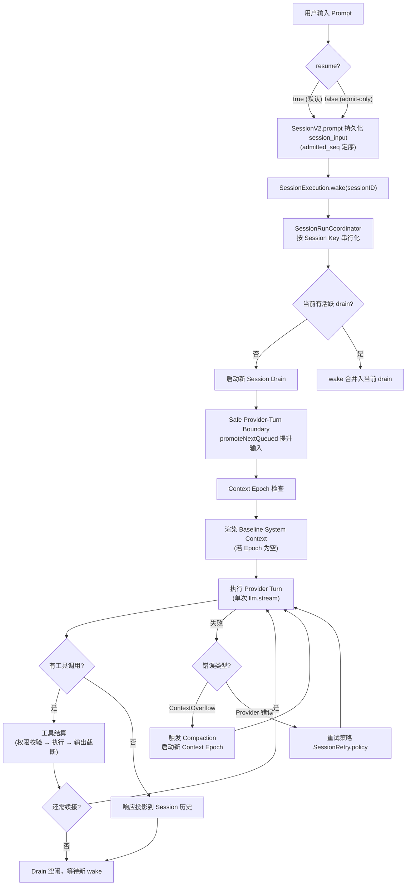
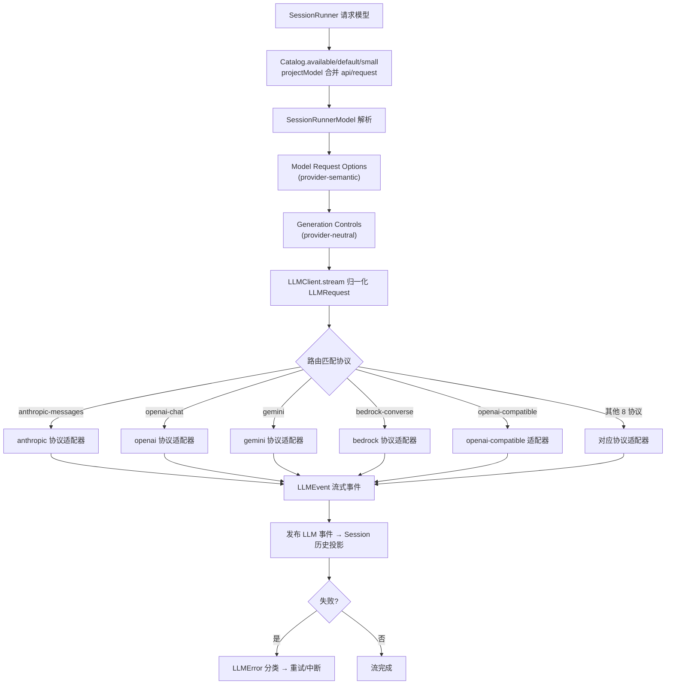
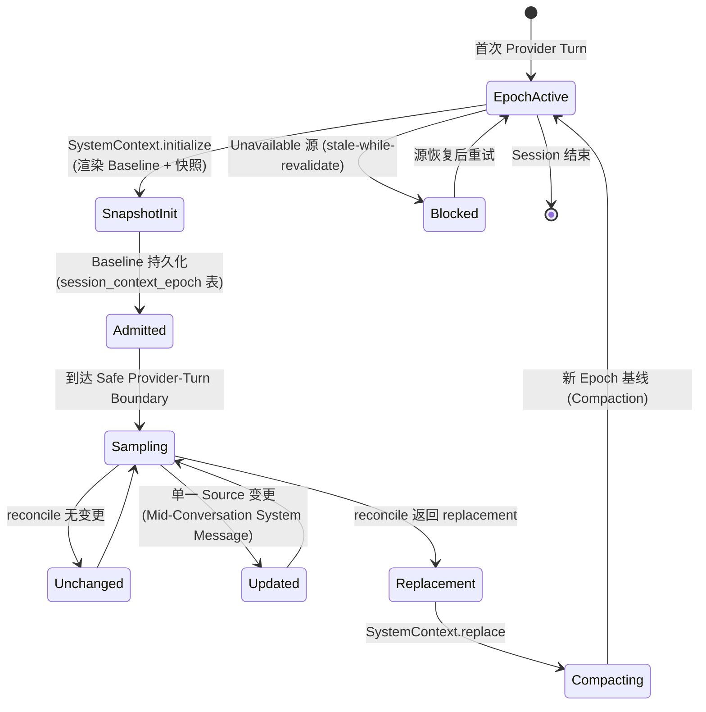
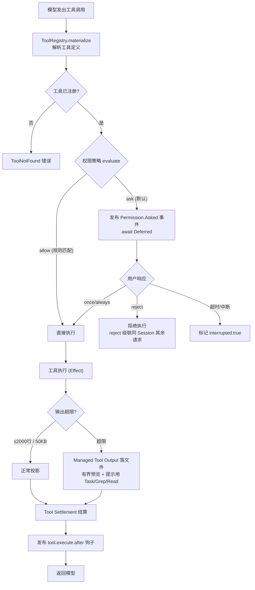
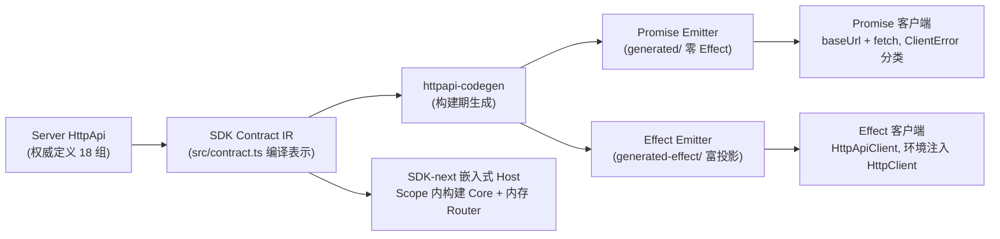
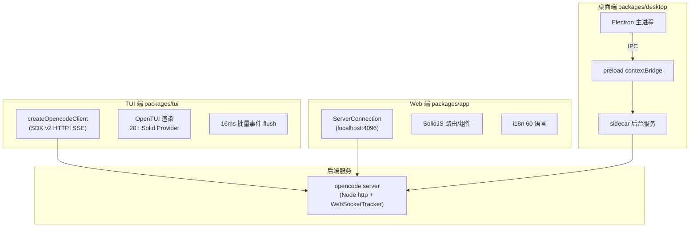

# 业务流程梳理

> 六大业务领域流程详解 · 含分支/回退/容错路径
>
> 📑 返回索引：[项目文档索引](项目文档索引.md)

## 领域总览

| # | 领域 | 所属模块 | 核心入口 |
|---|------|---------|---------|
| 1 | 会话编排 | opencode + core | SessionV2.prompt / SessionRunner |
| 2 | LLM Provider 适配 | llm + opencode | LLMClient.stream / Provider.Definition |
| 3 | 上下文管理 | core | SystemContextRegistry / ContextEpoch |
| 4 | 工具与权限 | opencode + core | ToolRegistry / Permission |
| 5 | 客户端 SDK | client + sdk-next | HttpApi 代码生成 / OpenCode.create |
| 6 | 跨端交付 | tui + app + desktop | createOpencodeClient / ServerConnection |

---

## 领域一：会话编排业务

### 1.1 Prompt 准入与执行流程（核心链路）

**图 1：Prompt 准入 → Drain 执行 → 工具结算主链路（含失败/压缩/续接分支）**

### 1.2 相关实体与触发条件

| 概念 | 实体/文件 | 触发条件 | 输出 |
|------|----------|---------|------|
| Admitted Prompt | `session_input` 表，`SessionInput.admit` | 用户提交 Prompt | durable seq 定序的待处理输入 |
| Prompt Promotion | `SessionInput.promoteNextQueued` | Safe Provider-Turn Boundary | promoted_seq 推进 + 用户消息入历史 |
| Session Drain | `SessionExecution` / `run-coordinator.ts` | wake 且有未提升输入 | 进程本地执行段（无持久身份） |
| Interrupt | `SessionExecution.interrupt` | 用户中断 / 工具拒绝 | tool_use 标 interrupted:true，finalize 中断态 |
| Compaction | `SessionCompaction` / `session/compaction.ts` | ContextOverflow / 溢出自动创建压缩任务 | 新 Context Epoch + 压缩历史 |

> **跨模块数据流向**：opencode CLI → server handlers → SessionV2（core）→ SessionRunner → llm + tool + system-context → EventV2 → SQLite。

---

## 领域二：LLM Provider 适配业务

### 2.1 模型选择与流式输出流程

**图 2：模型路由与协议适配（多路分支按 Route 协议分发）**

### 2.2 工具调用链路

模型返回工具调用 → `ToolRuntime.dispatch(tools, call)` 按"解码 → 执行 → 编码"三步处理，产出 `LLMEvent.toolResult / toolError`。跨协议统一：`generateObject` 通过强制合成工具 `generate_object` 实现，无需每个协议单独实现结构化输出。

| 环节 | 实现 | 文件 |
|------|------|------|
| 统一入口 | generate / stream / request | `packages/llm/src/llm.ts` |
| 协议路由 | Route{id, protocol, endpoint, auth, transport} | `packages/llm/src/route/` |
| 工具分发 | ToolRuntime.dispatch | `packages/llm/src/tool-runtime.ts` |
| 缓存策略 | applyCachePolicy（仅 RESPECTS_INLINE_HINTS 协议生效） | `packages/llm/src/cache-policy.ts` |

---

## 领域三：上下文管理业务

### 3.1 Context Epoch 生命周期

**图 3：Context Epoch 状态流转（含增量更新、替换、压缩、容错分支）**

### 3.2 内置 Context Source

| Source | Key | 说明 |
|--------|-----|------|
| core/environment | 环境信息 | 系统环境上下文 |
| core/date | 当前日期 | 日历日期（保留 host-local 行为） |
| AGENTS.md 指令 | instruction 聚合 | 全局 + 向上项目发现，有序聚合，变更发 Mid-Conversation Message |
| Skill 指引 | selected-agent skill | Agent 切换时更新，保留当前 Epoch 基线 |

---

## 领域四：工具与权限业务

### 4.1 工具执行与权限流程

**图 4：工具执行全链路（含权限三分支、拒绝级联、截断分支）**

### 4.2 内置工具清单

| 类别 | 工具 |
|------|------|
| 文件操作 | read / edit / write / patch |
| 检索 | glob / grep / search / fetch / todo |
| 执行 | shell / execute (code-mode) / task |
| 交互 | invalid / question / plan |
| 生态 | skill / lsp（实验性）/ websearch（特定 Provider） |

> 自定义工具扫描 `{tool,tools}/*.{js,ts}` 与插件工具；模型过滤：gpt 系用 apply_patch 否则 edit/write。

---

## 领域五：客户端 SDK 业务

### 5.1 代码生成与双客户端流程

**图 5：SDK 生成与消费链路**

### 5.2 关键设计

- **Page 分页**：`sessions.list()` 返回 `{data, cursor:{previous,next}}`，cursor 为 base64url JSON（SessionsCursor），不透明 branded 类型，跨查询复用非法
- **事件双通道**：`sessions.events({after})` 持久可回放流（SSE）vs `events.subscribe()` 实例级实时流（不可回放，断线显式失败）
- **嵌入式 Host**：`OpenCode.create` 在 Scope 内 Layer.buildWithMemoMap 构建 Core，createEmbeddedRoutes 生成 fetch 处理器，返回 `{...client, tools:{register}}`

---

## 领域六：跨端交付业务

### 6.1 三端通信架构

**图 6：多端通信拓扑（三端共用同一后端契约，SDK client 统一）**

### 6.2 各端要点

| 端 | 技术 | 关键文件 | 通信方式 |
|----|------|---------|---------|
| TUI | OpenTUI + SolidJS | `packages/tui/src/app.tsx` | SDK client HTTP + SSE |
| Web | SolidJS + Vite + Tailwind | `packages/app/src/context/server.tsx` | 本地服务器 localhost:4096 |
| Desktop | Electron | `packages/desktop/src/main/sidecar.ts` | sidecar 进程 + IPC bridge |
| Console | SolidStart + Cloudflare | `packages/console/app/` | 云服务（SST 部署） |

---

*由 opencode-project-analyzer skill 生成*
