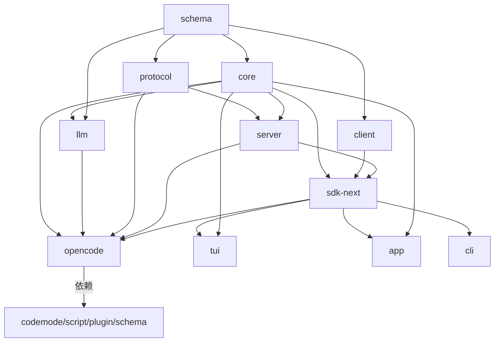

# 模块技术说明

> 各 workspace 包技术细节 · 职责/导出/核心文件/接口/依赖
>
> 📑 返回索引：[项目文档索引](项目文档索引.md)

## 1. @opencode-ai/schema（领域定义层）

**职责：** 全部领域记录的权威定义（Schema.Struct 纯数据，无运行时副作用）。

| 项 | 内容 |
|----|------|
| 核心导出 | Session / Agent / Catalog / Event 框架 / LLM / Location / Credential / Model / Project / Provider / Permission / Question / Pty / Workspace（28 个导出） |
| 关键文件 | `src/session.ts`、`agent.ts`、`event.ts`（define/versionedType/durable）、`event-manifest.ts`（ServerDefinitions）、`credential.ts`（OAuth/Key tagged union）、`model.ts` |
| 设计要点 | branded 类型（Session.ID）；命名空间风格导出；独立可发布（无 workspace 依赖，仅 effect） |
| 对外接口 | 被 client/core/protocol/server/llm/plugin 消费 |
| 依赖 | effect |

## 2. @opencode-ai/core（核心行为层）

| 项 | 内容 |
|----|------|
| 职责 | 领域行为：SessionV2 执行、EventV2 事件、Config、Database、Filesystem、Catalog、Credential、Provider/Tool/Agent 抽象 |
| 关键文件 | `src/session.ts`、`session/runner/llm.ts`、`session/run-coordinator.ts`、`session/context-epoch.ts`、`event.ts`、`config.ts`、`database/database.ts`、`system-context/index.ts`、`tool/tool.ts`、`catalog.ts`、`credential.ts` |
| Effect Service | SessionExecution / SessionRunCoordinator / SessionRunner / SessionStore / EventV2 / Config / Database / FileSystem / FileWatcher / AgentV2 / Catalog / Credential / SystemContextRegistry / ToolRegistry / PermissionV2 / ModelV2 / ProviderV2 / QuestionV2 / Location |
| 数据表 | session / message / part / todo / session_message / session_input / session_context_epoch / event / event_sequence / credential / project / project_directory / account / account_state / permission / session_share（17+ 表） |
| 依赖 | effect、drizzle-orm、zod、@ai-sdk/* 全系、llm、schema、plugin、effect-drizzle-sqlite、effect-sqlite-node |

## 3. @opencode-ai/llm（Provider 适配层）

| 项 | 内容 |
|----|------|
| 职责 | LLM Provider 统一抽象：generate/stream、协议适配、路由、工具运行时、缓存策略 |
| 关键文件 | `src/llm.ts`、`provider.ts`（Provider.Definition）、`route/`（Route/LLMClient）、`protocols/`（8 适配器：anthropic-messages/bedrock-converse/bedrock-event-stream/gemini/openai-chat/openai-compatible-chat/openai-responses/shared）、`tool-runtime.ts`、`cache-policy.ts` |
| 对外接口 | LLMClient.generate/stream；ToolRuntime.dispatch；applyCachePolicy；providers/ 11 个内置 Provider 定义 |
| 设计要点 | generateObject 用合成工具 generate_object 跨协议统一；CacheHint 编译期注入，仅 RESPECTS_INLINE_HINTS 协议生效 |
| 依赖 | schema、effect、aws4fetch、@smithy/* |

## 4. @opencode-ai/protocol（协议组合层）

| 项 | 内容 |
|----|------|
| 职责 | HttpApi 权威组合：路径/载荷/错误/游标/流式定义 |
| 关键文件 | `src/api.ts`（HttpApi.make("server")，18 组）、`errors.ts`（Schema.TaggedErrorClass + httpApiStatus）、`groups/`（agent/command/credential/event/fs/health/integration/location/message/model/permission/project-copy/provider/pty/question/reference/session/skill）、`middleware/`（authorization/schema-error） |
| 对外接口 | makeApi/makeDefaultApi 接收 locationMiddleware/sessionLocationMiddleware 注入 |
| 约束 | 不导入 core/server；Client 投影提供传输 key 并需证明与 Server 具体 API 等价 |
| 依赖 | schema、effect |

## 5. @opencode-ai/server（HTTP 服务器层）

| 项 | 内容 |
|----|------|
| 职责 | Hono 服务器：HttpApi 具体实现、处理器、中间件、PTY 环境 |
| 关键文件 | `src/api.ts`、`routes.ts`（HttpApiBuilder.layer + createRoutes/createEmbeddedRoutes）、`handlers.ts`（Layer.mergeAll 18 处理器）、`handlers/session.ts`（SessionsCursor 分页）、`middleware/`（authorization/schema-error/session-location）、`location.ts`、`pty-environment.ts` |
| 对外接口 | 18 组 HTTP API；Basic Auth（可选）；PTY ticket URL 跳过认证；嵌入式路由供 sdk-next |
| 设计要点 | LocationMiddleware 解析 workspace/directory header 或 query，兜底 process.cwd() |
| 依赖 | core、protocol、drizzle-orm、effect |

## 6. @opencode-ai/client（客户端层）

| 项 | 内容 |
|----|------|
| 职责 | 生成的 Promise + Effect 客户端 |
| 关键文件 | `src/contract.ts`（SDK Contract IR + endpointNames/omitEndpoints）、`generated/`（Promise emitter）、`generated-effect/`（Effect emitter）、`effect.ts`（/effect 重导出） |
| 对外接口 | 根导出（零 Effect Promise API）；/effect 导出（Effect 富投影）；Page 分页类型 |
| 约束 | 根导出不得有到 effect 的运行时路径；/effect 仅 import effect/schema/protocol；fs.read、pty.connect 被 omit |
| 依赖 | schema、protocol；dev: core/server/httpapi-codegen |

## 7. @opencode-ai/sdk-next（嵌入式 Host）

| 项 | 内容 |
|----|------|
| 职责 | 进程内组合 Client+Core+Server，提供嵌入式能力 |
| 关键文件 | `src/opencode.ts`（OpenCode.create）、`src/index.ts`（OpenCode/Tool 命名空间） |
| 对外接口 | OpenCode.create 返回 {...client, tools:{register}}；layer 暴露为 Context.Service |
| 设计要点 | Scope 内 Layer.buildWithMemoMap；createEmbeddedRoutes → fetch → FetchHttpClient；零网络 I/O |
| 依赖 | client、core、server、effect |

## 8. opencode（主入口/编排层）

| 项 | 内容 |
|----|------|
| 职责 | CLI 入口 + 会话编排 + 工具/MCP/LSP/插件/Agent/Skill/权限/Provider 集成 |
| 关键文件 | `src/index.ts`（21 命令）、`cli/bootstrap.ts`、`cli/cmd/run.ts`、`session/prompt.ts`（V1 SessionPrompt runLoop）、`session/processor.ts`、`session/compaction.ts`、`tool/registry.ts`、`tool/truncate.ts`、`mcp/index.ts`、`lsp/lsp.ts`、`plugin/index.ts`、`agent/agent.ts`、`skill/index.ts`、`permission/index.ts`、`provider/provider.ts`、`server/server.ts`、`project/project.ts`、`background/job.ts` |
| CLI 命令 | run/generate/account/providers/agent/upgrade/uninstall/serve/web/models/stats/export/import/github/pr/session/plug/db/acp/mcp/tui/attach/debug |
| 内置 Agent | build（默认 primary）、plan（只读）、general/explore（subagent）、compaction/title/summary（隐藏 primary） |
| 内置插件 | Codex/Copilot/Modal/GitLab/Poe/Cloudflare Workers/AI Gateway/Azure/DigitalOcean/XAI/SnowflakeCortex（11 个） |
| MCP | stdio / StreamableHTTP / SSE 传输；OAuth；状态机 connected/disabled/failed/needs_auth/needs_client_registration |
| 依赖 | codemode/llm/plugin/protocol/schema/script/sdk/server/tui + modelcontextprotocol/@opentui/*/solid-js |

## 9. @opencode-ai/plugin（插件框架）

| 项 | 内容 |
|----|------|
| v1 | `src/index.ts`：Plugin=(input,options)=>Hooks；hooks 含 event/config/tool/auth/provider、chat.message/params/headers、permission.ask、command.execute.before、tool.execute.before/after、shell.env 及 experimental.* |
| v2 | `src/v2/`：effect 原生 Plugin{id, effect(ctx)}、PluginContext{options,agent,aisdk,catalog,command,integration,plugin,reference,skill}、Registration{dispose}/Reload{reload}、subscribe(type)=>Stream；promise 版 define({id,setup}) + PluginDomain{add,remove} |
| 加载 | opencode 侧 loader.ts：Plan→Resolved→Loaded 三阶段，npm 按需安装重试 |
| 依赖 | sdk（v1） |

## 10. UI 三端（tui / app / desktop）

| 端 | 技术 | 关键文件 | 职责 |
|----|------|---------|------|
| tui | OpenTUI + SolidJS | `app.tsx`、`routes/`（home/session）、`context/sdk.tsx`、`component/dialog-*.tsx` | 终端界面；SDK client + SSE；16ms 批量 flush |
| app | SolidJS + Vite | `entry.tsx`、`pages/`、`context/server.tsx`、`i18n/`（60 语言） | Web 界面；localhost:4096 本地服务连接 |
| desktop | Electron | `main/server.ts`、`sidecar.ts`、`preload/index.ts`、`renderer/` | 桌面端（BETA）；sidecar 后台服务 + IPC |

## 11. 支撑包（支撑/工具性质）

| 包 | 定位 | 要点 |
|----|------|------|
| effect-sqlite-node | Effect SqlClient 的 node:sqlite 实现 | DatabaseSync、WAL、Semaphore 串行、事务、loadExtension |
| effect-drizzle-sqlite | drizzle-orm 的 Effect 驱动适配 | driver/session/migrator |
| httpapi-codegen | 构建期代码生成器 | 从 Effect HttpApi/Schema 契约生成 Promise/Effect 客户端 |
| http-recorder | HTTP/WebSocket 录制回放测试工具 | JSON cassettes |
| codemode | 受限代码执行 | Effect 原生，模型写 JS 调用宿主 schema 化工具 |
| slack | Slack bot 集成 | Socket Mode、threaded 对话 |
| cli | 独立 CLI 包（bin: lildax） | Effect 命令框架 + daemon 服务；与 opencode 包 CLI 并存 |
| console | 云控制台（目录组） | app（SolidStart）/core（drizzle+planetscale+stripe）/function（Cloudflare Workers）/support |
| web | 文档站 | Astro + Starlight，20+ locale，Cloudflare adapter |
| function | Cloudflare Worker 同步服务 | hono + Octokit + R2，SyncServer WebSocket |
| sdk（js/） | 旧版 JS SDK | openapi-codegen 生成；含 v2/ 子目录（新版） |
| containers | Docker 镜像构建 | base/bun-node/rust/tauri-linux/publish |
| enterprise | 企业版应用（定位不确定） | SolidStart 私有应用，build:cloudflare |
| identity | 品牌资源 | 仅 logo/mark.svg，无 package.json |

## 12. 模块依赖关系总览

**图 1：关键模块依赖图（workspace:* 引用）**

---

> 各包"对外接口"指公开导出与 HTTP 端点，非商业 API 定义。enterprise 包定位未在源码中明确，已标注【不确定】。

*由 opencode-project-analyzer skill 生成*
