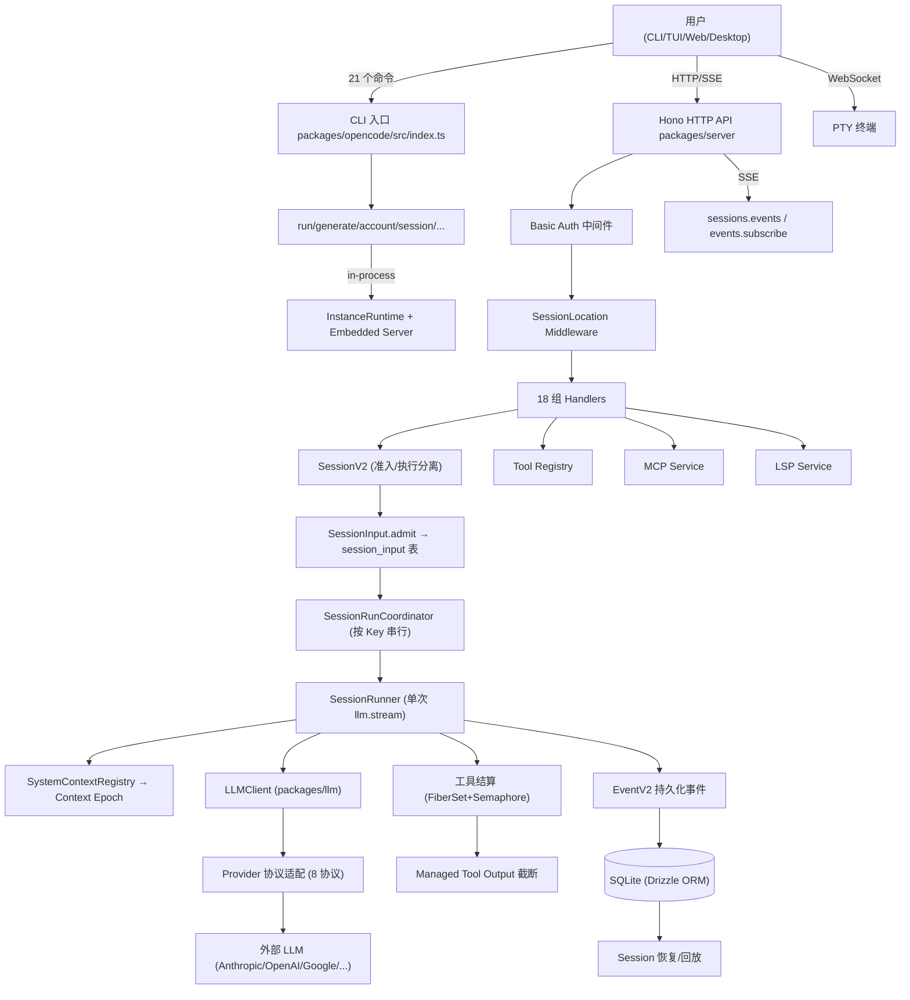
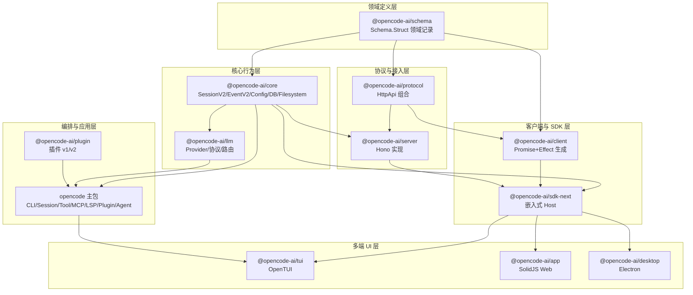

# 系统架构总览

> 数据流全景 · 模块划分 · 分层架构 · 技术栈 · 数据模型
>
> 📑 返回索引：[项目文档索引](项目文档索引.md)

## 一、系统全景数据流

**图 1：系统全景数据流**

## 二、模块全景图（workspace 包划分）

**图 2：模块全景与依赖关系**（方向符合 AGENTS.md 约束：Schema→Core/Protocol→Server；Client 不依赖 Core/Server）

## 三、分层架构说明

| 层 | 包 | 职责 | 关键约束 |
|----|-----|------|---------|
| 领域定义层 | `schema` | Schema.Struct 纯数据记录、事件定义、branded 类型 | 零运行时副作用，不触数据库/模型/执行 |
| 核心行为层 | `core`、`llm` | Session 执行、事件系统、配置、文件系统、Provider 适配 | 消费 schema；core 依赖 llm 及全部 @ai-sdk/* |
| 协议与接入层 | `protocol`、`server` | HttpApi 组合 + Hono 实现 + 中间件 | protocol 不导入 core/server；server 聚合两者 |
| 客户端与 SDK 层 | `client`、`sdk-next` | 生成客户端（根零 Effect）、嵌入式 Host | client 根导出禁 Effect；sdk-next 组合三方 |
| 编排与应用层 | `opencode`、`plugin` | CLI、会话编排、工具、MCP/LSP、插件、Agent/Skill | 继承全部下层能力 |
| 多端 UI 层 | `tui`、`app`、`desktop`、`console` | OpenTUI / SolidJS Web / Electron / 控制台 | 通过 SDK client 通信，不直接依赖 core/server 内部实现 |

## 四、技术栈清单

| 类别 | 技术 | 版本 | 用途 |
|------|------|------|------|
| 运行时 | Bun | 1.3.14 | 包管理器 + 运行时（Bun.file 等原生 API） |
| 函数式框架 | Effect | 4.0.0-beta.83 | Service/Layer/Scope/Stream/FiberSet/Schema |
| ORM / 数据库 | Drizzle ORM + effect-sqlite-bun | 1.0.0-rc.2 | SQLite 持久化（WAL 模式） |
| HTTP | Hono + hono-openapi | 4.10.7 | 服务器与 OpenAPI |
| AI SDK | ai（Vercel） | 6.0.168 | Provider 统一流式接口 + 20+ @ai-sdk/* Provider |
| 终端 UI | @opentui/core + @opentui/solid | 0.4.5 | TUI 渲染 |
| Web 前端 | SolidJS + Vite + Tailwind | 1.9.10 / 7.1.4 / 4.1.11 | Web 端 / 控制台 |
| 桌面端 | Electron | — | Desktop（BETA） |
| 文档站 | Astro + Starlight（packages/web） | — | opencode.ai/docs，MDX 多语言 |
| 部署 | SST v4（Cloudflare） | 4.13.1 | Worker/函数/数据湖部署 |
| 代码高亮 | Shiki | 4.2.0 | markdown-stream 渲染 |
| 校验 | Zod | 4.1.8 | Schema 输入校验 |
| 可观测 | @effect/opentelemetry + Sentry | — | 链路追踪 / Web 错误监控 |
| 构建编排 | turbo | 2.10.2 | typecheck/build/test 任务图 |
| 代码规范 | oxlint | 1.60.0 | lint（代替 eslint） |
| 测试 | @playwright/test + http-recorder | 1.59.1 | E2E / HTTP 录制回放 |

## 五、数据库核心数据表

| 表名 | 所属模块 | 核心字段（要点） | 用途 |
|------|---------|----------------|------|
| `session` | core/session | id, projectID, agent, model, location | 会话主表（V1） |
| `message` / `part` | core/session | 消息体与消息部件 | 会话消息（V1） |
| `todo` | core/session | 待办任务 | 任务清单 |
| `session_message` | core/session | 投影消息 | V2 投影消息 |
| `session_input` | core/session | admitted_seq, promoted_seq | Prompt 准入队列（V2 核心） |
| `session_context_epoch` | core/session | baseline, snapshot, baseline_seq | Context Epoch 持久化（V2 核心） |
| `event` / `event_sequence` | core/event | id, aggregate_id, seq, type, data | 持久化事件溯源 |
| `credential` | core/credential | value(JSON: key/OAuth) | 凭据管理 |
| `project` / `project_directory` | core/project | 项目与目录绑定 | 项目发现 |
| `permission` | core/permission | 规则集 | 权限持久化 |
| `session_share` | core/share | 分享会话 | 会话分享 |
| `account` / `account_state` | core/account | 账户与状态 | 账户体系 |
| `data_migration` | core/database | 迁移记录 | 自研迁移引擎状态 |

## 六、配置体系

### 配置层级与模块

- **配置层级**：global → project → `.opencode` 目录，`Config.entries()` 返回文档/目录（jsonc-parser 解析，含 V1 迁移）
- **配置子模块**：agent、attachments、command、compaction、experimental、formatter、lsp、markdown、mcp、plugin、provider、reference、tool-output、watcher
- **关键开关**：`experimental.continue_loop_on_deny`（权限拒绝后是否继续）、`config.tool_output`（截断覆盖）、`OPENCODE_DISABLE_PROJECT_CONFIG`、`OPENCODE_PURE`（关闭外部插件）、`OPENCODE_SERVER_PASSWORD`

---

*所有架构结论均基于源码与配置文件直接佐证；"未找到相关源码证据"的模块已在文档相应位置标注。*

*由 opencode-project-analyzer skill 生成*
