## [ 添加颜色](https://developer.android.com/codelabs/basic-android-kotlin-compose-material-theming?authuser=77&hl=zh-cn&continue=https%3A%2F%2Fdeveloper.android.com%2Fcourses%2Fpathways%2Fandroid-basics-compose-unit-3-pathway-3%3Fauthuser%3D77%26hl%3Dzh-cn%23codelab-https%3A%2F%2Fdeveloper.android.com%2Fcodelabs%2Fbasic-android-kotlin-compose-material-theming#3)

在 **Woof** 应用中，您首先要修改的就是配色方案。

配色方案是您的应用使用的颜色组合。不同的颜色组合会激发不同的心情，这会影响用户使用您的应用时的感受。

在 Android 系统中，颜色用十六进制颜色值表示。十六进制颜色代码以井号 (#) 字符开头，后跟六个字母和/或数字（代表该颜色的红色、绿色和蓝色 [RGB] 分量）。前两个字母/数字表示红色，后面的两个表示绿色，最后两个表示蓝色。

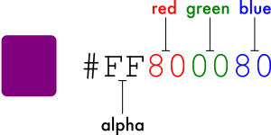

颜色还可以包含 Alpha 值（字母和/或数字），用于表示颜色的透明度（#00 表示不透明度为 0% [完全透明]，#FF 表示不透明度为 100% [完全不透明]）。若添加 alpha 值，则该值为井号 (#) 字符后的十六进制颜色代码的前两个字符。如果未添加 alpha 值，系统会假定它是 #FF，即 100% 不透明（完全不透明）。

以下是一些颜色及其十六进制值的示例。

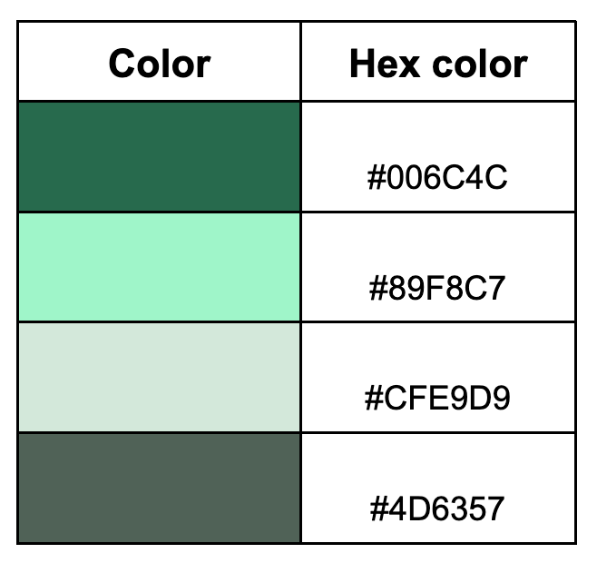

### 使用 Material Theme Builder 创建配色方案

为了创建应用的自定义配色方案，我们将使用 Material Theme Builder。

1. 点击[此处链接](https://m3.material.io/theme-builder#/custom)即可打开 Material Theme Builder。
2. 在左侧窗格中，您会看到“Core Colors”（核心颜色），然后点击“Primary”（主色）：

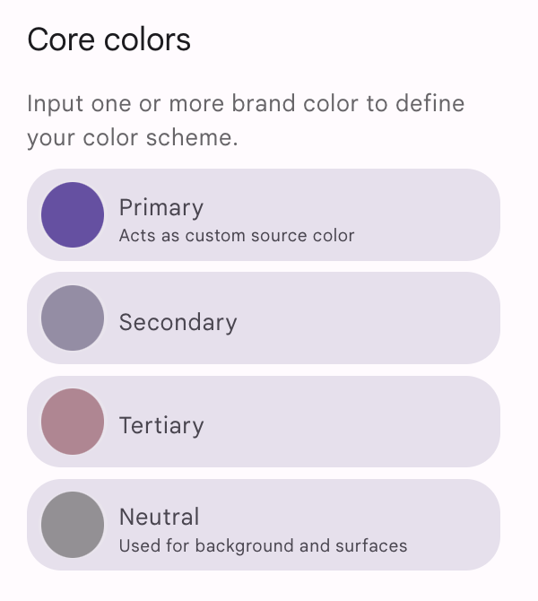

1. 系统会打开 HCT 颜色选择器。


1. 若要创建应用屏幕截图中显示的配色方案，您需要更改此颜色选择器中的主色。在文本框中，将当前文本替换为 **#006C4C**。这样，应用的主色就会变为绿色。


请注意这是如何将屏幕上的应用更新为采用绿色配色方案的。


1. 向下滚动页面，您会看到系统根据您输入的颜色生成的浅色和深色主题的完整配色方案。

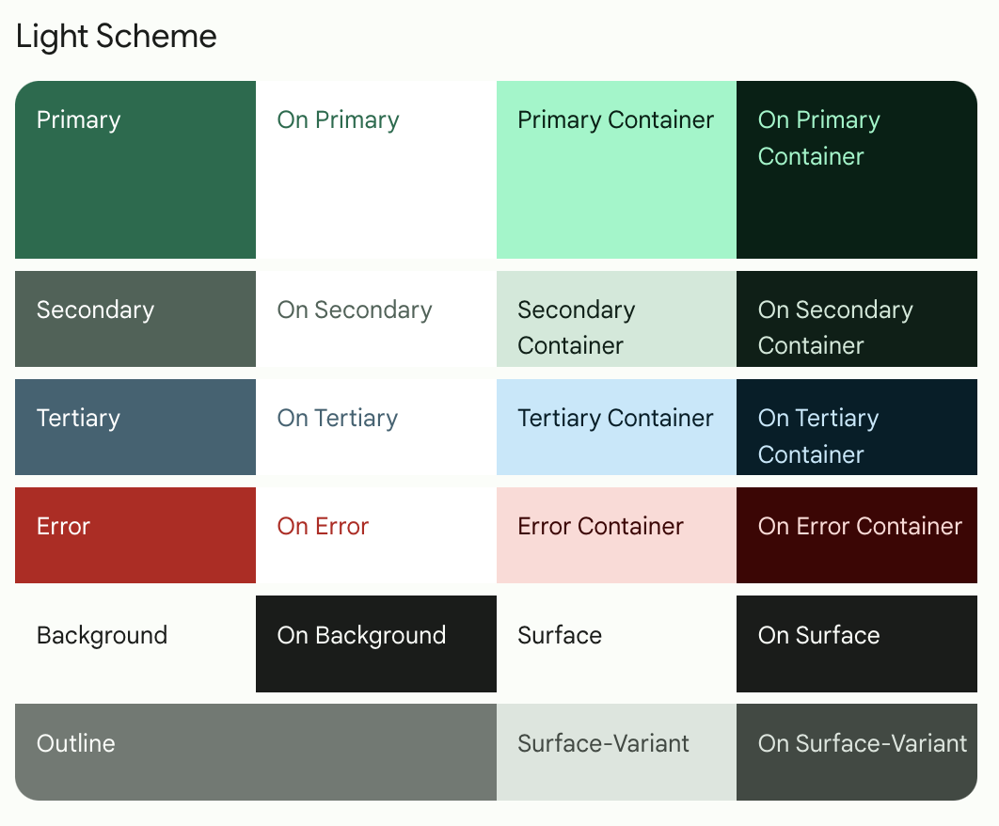

您可能想了解所有这些角色的含义及其使用方法，以下是其中几个主要角色：

- **primary**（主色）用于整个界面的关键组件。
- **secondary**（副色）用于界面中不太显眼的组件。
- **tertiary**（第三色）用于对比强调，可以平衡主色和副色，或者引起用户对某个元素（例如输入字段）的高度关注。
- **on** 颜色元素显示在调色板中其他颜色的**上层**，主要应用于文本、图标和描边。在调色板中，我们有一个 **onSurface** 颜色（显示在 **surface** 颜色的上层）和一个 **onPrimary** 颜色（显示在**主要**颜色的上层）。

有了这些槽可以实现统一的设计体系，相关组件的颜色也相似。

关于颜色的理论讲解到此为止 - 现在可以向应用中添加这个漂亮的调色板了！

### 向主题添加调色板

在 Material Theme Builder 页面上，您可以选择点击 **Export**（导出）按钮，以便下载 **Color.kt** 文件以及包含您在 Theme Builder 中所建自定义主题的 **Theme.kt** 文件。

这样一来，我们创建的自定义主题便会添加到您的应用中。不过，由于生成的 **Theme.kt** 文件不包含动态颜色的代码（稍后我们会在此 Codelab 中介绍），因此请将这些文件复制进来。

**注意**：如果您决定将通过 Material Theme Builder 生成的文件用于其他项目，则需要将软件包名称更新为对应项目的软件包名称。

1. 打开 **Color.kt** 文件，并将其内容替换为以下代码，以复制新的配色方案。

```
package com.example.woof.ui.theme

import androidx.compose.ui.graphics.Color

val md_theme_light_primary = Color(0xFF006C4C)
val md_theme_light_onPrimary = Color(0xFFFFFFFF)
val md_theme_light_primaryContainer = Color(0xFF89F8C7)
val md_theme_light_onPrimaryContainer = Color(0xFF002114)
val md_theme_light_secondary = Color(0xFF4D6357)
val md_theme_light_onSecondary = Color(0xFFFFFFFF)
val md_theme_light_secondaryContainer = Color(0xFFCFE9D9)
val md_theme_light_onSecondaryContainer = Color(0xFF092016)
val md_theme_light_tertiary = Color(0xFF3D6373)
val md_theme_light_onTertiary = Color(0xFFFFFFFF)
val md_theme_light_tertiaryContainer = Color(0xFFC1E8FB)
val md_theme_light_onTertiaryContainer = Color(0xFF001F29)
val md_theme_light_error = Color(0xFFBA1A1A)
val md_theme_light_errorContainer = Color(0xFFFFDAD6)
val md_theme_light_onError = Color(0xFFFFFFFF)
val md_theme_light_onErrorContainer = Color(0xFF410002)
val md_theme_light_background = Color(0xFFFBFDF9)
val md_theme_light_onBackground = Color(0xFF191C1A)
val md_theme_light_surface = Color(0xFFFBFDF9)
val md_theme_light_onSurface = Color(0xFF191C1A)
val md_theme_light_surfaceVariant = Color(0xFFDBE5DD)
val md_theme_light_onSurfaceVariant = Color(0xFF404943)
val md_theme_light_outline = Color(0xFF707973)
val md_theme_light_inverseOnSurface = Color(0xFFEFF1ED)
val md_theme_light_inverseSurface = Color(0xFF2E312F)
val md_theme_light_inversePrimary = Color(0xFF6CDBAC)
val md_theme_light_shadow = Color(0xFF000000)
val md_theme_light_surfaceTint = Color(0xFF006C4C)
val md_theme_light_outlineVariant = Color(0xFFBFC9C2)
val md_theme_light_scrim = Color(0xFF000000)

val md_theme_dark_primary = Color(0xFF6CDBAC)
val md_theme_dark_onPrimary = Color(0xFF003826)
val md_theme_dark_primaryContainer = Color(0xFF005138)
val md_theme_dark_onPrimaryContainer = Color(0xFF89F8C7)
val md_theme_dark_secondary = Color(0xFFB3CCBE)
val md_theme_dark_onSecondary = Color(0xFF1F352A)
val md_theme_dark_secondaryContainer = Color(0xFF354B40)
val md_theme_dark_onSecondaryContainer = Color(0xFFCFE9D9)
val md_theme_dark_tertiary = Color(0xFFA5CCDF)
val md_theme_dark_onTertiary = Color(0xFF073543)
val md_theme_dark_tertiaryContainer = Color(0xFF244C5B)
val md_theme_dark_onTertiaryContainer = Color(0xFFC1E8FB)
val md_theme_dark_error = Color(0xFFFFB4AB)
val md_theme_dark_errorContainer = Color(0xFF93000A)
val md_theme_dark_onError = Color(0xFF690005)
val md_theme_dark_onErrorContainer = Color(0xFFFFDAD6)
val md_theme_dark_background = Color(0xFF191C1A)
val md_theme_dark_onBackground = Color(0xFFE1E3DF)
val md_theme_dark_surface = Color(0xFF191C1A)
val md_theme_dark_onSurface = Color(0xFFE1E3DF)
val md_theme_dark_surfaceVariant = Color(0xFF404943)
val md_theme_dark_onSurfaceVariant = Color(0xFFBFC9C2)
val md_theme_dark_outline = Color(0xFF8A938C)
val md_theme_dark_inverseOnSurface = Color(0xFF191C1A)
val md_theme_dark_inverseSurface = Color(0xFFE1E3DF)
val md_theme_dark_inversePrimary = Color(0xFF006C4C)
val md_theme_dark_shadow = Color(0xFF000000)
val md_theme_dark_surfaceTint = Color(0xFF6CDBAC)
val md_theme_dark_outlineVariant = Color(0xFF404943)
val md_theme_dark_scrim = Color(0xFF000000)
```

1. 打开 **Theme.kt** 文件，并将其内容替换为以下代码，以为主题添加新的颜色。

```
package com.example.woof.ui.theme

import android.app.Activity
import android.os.Build
import android.view.View
import androidx.compose.foundation.isSystemInDarkTheme
import androidx.compose.material3.MaterialTheme
import androidx.compose.material3.darkColorScheme
import androidx.compose.material3.dynamicDarkColorScheme
import androidx.compose.material3.dynamicLightColorScheme
import androidx.compose.material3.lightColorScheme
import androidx.compose.runtime.Composable
import androidx.compose.runtime.SideEffect
import androidx.compose.ui.graphics.Color
import androidx.compose.ui.graphics.toArgb
import androidx.compose.ui.platform.LocalContext
import androidx.compose.ui.platform.LocalView
import androidx.core.view.WindowCompat

private val LightColors = lightColorScheme(
    primary = md_theme_light_primary,
    onPrimary = md_theme_light_onPrimary,
    primaryContainer = md_theme_light_primaryContainer,
    onPrimaryContainer = md_theme_light_onPrimaryContainer,
    secondary = md_theme_light_secondary,
    onSecondary = md_theme_light_onSecondary,
    secondaryContainer = md_theme_light_secondaryContainer,
    onSecondaryContainer = md_theme_light_onSecondaryContainer,
    tertiary = md_theme_light_tertiary,
    onTertiary = md_theme_light_onTertiary,
    tertiaryContainer = md_theme_light_tertiaryContainer,
    onTertiaryContainer = md_theme_light_onTertiaryContainer,
    error = md_theme_light_error,
    errorContainer = md_theme_light_errorContainer,
    onError = md_theme_light_onError,
    onErrorContainer = md_theme_light_onErrorContainer,
    background = md_theme_light_background,
    onBackground = md_theme_light_onBackground,
    surface = md_theme_light_surface,
    onSurface = md_theme_light_onSurface,
    surfaceVariant = md_theme_light_surfaceVariant,
    onSurfaceVariant = md_theme_light_onSurfaceVariant,
    outline = md_theme_light_outline,
    inverseOnSurface = md_theme_light_inverseOnSurface,
    inverseSurface = md_theme_light_inverseSurface,
    inversePrimary = md_theme_light_inversePrimary,
    surfaceTint = md_theme_light_surfaceTint,
    outlineVariant = md_theme_light_outlineVariant,
    scrim = md_theme_light_scrim,
)


private val DarkColors = darkColorScheme(
    primary = md_theme_dark_primary,
    onPrimary = md_theme_dark_onPrimary,
    primaryContainer = md_theme_dark_primaryContainer,
    onPrimaryContainer = md_theme_dark_onPrimaryContainer,
    secondary = md_theme_dark_secondary,
    onSecondary = md_theme_dark_onSecondary,
    secondaryContainer = md_theme_dark_secondaryContainer,
    onSecondaryContainer = md_theme_dark_onSecondaryContainer,
    tertiary = md_theme_dark_tertiary,
    onTertiary = md_theme_dark_onTertiary,
    tertiaryContainer = md_theme_dark_tertiaryContainer,
    onTertiaryContainer = md_theme_dark_onTertiaryContainer,
    error = md_theme_dark_error,
    errorContainer = md_theme_dark_errorContainer,
    onError = md_theme_dark_onError,
    onErrorContainer = md_theme_dark_onErrorContainer,
    background = md_theme_dark_background,
    onBackground = md_theme_dark_onBackground,
    surface = md_theme_dark_surface,
    onSurface = md_theme_dark_onSurface,
    surfaceVariant = md_theme_dark_surfaceVariant,
    onSurfaceVariant = md_theme_dark_onSurfaceVariant,
    outline = md_theme_dark_outline,
    inverseOnSurface = md_theme_dark_inverseOnSurface,
    inverseSurface = md_theme_dark_inverseSurface,
    inversePrimary = md_theme_dark_inversePrimary,
    surfaceTint = md_theme_dark_surfaceTint,
    outlineVariant = md_theme_dark_outlineVariant,
    scrim = md_theme_dark_scrim,
)

@Composable
fun WoofTheme(
    darkTheme: Boolean = isSystemInDarkTheme(),
    // Dynamic color is available on Android 12+
    dynamicColor: Boolean = false,
    content: @Composable () -> Unit
) {
    val colorScheme = when {
        dynamicColor && Build.VERSION.SDK_INT >= Build.VERSION_CODES.S -> {
            val context = LocalContext.current
            if (darkTheme) dynamicDarkColorScheme(context) else dynamicLightColorScheme(context)
        }

        darkTheme -> DarkColors
        else -> LightColors
    }
    val view = LocalView.current
    if (!view.isInEditMode) {
        SideEffect {
            setUpEdgeToEdge(view, darkTheme)
        }
    }

    MaterialTheme(
        colorScheme = colorScheme,
        shapes = Shapes,
        typography = Typography,
        content = content
    )
}

/**
 * Sets up edge-to-edge for the window of this [view]. The system icon colors are set to either
 * light or dark depending on whether the [darkTheme] is enabled or not.
 */
private fun setUpEdgeToEdge(view: View, darkTheme: Boolean) {
    val window = (view.context as Activity).window
    WindowCompat.setDecorFitsSystemWindows(window, false)
    window.statusBarColor = Color.Transparent.toArgb()
    val navigationBarColor = when {
        Build.VERSION.SDK_INT >= 29 -> Color.Transparent.toArgb()
        Build.VERSION.SDK_INT >= 26 -> Color(0xFF, 0xFF, 0xFF, 0x63).toArgb()
        // Min sdk version for this app is 24, this block is for SDK versions 24 and 25
        else -> Color(0x00, 0x00, 0x00, 0x50).toArgb()
    }
    window.navigationBarColor = navigationBarColor
    val controller = WindowCompat.getInsetsController(window, view)
    controller.isAppearanceLightStatusBars = !darkTheme
    controller.isAppearanceLightNavigationBars = !darkTheme
}
```

在 `WoofTheme()` 中，`colorScheme val` 使用了 `when` 语句

- 如果 `dynamicColor` 为 true，并且 build 版本为 S 或更高，则检查设备是否采用 `darkTheme`。
- 如果采用深色主题，`colorScheme` 会设为 `dynamicDarkColorScheme`。
- 如果没有采用深色主题，则会设为 `dynamicLightColorScheme`。
- 如果应用未使用 `dynamicColorScheme`，则检查该应用是否采用 `darkTheme`。如果采用，那么 `colorScheme` 会设为 `DarkColors`。
- 如果这两种情况都不是，则 `colorScheme` 会设为 `LightColors`。

复制进来的 **Theme.kt** 文件将 `dynamicColor` 设为了 false，而我们在使用的设备采用了浅色模式，因此 `colorScheme` 将设为 `LightColors`。

```
val colorScheme = when {
       dynamicColor && Build.VERSION.SDK_INT >= Build.VERSION_CODES.S -> {
           val context = LocalContext.current
           if (darkTheme) dynamicDarkColorScheme(context) else dynamicLightColorScheme(context)
       }

       darkTheme -> DarkColors
       else -> LightColors
   }
```

1. 重新运行应用，请注意，应用栏已自动更改颜色。


### 颜色映射

Material 组件会自动映射到颜色槽。整个界面中的其他关键组件（例如悬浮操作按钮）也默认为主色。也就是说，您无需为组件明确分配颜色；当您在应用中设置颜色主题时，它会自动映射到颜色槽。您可以通过在代码中明确设置颜色来覆盖此设置。您可以点击[此处](https://m3.material.io/styles/color/the-color-system/color-roles)，详细了解颜色角色。

在本部分中，我们将使用 `Card` 来封装包含 `DogIcon()` 和 `DogInformation()` 的 `Row`，以区分列表项的颜色与背景。

1. 在 `DogItem()` 可组合函数中，使用 `Card()` 封装 `Row()`。

```
Card() {
   Row(
       modifier = modifier
           .fillMaxWidth()
           .padding(dimensionResource(id = R.dimen.padding_small))
   ) {
       DogIcon(dog.imageResourceId)
       DogInformation(dog.name, dog.age)
   }
}
```

1. 由于 `Card` 现在是 `DogItem()` 中的第一个子级可组合项，因此请将 `DogItem()` 中的修饰符传递给 `Card`，并将 `Row` 的修饰符更新为 `Modifier` 的一个新实例。

```
Card(modifier = modifier) {
   Row(
       modifier = Modifier
           .fillMaxWidth()
           .padding(dimensionResource(id = R.dimen.padding_small))
   ) {
       DogIcon(dog.imageResourceId)
       DogInformation(dog.name, dog.age)
   }
}
```

1. 您可以查看 `WoofPreview()`。由于使用了 `Card` 可组合项，列表项现在已经自动更改了颜色。颜色看上去非常棒，但列表项之间没有间距。


### Dimens 文件

就像在应用中使用 **strings.xml** 存储字符串一样，使用名为 **dimens.xml** 的文件存储尺寸值也不失为一个好做法。这样做可以避免对值进行硬编码；就算需要，您也可以在一个地方集中做出更改。

依次点击 **app** > **res** > **values** > **dimens.xml**，然后查看该文件。这个文件存储了 `padding_small`、`padding_medium` 和 `image_size` 的尺寸值，而这些尺寸在整个应用中都会用到。

```
<resources>
   <dimen name="padding_small">8dp</dimen>
   <dimen name="padding_medium">16dp</dimen>
   <dimen name="image_size">64dp</dimen>
</resources>
```

如需从 **dimens.xml** 文件中添加值，请使用以下正确格式：


例如，要添加 `padding_small`，您可以传入 `dimensionResource(id = R.dimen.`*`padding_small`*`)`。

1. 在 `WoofApp()` 中，在对 `DogItem()` 的调用中添加带有 `padding_small` 的 `modifier`。

```
@Composable
fun WoofApp() {
    Scaffold { it ->
        LazyColumn(contentPadding = it) {
            items(dogs) {
                DogItem(
                    dog = it,
                    modifier = Modifier.padding(dimensionResource(R.dimen.padding_small))
                )
            }
        }
    }
}
```

在 `WoofPreview()` 中，列表项被更清晰地分隔开来。


### 深色主题

在 Android 系统中，可以选择将设备切换为深色主题。深色主题使用更暗、更柔和的颜色，并且：

- 可以大幅减少耗电量（具体取决于设备的屏幕技术）。
- 为弱视以及对强光敏感的用户提高可视性。
- 让所有人都可以在光线较暗的环境中更轻松地使用设备。

您的应用可以选择启用 [Force Dark](https://developer.android.com/guide/topics/ui/look-and-feel/darktheme?authuser=77&hl=zh-cn#force-dark)，这意味着系统会为您实现深色主题。不过，如果您实现深色主题，可为用户提供更好的体验，以便您继续完全控制应用主题。

在选择自己的深色主题时，请务必注意，深色主题的颜色必须符合[无障碍功能对比度标准](https://webaim.org/resources/contrastchecker/)。深色主题使用较深的界面颜色，且色彩强度有限。

### 在预览中查看深色主题

您在上一步中已经添加了深色主题的颜色。如需查看深色主题的实际效果，您需要向 **MainActivity.kt** 添加另一个 Preview 可组合项。这样，当您更改代码中的界面布局时，就能同时看到浅色主题和深色主题的预览效果。

1. 在 `WoofPreview()` 下，新建一个名为 `WoofDarkThemePreview()` 的函数，并为其添加 `@Preview` 和 `@Composable` 注解。

```
@Preview
@Composable
fun WoofDarkThemePreview() {

}
```

1. 在 `DarkThemePreview()` 内，添加 `WoofTheme()`。如果不添加 `WoofTheme()`，您将看不到我们在应用中添加的任何样式。将 `darkTheme` 参数设置为 **true**。

```
@Preview
@Composable
fun WoofDarkThemePreview() {
   WoofTheme(darkTheme = true) {

   }
}
```

1. 在 `WoofTheme()` 内调用 `WoofApp()`。

```
@Preview
@Composable
fun WoofDarkThemePreview() {
   WoofTheme(darkTheme = true) {
       WoofApp()
   }
}
```

## [添加形状](https://developer.android.com/codelabs/basic-android-kotlin-compose-material-theming?authuser=77&hl=zh-cn&continue=https%3A%2F%2Fdeveloper.android.com%2Fcourses%2Fpathways%2Fandroid-basics-compose-unit-3-pathway-3%3Fauthuser%3D77%26hl%3Dzh-cn%23codelab-https%3A%2F%2Fdeveloper.android.com%2Fcodelabs%2Fbasic-android-kotlin-compose-material-theming#4)

应用形状会给可组合项的外观和风格带来很大的变化。形状能够引导用户注意力、区别组件、传达状态以及呈现品牌风格。

许多形状都是使用 [`RoundedCornerShape`](https://developer.android.com/reference/kotlin/androidx/compose/foundation/shape/RoundedCornerShape?authuser=77&hl=zh-cn) 定义的，它所描述的是圆角矩形。传入的数字会定义角的圆度。如果使用 `RoundedCornerShape(0.dp)`，则矩形没有圆角；如果使用 `RoundedCornerShape(50.dp)`，角将变为完全圆形。

| 0.dp                                                         | 25.dp                                                        | 50.dp                                                        |
| ------------------------------------------------------------ | ------------------------------------------------------------ | ------------------------------------------------------------ |
|  | 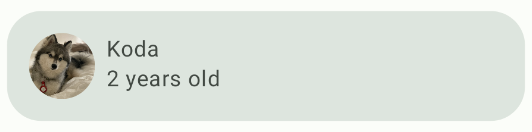 |  |

您还可以为每个角添加不同的圆角百分比，进一步自定义形状。尝试各种形状真是太有意思啦！

| 左上：50.dp 左下：25.dp 右上：0.dp 右下：15.dp               | 左上：15.dp 左下：50.dp 右上：50.dp 右下：15.dp              | 左上：0.dp 左下：50.dp 右上：0.dp 右下：50.dp                |
| ------------------------------------------------------------ | ------------------------------------------------------------ | ------------------------------------------------------------ |
| 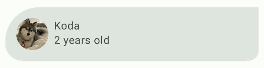 | 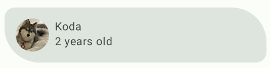 | 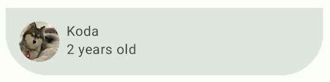 |

**Shape.kt** 文件用于定义 Compose 中组件的形状。组件分为三种类型：小、中和大。在本部分中，您将修改定义为 `medium` 大小的 `Card` 组件。系统会根据组件的大小将组件分组为[形状类别](https://m3.material.io/styles/shape/shape-scale-tokens#b09934f1-1b0f-4ce4-ade6-4a1f138add6c)。

在此部分中，您要将狗狗的图片设置为圆形，并修改列表项的形状。

### 将狗狗图片的形状设为圆形

1. 打开 **Shape.kt** 文件，您会发现 small 参数已设为 `RoundedCornerShape(50.dp)`。这个设置将用来让图片的形状变为圆形。

```
val Shapes = Shapes(
   small = RoundedCornerShape(50.dp),
)
```

1. 打开 **MainActivity.kt**。在 `DogIcon()` 中，将 [`clip`](https://developer.android.com/reference/kotlin/androidx/compose/ui/Modifier?authuser=77&hl=zh-cn#(androidx.compose.ui.Modifier).clip(androidx.compose.ui.graphics.Shape)) 属性添加到 `Image` 的 `modifier`；这会将图片裁剪为某种形状。传入 `MaterialTheme.shapes.small`。

```
import androidx.compose.ui.draw.clip

@Composable
fun DogIcon(
   @DrawableRes dogIcon: Int,
   modifier: Modifier = Modifier
) {
   Image(
       modifier = modifier
           .size(dimensionResource(id = R.dimen.image_size))
           .padding(dimensionResource(id = R.dimen.padding_small))
           .clip(MaterialTheme.shapes.small),
```

查看 `WoofPreview()` 时，您会注意到狗狗图标已变为圆形！不过，有些照片的侧边会被截断，而不是显示为完整的圆形。

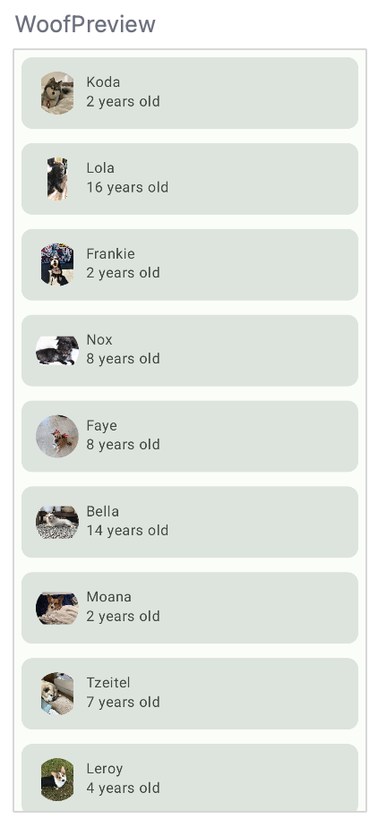

1. 若要将所有照片设为圆形，请添加 [`ContentScale`](https://developer.android.com/reference/kotlin/androidx/glance/layout/ContentScale?authuser=77&hl=zh-cn) 和 [`Crop`](https://developer.android.com/reference/kotlin/androidx/glance/layout/ContentScale?authuser=77&hl=zh-cn#Crop()) 属性，这会根据显示大小裁剪图片。请注意，`contentScale` 是 `Image` 的一个属性，不是 `modifier` 的一部分。

```
import androidx.compose.ui.layout.ContentScale

@Composable
fun DogIcon(
   @DrawableRes dogIcon: Int,
   modifier: Modifier = Modifier
) {
   Image(
       modifier = modifier
           .size(dimensionResource(id = R.dimen.image_size))
           .padding(dimensionResource(id = R.dimen.padding_small))
           .clip(MaterialTheme.shapes.small),
       contentScale = ContentScale.Crop,
```

以下是完整的 `DogIcon()` 可组合项。

```
@Composable
fun DogIcon(
    @DrawableRes dogIcon: Int,
    modifier: Modifier = Modifier
) {
    Image(
        modifier = modifier
            .size(dimensionResource(R.dimen.image_size))
            .padding(dimensionResource(R.dimen.padding_small))
            .clip(MaterialTheme.shapes.small),
        contentScale = ContentScale.Crop,
        painter = painterResource(dogIcon),

        // Content Description is not needed here - image is decorative, and setting a null content
        // description allows accessibility services to skip this element during navigation.

        contentDescription = null
    )
}
```

现在，`WoofPreview()` 中的图标是圆形。

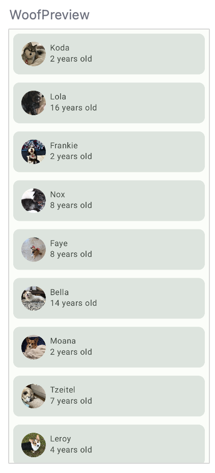

### 向列表项添加形状

在此部分中，您将向列表项添加形状。列表项已通过 `Card` 显示。`Card` 是可以包含一个可组合项并包含装饰选项的 Surface，可通过边框、形状等添加装饰。在本部分中，您将使用 `Card` 向列表项添加形状。


1. 打开 **Shape.kt** 文件。`Card` 是中等大小的组件，因此您要添加 `Shapes` 对象的 medium 参数。对于此应用，列表项的右上角和左下角要设为圆角，但又不是设为完全圆形。为此，请将 `16.dp` 传递给 `medium` 属性。

```
medium = RoundedCornerShape(bottomStart = 16.dp, topEnd = 16.dp)
```

由于 `Card` 已默认使用中等形状，因此您无需明确地将其设为中型。查看**预览**，看看采用新形状的 `Card`！

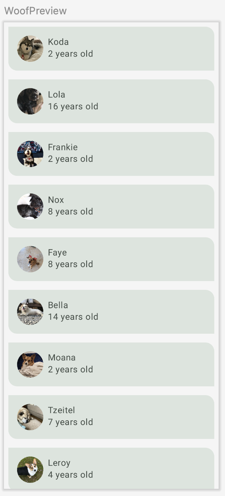

如果您返回到 `WoofTheme()` 中的 **Theme.kt** 文件并查看 `MaterialTheme()`，会看到 `shapes` 属性设置为您刚刚更新的 `Shapes` `val`。

```
MaterialTheme(
   colors = colors,
   typography = Typography,
   shapes = Shapes,
   content = content
)
```

## [添加排版](https://developer.android.com/codelabs/basic-android-kotlin-compose-material-theming?authuser=77&hl=zh-cn&continue=https%3A%2F%2Fdeveloper.android.com%2Fcourses%2Fpathways%2Fandroid-basics-compose-unit-3-pathway-3%3Fauthuser%3D77%26hl%3Dzh-cn%23codelab-https%3A%2F%2Fdeveloper.android.com%2Fcodelabs%2Fbasic-android-kotlin-compose-material-theming#5)

### Material Design 字型比例

字型比例是一系列字体样式的选择，可在应用中使用，确保样式既灵活又一致。[Material Design 字型比例](https://m3.material.io/styles/typography/type-scale-tokens)包含字型系统支持的 15 种字体样式。命名和分组已简化为：显示、大标题、标题、正文和标签，每个都有大号、中号和小号。只有在您想自定义应用时，才需要使用这些选项。如果您不知道为每个字型比例类别设置什么，请注意，您可以使用默认的排版缩放设置。

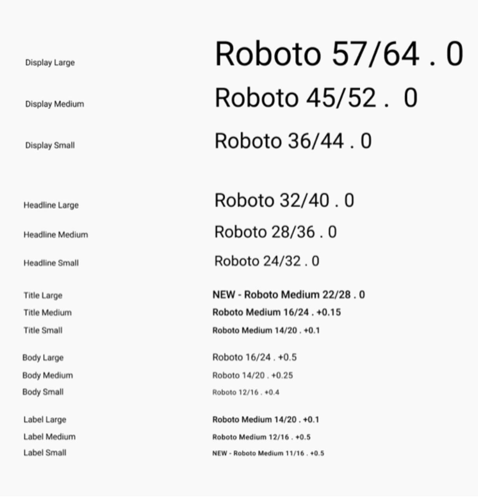

字型比例包含可重复使用的文本类别，每个类别都有预期的应用和含义。

#### **显示**

作为屏幕上最大的文本，显示字体专用于简短的重要文字或数字，最适合在大屏幕设备上使用。

#### **标题**

大标题最适合用来在小屏幕设备上显示高强调度的简短文本。这类样式有助于标记文本的主要段落或重要内容区域。

#### **标题**

标题比大标题样式要小，适用于内容相对较短的中强调度文本。

#### **Body**

正文样式用于显示应用中较长的文本段落。

#### **标签**

标签样式是较小的实用样式，用于显示组件内部的文本或内容正文中非常小的文本（例如字幕）。

#### 字体

虽然 Android 平台提供了各种字体，但您可能需要使用非默认提供的字体来自定义应用。自定义字体可以增添个性，并可用于品牌塑造。

在本部分中，您将添加名为 **Abril Fatface**、**Montserrat Bold** 和 **Montserrat Regular** 的自定义字体。您将使用 displayLarge 和 displayMedium 大标题以及 Material 字型系统中的 bodyLarge 文本，然后将其添加到应用中的文本。

### 创建字体 Android 资源目录。

在向应用添加字体之前，您需要添加一个字体目录。

1. 在 Android Studio 的项目视图中，右键点击 **res** 文件夹。
2. 依次选择 **New** > **Android Resource Directory**。


1. 将目录命名为 **font**，将资源类型设为 **font**，然后点击 **OK**。

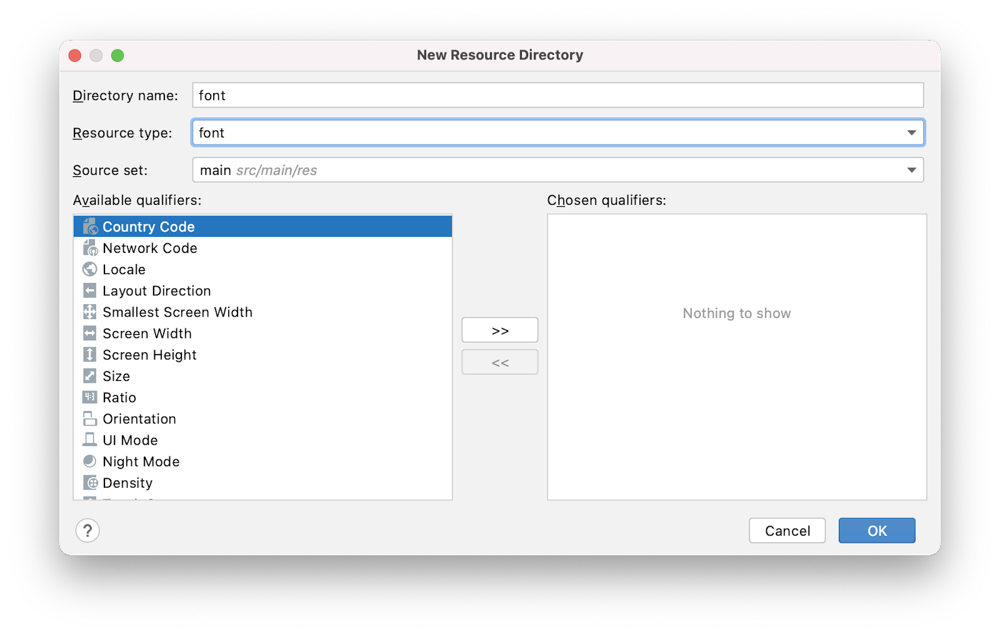

1. 打开位于 **res > font** 的新字体资源目录。

### 下载自定义字体

由于您使用的不是 Android 平台提供的字体，因此您需要下载自定义字体。

1. 访问 [https://fonts.google.com/](https://fonts.google.com/?authuser=77&hl=zh-cn)。
2. 搜索 [**Montserrat**](https://fonts.google.com/specimen/Montserrat?query=mon&authuser=77&hl=zh-cn)，然后点击 **Download family**。
3. 解压缩该 ZIP 文件。
4. 打开下载的 **Montserrat** 文件夹。在 **static** 文件夹中，找到 **Montserrat-Bold.ttf** 和 **Montserrat-Regular.ttf**（**ttf** 代表 TrueType 字体，即字体文件的格式）。选择两种字体，将它们拖动到 Android Studio 中项目的字体资源目录中。


1. 在字体文件夹中将 **Montserrat-Bold.ttf** 重命名为 **montserrat_bold.ttf**，并将**Montserrat-Regular.ttf** 重命名为 **montserrat_regular.ttf**。
2. 搜索 [**Abril Fatface**](https://fonts.google.com/specimen/Abril+Fatface?query=abril&authuser=77&hl=zh-cn)，然后点击 **Download family**。
3. 打开下载的 **Abril_Fatface** 文件夹。选择 **AbrilFatface-Regular.ttf** 并将其拖动到字体资源目录中。
4. 在字体文件夹中，将 **Abril_Fatface_Regular.ttf** 重命名为 **abril_fatface_regular.ttf**。

项目中的字体资源目录和三个自定义字体文件应如下所示：


### 初始化字体

1. 在项目窗口中，依次打开 **ui.theme** > **Type.kt**。在 import 语句下方和 `Typography` `val` 上方初始化下载的字体。首先，初始化 **Abril Fatface**，方法是将其设为 `FontFamily` 并使用字体文件 `abril_fatface_regular` 传入 `Font`。

```
import androidx.compose.ui.text.font.Font
import androidx.compose.ui.text.font.FontFamily
import com.example.woof.R

val AbrilFatface = FontFamily(
   Font(R.font.abril_fatface_regular)
)
```

1. 在 **Abril Fatface** 下方初始化 **Montserrat**，方法是将其设为 `FontFamily` 并使用字体文件 `montserrat_regular` 传入 `Font`。对于 `montserrat_bold`，还应添加 `FontWeight.Bold`。即使您传入了字体文件的粗体版本，Compose 也不知道该文件是粗体文件，因此您需要明确地将此文件关联到 `FontWeight.Bold`。

```
import androidx.compose.ui.text.font.FontWeight

val AbrilFatface = FontFamily(
   Font(R.font.abril_fatface_regular)
)

val Montserrat = FontFamily(
   Font(R.font.montserrat_regular),
   Font(R.font.montserrat_bold, FontWeight.Bold)
)
```

接下来，将不同类型的标题设为您刚刚添加的字体。`Typography` 对象具有上面讨论的 13 种不同字体的参数。您可以根据需要定义任意数量。在此应用中，我们将设置 `displayLarge`、`displayMedium` 和 `bodyLarge`。在此应用的下一部分中，您将使用 `labelSmall`，因此需在此处添加。

下表显示了您添加的每个大标题的字体、粗细和大小。

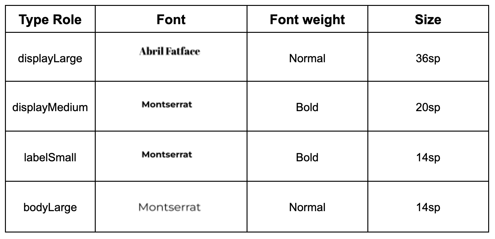

1. 对于 `displayLarge` 属性，应将其设为 `TextStyle`，并使用上表中的信息填写 `fontFamily`、`fontWeight` 和 `fontSize`。这意味着所有设为 `displayLarge` 的文本都将使用 **Abril Fatface** 作为字体，字体粗细正常，`fontSize` 为 `36.sp`。

对 `displayMedium`、`labelSmall` 和 `bodyLarge` 重复此过程。

```
import androidx.compose.ui.text.TextStyle
import androidx.compose.ui.unit.sp


val Typography = Typography(
   displayLarge = TextStyle(
       fontFamily = AbrilFatface,
       fontWeight = FontWeight.Normal,
       fontSize = 36.sp
   ),
   displayMedium = TextStyle(
       fontFamily = Montserrat,
       fontWeight = FontWeight.Bold,
       fontSize = 20.sp
   ),
   labelSmall = TextStyle(
       fontFamily = Montserrat,
       fontWeight = FontWeight.Bold,
       fontSize = 14.sp
   ),
   bodyLarge = TextStyle(
       fontFamily = Montserrat,
       fontWeight = FontWeight.Normal,
       fontSize = 14.sp
   )
)
```

如果您打开 `WoofTheme()` 中的 **Theme.kt** 文件并查看 `MaterialTheme()`，会发现 `typography` 参数就等于您刚刚更新的 `Typography val`。

```
MaterialTheme(
   colors = colors,
   typography = Typography,
   shapes = Shapes,
   content = content
)
```

### 向应用文本添加排版

现在，您要为应用中的每一个文本实例添加大标题字型。

1. 添加 `displayMedium` 作为 `dogName` 的样式，因为它是一种简短的重要信息。将 `bodyLarge` 添加为 `dogAge` 的样式，因为它适合较小的文本。

```
@Composable
fun DogInformation(
   @StringRes dogName: Int,
   dogAge: Int,
   modifier: Modifier = Modifier
) {
   Column(modifier = modifier) {
       Text(
           text = stringResource(dogName),
           style = MaterialTheme.typography.displayMedium,
           modifier = Modifier.padding(top = dimensionResource(id = R.dimen.padding_small))
       )
       Text(
           text = stringResource(R.string.years_old, dogAge),
           style = MaterialTheme.typography.bodyLarge
       )
   }
}
```

## [添加顶部栏](https://developer.android.com/codelabs/basic-android-kotlin-compose-material-theming?authuser=77&hl=zh-cn&continue=https%3A%2F%2Fdeveloper.android.com%2Fcourses%2Fpathways%2Fandroid-basics-compose-unit-3-pathway-3%3Fauthuser%3D77%26hl%3Dzh-cn%23codelab-https%3A%2F%2Fdeveloper.android.com%2Fcodelabs%2Fbasic-android-kotlin-compose-material-theming#6)

[`Scaffold`](https://developer.android.com/reference/kotlin/androidx/compose/material3/Scaffold.composable?authuser=77&hl=zh-cn#Scaffold(androidx.compose.ui.Modifier,kotlin.Function0,kotlin.Function0,kotlin.Function0,kotlin.Function0,androidx.compose.material3.FabPosition,androidx.compose.ui.graphics.Color,androidx.compose.ui.graphics.Color,androidx.compose.foundation.layout.WindowInsets,kotlin.Function1)) 是一种布局，可为各种组件和屏幕元素（如 `Image`、`Row` 或 `Column`）提供槽。`Scaffold` 还为 [`TopAppBar`](https://developer.android.com/reference/kotlin/androidx/compose/material3/package-summary?authuser=77&hl=zh-cn#TopAppBar(kotlin.Function0,androidx.compose.ui.Modifier,kotlin.Function0,kotlin.Function1,androidx.compose.foundation.layout.WindowInsets,androidx.compose.material3.TopAppBarColors,androidx.compose.material3.TopAppBarScrollBehavior)) 提供了槽，您将在本部分中使用。

`TopAppBar` 可用于许多用途，但在本例中，您会将其用于品牌宣传以及彰显应用个性。`TopAppBar` 有四种不同的类型：居中、小、中和大。在此 Codelab 中，您将实现一个居中的顶部应用栏。您将创建一个类似于以下屏幕截图的可组合项，并将其放入 `Scaffold` 的 `topBar` 部分。

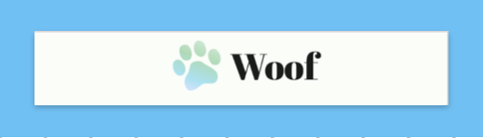

对于此应用，顶部栏由一个包含徽标图片和应用名称文字的 `Row` 组成。徽标包含可爱的渐变色的爪子和应用名称！

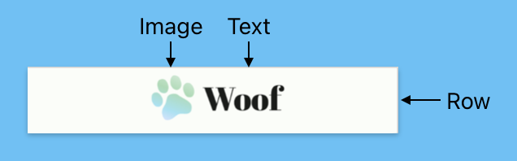

### 向顶部栏添加图片和文字

1. 在 **MainActivity.kt** 中，创建一个名为 `WoofTopAppBar()` 且带有可选 `modifier` 的可组合项。

```
@Composable
fun WoofTopAppBar(modifier: Modifier = Modifier) {
  
}
```

1. [`Scaffold`](https://developer.android.com/jetpack/compose/layouts/material?authuser=77&hl=zh-cn#scaffold) 支持 `contentWindowInsets` 参数，该参数有助于为 Scaffold 内容指定边衬区。[`WindowInsets`](https://developer.android.com/reference/android/view/WindowInsets?authuser=77&hl=zh-cn) 是屏幕上应用可与系统界面相交的部分，应通过 `PaddingValues` 参数将其传递给内容槽。[了解详情](https://developer.android.com/develop/ui/views/layout/insets?authuser=77&hl=zh-cn)。

`contentWindowInsets` 值会作为 `contentPadding` 传递给 `LazyColumn`。

```
@Composable
fun WoofApp() {
    Scaffold { it ->
        LazyColumn(contentPadding = it) {
            items(dogs) {
                DogItem(
                    dog = it,
                    modifier = Modifier.padding(dimensionResource(R.dimen.padding_small))
                )
            }
        }
    }
}
```

1. 在 `Scaffold` 中，添加 `topBar` 属性并将其设置为 `WoofTopAppBar()`。

```
Scaffold(
   topBar = {
       WoofTopAppBar()
   }
)
```

`WoofApp()` 可组合项将如下所示：

```
@Composable
fun WoofApp() {
    Scaffold(
        topBar = {
            WoofTopAppBar()
        }
    ) { it ->
        LazyColumn(contentPadding = it) {
            items(dogs) {
                DogItem(
                    dog = it,
                    modifier = Modifier.padding(dimensionResource(R.dimen.padding_small))
                )
            }
        }
    }
}
```

`WoofPreview()` 没有发生任何变化，因为 `WoofTopAppBar()` 中没有内容。让我们来修改一下！

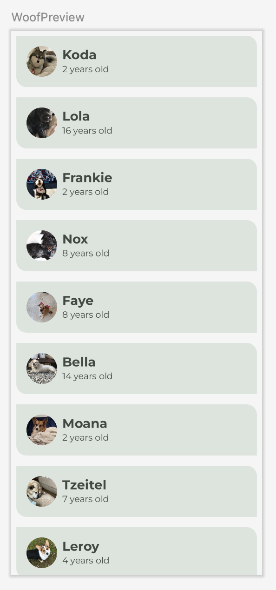

1. 在 `WoofTopAppBar() Composable` 中，添加 `CenterAlignedTopAppBar()` 并将修饰符参数设置为传入 `WoofTopAppBar()` 的修饰符。

```
import androidx.compose.material3.CenterAlignedTopAppBar

@Composable
fun WoofTopAppBar(modifier: Modifier = Modifier) {
   CenterAlignedTopAppBar(
       modifier = modifier
   )
}
```

1. 针对 title 参数，传入一个 `Row` 来存放 `CenterAlignedTopAppBar` 的 `Image` 和 `Text`。

```
@Composable
fun WoofTopAppBar(modifier: Modifier = Modifier){
   CenterAlignedTopAppBar(
       title = {
           Row() {
              
           }
       },
       modifier = modifier
   )
}
```

1. 将徽标 `Image` 添加到 `Row` 中。

- 将 `modifier` 中的图片大小设为 `dimens.xml` 文件中的 `image_size`，并将内边距设为 `dimens.xml` 文件中的 `padding_small`。
- 使用 `painter` 将 `Image` 设为可绘制对象文件夹中的 `ic_woof_logo`。
- 将 `contentDescription` 设为 **null**。在这种情况下，应用徽标不会为有视觉障碍的用户添加任何语义信息，因此我们无需添加内容说明。

```
Row() {
   Image(
       modifier = Modifier
           .size(dimensionResource(id = R.dimen.image_size))
           .padding(dimensionResource(id = R.dimen.padding_small)),
       painter = painterResource(R.drawable.ic_woof_logo),
       contentDescription = null
   )
}
```

1. 接下来，在 `Row` 中的 `Image.` 后添加一个 `Text` 可组合项。

- 使用 *`stringResource()`* 将其设为 `app_name` 的值。这会将文本设为存储在 `strings.xml` 中的应用的名称。
- 将文本样式设为 `displayLarge`，因为应用名称是简短的重要文本。

```
Text(
   text = stringResource(R.string.app_name),
   style = MaterialTheme.typography.displayLarge
)
```

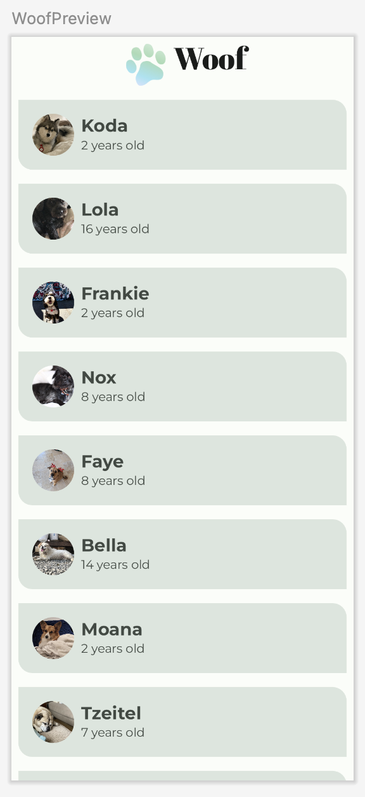

这就是 `WoofPreview()` 中显示的内容，看起来有点不对劲，因为图标和文本没有垂直对齐。

1. 若要解决此问题，请向 `Row` 添加 `verticalAlignment` 值参数，并将其设为 `Alignment.CenterVertically`。

```
import androidx.compose.ui.Alignment

Row(
   verticalAlignment = Alignment.CenterVertically
)
```

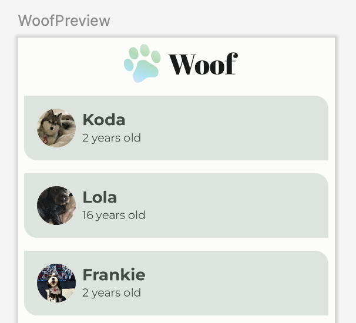

这样看起来好多了！

以下是完整的 `WoofTopAppBar()` 可组合项：

```
@Composable
fun WoofTopAppBar(modifier: Modifier = Modifier) {
   CenterAlignedTopAppBar(
       title = {
           Row(
               verticalAlignment = Alignment.CenterVertically
           ) {
               Image(
                   modifier = Modifier
                       .size(dimensionResource(id = R.dimen.image_size))
                       .padding(dimensionResource(id = R.dimen.padding_small)),
                   painter = painterResource(R.drawable.ic_woof_logo),

                   contentDescription = null
               )
               Text(
                   text = stringResource(R.string.app_name),
                   style = MaterialTheme.typography.displayLarge
               )
           }
       },
       modifier = modifier
   )
}
```

## [ 添加“展开”图标](https://developer.android.com/codelabs/basic-android-kotlin-compose-woof-animation?authuser=77&hl=zh-cn&continue=https%3A%2F%2Fdeveloper.android.com%2Fcourses%2Fpathways%2Fandroid-basics-compose-unit-3-pathway-3%3Fauthuser%3D77%26hl%3Dzh-cn%23codelab-https%3A%2F%2Fdeveloper.android.com%2Fcodelabs%2Fbasic-android-kotlin-compose-woof-animation#2)

在此部分中，您将为应用添加**展开** 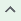 和**收起** 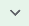 图标。

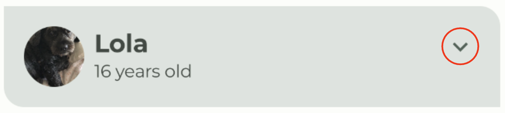

### Icons

图标是一种符号，可以形象地表示预期功能，帮助用户了解界面。图标设计通常会从用户在现实世界中可能接触到的对象中汲取灵感。图标设计通常对细节设计没有什么要求，只需确保用户熟悉即可。例如，在现实世界中，我们使用铅笔书写，因此铅笔图标通常表示**创建**或**修改**。

|  照片由 [Angelina Litvin](https://unsplash.com/@linalitvina?utm_source=unsplash&utm_medium=referral&utm_content=creditCopyText) 拍摄，选自 [Unsplash](https://unsplash.com/?utm_source=unsplash&utm_medium=referral&utm_content=creditCopyText) 网站 | 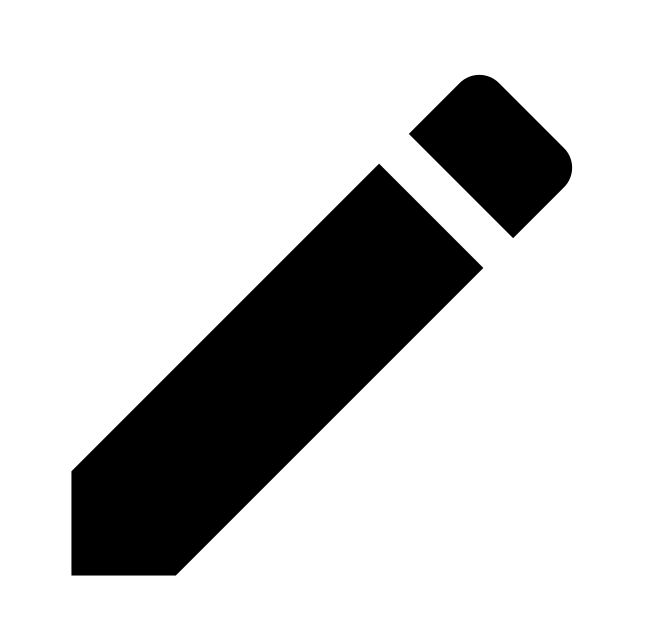 |
| ------------------------------------------------------------ | ------------------------------------------------- |
|                                                              |                                                   |

Material Design 提供了[大量图标](https://material.io/resources/icons/?style=baseline)，分成若干常见类别，可满足您的大多数需求。

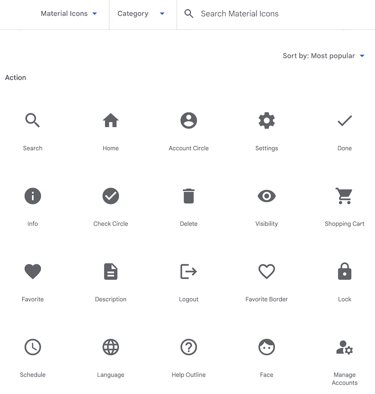

### 添加 Gradle 依赖项

为您的项目添加 `material-icons-extended` 库依赖项。您将使用此库中的 `Icons.Filled.ExpandLess`  和 `Icons.Filled.ExpandMore`  图标。

**有关 Gradle 依赖项的注意事项：**如需向您的项目添加依赖项，请在模块的 `build.gradle.kts` 文件的 `dependencies` 代码块中指定依赖项配置，例如“implementation”。在构建您的应用时，构建系统会编译该库模块，并将生成的编译内容打包到应用中。

在后面的单元中，您将详细了解如何为应用添加库。

1. 在 **Project** 窗格中，依次打开 **Gradle Scripts > build.gradle.kts (Module :app)**。
2. 滚动到 `build.gradle.kts (Module :app)` 文件的末尾。在 `dependencies{}` 代码块中，添加以下行：

```
implementation("androidx.compose.material:material-icons-extended")
```

**提示**：每当您修改 Gradle 文件时，Android Studio 可能需要导入或更新库，并运行一些后台任务。Android Studio 会显示一个弹出式窗口，让您同步项目。点击 **Sync Now**。


### 添加图标可组合项

添加一个函数，以显示 Material 图标库中的**展开**图标，并将其用作按钮。

1. 在 `MainActivity.kt` 中的 `DogItem()` 函数后面，创建一个名为 `DogItemButton()` 的全新可组合函数。
2. 传入针对展开状态的 `Boolean`、针对 onClick 处理程序的 lambda 表达式和可选的 `Modifier`，如下所示：

```
@Composable
private fun DogItemButton(
   expanded: Boolean,
   onClick: () -> Unit,
   modifier: Modifier = Modifier
) {
 

}
```

1. 在 `DogItemButton()` 函数内，添加一个 [`IconButton()`](https://developer.android.com/reference/kotlin/androidx/compose/material/IconButton.composable?authuser=77&hl=zh-cn#IconButton(kotlin.Function0,androidx.compose.ui.Modifier,kotlin.Boolean,androidx.compose.foundation.interaction.MutableInteractionSource,kotlin.Function0)) 可组合项，该可组合项接受 `onClick` 具名形参（一个使用尾随 lambda 语法的 lambda，会在按下此图标时调用），以及一个可选的 `modifier`。将 `IconButton's onClick` 和 `modifier value parameters` 设置为等于传入 `DogItemButton` 的函数。

```
@Composable
private fun DogItemButton(
   expanded: Boolean,
   onClick: () -> Unit,
   modifier: Modifier = Modifier
){
   IconButton(
       onClick = onClick,
       modifier = modifier
   ) {

   }
}
```

1. 在 `IconButton()` lambda 代码块内，添加一个 [`Icon`](https://developer.android.com/reference/kotlin/androidx/compose/material/icons/Icons?authuser=77&hl=zh-cn) 可组合项，并将 `imageVector value-parameter` 设置为 `Icons.Filled.ExpandMore`。这是将在列表项  末尾显示的按钮。Android Studio 会向您显示针对 `Icon()` 可组合项形参的警告，您将在下一步中修复相应问题。

```
import androidx.compose.material.icons.filled.ExpandMore
import androidx.compose.material.icons.Icons
import androidx.compose.material3.Icon
import androidx.compose.material3.IconButton

IconButton(
   onClick = onClick,
   modifier = modifier
) {
   Icon(
       imageVector = Icons.Filled.ExpandMore
   )
}
```

1. 添加值形参 `tint`，并将图标的颜色设为 `MaterialTheme.colorScheme.secondary`。添加具名形参 `contentDescription`，并将其设置为字符串资源 `R.string.expand_button_content_description`。

```
IconButton(
   onClick = onClick,
   modifier = modifier
){
   Icon(
       imageVector = Icons.Filled.ExpandMore,
       contentDescription = stringResource(R.string.expand_button_content_description),
       tint = MaterialTheme.colorScheme.secondary
   )
}
```

### 显示图标

通过将 `DogItemButton()` 可组合项添加到布局中来显示它。

1. 在 `DogItem()` 的开头，添加 `var` 以保存列表项的展开状态。将初始值设置为 `false`。

```
import androidx.compose.runtime.getValue
import androidx.compose.runtime.mutableStateOf
import androidx.compose.runtime.remember
import androidx.compose.runtime.setValue

var expanded by remember { mutableStateOf(false) }
```

**回顾 remember() 和 mutableStateOf()**：

使用 `mutableStateOf()` 函数，以便 Compose 观察状态值发生的更改，并触发重组来更新界面。使用 `remember()` 函数封装 `mutableStateOf()` 函数调用，以在初始组合期间将值存储在组合中，并在重组期间返回存储的值。

1. 在列表项中显示图标按钮。在 `DogItem()` 可组合项的 `Row` 代码块的末尾，调用 `DogInformation()` 之后添加 `DogItemButton()`。针对回调传入 `expanded` 状态和空 lambda。您将在后续步骤中定义 `onClick` 操作。

```
Row(
   modifier = Modifier
       .fillMaxWidth()
       .padding(dimensionResource(R.dimen.padding_small))
) {
   DogIcon(dog.imageResourceId)
   DogInformation(dog.name, dog.age)
   DogItemButton(
       expanded = expanded,
       onClick = { /*TODO*/ }
   )
}
```

1. 在 **Design** 窗格中查看 `WoofPreview()`。

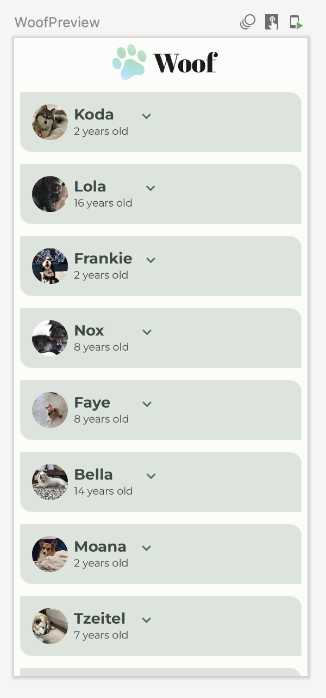

请注意，“展开”按钮未与列表项的末尾对齐。您将在下一步中修复该问题。

### 对齐“展开”按钮

如要将“展开”按钮与列表项的末尾对齐，您需要使用 [`Modifier.weight()`](https://developer.android.com/reference/kotlin/androidx/compose/foundation/layout/RowScope?authuser=77&hl=zh-cn#(androidx.compose.ui.Modifier).weight(kotlin.Float,kotlin.Boolean)) 属性在布局中添加分隔符。

**注意：**[`Modifier.weight()`](https://developer.android.com/reference/kotlin/androidx/compose/foundation/layout/RowScope?authuser=77&hl=zh-cn#(androidx.compose.ui.Modifier).weight(kotlin.Float,kotlin.Boolean)) 会根据界面元素相对于其加权同级元素（相应行或列中的其他子元素）的权重，按比例设置界面元素的宽度和高度。

示例：假设一行中的三个子元素的权重分别为 `1f`、`1f` 和 `2f`。在本例中，系统为所有子元素都分配了权重。根据指定的权重值按比例划分可用的行空间，为权重值较高的子元素分配更多空间。子元素的权重分配情况如下所示：

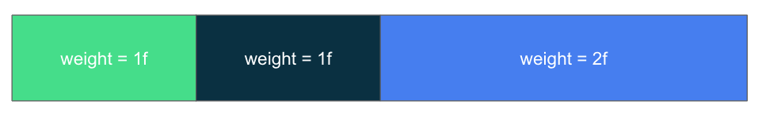

在上面的行中，系统为第一个和第二个子级可组合项分配了行宽的 ¼，而为第三个子级可组合项分配了行宽的 ½。

如果系统没有为子级可组合项分配权重（权重为可选形参），那么子级可组合项的高度/宽度将默认为封装内容（封装界面元素中的内容）。

**有关浮点值的注意事项**：Kotlin 中的浮点值为十进制数，以在数字末尾附上 `f` 或 `F` 表示。

在 **Woof** 应用中，每个列表项行都包含狗狗图片、狗狗信息和一个“展开”按钮。您需要在“展开”按钮前添加一个 `Spacer` 可组合项（权重为 `1f`），以便与按钮图标适当对齐。由于分隔符是行中唯一加权的子元素，因此该元素会在测量其他未加权子元素的宽度之后，填充行中的剩余空间。


### 在列表项行中添加分隔符

1. 在 `DogItem()` 中的 `DogInformation()` 和 `DogItemButton()` 之间，添加 `Spacer`。传入带 `weight(1f)` 的 `Modifier`。[`Modifier.weight()`](https://developer.android.com/reference/kotlin/androidx/compose/foundation/layout/RowScope?authuser=77&hl=zh-cn#(androidx.compose.ui.Modifier).weight(kotlin.Float,kotlin.Boolean)) 会使分隔符填充该行中剩余的空间。

```
import androidx.compose.foundation.layout.Spacer

Row(
   modifier = Modifier
       .fillMaxWidth()
       .padding(dimensionResource(R.dimen.padding_small))
) {
   DogIcon(dog.imageResourceId)
   DogInformation(dog.name, dog.age)
   Spacer(modifier = Modifier.weight(1f))
   DogItemButton(
       expanded = expanded,
       onClick = { /*TODO*/ }
   )
}
```

## [添加可组合项以显示业余爱好](https://developer.android.com/codelabs/basic-android-kotlin-compose-woof-animation?authuser=77&hl=zh-cn&continue=https%3A%2F%2Fdeveloper.android.com%2Fcourses%2Fpathways%2Fandroid-basics-compose-unit-3-pathway-3%3Fauthuser%3D77%26hl%3Dzh-cn%23codelab-https%3A%2F%2Fdeveloper.android.com%2Fcodelabs%2Fbasic-android-kotlin-compose-woof-animation#3)

在此任务中，您将添加 `Text` 可组合项以显示狗狗的爱好信息。


1. 创建一个新的名为 `DogHobby()` 的可组合函数，用于接受狗狗的爱好字符串资源 ID 和可选的 `Modifier`。

```
@Composable
fun DogHobby(
   @StringRes dogHobby: Int,
   modifier: Modifier = Modifier
) {
}
```

1. 在 `DogHobby()` 函数内，创建一个 `Column` 并传入在 `DogHobby()` 中传入的修饰符。

```
@Composable
fun DogHobby(
   @StringRes dogHobby: Int,
   modifier: Modifier = Modifier
){
   Column(
       modifier = modifier
   ) { 

   }
}
```

1. 在 `Column` 代码块内，添加两个 `Text` 可组合项：一个用于在爱好信息上方显示 **About** 文本，另一个用于显示爱好信息。

将第一个可组合项的 `text` 设置为 **strings.xml** 文件中的 `about`，并将 `style` 设置为 `labelSmall`。将第二可组合项的 `text` 设置为传入的 `dogHobby`，并将 `style` 设置为 `bodyLarge`。

```
Column(
   modifier = modifier
) {
   Text(
       text = stringResource(R.string.about),
       style = MaterialTheme.typography.labelSmall
   )
   Text(
       text = stringResource(dogHobby),
       style = MaterialTheme.typography.bodyLarge
   )
}
```

1. 在 `DogItem()` 中，`DogHobby()` 可组合项将位于包含 `DogIcon()`、`DogInformation()`、`Spacer()` 和 `DogItemButton()` 的 `Row` 下方。为此，请使用 `Column` 封装 `Row`，以便将爱好添加到 `Row` 下方。

```
Column() {
   Row(
       modifier = Modifier
           .fillMaxWidth()
           .padding(dimensionResource(R.dimen.padding_small))
   ) {
       DogIcon(dog.imageResourceId)
       DogInformation(dog.name, dog.age)
       Spacer(modifier = Modifier.weight(1f))
       DogItemButton(
           expanded = expanded,
           onClick = { /*TODO*/ }
       )
   }
}
```

1. 将 `DogHobby()` 添加在 `Row` 之后作为 `Column` 的第二个子级。传入 `dog.hobbies`，其中包含传入的狗狗的独特爱好，以及包含 `DogHobby()` 可组合项内边距的 `modifier`。

```
Column() {
   Row() {
      ...
   }
   DogHobby(
       dog.hobbies,
       modifier = Modifier.padding(
           start = dimensionResource(R.dimen.padding_medium),
           top = dimensionResource(R.dimen.padding_small),
           end = dimensionResource(R.dimen.padding_medium),
           bottom = dimensionResource(R.dimen.padding_medium)
       )
   )
}
```

## [点击按钮时显示或隐藏业余爱好](https://developer.android.com/codelabs/basic-android-kotlin-compose-woof-animation?authuser=77&hl=zh-cn&continue=https%3A%2F%2Fdeveloper.android.com%2Fcourses%2Fpathways%2Fandroid-basics-compose-unit-3-pathway-3%3Fauthuser%3D77%26hl%3Dzh-cn%23codelab-https%3A%2F%2Fdeveloper.android.com%2Fcodelabs%2Fbasic-android-kotlin-compose-woof-animation#4)

您的应用为每个列表项都提供了**展开**按钮，但该按钮还没有什么作用！在本部分中，您将添加用于在用户点击“展开”按钮时隐藏或显示爱好信息的选项。

1. 在 `DogItem()` 可组合函数的 `DogItemButton()` 函数调用中，定义 `onClick()` lambda 表达式，在用户点击按钮时将 `expanded` 布尔状态值更改为 `true`，在用户再次点击按钮时将其改回 `false`。

```
DogItemButton(
   expanded = expanded,
   onClick = { expanded = !expanded }
)
```

**注意：**逻辑 NOT 运算符 ( ! ) 会返回 `Boolean` 表达式的否定值。

例如，如果 `expanded` 为 `true`，则 `!expanded` 的求值结果为 `false`。

1. 在 `DogItem()` 函数中，使用对 `expanded` 布尔值进行的 `if` 检查来封装 `DogHobby()` 函数调用。

```
@Composable
fun DogItem(
   dog: Dog,
   modifier: Modifier = Modifier
) {
   var expanded by remember { mutableStateOf(false) }
   Card(
       ...
   ) {
       Column(
           ...
       ) {
           Row(
               ...
           ) {
               ...
           }
           if (expanded) {
               DogHobby(
                   dog.hobbies, modifier = Modifier.padding(
                       start = dimensionResource(R.dimen.padding_medium),
                       top = dimensionResource(R.dimen.padding_small),
                       end = dimensionResource(R.dimen.padding_medium),
                       bottom = dimensionResource(R.dimen.padding_medium)
                   )
               )
           }
       }
   }
}
```

现在，只有当 `expanded` 的值为 `true` 时，系统才会显示狗狗的爱好信息。

1. 预览会显示界面的外观，您还可以与之互动。如要与界面预览对象进行互动，请将鼠标悬停在 **Design** 窗格中的 WoofPreview 文本上，然后点击 **Design** 窗格右上角的 **Interactive Mode** 按钮 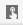。这会在交互模式下启动预览。

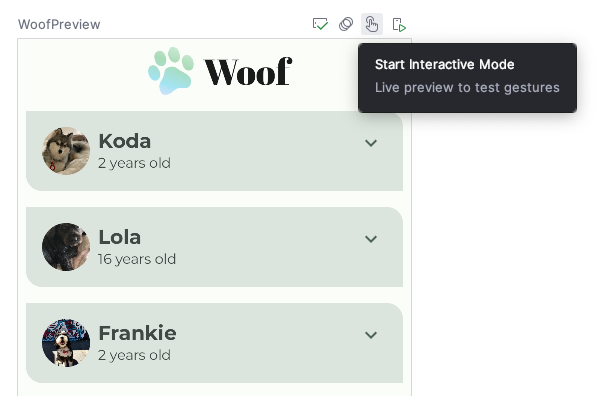

1. 点击“展开”按钮与预览对象进行互动。请注意，点击“展开”按钮后，系统会隐藏或显示狗狗的爱好信息。

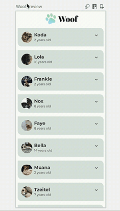

**注意：**如需停止交互模式，请点击预览窗格左上角的 **Stop Interactive Mode**。

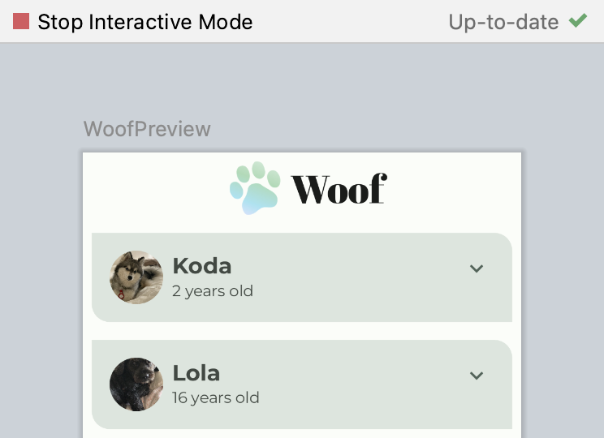

请注意，在列表项展开时，“展开”按钮图标没有发生变化。为了提供更加出色的用户体验，您将更改图标，使 `ExpandMore` 显示向下箭头 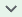，`ExpandLess` 显示向上箭头 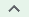。

1. 在 `DogItemButton()` 函数中，添加一个根据 `expanded` 状态更新 `imageVector` 值的 `if` 语句，如下所示：

```
import androidx.compose.material.icons.filled.ExpandLess


@Composable
private fun DogItemButton(
   ...
) {
   IconButton(onClick = onClick) {
       Icon(
           imageVector = if (expanded) Icons.Filled.ExpandLess else Icons.Filled.ExpandMore,
           ...
       )
   }
}
```

请注意您在上一个代码段中是如何编写 `if-else` 的。

```
if (expanded) Icons.Filled.ExpandLess else Icons.Filled.ExpandMore
```

这与以下代码中使用大括号 { } 一样：

```
if (expanded) {
`Icons.Filled.ExpandLess`
} else {
`Icons.Filled.ExpandMore`
}
```


## [添加动画](https://developer.android.com/codelabs/basic-android-kotlin-compose-woof-animation?authuser=77&hl=zh-cn&continue=https%3A%2F%2Fdeveloper.android.com%2Fcourses%2Fpathways%2Fandroid-basics-compose-unit-3-pathway-3%3Fauthuser%3D77%26hl%3Dzh-cn%23codelab-https%3A%2F%2Fdeveloper.android.com%2Fcodelabs%2Fbasic-android-kotlin-compose-woof-animation#5)

查看 `DogItem()` 可组合函数中的 `DogHobby()` 函数调用。狗狗的爱好信息基于 `expanded` 布尔值包含在组合中。根据狗狗的爱好信息处于可见状态还是隐藏状态，列表项的高度会发生变化。目前，该过渡过程不太自然。在此部分中，您将使用 [`animateContentSize`](https://developer.android.com/jetpack/compose/animation/composables-modifiers?authuser=77&hl=zh-cn#animateContentSize) 修饰符在展开状态和非展开状态之间更流畅地进行过渡。

```
// No need to copy over
@Composable
fun DogItem(...) {
  ...
    if (expanded) {
       DogHobby(
          dog.hobbies, 
          modifier = Modifier.padding(
              start = dimensionResource(R.dimen.padding_medium),
              top = dimensionResource(R.dimen.padding_small),
              end = dimensionResource(R.dimen.padding_medium),
              bottom = dimensionResource(R.dimen.padding_medium)
          )
      )
   }
}
```

1. 在 `MainActivity.kt` 的 `DogItem()` 内，向 `Column` 布局添加 `modifier` 形参。

```
@Composable
fun DogItem(
   dog: Dog, 
   modifier: Modifier = Modifier
) {
   ...
   Card(
       ...
   ) {
       Column(
          modifier = Modifier
       ){
           ...
       }
   }
}
```

1. 使用 [`animateContentSize`](https://developer.android.com/jetpack/compose/animation?authuser=77&hl=zh-cn#animateContentSize) 修饰符链接该修饰符，以便为大小（列表项高度）变化添加动画效果。

```
import androidx.compose.animation.animateContentSize

Column(
   modifier = Modifier
       .animateContentSize()
)
```

在当前实现中，您要为应用中的列表项高度变化添加动画效果。但是，动画效果非常细微，在运行应用时很难觉察出来。为解决此问题，请使用可选的 [`animationSpec`](https://developer.android.com/reference/kotlin/androidx/compose/animation/core/AnimationSpec?authuser=77&hl=zh-cn) 形参来自定义动画。

1. 对于 Woof 而言，动画会缓入和缓出，不会有弹跳。为此，请将 `animationSpec` 形参添加到 `animateContentSize()` 函数调用中。使用 [`DampingRatioNoBouncy`](https://developer.android.com/reference/kotlin/androidx/compose/animation/core/Spring?authuser=77&hl=zh-cn#DampingRatioNoBouncy()) 将其设置为弹簧动画，使其无弹跳，并使用 [`StiffnessMedium`](https://developer.android.com/reference/kotlin/androidx/compose/animation/core/Spring?authuser=77&hl=zh-cn#StiffnessMedium()) 形参让弹簧略硬。

```
import androidx.compose.animation.core.Spring
import androidx.compose.animation.core.spring

Column(
   modifier = Modifier
       .animateContentSize(
           animationSpec = spring(
               dampingRatio = Spring.DampingRatioNoBouncy,
               stiffness = Spring.StiffnessMedium
           )
       )
)
```