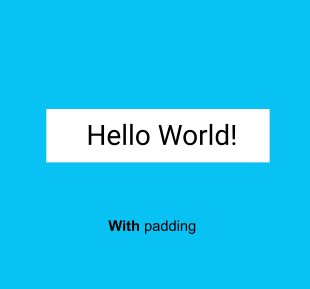

## 什么是 Jetpack Compose

Jetpack Compose 是用于构建 Android 界面的新款工具包。Compose 使用更少的代码、强大的工具和直观的 Kotlin 功能，可以帮助您简化并加快 Android 界面开发。借助 Compose，您可以通过定义一组函数来构建界面，这些函数称为可组合函数，它们会接受数据并描述界面元素。

## 可组合函数

在 Compose 中，可组合函数是界面的基本构建块。可组合函数：

- 描述界面中的某一部分。
- 不会返回任何内容。
- 接受一些输入并生成屏幕上显示的内容。

## 注释

注解是用于在代码中附加额外信息的方式。此类信息可以帮助 Jetpack Compose 编译器等工具和其他开发者理解应用的代码。

若要应用注解，只需在您要注解的声明开头为其名称（注解）添加 `@` 字符作为前缀即可。您可以为包括属性、函数和类在内的不同代码元素添加注解。本课程稍后会介绍类。

### 带形参的注解

注解可以接受形参。形参可以为处理它们的工具提供额外信息。以下是带形参和不带形参的 `@Preview` 注解的一些示例。


## [将文本元素排列成一行或一列](https://developer.android.com/codelabs/basic-android-kotlin-compose-text-composables?authuser=77&hl=zh-cn&continue=https%3A%2F%2Fdeveloper.android.com%2Fcourses%2Fpathways%2Fandroid-basics-compose-unit-1-pathway-3%3Fauthuser%3D77%26hl%3Dzh-cn%23codelab-https%3A%2F%2Fdeveloper.android.com%2Fcodelabs%2Fbasic-android-kotlin-compose-text-composables#7)

### 界面层次结构

界面层次结构基于包含机制，意即一个组件可以包含一个或多个组件，有时会用“父级”和“子级”这两个词来表述。这种说法是指，父界面元素包含子界面元素，而子界面元素还可以继续包含子界面元素。在此部分中，您将了解可用作父界面元素的 `Column`、`Row` 和 `Box` 可组合项。

### 尾随 lambda 语法

请注意，在上一个代码段中，`Row` 可组合函数中使用的是花括号而不是圆括号。这称为尾随 Lambda 语法。本课程稍后会详细介绍 lambda 和尾随 lambda 语法。现在，您只需要熟悉这个常用的 Compose 语法。

当最后一个形参是函数时，Kotlin 提供了一种特殊语法来将函数作为形参传递给函数。


将函数作为形参传递时，您可以使用尾随 lambda 语法。您可以将函数放在圆括号外部的大括号中，而不是放在圆括号内。这是 Compose 中的一种常见且推荐的做法，因此您需要熟悉代码的格式。

例如，`Row()` 可组合函数中的最后一个形参是 `content` 形参，它是一个描述子界面元素的函数。假设您想要创建一个包含三个文本元素的行。以下代码行得通，但如果为尾随 lambda 使用具名形参，则非常麻烦：

```
Row(
    content = {
        Text("Some text")
        Text("Some more text")
        Text("Last text")
    }
)
```

由于 `content` 形参是函数签名中的最后一个形参，并且您要将其值作为 lambda 表达式传递（目前，如果您不知道 lambda 是什么也没关系，只需要熟悉一下语法即可），因此您可以移除 `content` 形参和括号，如下所示：

```
Row {
    Text("Some text")
    Text("Some more text")
    Text("Last text")
}
```

```
@Composable
fun GreetingText(message:String,from:String,modifier: Modifier= Modifier){
    Column(
        verticalArrangement = Arrangement.Center,
        modifier = modifier
    ) {
        Text(
            text = message,
            fontSize = 100.sp,
            lineHeight = 116.sp,
            textAlign = TextAlign.Center
        )
        Text(
            text = from,
            fontSize = 36.sp,
            modifier = Modifier
                .padding(16.dp)
                .align(alignment = Alignment.End)
        )
    }
}
```

# 向 Android 应用添加图片

## [添加 Image 可组合项](https://developer.android.com/codelabs/basic-android-kotlin-compose-add-images?authuser=77&hl=zh-cn&continue=https%3A%2F%2Fdeveloper.android.com%2Fcourses%2Fpathways%2Fandroid-basics-compose-unit-1-pathway-3%3Fauthuser%3D77%26hl%3Dzh-cn%23codelab-https%3A%2F%2Fdeveloper.android.com%2Fcodelabs%2Fbasic-android-kotlin-compose-add-images#2)

若要在应用中显示图片，需要有一个显示位置。就像使用 `Text` 可组合项显示文本一样，可以使用 `Image` 可组合项来显示图片。

在此任务中，您将为应用添加一个 `Image` 可组合项，并将其图片设为您下载的图片，然后调整图片的位置和大小，使其填满整个屏幕。

### 通过添加可组合函数来添加图片

1. 在 `MainActivity.kt` 文件中，在 `GreetingText()` 函数后面添加一个 `GreetingImage()` 可组合函数。
2. 向 `GreetingImage()` 函数传递两个 `String` 形参：一个名为 `message`，用于添加生日祝福语，另一个名为 `from`，用于添加签名。

```
@Composable
fun GreetingImage(message: String, from: String) {
}
```

1. 每个可组合函数都应接受一个可选的 `Modifier` 形参。修饰符用于控制界面元素在其父布局中的放置、显示或行为方式。在 `GreetingImage()` 可组合函数中添加另一个形参。

```
@Composable
fun GreetingImage(message: String, from: String, modifier: Modifier = Modifier) {
}
```

### Jetpack Compose 中的资源

资源是指代码使用的附加文件和静态内容，例如位图、界面字符串、动画说明等。如需详细了解 Android 中的资源，请参阅[应用资源概览](https://developer.android.com/guide/topics/resources/providing-resources?authuser=77&hl=zh-cn)。

您应该始终将应用资源（如图片和字符串）与代码分隔开，以便能够独立地维护这些资源。在运行时，Android 会根据当前配置使用合适的资源。例如，您可能想根据屏幕尺寸提供不同的界面布局，或根据语言设置提供不同的字符串。

### 将资源分组

您应始终将每种类型的资源放在项目的 `res/` 目录下的相应子目录中。例如，以下是一个简单项目的文件层次结构：

```
MyProject/
    src/
        MyActivity.kt
    res/
        drawable/
            graphic.png
        mipmap/
            icon.png
        values/
            strings.xml
```

在此示例中，`res/` 目录中包含存储在不同子目录中的所有资源，其中包括存储图片资源的 `drawable/` 目录、存储启动器图标的 `mipmap/` 目录和存储字符串资源的 `values/` 目录。如需详细了解应用资源的用法、格式和语法，请参阅[资源类型概览](https://developer.android.com/guide/topics/resources/available-resources?authuser=77&hl=zh-cn)。

### 访问资源

Jetpack Compose 可以访问您的 Android 项目中定义的资源。可以使用在项目的 `R` 类中生成的资源 ID 访问资源。

`R` 类是 Android 自动生成的类，其中包含了项目中所有资源的 ID。在大多数情况下，资源 ID 与文件名相同。例如，可以使用以下代码访问上面的文件层次结构中的图片：

```
R.drawable.graphic
```


在下一个任务中，您将使用在上一个任务中添加的图片（**`androidparty.png`** 文件）。

1. 在 `GreetingImage()` 函数中，声明 `val` 属性并将其命名为 `image`。
2. 通过传入 `androidparty` 资源来调用 [`painterResource()`](https://developer.android.com/reference/kotlin/androidx/compose/ui/res/painterResource.composable?authuser=77&hl=zh-cn#painterResource(kotlin.Int)) 函数。将返回值分配给 `image` 变量。

```
val image = painterResource(R.drawable.androidparty)
```

Android Studio 突出显示了 .`painterResource` 代码，因为您需要导入该函数来编译应用。


1. 点击 Android Studio 突出显示的 `.painterResource`。
2. 点击弹出式窗口中的 **Import**，为 `androidx.compose.ui.res.painterResource` 添加 import 语句。

[`painterResource()`](https://developer.android.com/reference/kotlin/androidx/compose/ui/res/painterResource.composable?authuser=77&hl=zh-cn#painterResource(kotlin.Int)) 函数会加载可绘制图片资源，并将资源 ID（在本例中为 `R.drawable.androidparty`）作为实参。

1. 调用 [`painterResource()`](https://developer.android.com/reference/kotlin/androidx/compose/ui/res/painterResource.composable?authuser=77&hl=zh-cn#painterResource(kotlin.Int)) 函数后，添加 `Image` 可组合函数，然后传入 `image` 作为 `painter` 的具名实参。

```
Image(
    painter = image
)
```

Android Studio 突出显示了 `Image` 代码，因为您需要导入该函数来编译应用。


若要修正此警告，请在 `MainActivity.kt` 文件的顶部添加以下 import 语句：

```
import androidx.compose.foundation.Image
```

初始警告现已解决，但如果您将鼠标指针悬停在 `Image` 一词上，Android Studio 会显示一条新警告，表明“None of the following functions can be called with the arguments supplied”。这是因为提供的实参与任何 `Image` 函数签名都不匹配。


此警告将在下一部分中修正。

### 检查应用是否支持无障碍功能

如果您遵循无障碍方面的编码实践时，就可以让所有用户（包括[残障](https://developer.android.com/guide/topics/ui/accessibility?authuser=77&hl=zh-cn)人士）更轻松地在您的应用中进行导航并与之互动。

**注意**：Android 为用户提供了许多工具。例如，[TalkBack](https://support.google.com/accessibility/android/answer/6283677?authuser=77&hl=zh-cn) 是 Android 设备随附的 Google 屏幕阅读器。TalkBack 可为用户提供语音反馈，这样用户无需查看屏幕即可使用设备。如需详细了解无障碍功能，请参阅[打造无障碍应用](https://developer.android.com/guide/topics/ui/accessibility/?authuser=77&hl=zh-cn)。

Android Studio 会提供相应的提示和警告，以便使您的应用更方便更多人使用。内容说明定义了界面元素的用途，可让您的应用更易于通过 TalkBack 进行使用。

不过，在此应用中添加图片只是为了进行装饰。就本例而言，在图片中添加内容说明会使应用更难以通过 TalkBack 进行使用。您可以不设置面向用户的内容说明，而将图片的 `contentDescription` 实参设为 `null`，以便 TalkBack 跳过 `Image` 可组合函数。

- 在 `Image` 可组合函数中，添加另一个名为 `contentDescription` 的实参，并将其值设为 `null`。

```添加 Image 可组合项
Image(
    painter = image,
    contentDescription = null
)
```

## [添加盒子布局](https://developer.android.com/codelabs/basic-android-kotlin-compose-add-images?authuser=77&hl=zh-cn&continue=https%3A%2F%2Fdeveloper.android.com%2Fcourses%2Fpathways%2Fandroid-basics-compose-unit-1-pathway-3%3Fauthuser%3D77%26hl%3Dzh-cn%23codelab-https%3A%2F%2Fdeveloper.android.com%2Fcodelabs%2Fbasic-android-kotlin-compose-add-images#3)

Compose 中的 3 个基本标准布局元素是 [`Column`](https://developer.android.com/reference/kotlin/androidx/compose/foundation/layout/Column.composable?authuser=77&hl=zh-cn#Column(androidx.compose.ui.Modifier,androidx.compose.foundation.layout.Arrangement.Vertical,androidx.compose.ui.Alignment.Horizontal,kotlin.Function1))、[`Row`](https://developer.android.com/reference/kotlin/androidx/compose/foundation/layout/Row.composable?authuser=77&hl=zh-cn#Row(androidx.compose.ui.Modifier,androidx.compose.foundation.layout.Arrangement.Horizontal,androidx.compose.ui.Alignment.Vertical,kotlin.Function1)) 和 [`Box`](https://developer.android.com/reference/kotlin/androidx/compose/foundation/layout/Box.composable?authuser=77&hl=zh-cn#Box(androidx.compose.ui.Modifier,androidx.compose.ui.Alignment,kotlin.Boolean,kotlin.Function1)) 可组合函数。在之前的 Codelab 中，您已了解了 [`Column`](https://developer.android.com/reference/kotlin/androidx/compose/foundation/layout/Column.composable?authuser=77&hl=zh-cn#Column(androidx.compose.ui.Modifier,androidx.compose.foundation.layout.Arrangement.Vertical,androidx.compose.ui.Alignment.Horizontal,kotlin.Function1)) 和 [`Row`](https://developer.android.com/reference/kotlin/androidx/compose/foundation/layout/Row.composable?authuser=77&hl=zh-cn#Row(androidx.compose.ui.Modifier,androidx.compose.foundation.layout.Arrangement.Horizontal,androidx.compose.ui.Alignment.Vertical,kotlin.Function1)) 可组合函数，现在您将深入了解 `Box` 可组合函数。

[`Box`](https://developer.android.com/reference/kotlin/androidx/compose/foundation/layout/Box.composable?authuser=77&hl=zh-cn#Box(androidx.compose.ui.Modifier,androidx.compose.ui.Alignment,kotlin.Boolean,kotlin.Function1)) 布局是 Compose 中的标准布局元素之一。使用 `Box` 布局可将元素堆叠在一起。`Box` 布局还可用于配置它所包含的元素的特定对齐方式。


1. 在 `GreetingImage()` 函数中，添加围绕 `Image` 可组合项的 `Box` 可组合项，如下所示：

```
@Composable
fun GreetingImage(message: String, from: String, modifier: Modifier = Modifier) {
    val image = painterResource(R.drawable.androidparty)
    Box {
        Image(
            painter = image,
            contentDescription = null
        )
    }
}
```

1. 当 Android Studio 提示时，导入 `androidx.compose.foundation.layout.Box` 函数。
2. 添加代码，以将 `modifier` 形参传递给 `Box` 可组合项。

```
@Composable
fun GreetingImage(message: String, from: String, modifier: Modifier = Modifier) {
    val image = painterResource(R.drawable.androidparty)
    Box(modifier) {
        Image(
            painter = image,
            contentDescription = null
        )
    }
}
```

1. 在 `Box` 可组合函数的末尾，调用 `GreetingText()` 函数，并将生日祝福语、签名和修饰符传递给该函数，如下所示：

```
@Composable
fun GreetingImage(message: String, from: String, modifier: Modifier = Modifier) {
    val image = painterResource(R.drawable.androidparty)
    Box(modifier) {
        Image(
            painter = image,
            contentDescription = null
        )
        GreetingText(
            message = message,
            from = from,
            modifier = Modifier
                .fillMaxSize()
                .padding(8.dp)
        )
    }
}
```

## [对齐和排列文本](https://developer.android.com/codelabs/basic-android-kotlin-compose-add-images?authuser=77&hl=zh-cn&continue=https%3A%2F%2Fdeveloper.android.com%2Fcourses%2Fpathways%2Fandroid-basics-compose-unit-1-pathway-3%3Fauthuser%3D77%26hl%3Dzh-cn%23codelab-https%3A%2F%2Fdeveloper.android.com%2Fcodelabs%2Fbasic-android-kotlin-compose-add-images#5)

在此任务中，您将观察在上一个 Codelab 中添加用于在应用中排列文本的代码。

1. 在 `MainActivity.kt` 文件中，滚动到 `GreetingText()` 函数。此列中的 `verticalArrangement` 属性设置为 `Arrangement.Center`。因此，文本内容将在屏幕上居中。

```
@Composable
fun GreetingText(message: String, from: String, modifier: Modifier = Modifier) {
    Column(
        verticalArrangement = Arrangement.Center,
        modifier = modifier
    ) {
        Text(
            text = message,
            fontSize = 100.sp,
            lineHeight = 116.sp,
            textAlign = TextAlign.Center
        )
        Text(
            text = from,
            fontSize = 36.sp,
            modifier = Modifier
                .padding(16.dp)
                .align(alignment = Alignment.End)
        )
    }
}
```

### 内边距

界面元素会用自身包裹住其内容。为避免包裹地过紧，您可以在每一侧指定内边距大小。

|  |  |
| ------------------------------------------------------------ | ------------------------------------------------------------ |
|                                                              |                                                              |

内边距将作为修饰符使用，这意味着您可以将其应用于任何可组合项。对于可组合项的每一侧，`padding` 修饰符都接受一个可选实参，该实参定义了内边距的大小。


```
// This is an example.
Modifier.padding(
    start = 16.dp,
    top = 16.dp,
    end = 16.dp,
    bottom = 16.dp
)
```

1. 轮到你了！在 `MainActivity.kt` 文件中，滚动到 `GreetingText()` 函数被调用的位置并留意内边距属性。

```
modifier = Modifier
    .fillMaxSize()
    .padding(8.dp)
```

1. 同样，留意 `GreetingText()` 函数内签名 `Text` 可组合函数的内边距。

```
modifier = Modifier
    .padding(16.dp)
    .align(alignment = Alignment.End)
```

# 创建交互式 Dice Roller 应用

## 添加按钮

1. 在 `strings.xml` 文件中，添加一个字符串并将其设为 `Roll` 值。

**`res/values/strings.xml`**

```
<string name="roll">Roll</string>
```

1. 在 `Column()` 的 lambda 正文中，添加 `Button()` 函数。

**注意：**`Button` 可组合函数的 import 语句为 `import androidx.compose.material3.Button`。

1. 在 `MainActivity.kt` 文件中，将 `Text()` 函数添加到函数 lambda 正文中的 `Button()`。
2. 将 `roll` 字符串的字符串资源 ID 传递到 `stringResource()` 函数，并将结果传递到 `Text` 可组合函数。

**`MainActivity.kt`**

```
Column(
    modifier = modifier,
    horizontalAlignment = Alignment.CenterHorizontally
) {
    Button(onClick = { /*TODO*/ }) {
        Text(stringResource(R.string.roll))
    }
}
```

## 将 Button 设为可交互

1. 在 `DiceWithButtonAndImage()` 函数中的 `Column()` 函数前面，创建一个 `result` 变量并将其值设为等于 `1`。
2. 查看 `Button` 可组合函数。您会发现，系统正在向它传递一个 `onClick` 形参，该形参已设为内含 `/*TODO*/` 注释的一对大括号。在本例中，大括号代表所谓的“lambda”，大括号内的区域是 lambda 正文。将函数作为实参进行传递时，相应过程也可称为[回调](https://en.wikipedia.org/wiki/Callback_(computer_programming))。

**`MainActivity.kt`**

```
Button(onClick = { /*TODO*/ })
```

lambda 是一种与其他函数类似的函数字面量，但不是使用 `fun` 关键字单独声明，而是以内嵌方式编写，并以表达式的形式传递。`Button` 可组合函数想要将函数作为 `onClick` 形参进行传递。lambda 正适用于这种情况，并且您将在本部分中编写 lambda。

1. 在 `Button()` 函数中，从 `onClick` 形参的 lambda 正文的值中移除 `/*TODO*/` 注解。
2. 掷骰子是随机的。为了在代码中反映这一点，您需要使用正确的语法来生成随机数字。在 Kotlin 中，您可以对一个数字范围使用 `random()` 方法。在 `onClick` lambda 正文中，将 `result` 变量的范围设为 1 到 6，然后针对该范围调用 `random()` 方法。请注意，在 Kotlin 中，范围由范围中的第一个数字与范围中的最后一个数字之间的两个句点指定。

**`MainActivity.kt`**

```
fun DiceWithButtonAndImage(modifier: Modifier = Modifier) {
    var result = 1
    Column(
        modifier = modifier,
        horizontalAlignment = Alignment.CenterHorizontally
    ) {
        Image(
            painter = painterResource(R.drawable.dice_1),
            contentDescription = "1"
        )
        Spacer(modifier = Modifier.height(16.dp))
        Button(onClick = { result = (1..6).random() }) {
            Text(stringResource(R.string.roll))
        }
    }
}
```

现在，该按钮可点按了，但点按该按钮并不会产生任何可见的变化，因为您仍需构建该功能。

### 为 Dice Roller 应用添加条件

在上一部分中，您创建了一个 `result` 变量并将其硬编码为 `1` 值。最终，`result` 变量的值会在点按 **Roll** 按钮时重置，并且该变量应确定要显示的图片。

默认情况下，可组合函数是无状态的，这意味着它们不存储值，并且可随时被系统重组，从而导致值被重置。不过，Compose 提供了一种避免这种情况的便捷方式。可组合函数可以使用 `remember` 可组合函数将对象存储在内存中。

1. 将 `result` 变量设为 `remember` 可组合函数。

`remember` 可组合函数需要传递函数。

1. 在 `remember` 可组合函数正文中，传入 `mutableStateOf()` 函数，然后向该函数传递 `1` 实参。

`mutableStateOf()` 函数会返回一个可观察对象。稍后，您会详细了解可观察对象，但目前这基本上意味着，当 `result` 变量的值变化时，系统会触发重组、反映结果值并刷新界面。

**`MainActivity.kt`**

```
var result by remember { mutableStateOf(1) }
```

**注意**：`import androidx.compose.runtime.mutableStateOf` 和 `import androidx.compose.runtime.remember` 语句会导入 `mutableStateOf()` 函数和 `remember` 可组合函数所需的软件包。

如需导入必要的 State 扩展函数，还需要以下 import 语句：

```
import androidx.compose.runtime.getValue
import androidx.compose.runtime.setValue
```

现在，如果点按该按钮，`result` 变量会更新为一个随机值。

现在，`result` 变量可用于确定要显示的图片。

1. 在 `result` 变量实例化的下方，创建一个不可变的 `imageResource` 变量，并将其设为接受 `result` 变量的 `when` 表达式，然后将每个可能的结果设为其可绘制对象。

**`MainActivity.kt`**

```
val imageResource = when (result) {
    1 -> R.drawable.dice_1
    2 -> R.drawable.dice_2
    3 -> R.drawable.dice_3
    4 -> R.drawable.dice_4
    5 -> R.drawable.dice_5
    else -> R.drawable.dice_6
}
```

1. 将传递到 `Image` 可组合函数的 `painterResource` 形参的 ID 从 `R.drawable.dice_1` 可绘制对象更改为 `imageResource` 变量。
2. 通过将 `result` 变量转换为包含 `toString()` 的字符串并将其作为 `contentDescription` 传递，更改 `Image` 可组合函数的 `contentDescription` 形参以反映 `result` 变量的值。

**`MainActivity.kt`**

```
Image(
   painter = painterResource(imageResource),
   contentDescription = result.toString()
)
```
