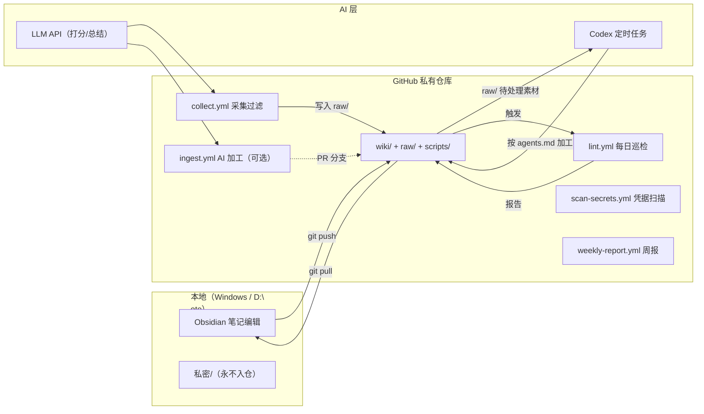

# 自动化工作流功能与实现方案

> 在 [[自动化工作流设计]] 的蓝图基础上，落地为「GitHub Actions（确定性流程）+ Codex 定时任务（AI 加工）+ Obsidian（本地编辑）」的混合自动化产线，覆盖采集、过滤、加工、审阅、巡检、安全与报告全链路。

---

## 一、方案总览

### 1.1 设计原则

1. **确定性交给脚本，创造性交给 AI**：抓取、去重、断链检查、凭据扫描等写死逻辑由 GitHub Actions 定时执行；分类、总结、选链接等语义判断由 Codex / LLM 完成。
2. **云端与本地分工**：Actions 跑在 GitHub 云端（采集、巡检、PR 审阅）；Obsidian 留在本地（编辑、阅读）；`私密/` 永远不离开本地。
3. **人工审阅闭环**：AI 的批量加工结果以 PR（Pull Request）提交，经人工 review 后合并，防止污染知识库。
4. **可回滚**：整个 `D:\note`（除 `私密/` 目录）纳入 git 版本管理，任何 AI 写入前先提交一次，出错可随时回退。
5. **分层落地**：先打地基（git/清理），再上巡检，后接加工，最后接采集；每层可独立验收、独立回滚。

### 1.2 分工矩阵

| 环节 | 执行方 | 机制 |
|------|--------|------|
| 版本管理 / 备份 | git + 每日自动提交 | 云端仓库 = 安全网 |
| 定时采集 | GitHub Actions | `collect.yml` 每周一 06:00 |
| 过滤去重 | GitHub Actions（脚本） | 关键词 + URL/SimHash + LLM 打分 |
| AI 加工 Ingest | Codex 定时任务（推荐）或 Actions `ingest.yml` | 遵循 [[agents.md]] Ingest 规范 |
| 人工审阅 | 用户 | PR review / 每周抽查 |
| 每日巡检 Lint | GitHub Actions | `lint.yml` 每天 08:30 |
| 凭据扫描 | GitHub Actions | `scan-secrets.yml` 每次 push |
| 周报生成 | GitHub Actions | `weekly-report.yml` 每周五 |
| 本地编辑 / 同步 | Obsidian + Obsidian Git 插件 | 自动 commit / push / pull |

### 1.3 架构图



---

## 二、功能需求清单

> 每条功能含：功能描述 / 触发方式 / 输入输出 / 验收标准。

### F01 仓库与版本管理

- **描述**：`D:\note` 初始化为 git 仓库，`.gitignore` 排除 `私密/` 等敏感目录；每次 AI 写入前自动提交 checkpoint，形成可回滚历史。
- **触发**：初始化一次性；此后每次流程自动提交。
- **输入/输出**：仓库 = `raw/` + `wiki/` + `scripts/` + `agents.md`（不含 `私密/`）。
- **验收**：`git log` 有完整历史；`私密/` 从未出现在仓库中。

### F02 定时采集

- **描述**：从多个源周期采集 AI / Agent / 后端/安卓开发相关内容，统一md格式写入 `raw/`。
- **触发**：`collect.yml`，每周一 06:00（UTC+8），支持手动 `workflow_dispatch`。
- **首批源**：GitHub Search API（`topic:ai-agent` 等）、HackerNews Firebase API、ArXiv API。
- **二期源**：RSSHub（掘金 / 知乎 / CSDN）、Newsletter（IMAP）。
- **输出格式**：每条素材带 frontmatter（`source / url / title / collected / status=pending / score / tags`）。
- **验收**：每轮产出 5-30 条，通过率 20-50%（宁缺毋滥）。

### F03 过滤去重

- **描述**：三级过滤——关键词粗滤 → LLM 三维打分（相关性 / 技术深度 / 新鲜度，总分 ≥ 7 且 `pass=true` 才入库）→ 去重（URL 精确匹配、标题余弦相似度 ≥ 0.85、内容 SimHash 海明距离 ≤ 3）。
- **特殊规则**：GitHub 同 repo 的新 release / star 里程碑视为更新而非重复。
- **验收**：无重复素材入库；垃圾 / 广告 / 纯标题党命中为零。

### F04 AI 加工（Ingest）

- **描述**：按 [[agents.md]] 的 Ingest 规范执行：读取 `raw/` 待处理素材 → LLM 提取概念 → 判断分类 → 增量更新已有条目或新建条目 → 建立双向链接 → 更新 `index.md` / `知识图谱.md` / `log.md` → 标记素材已处理。
- **状态机**：素材 `status` 完整流转 `pending → processing → done → archived`，并记录 `processed_at` 与 `content_hash`。
- **幂等**：同一素材重复触发不会产生重复内容（靠 `content_hash` 与状态机双重保护）。
- **验收**：素材加工后 `status=done`；wiki 链接健康度 100%。

### F05 人工审阅闭环

- **描述**：AI 加工结果不直接进 `main`。
  - **模式 A（推荐）**：Codex 加工后输出变更摘要，用户在本地 review。
  - **模式 B（全云端）**：`ingest.yml` 提交到 `ai-ingest/日期` 分支并开 PR，用户 merge。
- **验收**：无未经审阅的 AI 变更进入 `main`。

### F06 每日巡检（Lint）

- **描述**：检查断链（`[[]]` 引用不存在的目标）、孤立节点、重复条目、积压（`pending` 超 24h / 7 天）、index 与条目同步、空笔记；报告写入 `log.md`，严重问题自动开 Issue。
- **触发**：`lint.yml`，每天 08:30（UTC+8）。
- **验收**：链接健康度 100%；孤立率 < 5%；积压率 < 10%。

### F07 凭据扫描

- **描述**：正则扫描仓库内文件（`github_pat_`、`sk-`、`AKIA`、`password=`、常见 API Key 模式等），命中即让 workflow 失败、阻断 PR 合并。
- **触发**：`scan-secrets.yml`，每次 push 到 `main` 及每个 PR。
- **验收**：敏感信息入库数为 0；`私密/` 因 gitignore 天然不被扫描。

### F08 周报生成

- **描述**：每周五汇总本周新增 / 更新条目、采集量、通过率、积压、孤立节点与链接健康度，生成「知识库周报」。
- **输出**：追加到 `wiki/log.md` 或独立 `知识库周报.md`。
- **验收**：每周自动产出一份可读报告。

### F09 失败告警

- **描述**：任何 workflow 失败时通过 webhook 通知（Server酱 / Telegram / 邮件），避免静默失败。
- **验收**：失败后 5 分钟内收到通知。

### F10 Obsidian 本地体验增强

- **描述**：Obsidian Git 插件自动提交 / 推送 / 拉取；Dataview 按 frontmatter 动态生成 `index.md`；Templater 提供新条目模板（自动带 frontmatter 与 `## 相关条目` 段）。
- **验收**：新增条目零成本带元数据；`index.md` 不再手写维护。

### F11 语义检索（拓展）

- **描述**：将 `wiki/` 向量化建立 embedding 索引（本地 sentence-transformers + SQLite），Query 按语义而非关键词检索。
- **验收**：同义 / 近义查询能命中相关条目。

---

## 三、GitHub Actions 实现方案

### 3.1 仓库与目录结构

```text
D:\note/                            # git 仓库根（GitHub 私有仓库）
├── .github/workflows/
│   ├── collect.yml                 # 采集 + 过滤
│   ├── ingest.yml                  # AI 加工（模式 B，可选）
│   ├── lint.yml                    # 每日巡检
│   ├── scan-secrets.yml            # 凭据扫描
│   └── weekly-report.yml           # 周报
├── scripts/                        # Python 脚本（跨平台，本地/云端共用）
│   ├── collect.py                  # 采集（GitHub/HN/ArXiv/RSSHub）
│   ├── filter.py                   # 过滤去重 + LLM 打分
│   ├── count_pending.py            # 统计 raw/ 待处理数
│   ├── ingest.py                   # 加工入库（模式 B）
│   ├── lint.py                     # 巡检
│   ├── scan_secrets.py             # 凭据扫描
│   ├── weekly_report.py            # 周报
│   └── requirements.txt            # requests / PyYAML / feedparser 等
├── raw/                            # 原始素材（只读，仅 status 可被 AI 修改）
├── wiki/                           # 结构化知识库
├── .gitignore
└── agents.md
```

### 3.2 Secrets 与配置

| Secret | 用途 | 必填 |
|--------|------|------|
| `LLM_API_KEY` | LLM 打分 / 加工调用 | 是 |
| `GH_PAT` | 提高 GitHub API 限额（可选，search 配额） | 否 |
| `NOTIFY_WEBHOOK` | 失败告警（Server酱 / Telegram 等） | 否 |

> `LLM_API_KEY` 等敏感值只存于 GitHub Secrets，绝不写进代码或仓库文件。

### 3.3 collect.yml（采集 + 过滤）

```yaml
name: 采集与过滤

on:
  schedule:
    - cron: '0 22 * * 0'      # 周一 06:00（UTC+8）= 周日 22:00 UTC
  workflow_dispatch: {}       # 支持手动触发补跑

permissions:
  contents: write

jobs:
  collect:
    runs-on: ubuntu-latest
    steps:
      - name: 检出仓库
        uses: actions/checkout@v4

      - name: 安装 Python
        uses: actions/setup-python@v5
        with:
          python-version: '3.12'

      - name: 安装依赖
        run: pip install -r scripts/requirements.txt

      - name: 采集 + 过滤
        env:
          LLM_API_KEY: ${{ secrets.LLM_API_KEY }}
          GH_PAT: ${{ secrets.GH_PAT }}
        run: python scripts/collect.py --sources github hn arxiv

      - name: 提交素材
        run: |
          if [ -n "$(git status --porcelain)" ]; then
            git config user.name "kb-bot"
            git config user.email "kb-bot@users.noreply.github.com"
            git add raw/
            git commit -m "collect: $(date +%F) 素材入库"
            git push
          fi
```

### 3.4 ingest.yml（模式 B：全云端加工 + PR 审阅）

```yaml
name: AI 加工（模式 B）

on:
  schedule:
    - cron: '0 0 * * *'       # 每天 08:00（UTC+8）= 00:00 UTC
  workflow_dispatch: {}

permissions:
  contents: write
  pull-requests: write

jobs:
  ingest:
    runs-on: ubuntu-latest
    steps:
      - name: 检出仓库
        uses: actions/checkout@v4

      - name: 安装 Python
        uses: actions/setup-python@v5
        with:
          python-version: '3.12'

      - name: 安装依赖
        run: pip install -r scripts/requirements.txt

      - name: 检查待处理素材
        id: pending
        run: echo "count=$(python scripts/count_pending.py)" >> "$GITHUB_OUTPUT"

      - name: 执行加工
        if: steps.pending.outputs.count != '0'
        env:
          LLM_API_KEY: ${{ secrets.LLM_API_KEY }}
        run: python scripts/ingest.py

      - name: 提交并创建 PR
        if: steps.pending.outputs.count != '0'
        env:
          GH_TOKEN: ${{ github.token }}
        run: |
          BRANCH="ai-ingest/$(date +%Y%m%d)"
          git checkout -b "$BRANCH"
          git add wiki/ raw/
          if [ -n "$(git status --porcelain)" ]; then
            git config user.name "kb-bot"
            git config user.email "kb-bot@users.noreply.github.com"
            git commit -m "ingest: $(date +%F) AI 加工结果"
            git push -u origin "$BRANCH"
            gh pr create --base main --head "$BRANCH" \
              --title "AI 加工 $(date +%F)" \
              --body "本 PR 由 ingest 流程自动生成，请 review 后合并。变更摘要见 wiki/log.md。"
          fi
```

### 3.5 lint.yml（每日巡检）

```yaml
name: 每日巡检

on:
  schedule:
    - cron: '30 0 * * *'      # 每天 08:30（UTC+8）= 00:30 UTC
  workflow_dispatch: {}

permissions:
  contents: write
  issues: write

jobs:
  lint:
    runs-on: ubuntu-latest
    steps:
      - name: 检出仓库
        uses: actions/checkout@v4

      - name: 安装 Python
        uses: actions/setup-python@v5
        with:
          python-version: '3.12'

      - name: 安装依赖
        run: pip install -r scripts/requirements.txt

      - name: 运行巡检
        run: python scripts/lint.py --report .lint-report.md --issues .lint-issues.md

      - name: 提交巡检报告
        run: |
          if [ -n "$(git status --porcelain)" ]; then
            git config user.name "kb-bot"
            git config user.email "kb-bot@users.noreply.github.com"
            git add wiki/log.md
            git commit -m "lint: $(date +%F) 巡检报告"
            git push
          fi

      - name: 严重问题开 Issue
        if: hashFiles('.lint-issues.md') != ''
        env:
          GH_TOKEN: ${{ github.token }}
        run: gh issue create --title "巡检异常 $(date +%F)" --body-file .lint-issues.md
```

### 3.6 scan-secrets.yml（凭据扫描）

```yaml
name: 凭据扫描

on:
  push:
    branches: [main]
  pull_request:

jobs:
  scan:
    runs-on: ubuntu-latest
    steps:
      - name: 检出仓库
        uses: actions/checkout@v4

      - name: 安装 Python
        uses: actions/setup-python@v5
        with:
          python-version: '3.12'

      - name: 扫描凭据
        run: python scripts/scan_secrets.py --path .
```

### 3.7 weekly-report.yml（周报）

```yaml
name: 知识库周报

on:
  schedule:
    - cron: '0 11 * * 5'      # 周五 19:00（UTC+8）= 11:00 UTC
  workflow_dispatch: {}

permissions:
  contents: write

jobs:
  weekly:
    runs-on: ubuntu-latest
    steps:
      - uses: actions/checkout@v4
      - uses: actions/setup-python@v5
        with:
          python-version: '3.12'
      - run: pip install -r scripts/requirements.txt
      - run: python scripts/weekly_report.py
      - name: 提交周报
        run: |
          if [ -n "$(git status --porcelain)" ]; then
            git config user.name "kb-bot"
            git config user.email "kb-bot@users.noreply.github.com"
            git add wiki/log.md
            git commit -m "weekly: $(date +%F) 知识库周报"
            git push
          fi
```

### 3.8 分支与提交策略

- `main`：始终是可用的稳定内容。
- `ai-ingest/YYYYMMDD`：AI 加工分支，开 PR 后由用户 review 合并。
- **checkpoint 规则**：任何 AI 写入前先 `git commit` 一次当前状态，出错可 `git revert` 回滚。
- **提交信息规范**：`collect: 日期 素材入库` / `ingest: 日期 AI 加工结果` / `lint: 日期 巡检报告` / `weekly: 日期 知识库周报`。
- **防递归**：workflow 自身用 `GITHUB_TOKEN` 提交时不会再次触发 workflow；`ingest.yml` 只在有 `pending` 素材时才产生提交。

---

## 四、Codex 自动化接入方案

### 4.1 分工定位

- **模式 A（推荐）**：Codex 定时任务负责 AI 加工（质量最高，直接遵循 [[agents.md]] 规则）；Actions 只做采集、巡检、扫描、周报等确定性流程。
- **模式 B**：Actions 全云端加工（见 `ingest.yml`），Codex 仅按需参与（如用户手动说「摄入 xxx」）。
- 两模式通过 `raw/` 的 `status` 状态机天然互斥，不会双写。

### 4.2 定时任务设计

| 任务 | 时间 | 指令模板 | 输出 |
|------|------|----------|------|
| 周加工 | 每周一 06:30 | 「摄入 `raw/` 中所有 `status=pending` 的素材，按 agents.md 规则入库」 | wiki 条目更新 + 变更摘要 |
| 日巡检 | 每天 09:00 | 「检查知识库：断链 / 孤立 / 重复 / 积压，报告并修复可自动修复项」 | 巡检报告（写入 log.md） |
| 手动摄入 | 随时 | 「摄入 `D:\note\raw\xxx.md`」 | 单条入库 |

### 4.3 与 Actions 的协同与互斥

1. **互斥依据**：素材 `status` 状态机——Codex 加工完成即置 `done`；Actions 加工只处理 `pending`，天然互斥。
2. **冲突规避**：Actions 只在 `raw/` 新增文件，不写 `wiki/`；Codex 写 `wiki/` 前先 `git pull`。
3. **双跑保护**：`content_hash` 幂等——即使两端同时加工同一素材，第二次写入会被跳过。
4. **审阅分工**：模式 A 由用户抽查 Codex 变更摘要；模式 B 由 PR review 把关。

---

## 五、实施路线图

### P0 地基（0.5 天）

- [x] `git init` + 首次提交（本地仓库已完成；远端私有仓库待 `gh auth login` 后推送）
- [x] `.gitignore`：排除 `私密/`、`.obsidian/workspace.json`、`.claudian/` 等
- [x] 清理待办：重命名含 `#` 的文件名（4 个已完成）；合并 Free-fs 重复（⚠️ 两文件差异 570 行，待人工确认）；空笔记已在 index 标记
- [ ] 吊销 `私密/密码管理.md` 中泄露的 GitHub Token

**验收**：仓库可 push / pull，`私密/` 不在其中。

### P1 巡检与安全（1 天）

- [ ] `scripts/lint.py`：断链 / 孤立 / 重复 / 积压 / index 同步检查
- [ ] `scripts/scan_secrets.py`：凭据正则扫描
- [ ] `lint.yml` + `scan-secrets.yml` 上线
- [ ] 安装 Obsidian Git 插件（自动 push / pull）

**验收**：一次跑通，报告正确；凭据扫描对测试用例命中。

### P2 采集与过滤（2-3 天）

- [ ] `scripts/collect.py`：GitHub Search / HN / ArXiv
- [ ] `scripts/filter.py`：关键词粗滤 + SimHash 去重 + LLM 打分
- [ ] `collect.yml` 上线（每周一 06:00）

**验收**：周一自动产出 `raw/` 素材，通过率 20-50%。

### P3 AI 加工（2-3 天）

- [ ] 模式 A：配置 Codex 定时任务（周加工 + 日巡检）
- [ ] 或模式 B：`scripts/ingest.py` + `count_pending.py` + `ingest.yml`
- [ ] 状态机 + `content_hash` 幂等实现

**验收**：`pending` 素材能变成 wiki 条目 + 双向链接 + index/log 更新；重复触发无重复写入。

### P4 拓展（持续）

- [ ] `weekly-report.yml` + 失败告警（F08 / F09）
- [ ] Dataview 动态 index + Templater 模板（F10）
- [ ] 语义检索（F11）
- [ ] RSSHub 国内源（掘金 / 知乎 / CSDN）
- [ ] 可选：self-hosted runner（解决国内源网络问题）

---

## 六、运维与质量指标

| 指标 | 目标 | 监控来源 |
|------|------|----------|
| 采集量 / 轮 | 5-30 条 | collect 日志 |
| 通过率 | 20-50% | collect 日志 |
| 加工量 / 天 | 0-5 条 | log.md |
| 积压率（>48h） | < 10% | lint 报告 |
| 链接健康度 | 100% | lint 报告 |
| 孤立率 | < 5% | lint 报告 |
| 凭据命中 | 0 | scan-secrets |

---

## 七、风险与对策

| 风险 | 对策 |
|------|------|
| `私密/` 泄露 | `.gitignore` 排除 + 凭据扫描 + 吊销旧 Token + 私有仓库 |
| Actions 60 天无活动停摆 | 每日提交保持仓库活跃；所有 workflow 支持手动 `workflow_dispatch` 补跑 |
| 海外 runner 访问国内源不稳 | 首批只用海外源；国内源走 RSSHub 或 self-hosted runner |
| git 冲突 | 分支策略；Codex 写前 pull；AI 只做增量追加 |
| AI 内容污染 | PR 审阅 + 每周抽查 + git 回滚 |
| LLM 成本失控 | 打分用小模型；加工设 token 上限；控制采集量 |
| 双跑重复加工 | 状态机 + `content_hash` 幂等 |
| 定时任务静默失败 | F09 失败告警 |

---

## 八、待办与后续

- [ ] P0：git init 与 `.gitignore`
- [ ] P0：清理 index 待办（重命名 / 去重 / 空笔记）
- [ ] P1：`lint.py` 与 `scan_secrets.py`
- [ ] P2：`collect.py` 首批接入 GitHub / HN / ArXiv
- [ ] P3：Codex 定时任务接入
- [ ] P4：周报 / 告警 / 语义检索

## 相关条目

- [[自动化工作流设计]]
- [[知识图谱]]
- [[index]]
- [[Agent搭建]]
- [[MCP协议与工具调用]]
